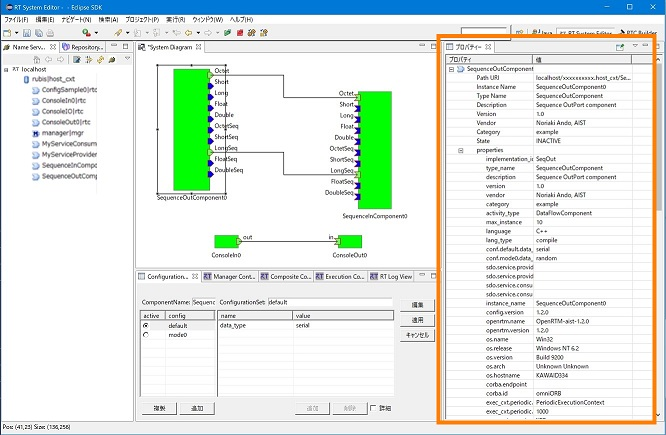
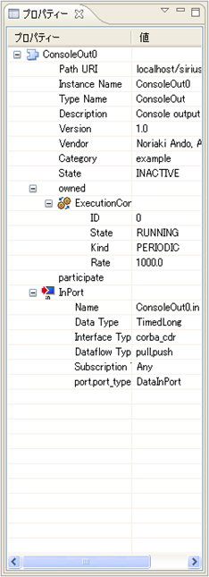
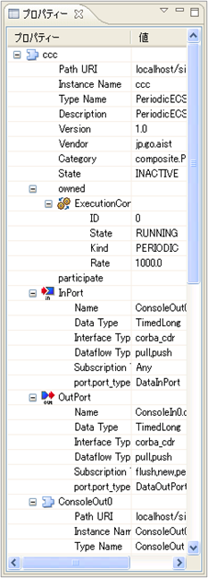
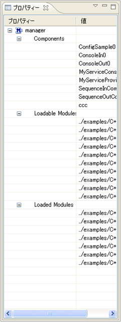

<!-- Title: ビュー（プロパティビュー編） -->
<!-- #contents -->

This section explains the Property View.
 

<strong>Location of the Property View</strong>

 

The Property View displays profile information of RTCs and connectors selected in the System Dialog in real time. (Even while an RTC is selected, if a change is detected, it is reflected immediately.)
 

<table class="table-alt">
  <tr>
    <td style="text-align: center;">For RTC</td>
    <td style="text-align: center;">For Composite RTC</td>
    <td style="text-align: center;">For Manager</td>
  </tr>
  <tr>
    <td>

</td>
    <td>

</td>
    <td>

</td>
  </tr>
</table>

<strong>Property View</strong>

 

The meanings of the displayed icons are as follows.
 

<strong>List of Property Icons</strong>

<table class="table-alt">
  <tr>
    <td>No.</td>
    <td>Icon</td>
    <td>Name</td>
    <td>Display Contents</td>
  </tr>
  <tr>
    <td>1</td>
    <td>

</td>
    <td>RTC</td>
    <td>InstanceName, TypeName, Description, Vender, Category, State (*displayed based on the LifeCycleState of the first ExecutionContext)</td>
  </tr>
  <tr>
    <td>2</td>
    <td>

</td>
    <td>ExecutionContext</td>
    <td>State, Kind, Rate</td>
  </tr>
  <tr>
    <td>3</td>
    <td>

</td>
    <td>ServicePort</td>
    <td>Name, list of property information</td>
  </tr>
  <tr>
    <td>4</td>
    <td>

</td>
    <td>Outport</td>
    <td>Name, list of property information</td>
  </tr>
  <tr>
    <td>5</td>
    <td>

</td>
    <td>Inport</td>
    <td>Name, list of property information</td>
  </tr>
  <tr>
    <td>6</td>
    <td>

</td>
    <td>PortInterfaceProfile</td>
    <td>InterfaceName, TypeName, PortInterfacePolarity</td>
  </tr>
  <tr>
    <td>7</td>
    <td>

</td>
    <td>Manager</td>
    <td>Components (list of created component names) Loadable Modules (list of loadable module names) Loaded Modules (list of loaded module names)</td>
  </tr>
</table>

According to the RTC specification, an RTC's LifeCycleState exists for each ExecutionContext. Therefore, multiple states exist, but RT System Editor displays STATE using only the first ExecutionContext.
 
 

