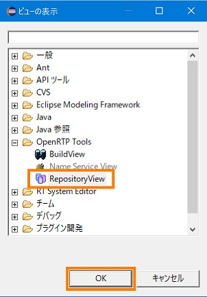
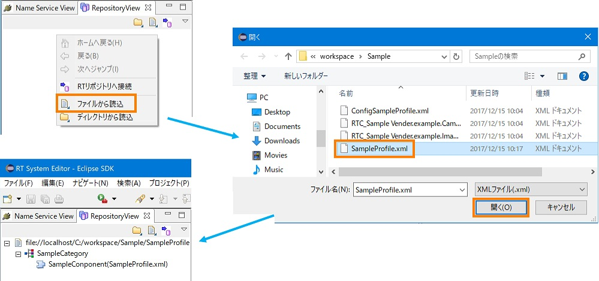
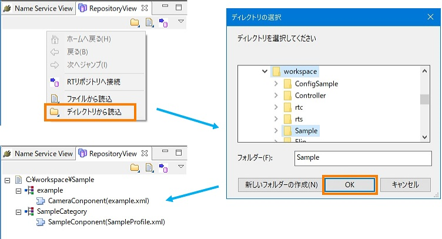
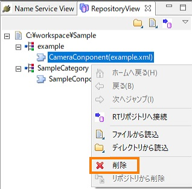

<!-- Title: ビュー（リポジトリビュー編） -->
<!-- #contents -->

ここでは、リポジトリビューについて解説します。
 

リポジトリビューは、RTコンポーネント仕様記述ファイルを読み込み、ツリービューで表示する機能をもっています。
 

<strong>リポジトリビュー</strong>

 

### ファイルのロード
ここでは、リポジトリビューに RTコンポーネント仕様記述ファイルを指定して表示する方法を説明します。 
リポジトリビュー内で右クリックし、表示されるコンテキストメニューから [ファイルから読込] を選択すると、ファイル選択ダイアログが表示されます。ここでリポジトリビューに読み込む RTコンポーネント仕様記述ファイルを選択します。 
このダイアログは xml ファイルのみ表示するようフィルタがかかります。
 

<strong>ファイルのロード</strong>

 

ローカルに存在する RTコンポーネント仕様記述ファイルを読み込んだ場合、最上位階層は読み込んだ RTコンポーネント仕様記述ファイルの絶対パスを表示します。
そして、２階層目は RTコンポーネント仕様記述ファイル内で定義されている category 属性の値を表示します。
また３階層目は RTコンポーネント仕様記述ファイル内の name 属性に記述されている値と RTコンポーネント仕様記述ファイル名を表示します。

### ディレクトリーのロード
ここでは、RTコンポーネント仕様記述ファイルが存在するディレクトリーを指定して、ディレクトリー内の全ファイルの読み込み、表示を行う方法を説明します。 
リポジトリビュー上で右クリックし、表示されるコンテキストメニューから [ディレクトリから読込] を選択すると、ディレクトリー選択ダイアログが表示されます。
リポジトリビューに読み込むディレクトリーを選択します。ディレクトリー以下に存在する RTコンポーネント仕様記述ファイルを読み込みます。
 

<strong>ディレクトリーのロード</strong>

 

表示方法はファイルのロードと同様です。 
すでに展開したディレクトリーに新しい RTコンポーネント仕様記述ファイルを追加し、再度読み込みを行うと追加された RTコンポーネント仕様記述ファイルのみ読み込まれます。
 

### 削除
リポジトリビューのコンポーネントは、リポジトリビュー上で右クリックし、コンテキストメニューから [削除] を選択して削除することが可能です。 
[削除] はパス、category、コンポーネントのいずれかを選択している場合のみ選択できます。
 

<strong>コンポーネントの削除</strong>

 

最上位階層であるパスを削除すると、下位の category、コンポーネントも同時に削除されます。また３階層目のコンポーネントを削除し、他のコンポーネントが存在しない場合は再帰的に最上位階層まで削除されます。
 
 

