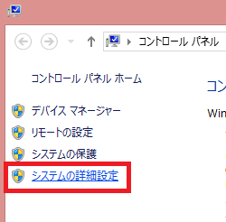
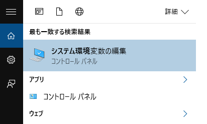
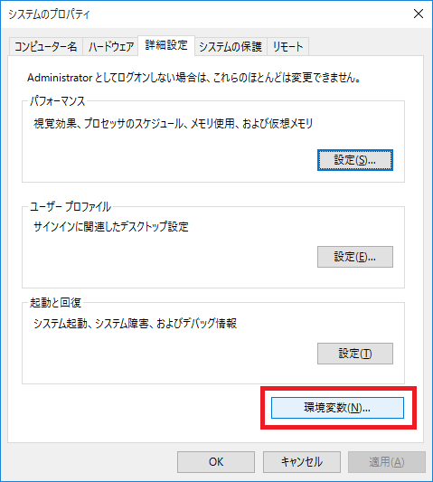
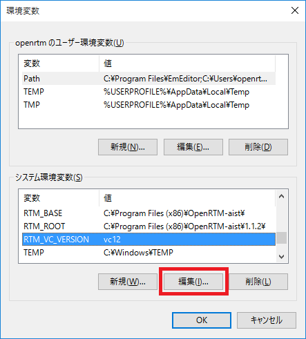
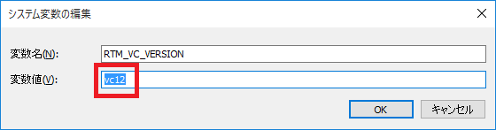
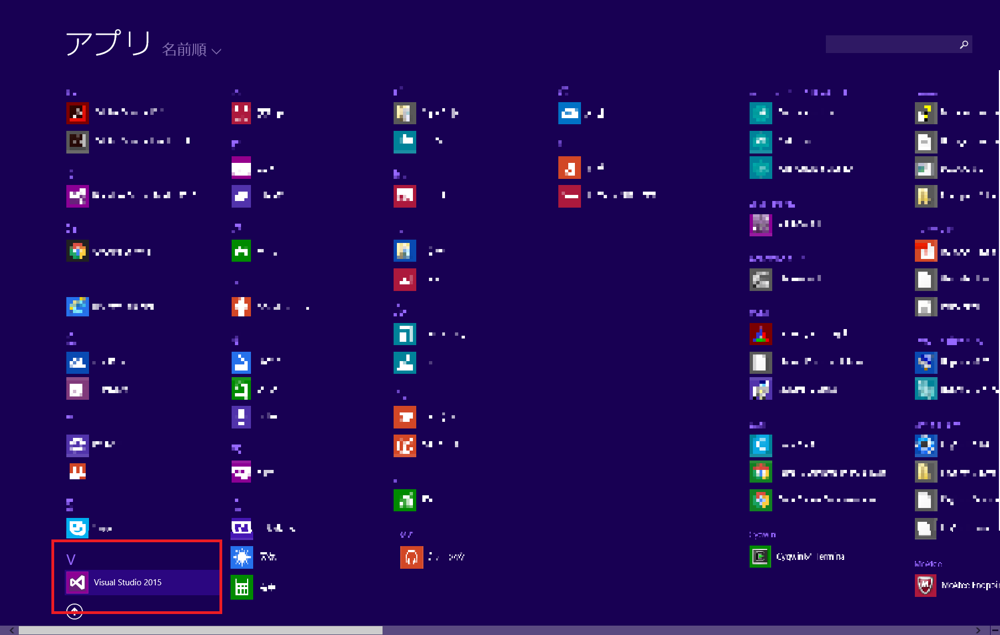
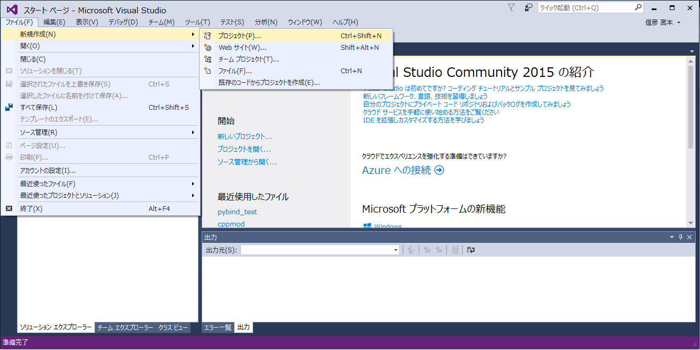
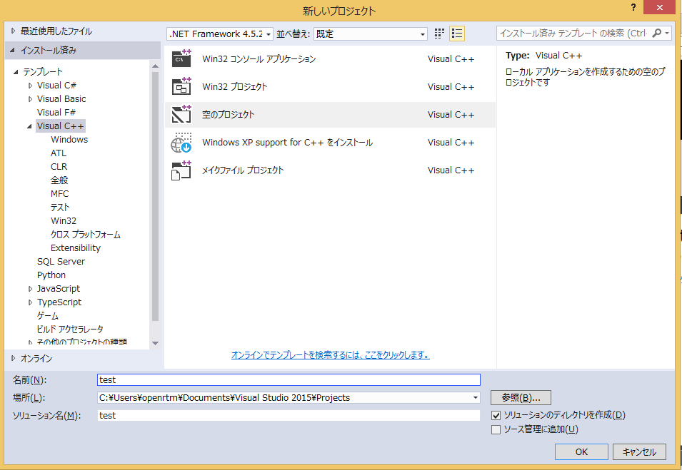

<!-- Title: OpenRTM-aist C++ 1.1.2-RELEASE -->
<div align="right"><a href="cpp_logo.png"></a></div>
#contents(4)

<!-- -&color(red){まだリリースしておりません。準備中です。もうしばらくお待ち下さい。}; -->

<br>
## パッケージ
### Windows インストーラー

#### 32bit用

<table class="table-alt">
  <tr>
    <td>Windows 用インストーラー<br> (OpenRTM-aist、C++、Python、Java版<br> および OpenRTP、rtshell(4.1.0) 含む)<br>(Visual Studio 2008、2010、2012、2013、2015 共通)</td>
    <td><a href="http://openrtm.org/pub/Windows/OpenRTM-aist/1.1/OpenRTM-aist-1.1.2-RELEASE_x86.msi">OpenRTM-aist-1.1.2-RELEASE_x86.msi</a> <br>MD5:59be8603f3fc007c2aed4476052886ce</td>
    <td>2016/05/27</td>
  </tr>
  <tr>
    <td>Python-2.7</td>
    <td><a href="https://www.python.org/ftp/python/2.7.10/python-2.7.10.msi">python-2.7.10.msi</a></td>
    <td><a href="https://www.python.org">python.org</a></td>
  </tr>
  <tr>
    <td>PyYAML</td>
    <td><a href="http://pyyaml.org/download/pyyaml/PyYAML-3.11.win32-py2.7.exe">PyYAML-3.11.win32-py2.7.exe</a></td>
    <td><a href="http://pyyaml.org/">pyyaml.org</a></td>
  </tr>
  <tr>
    <td>CMake</td>
    <td><a href="https://cmake.org/files/v3.5/cmake-3.5.2-win32-x86.msi">cmake-3.5.2-win32-x86.msi</a></td>
    <td><a href="https://cmake.org/">cmake</a></td>
  </tr>
  <tr>
    <td>Doxygen</td>
    <td><a href="https://www.doxygen.nl/files/doxygen-1.9.2-setup.exe">doxygen-1.9.2-setup.exe</a></td>
    <td><a href="http://doxygen.nl/">doxygen</a></td>
  </tr>
</table>

- <span style="color:red;">※ Python 2.7.10 推奨。2.7.11 は PYTHONPATH 等環境変数の設定が必要な場合があります。</span>;
- <span style="color:red;">※ 古い rtshell は事前に削除しておいてください。</span>;
- Doxygenは最新版がリリースされると上記のダウンロードリンクが切れることがあります。その際は[doxygen](http://www.doxygen.nl/index.html)のダウンロードページに移動し、最新の "doxygen-X.X.X-setup.exe" をダウンロード・インストールしてください。

#### 64bit用

<table class="table-alt">
  <tr>
    <td colspan="3" style="text-align: center;">Visual Studio 64bit用</td>
  </tr>
  <tr>
    <td>Windows 用インストーラー<br> (OpenRTM-aist、C++、Python、Java版、<br> および OpenRTP、rtshell (4.1.0) 含む)<br>(Visual Studio 2010、2012、2013、2015 共通)</td>
    <td><a href="http://openrtm.org/pub/Windows/OpenRTM-aist/1.1/OpenRTM-aist-1.1.2-RELEASE_x86_64.msi">OpenRTM-aist-1.1.2-RELEASE_x86_64.msi</a> <br>MD5:ee8db7c1682cb21dce963207e0484fb3</td>
    <td>2016/05/27</td>
  </tr>
  <tr>
    <td>Python-2.7</td>
    <td><a href="https://www.python.org/ftp/python/2.7.10/python-2.7.10.amd64.msi">python-2.7.10.amd64.msi</a></td>
    <td><a href="https://www.python.org">python.org</a></td>
  </tr>
  <tr>
    <td>PyYAML</td>
    <td><a href="http://pyyaml.org/download/pyyaml/PyYAML-3.11.win-amd64-py2.7.exe">PyYAML-3.11.win-amd64-py2.7.exe</a></td>
    <td><a href="http://pyyaml.org/">pyyaml.org</a></td>
  </tr>
  <tr>
    <td>CMake</td>
    <td><a href="https://cmake.org/files/v3.5/cmake-3.5.2-win32-x86.msi">cmake-3.5.2-win32-x86.msi</a></td>
    <td><a href="https://cmake.org/">cmake</a></td>
  </tr>
  <tr>
    <td>Doxygen</td>
    <td><a href="https://www.doxygen.nl/files/doxygen-1.9.2-setup.exe">doxygen-1.9.2-setup.exe</a></td>
    <td><a href="http://doxygen.nl/">doxygen</a></td>
  </tr>
</table>

- <span style="color:red;">※ Python 2.7.10 推奨。2.7.11は PYTHONPATH 等環境変数の設定が必要な場合があります。</span>;
- <span style="color:red;">※ 古い rtshell は事前に削除しておいてください。</span>;
- Doxygenは最新版がリリースされると上記のダウンロードリンクが切れることがあります。その際は[doxygen](http://www.doxygen.nl/index.html)のダウンロードページに移動し、最新の "doxygen-X.X.X-setup.exe" をダウンロード・インストールしてください。

インストールについては、[OpenRTM-aistを10分で始めよう！](http://openrtm.org/openrtm/ja/node/6026) のページで手順を紹介しています。<br>

#### Visual Studio のバージョン指定

インストールされている Visual Studio のバージョンに合わせて、システム環境変数 **RTM_VC_VERSION** を変更してください。

<table class="table-alt">
  <tr>
    <td>Visual Studio のバージョン</td>
    <td>システム環境変数 RTM_VC_VERSION の指定値</td>
    <td></td>
  </tr>
  <tr>
    <td>2008</td>
    <td>vc9</td>
    <td>32bit用インストーラーのみ</td>
  </tr>
  <tr>
    <td>2010</td>
    <td>vc10</td>
    <td></td>
  </tr>
  <tr>
    <td>2012</td>
    <td>vc11</td>
    <td></td>
  </tr>
  <tr>
    <td>2013</td>
    <td>vc12</td>
    <td>初期設定</td>
  </tr>
  <tr>
    <td>2015</td>
    <td>vc14</td>
    <td></td>
  </tr>
</table>

#### 手動での「 RTM_VC_VERSION 」設定手順

システム環境変数の設定画面は、以下の手順で開くことができます。

<table class="table-alt">
  <tr>
    <th>Windows7</th>
    <th>スタートボタン ＞ コンピュータを右クリック ＞ プロパティ ＞ システムの詳細設定</th>
    <th><div align="center"><a href="system_env1.png"></a></div>;</th>
  </tr>
  <tr>
    <td>Windows8.1</td>
    <td>デスクトップ画面を表示 ＞ Windows ボタンを右クリック ＞ システム ＞ システムの詳細設定</td>
    <td>同上</td>
  </tr>
  <tr>
    <td>Windows10</td>
    <td>検索窓で「システム環境変数」と入力 ＞ システム環境変数の編集をクリック</td>
    <td><div align="center"><a href="system_env2.png"></a></div>;</td>
  </tr>
</table>

システムのプロパティ画面で、「環境変数」をクリックします。

<div align="center"><a href="system_env3.png"></a></div>

「RTM_VC_VERSION」を編集します。

<div align="center"><div align="center"><a href="system_env4.png"></a></div>;  <div align="center"><a href="system_env5.png"></a></div>;</div>

#### ツールを使った「 RTM_VC_VERSION 」設定手順

GUI ツールを使って設定することができます。使い方は下記ページで解説しています。

- [http://openrtm.org/openrtm/ja/content/vc_version_changer](http://openrtm.org/openrtm/ja/content/vc_version_changer)


&aname(vc2013_install);
#### Visual Studio のダウンロード・インストール

サポートしている Visual Studio は2015 までで、<span style="color:red;">Visual Studio 2017 はサポートしておりません。</span>;

これからサポート対象の Visual Studio をダウンロード・インストールしたい方は、無償プログラムの <br>
「Visual Studio Dev Essential」への登録が必要です。下記サイトの手順に従って登録してください。
- [https://blogs.msdn.microsoft.com/ayatokura/2016/12/20/vsdevessential/](https://blogs.msdn.microsoft.com/ayatokura/2016/12/20/vsdevessential/)

vc2013 を選択すると OpenRTM-aist 1.1.2版のシステム環境変数設定を変更せずに使えますので、このバージョンのインストール方法を紹介します。

- Visual Studio Dev Essential 画面を開き、左端にある「Visual sutdio Community」の Download をクリックします
- 検索窓に「Visual Studio Express 2013 for Windows Desktop with Update 5」と入力して検索してください
- インストーラーのデフォルト言語は English となっていますが、Japanese を選択可能です
- EXE の web インストーラーをダウンロードしてインストールしてください


##### インストールの確認

講習会前などには、Visual  C++のプロジェクトが作成できるかを確認をお勧めします。

まずはVisual Studioを起動してください。
Windows 8.1の場合はスタートメニュー→アプリビュー→**Visual Studio 2015**(もしくは**Visual Studio 2013**)から起動できます。

<br>

<div align="center"><a href="vs2015_1.png"></a></div>
<br>

「ファイル」→「新規作成」→「プロジェクト」をクリックしてください。

<br>

<div align="center"><a href="vs2015_2.png"></a></div>
<br>

テンプレートに**Visual C++**を選択して、**空のプロジェクト**を選択してください。

<br>

<div align="center"><a href="vs2015_3.png"></a></div>
<br>


プロジェクト名を入力後にOKをクリックするとVisual C++のプロジェクトが生成されます。


Visual Studio 2015でVisual C++をインストールしていない場合については、以下のページのように**Visual C++ 2015 Tools for Windows Desktopをインストール**が表示されるため、手順に従ってインストールしてください。

- [http://ishidate.my.coocan.jp/vcpp15_1/vcpp15_1.htm](http://ishidate.my.coocan.jp/vcpp15_1/vcpp15_1.htm)


またVisual Studio 2015以外を使用の場合にも、念のためにVisual C++のプロジェクトが作成できるかの確認することをお勧めします。


#### C++版の旧バージョンランタイム利用方法

旧バージョンのランタイムは、OpenRTM-aist ディレクトリー下に、1.0.0（32bit用のみ）、1.1.0、1.1.1 としてインストールされます。
**RTM_BASE**というシステム環境変数を使いパスを通してお使いください。

例）1.1.1版 vc12 のランタイムのパスは、「RTM_BASE1.1.1\vc12\bin」で指定できます。

#### Windows10 等の高解像度(HiDPI)モードで OpenRTP/RTSystemEditor が縮小表示される場合の対処方法

Windows10などの高解像度モードを利用すると、Eclipse のアイコンなどが縮小表示される場合があります。
以下のFAQで解決方法を説明しています。

- [http://openrtm.org/openrtm/ja/content/tool_trouble_shooting_ja#toc1](http://openrtm.org/openrtm/ja/content/tool_trouble_shooting_ja#toc1)

#### インストール環境の設定を確認する方法

windows_installer_test.bat スクリプトで確認することができます。使い方は下記ページで解説しています。

- [http://openrtm.org/openrtm/ja/content/rtm-install-check-script](http://openrtm.org/openrtm/ja/content/rtm-install-check-script)


<!-- - 1.1.2版を「標準」インストールすると、C++版だけでなく、Python版、Java版、rtshell もインストールされますので、 -->
<!-- これらの古いバージョンをインストールされている場合は、あらかじめ全てアンインストールしてください。 -->

<br>
### Linux パッケージ

<!-- Linux パッケージは順次提供される予定です。ソースからのビルドの仕方は以下を参考にしてください。 -->

現在のところ、以下のディストリビューション・バージョンでパッケージを提供しています。<br>
以下で配布しているインストールスクリプトを利用すれば、必要なパッケージを一括でインストールすることができます。

<!-- [[古pkg_install_ubuntu.sh >http://svn.openrtm.org/OpenRTM-aist/tags/RELEASE_1_1_2/OpenRTM-aist/build/pkg_install_ubuntu.sh]]  -->
<!-- [[古pkg_install_debian.sh >http://svn.openrtm.org/OpenRTM-aist/tags/RELEASE_1_1_2/OpenRTM-aist/build/pkg_install_debian.sh]] -->
<!-- [[古pkg_install_fedora.sh >http://svn.openrtm.org/OpenRTM-aist/tags/RELEASE_1_1_1/OpenRTM-aist/build/pkg_install_fedora.sh]]  -->

<table class="table-alt">
  <tr>
    <th>ディストリビューション・バージョン</th>
    <th>一括インストールスクリプト</th>
  </tr>
  <tr>
    <td>Ubuntu 14.04 (trusty) i386/amd64/arm64 <br>  Ubuntu 16.04 (xenial) i386/amd64/arm64 <br> Ubuntu 16.10 (yakkety) i386/amd64 <br> Ubuntu 17.04 (zesty) i386/amd64 <br> Ubuntu 17.10 (artful) i386/amd64</td>
    <td><a href="https://raw.githubusercontent.com/OpenRTM/OpenRTM-aist/master/scripts/pkg_install_ubuntu.sh">pkg_install_ubuntu.sh </a></td>
  </tr>
  <tr>
    <td>Debian  7.0  (wheezy) i386/amd64 <br> Debian  8.0  (jessie) i386/amd64 <br> Debian  9.0  (stretch) i386/amd64</td>
    <td><a href="https://raw.githubusercontent.com/OpenRTM/OpenRTM-aist/master/scripts/pkg_install_debian.sh">pkg_install_debian.sh </a></td>
  </tr>
  <tr>
    <td>Fedora 23 i386/amd64 <br> Fedora 24 i386/amd64 <br> Fedora 25 i386/amd64<br> Fedora 26 i386/amd64</td>
    <td><a href="https://raw.githubusercontent.com/OpenRTM/OpenRTM-aist/master/scripts/pkg_install_fedora.sh">pkg_install_fedora.sh </a></td>
  </tr>
</table>

<!-- ※Fedora用一括インストール・スクリプトはOpenRTM-aist 1.2.0版以降対応予定です。 -->

オプションを指定することで、目的に合わせたパッケージをインストールすることができるようになりました。インストール方法やオプション、パッケージの種類につきましては、「[一括インストール・スクリプト](http://openrtm.org/openrtm/ja/node/6345)」のページをご確認ください。


<!-- --- Ubuntu 用スクリプト pkg_install_ubuntu.sh は、以下のいずれかのオプションを指定して実行します。 -->

<!-- |CENTER:インストール時|CENTER:アンインストール時|CENTER:ヘルプ内容|CENTER:解説| -->
<!-- |CENTER:-s|CENTER:-us|tool_packages for build Source packages|リポジトリから OpenRTM をチェックアウトしてビルドする人向け| -->
<!-- |CENTER:-d|CENTER:-ud|tool_packages for build Distribution|ディストリビューションソースパッケージをビルドしてインストールする人向け| -->
<!-- |CENTER:-c|CENTER:-uc|robot Component developer tool_packages|OpenRTM の開発環境（ヘッダ等含む）をインストールして RTC を開発する人向け| -->
<!-- |CENTER:-r|CENTER:-ur|robot component Runtime tool_packages|RTC を実行のみする人向け| -->

<!-- 1.1.0-RELEASE を既にインストールしている場合は、削除後 apt-get update を実行して再度インストールしてください。 -->
<!-- $ sudo dpkg -r openrtm-aist-doc openrtm-aist-example openrtm-aist-dev openrtm-aist -->
<!-- $ sudo apt-get clean -->
<!-- $ sudo apt-get update -->
<!-- $ sudo apt-get install openrtm-aist openrtm-aist-doc openrtm-aist-example openrtm-aist-dev -->

1.1.1-RELEASE を既にインストールしている場合はアップデートが可能です。

Ubuntu / Debian の場合

```
 $ sudo apt-get update
 $ sudo apt-get upgrade
```

Fedora　の場合

```
 # dnf update
```

ダウンロード方法・インストール方法については、[こちら(C++)](/ja/node/999) をご覧くだい。

&aname(src);
## ソースコード

<table class="table-alt">
  <tr>
    <td>C++版ソースコード</td>
    <td><a href="http://openrtm.org/pub/OpenRTM-aist/cxx/1.1.2/OpenRTM-aist-1.1.2.tar.bz2">OpenRTM-aist-1.1.2.tar.bz2</a> <br>MD5:2d1eae79695bb7b9c91bdfac67292f79</td>
    <td>2017.10.24</td>
  </tr>
  <tr>
    <td>C++版ソースコード</td>
    <td><a href="http://openrtm.org/pub/OpenRTM-aist/cxx/1.1.2/OpenRTM-aist-1.1.2.tar.gz">OpenRTM-aist-1.1.2.tar.gz</a> <br>MD5:bef2f360df60771134f016bbf0e4256c</td>
    <td>2017.10.24</td>
  </tr>
  <tr>
    <td>C++版Windows専用ソース</td>
    <td><a href="http://openrtm.org/pub/OpenRTM-aist/cxx/1.1.2/OpenRTM-aist-1.1.2-win32.zip">OpenRTM-aist-1.1.2-win32.zip</a> <br>MD5:09ad26622ebeba86097df19bae21fc16</td>
    <td>2017.10.24</td>
  </tr>
</table>

<!-- |C++版ソースコード|[[OpenRTM-aist-1.1.2.tar.bz2:http://openrtm.org/pub/OpenRTM-aist/cxx/1.1.2/OpenRTM-aist-1.1.2.tar.bz2]] &br;MD5:c270ad187f26e473bf274e8d589fcd8f|2016.05.27| -->
<!-- |C++版ソースコード|[[OpenRTM-aist-1.1.2.tar.gz:http://openrtm.org/pub/OpenRTM-aist/cxx/1.1.2/OpenRTM-aist-1.1.2.tar.gz]] &br;MD5:e09d05bb93bef22657d133cff20255a4|2016.05.27| -->
<!-- |C++版Windows専用ソース|[[OpenRTM-aist-1.1.2-win32.zip:http://openrtm.org/pub/OpenRTM-aist/cxx/1.1.2/OpenRTM-aist-1.1.2-win32.zip]] &br;MD5:ade9f4e555d76ca6c29bdd67dd64d42b|2016.05.27| -->

### ソースからのビルド

ソースからビルドする方法については、[ソースからのビルド(Windows編)](/ja/node/793) または [ソースからのビルド(Linux編)](/ja/node/788) をご覧くだい。

### deb/rpm パッケージ作成

1.1から上記の [[ソースコード>#src]] からのUbuntu、Debian 用 deb パッケージ、Fedora、Vine 用 rpmパッケージの作成が正式にサポートされました。<br>
以下の手順でパッケージを作成することができます。パッケージ作成に当たっては、一括インストールスクリプト（pkg_install_***.sh）を利用して必要なパッケージを予めインストールしておいてください。

```
 $ tar xvzf OpenRTM-aist-1.1.2-RELEASE.tar.gz
 $ cd OpenRTM-aist-1.1.2
 $ ./configure --prefix=/usr
 $ cd packages
 $ make
```

パッケージは pacakges ディレクトリー内に作成されます。

<span style="color:red;">※ Ubuntu や Debian にて deb パッケージを作成する場合は "dpkg-dev build-essential debhelper devscripts"、Fedora にて rpm パッケージを作成する場合は "rpm-build createrepo" といったツールを予めインストールしておく必要があります。</span>;

<!-- &br; -->
<!-- ***MacPorts -->
<!-- MacPorts 用 Portfile が利用可能です。あらかじめ Xcode および MacPorts をインストールした上でご利用ください。 -->
<!-- - [[Portfile (ports.tgz) :http://www.openrtm.org/pub/MacOSX/macports/ports.tgz]] -->
<!-- - [[インストールスクリプト (port_install.sh) :http://www.openrtm.org/pub/MacOSX/macports/port_install.sh]]: ports.tgz のダウンロード、OpenRTM-aist のビルド・インストールまで自動で行います。 -->

<!-- ** ツール -->

<!-- インストーラーのオプションで OpenRTP を選択していれば、インストールする必要はありません。 -->
<!-- ツールを別途インストールする方法については、　[[OpenRTP 1.1.0-RC5:/ja/node/5778]] をご覧ください。 -->

<br>
## リリースノート: 1.1.2-RELEASE
OpenRTM-aist Official Website からソースコード、Windows インストーラー、Linux 用パッケージ等が LGPL ライセンスもしくは産総研との個別契約のうち一つから選択するデュアルライセンス方式で利用可能です。

<!-- - [[OpenRTM-aist-1.1.0-RELEASE.tar.gz:http://www.openrtm.org/pub/OpenRTM-aist/cxx/1.1.0/OpenRTM-aist-1.1.0-RELEASE.tar.gz]] -- 2012.05.25リリース -->

### 機能に関する変更
  - 雑多なバグフィックス
<!-- -- RTC の各種動作をフックするリスナ機構の追加 -->
<!-- --- ComponentActionListener: コンポーネントの各種動作をフック可能に -->
<!-- --- PortConnectionListeners: ポートの接続切断をフックする事が可能に -->
<!-- --- ManagerActionListener: マネージャの各種動作のフック -->
<!-- --- ConfigurationListener:コンフィギュレーションの動作のフック -->
<!-- --- ConnectorListener：データポートの送受信の各種動作のフック -->
<!-- -- rtcd で C++ だけでなく Python、Java の RTC プロファイルを取得可能に -->
<!-- -- EC にアクセスするための各種関数群の提供 -->
<!-- -- SDO サービス（プロバイダ・コンシューマ）管理機能の導入 -->
<!-- -- ログのタイムスタンプで ms,、usが出力可能 -->
<!-- -- 各種オプションの追加:　manager.auto_shutdown_duration 等 -->

### ポータビリティに関する変更
  - 64bit Linunx への雑多な対応
  - 64bit Windows への対応
<!-- -- Mac OS X への正式な対応 -->
<!-- -- Linux+RtORB の正式サポート -->
<!-- -- Cygwin+RtORB の正式サポート -->
<!-- -- MacOS+RtORB の正式サポート -->
  - VC2015(32bit/64bit) の正式サポート
<!-- -- CMake への正式対応 -->

### 拡張機能に関する変更
<!-- -- ComponentObserver の提供 -->
<!-- -- RT preemptive kernel 用 EC の正式サポート -->

### ユーザービリティに関する変更
- Windows インストーラーをアーキテクチャ別の２種類にまとめる
  - １つのインストーラーで複数の Visual Studio バージョンに対応
  - C++版、Python版、Java版、rtshell も同時にインストール可能
- Windows インストーラーで omniORBを4.2.1に更新
- Windows インストーラーで OpenCVを2.4.11に更新し、IntelTBB で再コンパイル
<!-- -- Windows インストーラーでツールの RTSystemEditorRCP版 と OpenRTP を選択可能にする -->
<!-- -- Windows インストーラーのスタートメニューでのツールを、各言語（C++、Python、Java)で共通にする -->
<!-- -- Windows インストーラーで OpenJDK7 JRE のインストールを選択可能にする -->
<!-- -- debパッケージ作成でマルチアーチ機能へ対応 -->
<!-- -- debパッケージ利用環境で OpenRTM-aist Python と共存時のアンインストール動作の見直し -->

### 対応 (ビルド検証済) OS
- Debian 7.0 i386, x86_64
- Debian 8.0 i386, x86_64
<!-- ---Fedora release 21 i386, x86_64 -->
<!-- ---Fedora release 22 i386, x86_64 -->
- Ubuntu 12.04 i386, x86_64
- Ubuntu 14.04 i386, x86_64
- Ubuntu 15.10 i386, x86_64
- Ubuntu 16.04 i386, x86_64
- Windows-7 (32/64bit)
- Windows-8.1 (32/64bit)
