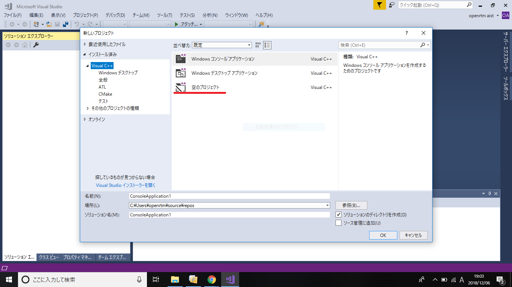

<!-- Title: OpenRTM-aist C++ 1.2.1-RELEASE -->
<div align="right"><a href="cpp_logo.png"></a></div>
#contents(4)

<br>
インストール手順については以下のページを参照してください。

- [OpenRTM-aist(C++版)1.2系のインストール](/ja/node/6600)

## パッケージ
### Windowsインストーラー
msiファイルは900MB以上のサイズがあります。ダウンロードを数分で行うためにはある程度高速な回線(50Mbps以上)を用いてください。

#### 64bit用

<table class="table-alt">
  <tr>
    <td>Windows用インストーラー<br> (OpenRTM-aist、C++、Python、<br>Java版、および OpenRTP、<br> rtshell(4.2.2)含む)<br>(Visual Studio 2010、2012、<br> 2013、2015、2017、2019 共通)</td>
    <td><a href="https://github.com/OpenRTM/OpenRTM-aist/releases/download/v1.2.1/OpenRTM-aist-1.2.1-RELEASE_x86_64.msi">OpenRTM-aist-1.2.1-RELEASE_x86_64.msi</a> <br>MD5:be6b346d61768435d812cc032bc7a529</td>
    <td>2019/11/25</td>
  </tr>
  <tr>
    <td>Python-2.7</td>
    <td><a href="https://www.python.org/ftp/python/2.7.16/python-2.7.16.amd64.msi">python-2.7.16.amd64.msi</a></td>
    <td><a href="https://www.python.org">python.org</a></td>
  </tr>
  <tr>
    <td>Python-3.6</td>
    <td><a href="https://www.python.org/ftp/python/3.6.8/python-3.6.8-amd64.exe">python-3.6.8-amd64.exe</a></td>
    <td><a href="https://www.python.org">python.org</a></td>
  </tr>
  <tr>
    <td>Python-3.7</td>
    <td><a href="https://www.python.org/ftp/python/3.7.5/python-3.7.5-amd64.exe">python-3.7.5-amd64.exe</a></td>
    <td><a href="https://www.python.org">python.org</a></td>
  </tr>
  <tr>
    <td>CMake</td>
    <td><a href="https://github.com/Kitware/CMake/releases/download/v3.15.5/cmake-3.15.5-win64-x64.msi">cmake-3.15.5-win64-x64.msi</a></td>
    <td><a href="https://cmake.org/">cmake</a></td>
  </tr>
  <tr>
    <td>Doxygen</td>
    <td><a href="https://www.doxygen.nl/files/doxygen-1.9.2-setup.exe">doxygen-1.9.2-setup.exe</a></td>
    <td><a href="http://www.doxygen.nl/index.html">doxygen</a></td>
  </tr>
</table>

- <span style="color:red;">※Pythonは、"3.7"、"3.6"、"2.7"のいずれかのバージョンをインストールしてください。</span>;
<!-- -&color(red){※古いrtshellは事前に削除しておいてください。ただし、OpenRTM-aist 1.1.2版をmsiファイルを用いてインストールしている場合は対応不要です。}; -->
- Doxygenは最新版がリリースされると上記のダウンロードリンクが切れることがあります。その際は[doxygen](http://www.doxygen.nl/index.html)のダウンロードページに移動し、最新の "doxygen-X.X.X-setup.exe" をダウンロード・インストールしてください。

#### 32bit用

<table class="table-alt">
  <tr>
    <td>Windows用インストーラー<br> (OpenRTM-aist、C++、Python、<br>Java版、およびOpenRTP、<br>rtshell(4.2.2)含む)<br>(Visual Studio 2010、2012、<br>2013、2015、2017、2019共通)</td>
    <td><a href="https://github.com/OpenRTM/OpenRTM-aist/releases/download/v1.2.1/OpenRTM-aist-1.2.1-RELEASE_x86.msi">OpenRTM-aist-1.2.1-RELEASE_x86.msi</a> <br>MD5:a9186d409cafc039432a0e1c6e7e02ef</td>
    <td>2019/11/25</td>
  </tr>
  <tr>
    <td>Python-2.7</td>
    <td><a href="https://www.python.org/ftp/python/2.7.16/python-2.7.16.msi">python-2.7.16.msi</a></td>
    <td><a href="https://www.python.org">python.org</a></td>
  </tr>
  <tr>
    <td>Python-3.6</td>
    <td><a href="https://www.python.org/ftp/python/3.6.8/python-3.6.8.exe">python-3.6.8.exe</a></td>
    <td><a href="https://www.python.org">python.org</a></td>
  </tr>
  <tr>
    <td>Python-3.7</td>
    <td><a href="https://www.python.org/ftp/python/3.7.5/python-3.7.5.exe">python-3.7.5.exe</a></td>
    <td><a href="https://www.python.org">python.org</a></td>
  </tr>
  <tr>
    <td>CMake</td>
    <td><a href="https://github.com/Kitware/CMake/releases/download/v3.15.5/cmake-3.15.5-win32-x86.msi">cmake-3.15.5-win32-x86.msi</a></td>
    <td><a href="https://cmake.org/">cmake</a></td>
  </tr>
  <tr>
    <td>Doxygen</td>
    <td><a href="https://www.doxygen.nl/files/doxygen-1.9.2-setup.exe">doxygen-1.9.2-setup.exe</a></td>
    <td><a href="http://www.doxygen.nl/index.html">doxygen</a></td>
  </tr>
</table>

- <span style="color:red;">※Pythonは、"3.7"、"3.6"、"2.7"のいずれかのバージョンをインストールしてください。</span>;
<!-- -&color(red){※古いrtshellは事前に削除しておいてください。ただし、OpenRTM-aist 1.1.2版をmsiファイルを用いてインストールしている場合は対応不要です。}; -->
- Doxygenは最新版がリリースされると上記のダウンロードリンクが切れることがあります。その際は[doxygen](http://www.doxygen.nl/index.html)のダウンロードページに移動し、最新の "doxygen-X.X.X-setup.exe" をダウンロード・インストールしてください。


インストールについては、[OpenRTM-aistを10分で始めよう！](/ja/node/6521)のページで手順を紹介しています。<br>

#### Visual Studioのバージョン指定

インストールされているVisual Studioのバージョンに合わせて、システム環境変数**RTM_VC_VERSION**を設定しています。
インストール後に変更する場合は、GUIツールを使って設定できます。使い方は[VCVerChanger](/ja/node/6136)のページで解説しています。
<br>

<table class="table-alt">
  <tr>
    <td>Visual Studioのバージョン</td>
    <td>システム環境変数RTM_VC_VERSIONの指定値</td>
  </tr>
  <tr>
    <td>2010</td>
    <td>vc10</td>
  </tr>
  <tr>
    <td>2012</td>
    <td>vc11</td>
  </tr>
  <tr>
    <td>2013</td>
    <td>vc12</td>
  </tr>
  <tr>
    <td>2015、2017、2019</td>
    <td>vc14</td>
    <td>初期設定</td>
  </tr>
</table>


- <span style="color:red;">※インストール後、Visual Studioのバージョンを変更しない場合でも、一度[VCVerChanger](/ja/node/6136)でシステム環境変数の設定を確認してください。不要なパスが残っていた場合はこれを削除します。</span>;
<br>


&aname(vc2013_install);
#### Visual Studioのダウンロード・インストール

MicrosoftのダウンロードページからVisual Studio Community 2019をダウンロードできます。
- https://visualstudio.microsoft.com/ja/downloads/

インストールについては、[Visual Studio Community 2019インストール方法](/ja/node/6650/)のページで手順を紹介しています。<br>

<!-- Microsoftのダウンロードページでは、Visual Studioの最新バージョンしかダウンロードできません。&br; -->
<!-- サポート対象の別バージョンの Visual Studioをダウンロード・インストールしたい方は、無償プログラムの &br; -->
<!-- 「Visual Studio Dev Essential」への登録が必要です。下記サイトの手順に従って登録してください。 -->
<!-- - https://blogs.msdn.microsoft.com/ayatokura/2016/12/20/vsdevessential/ -->
<!--  -->
<!-- vc2013 のインストール方法を紹介します。 -->
<!--  -->
<!-- - Visual Studio Dev Essential 画面を開き、左端にある「Visual sutdio Community」の[Download]をクリックします -->
<!-- - 検索窓に「Visual Studio Express 2013 for Windows Desktop with Update 5」と入力して検索してください -->
<!-- - インストーラーのデフォルト言語は[English]となっていますが、[Japanese]を選択可能です -->
<!-- - EXE の webインストーラーをダウンロードしてインストールしてください -->


##### インストールの確認

講習会前などには、Visual C++のプロジェクトが作成できるかを確認を推奨します。

まずはVisual Studioを起動し、「ファイル」→「新規作成」→「プロジェクト」をクリックしてください。<br>
テンプレートに**Visual C++**を選択して、**空のプロジェクト**を選択してください。

<br>

<div align="center"><a href="vc2017.png"></a></div>
<br>


プロジェクト名を入力後にOKをクリックするとVisual C++のプロジェクトが生成されます。


**Visual C++**を選択できない場合は、[Visual Studio Community 2019のインストール方法](/ja/node/6650)の手順に従って「C++によるデスクトップ開発」をインストールしてください。


またVisual Studio 2019以外を使用の場合にも、念のためにVisual C++のプロジェクトが作成できるかの確認することを推奨します。


#### C++版の旧バージョンランタイム利用方法

旧バージョンのランタイムは、OpenRTM-aistディレクトリ下に、1.0.0（32bit用のみ）、1.1.0、1.1.1、1.1.2、1.2.0としてインストールされます。
**RTM_BASE**というシステム環境変数を使いパスを通してお使いください。

例）1.1.1版 vc12のランタイムのパスは、「%RTM_BASE%\1.1.1\vc12\bin」で指定できます。

#### Windows10などの高解像度(HiDPI)モードでOpenRTP/RTSystemEditorが縮小表示される場合の対処方法

Windows10などの高解像度モードを利用すると、Eclipseのアイコンなどが縮小表示される場合があります。以下のFAQで解決方法を説明しています。
- [Windows10 などで、高解像度モードのときにアイコンなどが小さすぎて見にくくなる](/ja/content/tool_trouble_shooting_ja#toc1)


<!-- **** インストール環境の設定を確認する方法 -->
<!--  -->
<!-- windows_installer_test.batスクリプトで確認できます。使い方は下記ページで解説しています。 -->
<!-- #br -->
<!-- [[windows_installer_test.batの利用方法:/ja/content/rtm-install-check-script]] -->
<!--  -->

<!-- - 1.1.2版を「標準」インストールすると、C++版だけでなく、Python版、Java版、rtshell もインストールされますので、 -->
<!-- これらの古いバージョンをインストールされている場合は、あらかじめ全てアンインストールしてください。 -->

<br>
### Linuxパッケージ

<!-- Linuxパッケージは順次提供される予定です。ソースからのビルドの仕方は以下を参考にしてください。 -->

現在のところ、以下のディストリビューション・バージョンでパッケージを提供しています。<br>
以下で配布しているインストールスクリプトを利用すれば、必要なパッケージを一括でインストールできます。


<table class="table-alt">
  <tr>
    <th>ディストリビューション・バージョン</th>
    <th>一括インストールスクリプト(右クリックでURLを入手)</th>
  </tr>
  <tr>
    <td>Ubuntu 16.04 (xenial) i386/amd64 <br> Ubuntu 18.04 (bionic) amd64 <br></td>
    <td><a href="https://raw.githubusercontent.com/OpenRTM/OpenRTM-aist/master/scripts/pkg_install_ubuntu.sh">pkg_install_ubuntu.sh </a></td>
  </tr>
  <tr>
    <td>Raspbian Buster</td>
    <td><a href="https://raw.githubusercontent.com/OpenRTM/OpenRTM-aist/master/scripts/pkg_install_raspbian.sh">pkg_install_raspbian.sh </a></td>
  </tr>
</table>
<!-- | Debian  8.0  (jessie) i386/amd64 &br; Debian  9.0  (stretch) i386/amd64| [[pkg_install_debian.sh >https://raw.githubusercontent.com/OpenRTM/OpenRTM-aist/master/scripts/pkg_install_debian.sh]] | -->
<!-- | Fedora 27 i686/x86_64 &br; Fedora 28 i686/x86_64 &br; Fedora 29 i686/x86_64| [[pkg_install_fedora.sh >https://raw.githubusercontent.com/OpenRTM/OpenRTM-aist/master/scripts/pkg_install_fedora.sh]] | -->

<!-- ※Fedora用一括インストール・スクリプトはOpenRTM-aist 1.2.0版以降対応予定です。 -->


オプションを指定することで、目的に合わせたパッケージをインストールできるようになりました。インストール方法やオプション、パッケージの種類につきましては、[一括インストール・スクリプト](/ja/node/6345)をご確認ください。


1.2.0-RELEASEを既にインストールしている場合はアップデートが可能です。

Ubuntu / Debianの場合

```
 $ sudo apt-get update
 $ sudo apt-get dist-upgrade
```

<!-- Fedora　の場合 -->
<!--  -->
<!-- # dnf update -->

ダウンロード方法・インストール方法については、[OpenRTM-aist(C++版)1.2系のインストール](/ja/node/6600)をご覧くだい。

&aname(src);
## ソースコード

<table class="table-alt">
  <tr>
    <td>C++版ソースコード</td>
    <td><a href="https://github.com/OpenRTM/OpenRTM-aist/releases/download/v1.2.1/OpenRTM-aist-1.2.1.tar.bz2">OpenRTM-aist-1.2.1.tar.bz2</a> <br>MD5:890ad85f3d6f6afd7d24d68c4aa6c290</td>
    <td>2019.11.25</td>
  </tr>
  <tr>
    <td>C++版ソースコード</td>
    <td><a href="https://github.com/OpenRTM/OpenRTM-aist/releases/download/v1.2.1/OpenRTM-aist-1.2.1.tar.gz">OpenRTM-aist-1.2.1.tar.gz</a> <br>MD5:dc7075480642017ea228d04c8bde6ca8</td>
    <td>2019.11.25</td>
  </tr>
  <tr>
    <td>C++版Windows専用ソース</td>
    <td><a href="https://github.com/OpenRTM/OpenRTM-aist/releases/download/v1.2.1/OpenRTM-aist-1.2.1-win32.zip">OpenRTM-aist-1.2.1-win32.zip</a> <br>MD5:5dd560c1ba2297b048a8a03c8db88632</td>
    <td>2019.11.25</td>
  </tr>
</table>

### ソースからのビルド

ソースからビルドする方法については、[ソースからのビルド(Windows編)](/ja/node/6611)または[ソースからのビルド(Linux編)](/ja/node/6612)をご覧くだい。

### deb/rpmパッケージ作成

1.1から上記のソースコードからのUbuntu、Debian用debパッケージ、Fedora用rpmパッケージの作成が正式にサポートされました。

以下の手順でパッケージを作成できます。パッケージ作成に当たっては、一括インストールスクリプト（pkg_install_***.sh）を利用して必要なパッケージをあらかじめインストールしておいてください。

```
 $ tar xvzf OpenRTM-aist-1.2.1-RELEASE.tar.gz
 $ cd OpenRTM-aist-1.2.1
 $ ./configure --prefix=/usr  --enable-fluentd=yes --enable-observer=yes --enable-ssl=yes
 $ cd packages
 $ make
```

パッケージはpacakgesディレクトリ内に作成されます。

<span style="color:red;">※UbuntuやDebianにてdebパッケージを作成する場合は"dpkg-dev build-essential debhelper devscripts"、Fedoraにてrpmパッケージを作成する場合は"rpm-build createrepo"といったツールをあらかじめインストールしておく必要があります。</span>;
これらは、[一括インストール・スクリプト](/ja/node/6345)を-cオプションで実行すればインストールされます。

<!-- &br; -->
<!-- ***MacPorts -->
<!-- MacPorts 用 Portfile が利用可能です。あらかじめ Xcode および MacPorts をインストールした上でご利用ください。 -->
<!-- - [[Portfile (ports.tgz) :http://www.openrtm.org/pub/MacOSX/macports/ports.tgz]] -->
<!-- - [[インストールスクリプト (port_install.sh) :http://www.openrtm.org/pub/MacOSX/macports/port_install.sh]]: ports.tgz のダウンロード、OpenRTM-aist のビルド・インストールまで自動で行います。 -->

<!-- ** ツール -->

<!-- インストーラーのオプションで OpenRTP を選択していれば、インストールする必要はありません。 -->
<!-- ツールを別途インストールする方法については、　[[OpenRTP 1.1.0-RC5:/ja/node/5778]] をご覧ください。 -->

<br>
## リリースノート
OpenRTM-aist Official Websiteからソースコード、Windowsインストーラー、Linux用パッケージなどがLGPLライセンスもしくは産総研との個別契約のうち一つから選択するデュアルライセンス方式で利用可能です。

- [1.2.1-RELEASE ](https://github.com/OpenRTM/OpenRTM-aist/releases/tag/v1.2.1)


### 対応(ビルド検証済)OS
- Ubuntu 16.04 i386、 amd64
- Ubuntu 18.04 amd64
- Raspbian Buster armhf
- Windows-10 (32/64bit)
