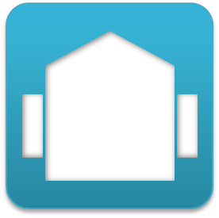

---

layout: page
title: "Hardware"

---
RTC-available hardwares. If you have some information of RTC-available hardware, please send an email to us: support[at]openrtm.org

If you had any question of these RTCs, please contact below:
- [Forum](http://www.openrtm.org/openrtm/ja/node/281)
- [Mailing Lists](http://www.openrtm.org/openrtm/ja/node/275)
- [Issue Tracking](http://www.openrtm.org/openrtm/ja/node/add/project-issue)

※Never contact with the robots' makers.;

All components are provided 'as is', and we never insure their performance. For more detail information, please read the RTCs' license agreements, or contact to their developers.
