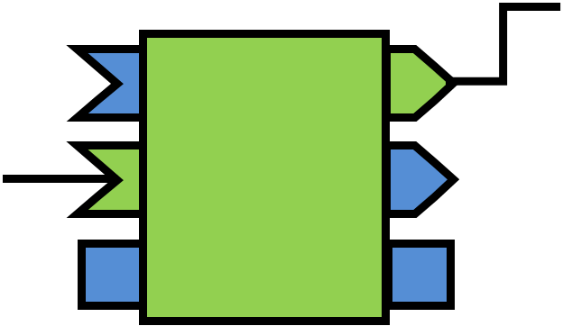
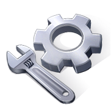

You can find not only official RT-Components but also third party RT-Components in this section. By creating an account on this web site, you can also create your own project pages to distribute your RT-Components, tools and so on.

There are four project categories.
- RT-Component: RT-Components for use with RT-Middlewares.
- RT-Middleware: OpenRTM-aist and other related middlewares, including extension modules.
- Tool: Various kinds of tools, such as RTSystemEditor and rtshell.
- Specification and Documentation: This includes specifications, interface definitions and other documentation projects.

After creating account and sign-in, please select Create new project to create your project.

- [Create new project]()

<a>RT-Component    RT-Middleware    Tool</a>

<a>Specification and Documentation</a>
