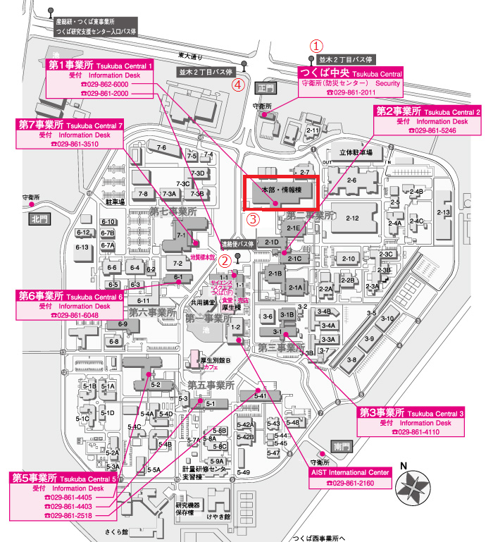

## Tsukuba Central 2, Headquarters and Information Technology Building, 1st Floor

- If you are coming by **highway bus**, get off at ① "Namiki 2-chome" bus stop.
- If you are coming by **shuttle bus**, get off at ② "Shuttle Bus Stop (Tsukuba Central 1)".
  - Depending on the time, the bus may also stop here: ③ "Shuttle Bus Stop (Information Technology Building)".
- If you are coming from Arakawaoki Station by **local bus**, get off at ④ "Namiki 2-chome" bus stop.

~                                         

