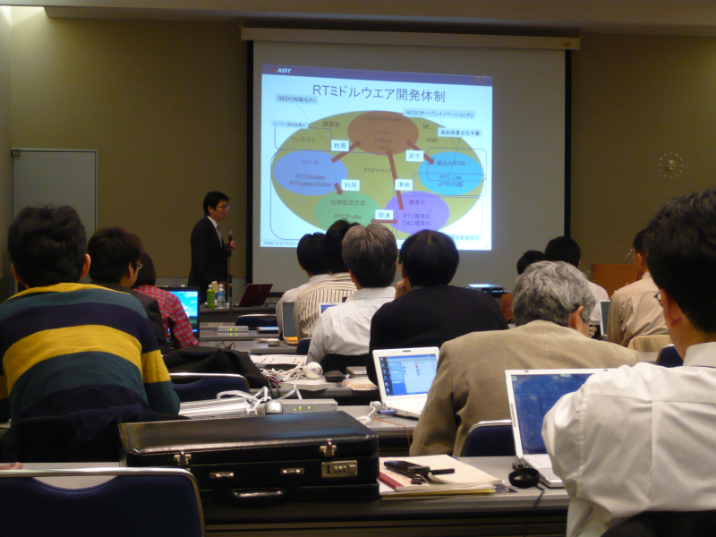
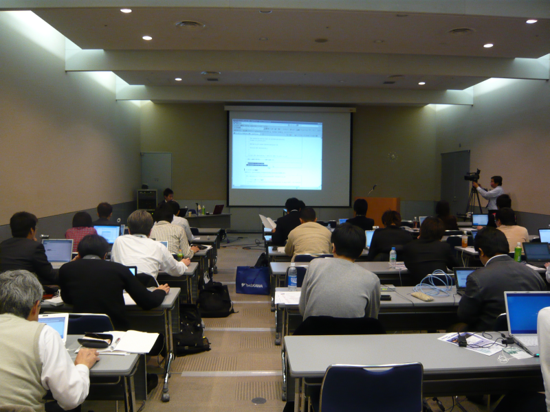
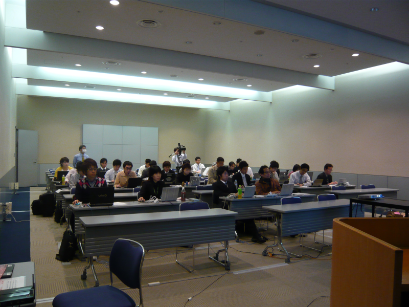

 
<a>No English version available.
</a>

<!-- -------jp page!!------- -->

#contents

## 講習会案内 (iREX2009 RTミドルウェア講習会:11月27日)
### 参加人数
- 28名

### 資料

- [RTミドルウェア講習会資料](./091127-01.pdf)(PDF)(no_link)
### 開催案内

- **日時**: 2009年11月27日, 13:00`17:00`
- **場所**: [東京ビッグサイト 国際会議場 ７０３会議室](http://www.bigsight.jp/)
  - アクセス: [交通アクセス](http://www.bigsight.jp/general/access/index.html)
  - 会議室: [施設案内(PDF)](http://www.bigsight.jp/download/public/bigsight_map_color_j.pdf)
- **プログラム**:

<table class="table-alt">
  <tr>
    <td>**13:00-13:30**</td>
    <td>**第1部：OMG標準準拠ミドルウェアOpenRTM-aistについて**</td>
  </tr>
  <tr>
    <td></td>
    <td>概要：RTミドルウエア概要、OMG標準化、OpenRTM-aist-1.0および、現在、NEDO次世代ロボット知能化技術開発プロジェクトで開発している共通プラットフォーム「OpenRTプラットフォーム」等について解説します。</td>
    <td></td>
  </tr>
  <tr>
    <td>**13:30-14:15**</td>
    <td>**第2部：OpenRTM-aist開発支援ツールの紹介とその利用法**</td>
  </tr>
  <tr>
    <td></td>
    <td>概要：RTコンポーネントを作成するツールRTCBuilder、およびRTシステムを設計するツールRTSystemEditerの使い方について解説します。</td>
    <td></td>
  </tr>
  <tr>
    <td>**14:30-17:00**</td>
    <td>**第3部：コンポーネント開発実習**</td>
  </tr>
  <tr>
    <td></td>
    <td>概要：OpenRTMのインストール方法やテスト方法を解説します。OpenRTM-aistでのコンポーネント作成方法を実際に体験していただきます。RTCBuilderを使用したRTコンポーネントの設計とRTSystemEditerでのRTシステム作成を行います。</td>
    <td></td>
  </tr>
</table>

- **参加費**: 無料
- **募集定員**: 50名 (ただし、提供可能なUSBカメラは20台までとなります(先着順)。)
- **応募要領**: 下記参加申込書に記入の上(USBカメラの有無もお知らせください)、メール (rtm-irex2009@m.aist.go.jp) にてお申し込み下さい。
- **応募締切**: 2009年11月13日(金)(定員になり次第締め切らせて頂きます。)
- **お願い**: PCおよびUSBカメラをご用意ください。以下の事前準備に従い、Visual Studio 2008 (Express) および OpenRTM-aist 関連ソフトウエアをあらかじめインストールした上でご参加くださいますようお願いいたします。
<!-- -''問合せ先'': -->
<!--  -->
<!-- ロボットビジネス推進協議会事務局　社団法人日本ロボット工業会　 -->
<!-- 〒105-0011 東京都港区芝公園3-5-8　機械振興会館 -->
<!-- TEL：03-3434-2919, FAX: 03-3578-1404 -->
<!-- e-mail: rtm-irex2009@m.aist.go.jp -->
<!--  -->
<!-- -''申込書'': -->
<!--  -->
<!-- ～（１１／１６）ＲＴＭ講習会参加申込書～ -->
<!--  -->
<!-- 機関名: -->
<!-- 氏名: -->
<!-- USBカメラの有無: (有/無) -->
<!-- e-mail: -->
<!-- TEL: -->

#### 開発環境の整備
- OS: Windows XP SP2

- インストールするソフトウエア
 ※　ご参加頂く前に、予め下記のソフトウエアをインストールして頂きますよう、よろしくお願い致します。;

  - コンパイラ: [Visual C++ 2008 Express Edition 日本語版](http://www.microsoft.com/japan/msdn/vstudio/express/default.aspx)

  - [omniORB: version 4.1.2](http://www.openrtm.org/pub/Windows/omniORB/omniORB-4.1.2_vc9.msi)
 MD5: 82ab918937fb86755adc7177465fdfd0

  - [OpenCV: version 1.0](http://downloads.sourceforge.net/opencvlibrary/OpenCV_1.0.exe?modtime=1161287502&big_mirror=1)

  - [OpenRTM-aist: version 1.0.0-RC1](http://www.openrtm.org/pub/Windows/OpenRTM-aist/cxx/OpenRTM-aist-1.0.0-RC1-jp_vc9.msi)
 MD5: 6db2af9fa12c3ce81e244b2d4f05ae2b

  - [OpenCVサンプルRTC](http://www.openrtm.org/OpenRTM-aist/download/IREX2009/OpenCV_RTC-1.0_vc9_jp.msi)
 MD5: a6e5a6f6cabb8ecb6157f2dc6c47758d

  - [Java(JRE 6 Update 17)](http://java.sun.com/javase/ja/6/download.html)

  - RTSystemEditor 1.0
  - RTCBuilder 1.0
    - [全部入りパッケージ](http://www.openrtm.org/OpenRTM-aist/download/IREX2009/eclipse.zip_)
 MD5: fc744c5e7809b0516ed59a169f2af948

※ eclipse.zipの解凍時にエラーがでる場合は、下記のツールで解凍してみてください。;

  - [解凍ツール(Lhaplus)](http://www.forest.impress.co.jp/lib/arc/archive/archiver/lhaplus.html)

## 講習会の様子 

 

 

 

<!-- -------jp page!!------- -->
