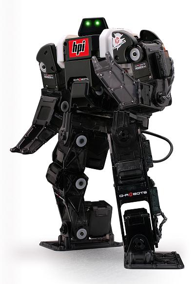
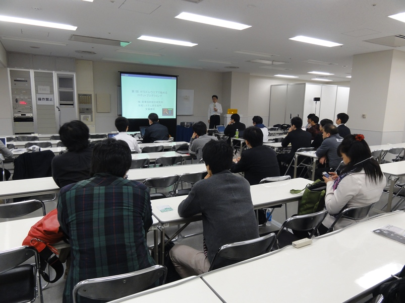
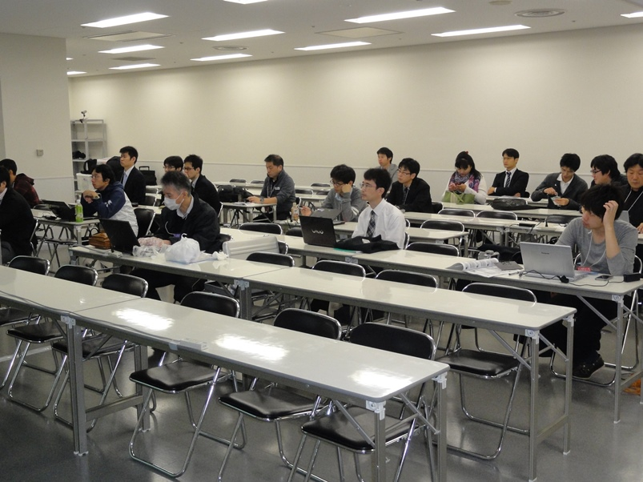
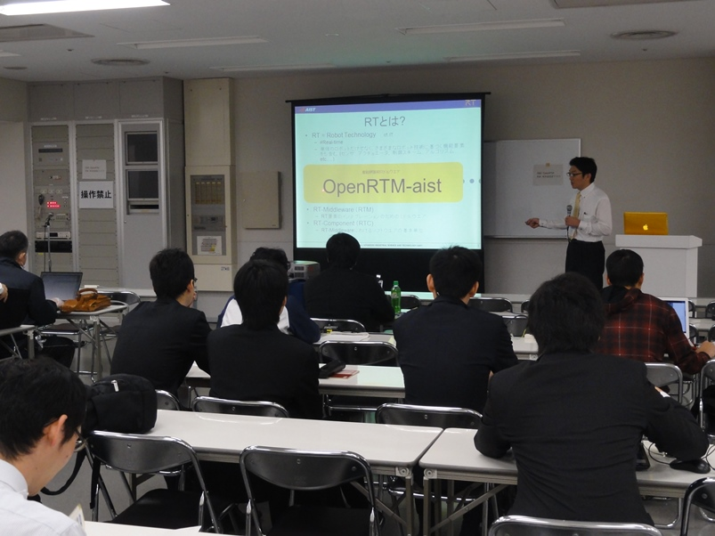
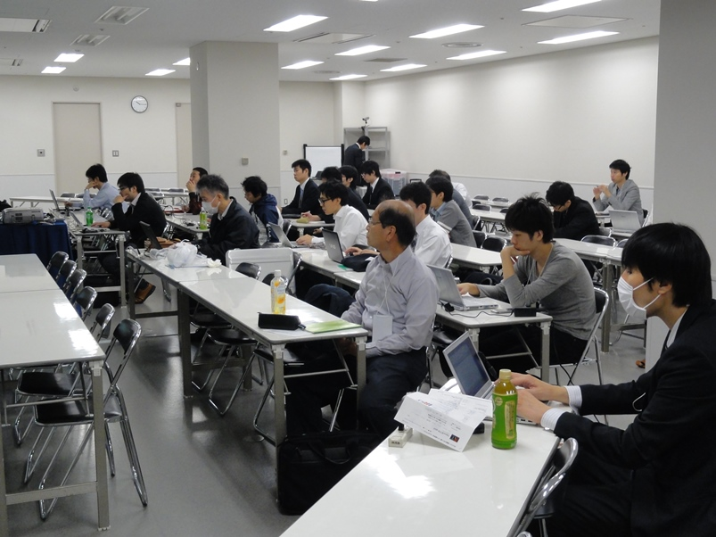
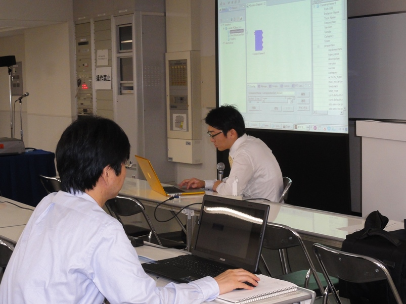

</a>

#contents(4)

## 開催報告

平成25年11月6日(水)に東京ビックサイトにおいて、国際ロボット展－RTミドルウエア講習会を開催いたしました。

<!-- ** 国際ロボット展－RTミドルウエア講習会(2013年11月6日) -->
## 日時・場所

- **日時**: 平成25年11月6日(水), 10時00分～16時30分
- **場所**: [東京ビックサイト](http://www.bigsight.jp/) 東3ホール入口　ワークショップ会場B
  - [交通アクセス](http://www.bigsight.jp/general/access/index.html)
- **主催**: [産業技術総合研究所](http://www.aist.go.jp), [ロボットビジネス推進協議会](http://www.roboness.jp/)
<!-- -''定員''：実習 30名, 聴講 30名（先着順で定員になり次第締め切り） -->
- **参加者**：実習 21名, 聴講 5名（＋講師・スタッフ4名）
<!-- -''参加費'': 無料 -->
<!-- -''申し込み'':[[NEDO Webページ:http://www.nedo.go.jp/events/CA_100005.html]] にて [[ユーザアカウント発行:https://app3.infoc.nedo.go.jp/gyouji/mypage/customer_join_form]] の上 [[こちら:https://app3.infoc.nedo.go.jp/gyouji/events/CA/nedoevent.2011-10-17.0557580387/mypage/customer_login]] よりお申し込みください。 -->
<!-- -''申し込み'':本ページの下の登録フォームからお申し込みください。 -->
<!-- -- &color(red){''「KobukiとRaspberryPiコース」'', ''「G-ROBOTとChoreonoidコース」''は定員となりましたので締め切らせていただきました。}; -->
<!-- -- お申込みになる場合、''「KobukiとRaspberryPiコース」'', ''「G-ROBOTとChoreonoidコース」'', ''「聴講のみ」''のいずれかをご選択ください。 -->
<!-- -- ''「KobukiとRaspberryPiコース」'', ''「G-ROBOTとChoreonoidコース」''ではノートPCをご持参のうえ、下記の事前準備をお願いしております。 -->
<!-- -- &color(red){定員が限られておりますので、ご欠席される場合は当Webページからお申込みの削除お願いいたします。}; -->

<!-- &ref(irex2013_button.png,80%,left,url=#entry); -->

## プログラム

<table class="table-alt">
  <tr>
    <td>10:00 -10:50</td>
    <td>**第1部：RTミドルウエアで始めるロボットプログラミング**  **担当**：安藤慶昭氏 (産業技術総合研究所)   **概要**：国際標準準拠のロボット用ミドルウエアであるOpenRTM-aistの概要について説明します。OpenRTM-aistを使うと何が出来るのか、何が便利になるのか、また実際にどのように開発するのかといった基本的内容から、コンポーネントの基本機能や開発の実際、各種ツールの利用方法など技術的内容について解説します。  <a href="./131106-01.pdf">31106-01.pdf</a></td>
  </tr>
  <tr>
    <td>11:00 -11:50</td>
    <td>**第2部：RTコンポーネントの作成入門**   **担当**：安藤慶昭氏 (産総研)  **概要**：RTCBuilderを使用したRTコンポーネントの作成方法を実習形式で体験していただきます。   <a href="http://www.openrtm.org/openrtm/ja/node/5022">講義資料</a></td>
  </tr>
  <tr>
    <td>11:50 -12:00</td>
    <td>質疑応答・意見交換</td>
  </tr>
  <tr>
    <td>12:00 -13:00</td>
    <td>昼食</td>
  </tr>
  <tr>
    <td>13:00 -16:30</td>
    <td>**第3部：プログラミング実習**   担当：Geoffrey Biggs 氏 (産総研)、原功 氏 (産総研)、安藤慶昭 氏 (産総研)   **概要**：OpenRTM-aistを利用してコンポーネントを作成し実際にロボットを動かしていただきます。  今回は2つのコース (Kobuki & Raspberry Piコース ( <a href="131106-03.pdf">131106-03.pdf</a> ), G-ROBOT & Choreonoidコース ( <a href="131106-04.pdf">131106-04.pdf</a> )) を用意しました。</td>
  </tr>
</table>

## コース概要

### Kobuki & Raspberry Piコース

ARMプロセッサを搭載した小型のシングルボードコンピュータRaspberry Piを使用して、移動ロボット Kobukiを動かしたり、Raspberry Pi用IOボードを利用したジョイスティックを作成したりします。
これらを組み合わせてKobukiを遠隔操作したり、自律走行させたりすることを目標にします。

こちらのコースをご希望の方は、以下の申し込みフォームにて「KobukiとRaspberryPiコース」をチェックしてお申し込みください。

- <a href="131106-03.pdf">131106-03.pdf</a>;

 

;

### G-ROBOT & Choreonoidコース

G-ROBOTを操作するインターフェースを実際に作ってみたり、産総研で開発されたロボットのモーションエディタ・シミュレータ Choreonoid 上のG-ROBOTを動かしたりします。

こちらのコースをご希望の方は、以下の申し込みフォームにて「G-ROBOTとChoreonoidコース」をチェックしてお申し込みください。

 

;

### 聴講のみ

実習には参加せず、前半の概要説明などの聴講のみの参加も可能です。以下の申し込みフォームにて「聴講のみ」をチェックの上お申し込みください。
聴講は前半の講義だけではなく、実習をご覧になることもできます。お気軽にお申し込みください。

<!-- &aname(document); -->
<!-- **資料 -->

## 講習会に参加される方へ

実習形式の講習会に参加される方は、以下の準備をお願いいたします。

- ノートPC
  - OS: Windowsを推奨します。応用コースの方は自分で対処出来る場合はどちらでも結構です
  - Eclipseが動作する程度のスペックが必要です
  - メモリ: 1GB以上
  - CPU: Core2Duo以上
  - HDD空き: 5GB以上 (Visual C++ Expressの場合)
- USBカメラ (ない場合には貸与いたします)

Windowsのファイアウォールは必ず切っておいてください。;

### 事前にインストールするソフトウエア
あらかじめインストールしておくべきソフトウエアは以下のとおりです。以下のリンクをクリックし、ファイルをダウンロード・インストールしてください。(一部のリンクはダウンロードページへ飛びますので、飛んだ先のページ内で適切なファイルをそれぞれダウンロードしてください。

- Visual C++ 2010
  - 無料のExpress版が [こちら](http://www.microsoft.com/visualstudio/jpn/downloads#d-2010-express) からダウンロードできます。
  - インストールには時間がかかりますので、ご注意ください。
  - VC2012には対応していません。また、VC2008は少々古いのでお勧めいたしません。
- [OpenRTM-aist-1.1.0 C++版](http://www.openrtm.org/openrtm/ja/node/5012)
  - インストールされているVCに一致するバージョンをダウンロードしてください。;
  - 64bit版はPythonとの相性が悪いので、32bit版をお勧めします。
- [OpenRTM-aist-1.1.0-RC1 Python](http://www.openrtm.org/pub/Windows/OpenRTM-aist/python/OpenRTM-aist-Python-1.1.0-RC1.msi)
- [Python 2.6(32bit)](http://www.python.org/ftp/python/2.6.6/python-2.6.6.msi)
- [PyYAML](http://pyyaml.org/download/pyyaml/PyYAML-3.10.win32-py2.6.exe)
- [CMake](http://www.cmake.org/files/v2.8/cmake-2.8.8-win32-x86.exe)
- [Doxygen](http://ftp.stack.nl/pub/users/dimitri/doxygen-1.8.1-setup.exe)
- [JDK](http://www.oracle.com/technetwork/java/javase/downloads/jdk7-downloads-1880260.html)
  - 32bit版をお勧めします。
- [Eclipse全部入り](http://www.openrtm.org/openrtm/ja/node/30)
  - [Windows用32bit版全部入り](http://openrtm.org/pub/openrtp/packages/1.1.0.rc4v20130216/eclipse381-openrtp110rc4v20130216-ja-win32.zip)を推奨します。
  - インストール後、メニューの「ヘルプ」→「新規ソフトウエアのインストール」を選択、更新サイトに http://openrtm.org/pub/openrtp/releases/updates/ を入力してRTSystemEditorとRTCBuilderをアップデートしておくことをお勧めします。
- [TeraTerm](http://sourceforge.jp/projects/ttssh2/downloads/58215/teraterm-4.77.exe/)
- Bonjour: インストール方法については[こちら](http://openrtm.org/openrtm/ja/node/266#toc8)
  - [iTunes](http://www.apple.com/jp/itunes/download/)や[Bonjour Print Services for Windows](http://support.apple.com/kb/DL999?viewlocale=ja_JP)がインストールされていれば不要です。
- 使い慣れたエディタ: EclipseやPythonに付属のエディタでも構いませんが、使い慣れたエディタが入っていた方が良いでしょう
<!-- - [[RTC.xml:http://www.openrtm.org/openrtm/sites/default/files/5235/RTC.xml]] 第2部で使用します。 -->

<!-- &aname(entry); -->
<!-- **講習会申し込みフォーム -->

<!-- 以下のフォームから講習会へお申し込みください。（国際ロボット展への参加は別途お申し込みください。） -->
<!-- - 参加登録する前に当Webページのユーザ登録をお願いします。[[ユーザ登録はこちら:http://openrtm.org/openrtm/ja/user/register]] -->
<!-- - 当Webサイトにログイン済みの方は名前の欄にユーザ名が出ますが、氏名に書き換えてください。 -->
<!-- - フォーム送信後、確認メールをお送りいたします。1日たっても確認メールが届かない場合は、[[こちら（irex2013@openrtm.org）:mailto:irex2013@openrtm.org]] までお問い合わせください。 -->

<!-- - &color(red){''「KobukiとRaspberryPiコース」'', ''「G-ROBOTとChoreonoidコース」''は定員となりましたので締め切らせていただきました。}; -->

<!-- &color(red){Kobuki+RaspberryPiコースは定員に達しましたので申し込みを締め切らせていただきました。G-ROBOT+Choreonoidコースおよび聴講のみコースは申し込み可能です。}; -->

<!-- &color(red){定員に達しましたので申し込みを締め切らせていただきました。ありがとうございました。なお、見学だけであれば参加可能ですので、当日、会場までお越しください。}; -->

## 講義資料

#### 第1部
- <a href="131106-01.pdf">131106-01.pdf</a>

<!-- Invalid YouTube URL: http://www.slideshare.net/28178550 -->


#### 第3部 Kobuki & Raspberry Piコース
- <a href="131106-03.pdf">131106-03.pdf</a>

<!-- Invalid YouTube URL: http://www.slideshare.net/28178571 -->


#### 第3部 G-ROBOT & Choreonoidコース
- <a href="131106-04.pdf">131106-04.pdf</a>

<!-- Invalid YouTube URL: http://www.slideshare.net/28144373 -->


## 講習会の様子

 

 

 

 

 
