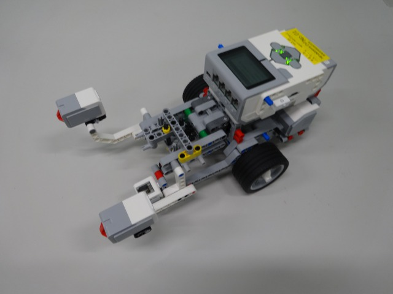
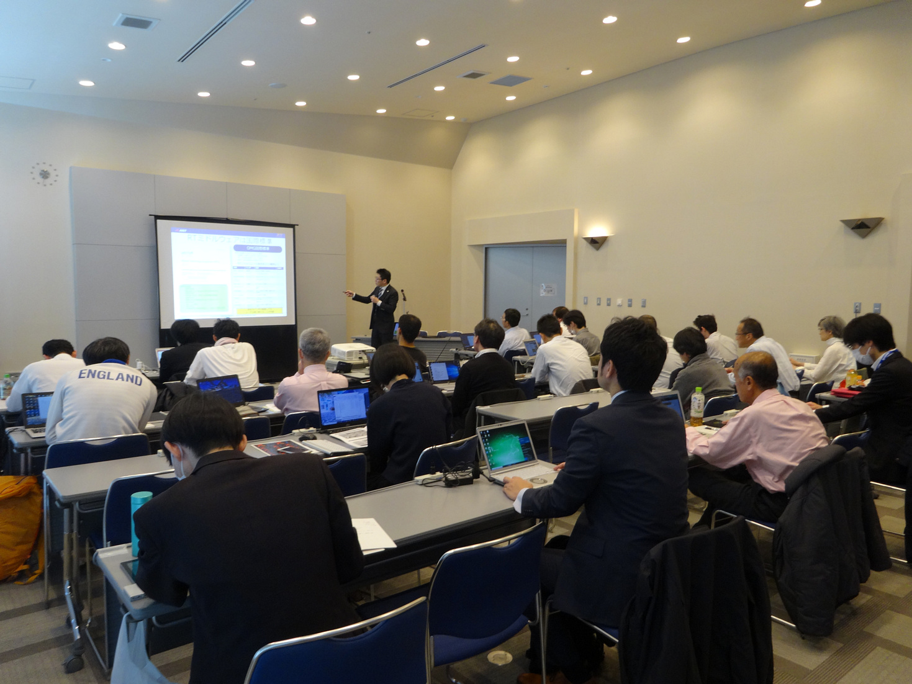
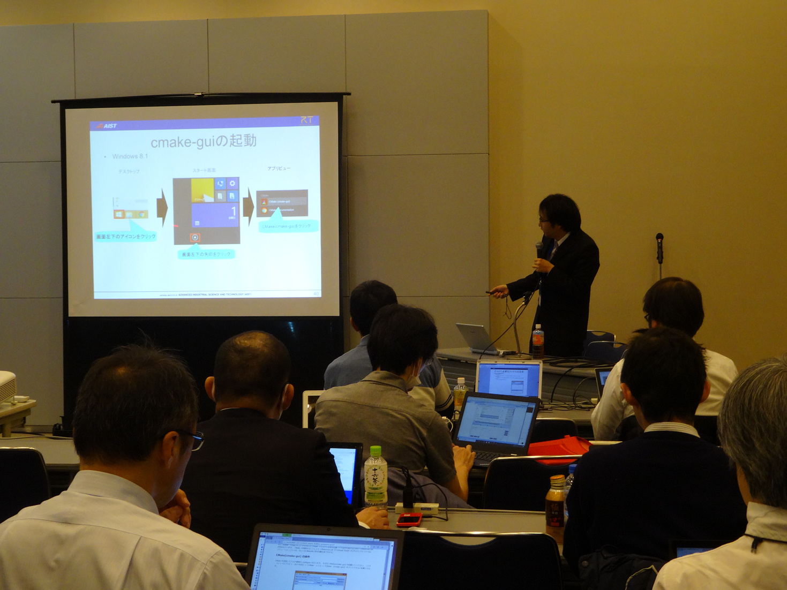
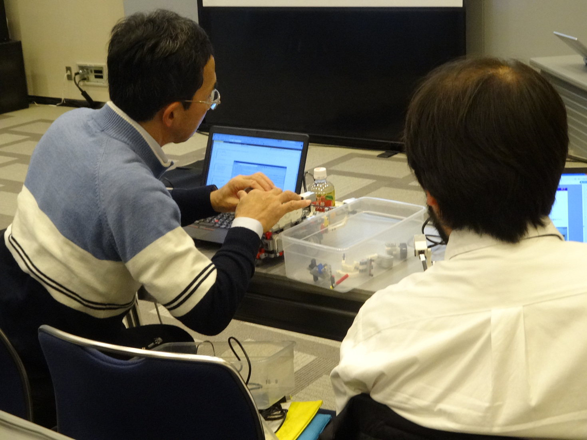
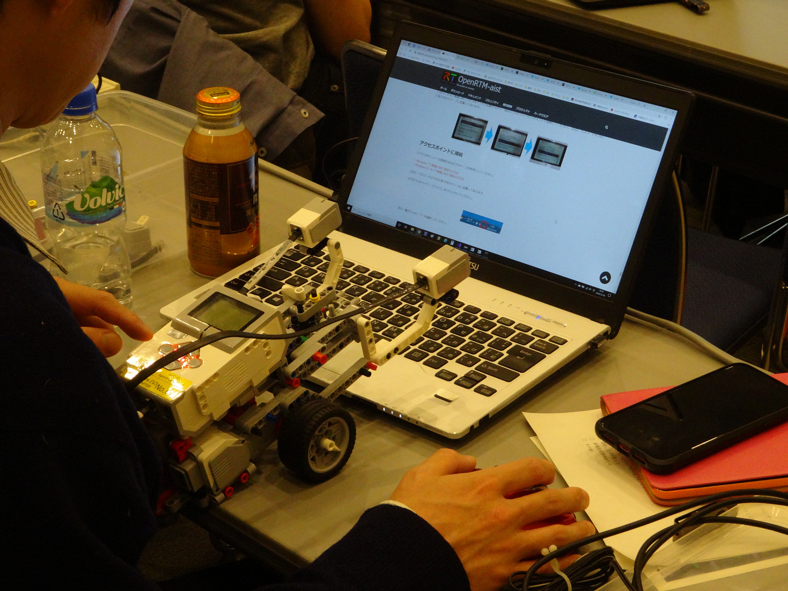
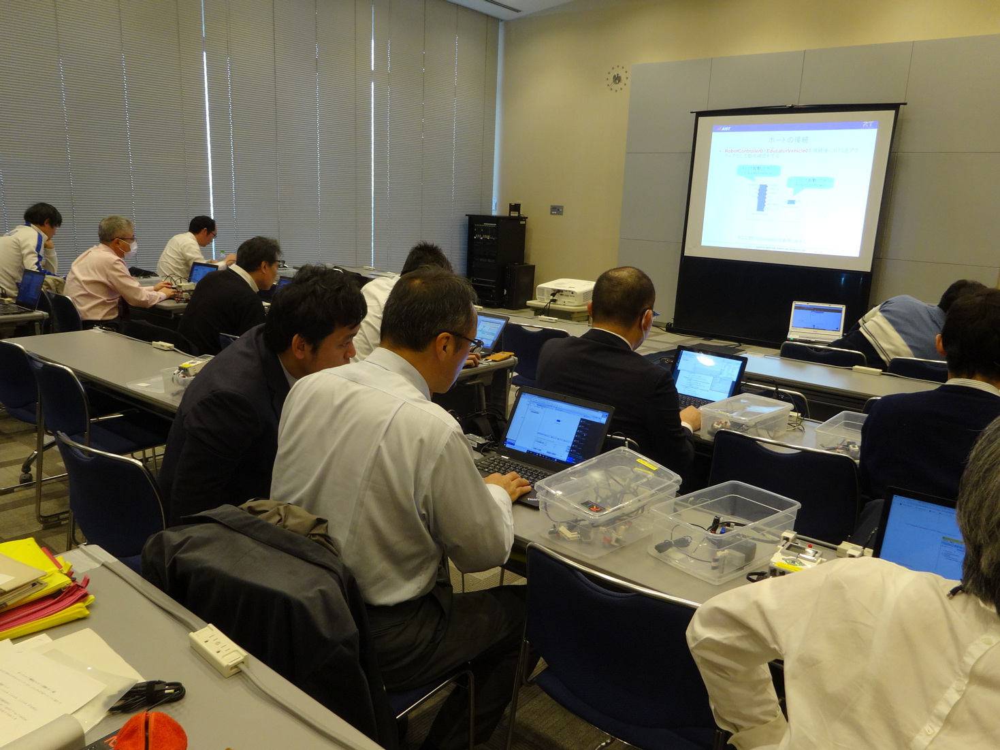

<!-- #ref(robomech2019_title.png,left,60%,margin=10,url=/ja/tutorial/robomech2019) -->

#contents

## 開催案内

<!-- 2019年12月18日(水)に東京ビッグサイトにおいて、iREX2019 RTミドルウエア講習会を開催いたします。 -->

2019年12月18日(水)に東京ビッグサイトにおいて、iREX2019 RTミドルウエア講習会を開催いたしました。

RTミドルウエアはロボットシステムの構築を効率化するソフトウエアプラットフォームです。RTコンポーネントと呼ばれるモジュール化されたソフトウエアを多数組わせてロボットシステムを構築するため、システムの変更、拡張がしやすいだけでなく、既存のソフトウエア資産をの継承や他人が作ったコンポーネントとの組み合わせも容易になります。講習会では、RTミドルウエアの概要、RTコンポーネントの作成方法について解説します。受講者には各自ノートPCをお持ちいただき、実習形式で実際にRTコンポーネントを作成、既存のコンポーネントなどと組み合わせて簡単なシステムを構築していただきます。本講習会を受講することで、RTコンポーネント設計方法、実装の仕方、システムの作り方をマスターすることができます。


## 日時・場所
<!-- -''主催'': 国立研究開発法人 産業技術総合研究所 -->
<!-- -''協賛'': ROBOMECH2019, (公社)計測自動制御学会システムインテグレーション部門 -->
- **日時**:2019年12月18日（水）10:00-17:00  
- **場所**:東京ビッグサイト 会議棟8階802
<!-- --アクセス: [[交通アクセス:http://www.pcf.city.hiroshima.jp/icch/access.html]] -->
<!-- --詳細は[[ROBOMEC2019 Webページ:http://robomech.org/2019/workshop-tutorial/#RTM]]をご覧ください。 -->
- **聴講料**: 無料
<!-- -- &color(red){必須ではありませんが可能な限りROBOMECH2019への参加登録をお願いします。}; -->
<!-- -''定員'': 20名程度を予定しております。定員になり次第申し込みは終了させていただきます。第1部のみご参加の方は申し込み不要です。 -->
- **参加者**: 1部19名、実習（第2, 3部）17名（+講師・スタッフ5名）
<!-- - ''参加登録'': &color(red){第1部のみの聴講は申込不要。}; -->
<!-- -- [[講習会申し込みフォーム:#form]] -->
<!-- -''参加登録'': 準備中です。少々お待ちください。 -->
<!-- - [[参加登録フォームはこちら:https://goo.gl/forms/vDW0jAmboChrlhkC2]] -->
<!-- -- 参加登録には当Webページのユーザ登録が必要です。[[ユーザ登録はこちら:/openrtm/ja/user/register]] -->
<!-- -- [[メーリングリスト:http://www.openrtm.org/mailman/listinfo/openrtm-users]]への登録をお勧めします。必須ではありませんが、Webでご案内する事前準備についてはメーリングリストにてお知らせします。 -->
<!-- -- 講習会のみの参加の場合ROBOMEC2019への参加登録は不要です。 -->
<!-- -- なお、登録の際に問題が生じた場合は、 [[こちら（robomech2017@openrtm.org）:mailto:robomech2017@openrtm.org]] までお問い合わせください。 -->

<!-- &br; -->
<!-- #ref(robomech2016_button.png,left,url=#entry) -->

## 過去の講習会

こちらから、過去の講習会の資料および写真などがご覧いただけます。

- [過去の講習会](/ja/node/130#past-training)

## プログラム

<table class="table-alt">
  <tr>
    <td>10:00 -11:00</td>
    <td>**第1部：OpenRTM-aistおよびRTコンポーネントプログラミングの概要**<br>  **担当**：安藤慶昭 (産総研) <br> **概要**： RTミドルウェア(OpenRTM-aist)はロボットシステムをコンポーネント指向で構築するソフトウェアプラットフォームです。RTミドルウェアを利用することで、既存のコンポーネントを再利用し、モジュール指向の柔軟なロボットシステムを構築することができます。RTミドルウエアについて、その概要およびRTコンポーネントの機能やプログラミングの流れについて説明します。<br>**講義資料**:<a href="191214-01.pdf">191214-01.pdf</a></td>
  </tr>
  <tr>
    <td>11:00 -12:00</td>
    <td>**第2部(前半)：RTコンポーネントの作成入門** <br> - **担当**：宮本 信彦(産総研) <br> - **概要**：RTシステムを設計するツールRTSystemEditorおよびRTコンポーネントを作成するツールRTCBuilderの使用方法について解説するとともに、移動ロボットのシミュレータを用いた実習によりRTCBuilder、RTSystemEditorの利用法の学習します。 <br> <a href="/ja/node/6381">チュートリアル(第2部、Windows)</a> <br> <a href="/ja/node/6382">チュートリアル(第2部、Ubuntu)</a> <br>**講義資料**:<a href="191218-02.pdf">191218-02.pdf</a></td>
  </tr>
  <tr>
    <td>12:00 -12:30</td>
    <td>RTミドルウェア普及貢献賞授賞式</td>
  </tr>
  <tr>
    <td>12:30 -13:30</td>
    <td>昼食</td>
  </tr>
  <tr>
    <td>13:30 -15:30</td>
    <td>**第2部(後半)：RTコンポーネントの作成入門** <br> - **担当**：宮本 信彦(産総研) <br> - **概要**：OpenRTM-aistを利用して移動ロボット実機を制御するプログラムを作成します。</td>
  </tr>
  <tr>
    <td>15:30 -16:30</td>
    <td>**第3部：RTシステム応用実習** <br> - **担当**：宮本 信彦(産総研) <br> - **概要**：ポータブル版LibreOffice用RTCの利用方法について解説を行うとともに、表計算ソフトによるRTCのテストの実行についての実習を行います。<br> <a href="/ja/node/6905">チュートリアル(第3部、Windows)</a> <br>**講義資料**:<a href="191218-03.pdf">191218-03.pdf</a></td>
  </tr>
</table>

<br>


<span style="color:red;">以下の小型ロボットを使って実習を行います。</span>;

### Educator Vehicle(LEGO Mindstorms EV3)
**MINDSTORMS**はLEGOが販売しているモーター、センサー、プログラミング可能なブロックの組み合わせでロボットなどを作成できる商品セットです。
**LEGO Mindstorms EV3**は第3世代のMindstormsの製品です。プログラム可能なEV3ブロックではLinuxが動作します。
**Educator Vehicle**はLEGO Mindstorms EV3を車輪移動ロボットの形に組み立てた例です。
今回は、あらかじめEducator Vehicle制御用コンポーネントがインストールされている状態で、これを制御するRTコンポーネントを作成していただきます。


<div align="center"><a href="s_DSC04048.JPG"></a></div>

- [LEGO Mindstorms EV3 活用事例](/ja/node/5864)

## 事前準備

### ノートPC
第2部ではノートPCを用いた実習を行うため、ノートPCの用意をお願いします。
ノートPCが用意できない場合は貸し出します。当日申し出てください。

ノートPCにウイルス対策ソフトをインストールしている場合は、教材ロボットと通信できなくなる場合があるため無効にしてください。
無効にできない場合はこちらで用意したノートPCを貸し出します。

### 資料
説明資料等を講習会当日にUSBメモリで配布する予定ですが、何らかの理由によりUSBメモリを利用できない場合は以下のZIPファイルをダウンロードしてください。

- [RTM_Tutorial_EV3.zip](https://github.com/OpenRTM/RTM_Tutorial_EV3/releases/download/iREX2019_0.01/RTM_Tutorial_EV3.zip)

### インストールするソフトウェア
#### Windowsの場合
以下のソフトウェアをインストールしてください。

- [Visual Studio 2019](/ja/node/6650)
  - Visual C++がインストールされているかは必ず確認してください。
- [Python 3.7](https://www.python.org/ftp/python/3.7.4/python-3.7.4-amd64.exe)
- [CMake](https://github.com/Kitware/CMake/releases/download/v3.15.4/cmake-3.15.4-win64-x64.msi)
- [Doxygen](http://doxygen.nl/files/doxygen-1.8.16-setup.exe)
- [OpenRTM-aist-1.2.1-RELEASE](https://github.com/OpenRTM/OpenRTM-aist/releases/download/v1.2.1/OpenRTM-aist-1.2.1-RELEASE_x86_64.msi)


### Ubuntuの場合

#### OpenRTM-aist

```
 $ wget https://raw.githubusercontent.com/OpenRTM/OpenRTM-aist/master/scripts/pkg_install_ubuntu.sh
 $ sudo sh pkg_install_ubuntu.sh -l all --yes
```

#### JDK

```
 # Ubuntu 18.04、18.10の場合
 $ sudo apt-get install openjdk-8-jdk
 # Ubuntu 16.04の場合
 $ sudo apt-get install default-jdk
```

Ubuntu 18.04、18.10の場合は以下のコマンドでjava8に切り替えます。

```
 $ sudo update-alternatives --config java
```

#### Git

```
 $ sudo apt-get install git
```

#### Premake(EV3Simulator に必要)

```
 $ sudo apt-get install premake4
```

#### GLUT(EV3Simulatorに必要)

```
 $ sudo apt-get install freeglut3-dev
```

#### EV3Simulator コンポーネント

```
 $ wget https://raw.githubusercontent.com/OpenRTM/RTM_Tutorial_EV3/master/script/install_ev3_simulator.sh
 $ sh install_ev3_simulator.sh
```


#### Code::Blocks(任意)

```
 $ sudo apt-get install codeblocks
```

#### cmake-gui(任意)

```
 $ sudo apt-get install cmake-qt-gui
```

<!-- &color(red){2種類の小型ロボットを使って実習を行います。}; -->

<!-- *** RaspberryPiマウス -->
<!-- RaspberryPiマウスは、株式会社アールティから発売されているメインボードにRaspberry Piを使った左右独立二輪方式の小型移動プラットフォームロボットです。 -->
<!-- RaspberryPiを利用しているので、実機上で開発したり、容易に拡張したりすることが可能です。今回は、あらかじめマウス制御用コンポーネントがインストールされている状態で、これを制御するRTコンポーネントを作成していただきます。 -->


<!-- #ref(s_DSC00444.JPG,50%,margin=10,nolink) -->

<!-- - [[Raspberry Pi Mouse 活用事例:http://openrtm.org/openrtm/ja/content/raspberry_pi_mouse]] -->

<!-- *** LEGO Mindstorms EV3 -->

<!-- LEGO Mindstorms EV3 は LEGO の Mindstorms シリーズの新しいパッケージです。EV3のメインのコントローラは、Linuxが標準搭載され、様々な言語でロボットの開発が可能になりました。USBインターフェースが搭載され、無線LANのUSBアダプタを挿すことで無線LANなどで外部と通信することも可能になりました。 -->
<!-- 搭載されるOSがLinuxになったことで、これまでよりもさらに柔軟に、かつ高度なロボット開発が可能になります。 -->

<!-- #ref(s_DSC00443.JPG,50%,margin=10,nolink) -->

<!-- - [[LEGO Mindstorms EV3 活用事例:/ja/casestudy/lego_mindstorm_ev3]] -->

<!-- &aname(form); -->
<!-- ** 事前参加登録フォーム -->

<!-- 参加登録多数のため申し込み受付を終了します。 -->

<!-- 以下の手順に従って、下記フォームから講習会へお申し込みください。 -->
<!-- &br; -->

<!-- #ref(registration_scheme.png,60%,left,nolink) -->

<!-- #ref(reg_flow.png,60%,left,nolink) -->

<!-- &br; -->
<!-- &color(red){このサイトにログイン後、下方に参加登録フォームが現れます。}; -->

<!-- + ''ユーザ登録:'' 参加登録するまえに当Webページのユーザ登録をお願いします。[[ユーザ登録はこちら:http://openrtm.org/openrtm/ja/user/register]] -->
<!-- -- 当Webサイトにログイン済みの方は名前の欄にユーザ名が出ますが、氏名に書き換えてください。 -->
<!-- + ''ログイン:'' ユーザ登録後 openrtm.org のサイトにログインします。 -->
<!-- + ''参加登録:'' 下記の登録フォームに必要事項を記入し登録してください。 -->
<!-- -- 申し込み内容はコースも含めて5日前まで変更できます。 -->
<!-- -- フォーム送信後、確認メールをお送りいたします。1日たっても確認メールが届かない場合は、[[こちら（rtm-tutorial@aist.go.jp）:mailto: rtm-tutorial@aist.go.jp]] までお問い合わせください。 -->


<!-- &color(red){定員に達しましたので申し込みを締め切らせていただきました。ありがとうございました。なお、見学だけであれば参加可能ですので、当日、会場までお越しください。}; -->
<!-- &color(red){第1部のみの聴講は申込不要です。}; -->

### 講義資料
#### 第1部 OpenRTM-aistおよびRTコンポーネントプログラミングの概要
- [第1部 講義資料(PDF)](191214-01.pdf)

<!-- Invalid YouTube URL: https://www.slideshare.net/207621255 -->

#### 第2部 RTコンポーネントの作成入門
- [第2部 講義資料(PDF)](191218-02.pdf)

<!-- Invalid YouTube URL: https://www.slideshare.net/207633559 -->

#### 第3部 RTミドルウェア応用実習
- [第3部 講義資料(PDF)](191218-03.pdf)

<!-- Invalid YouTube URL: https://www.slideshare.net/207635765 -->


## 講習会の様子
<div align="center"><a href="191218_11.jpg"></a></div>
<br>

<div align="center"><a href="191218_12.jpg"></a></div>
<br>

<div align="center"><a href="191218_13.jpg"></a></div>
<br>

<div align="center"><a href="191218_14.jpg"></a></div>
<br>

<div align="center"><a href="191218_15.jpg"></a></div>
<br>

