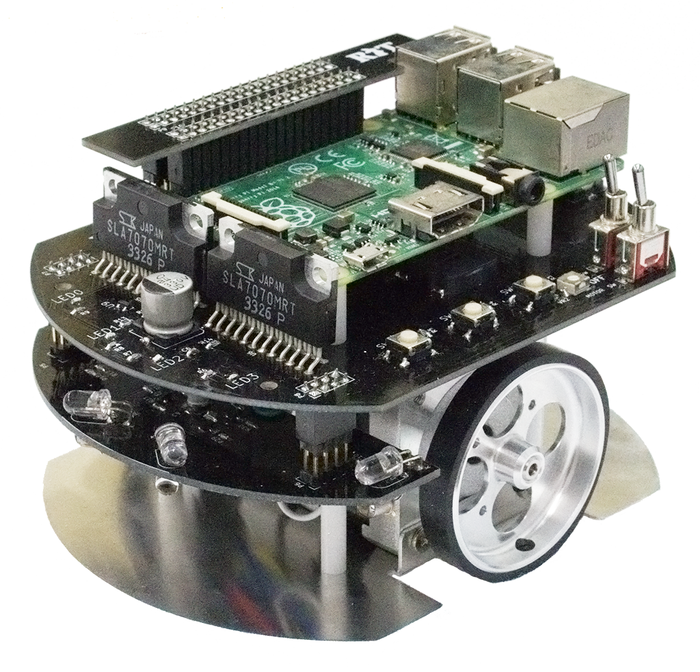
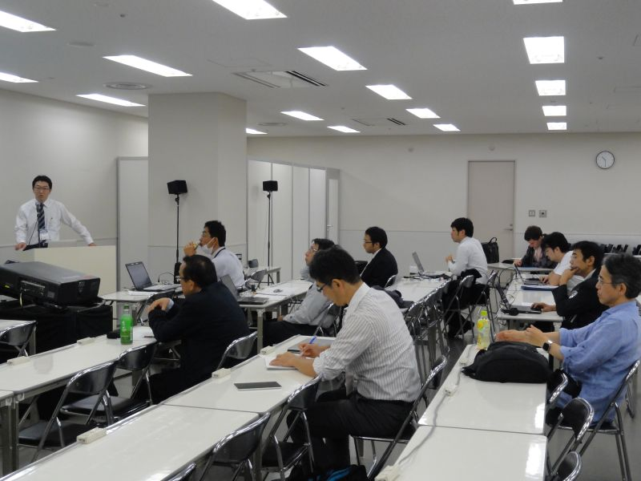
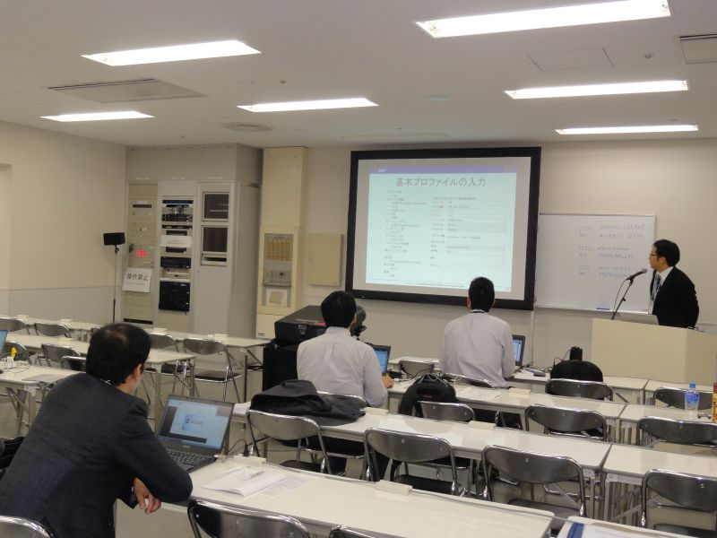
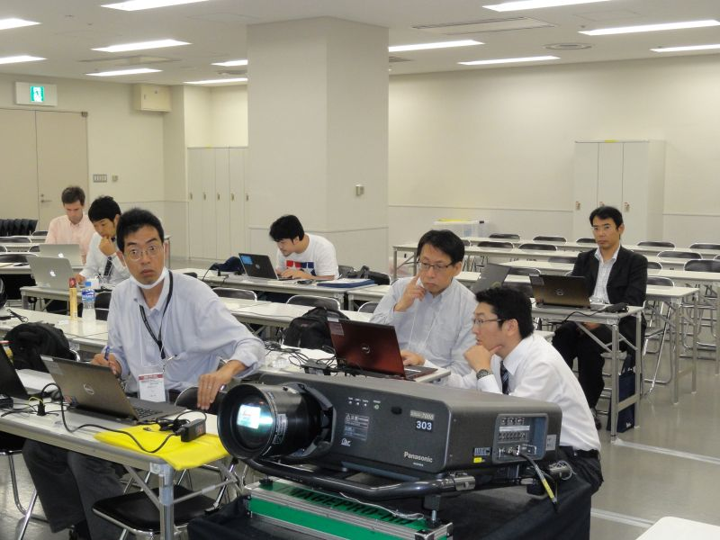
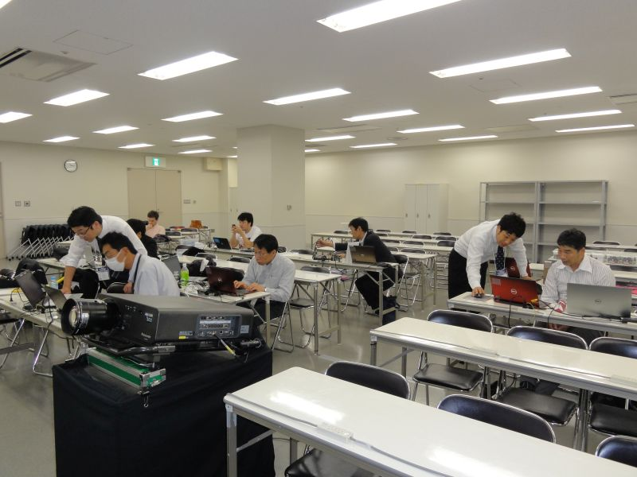
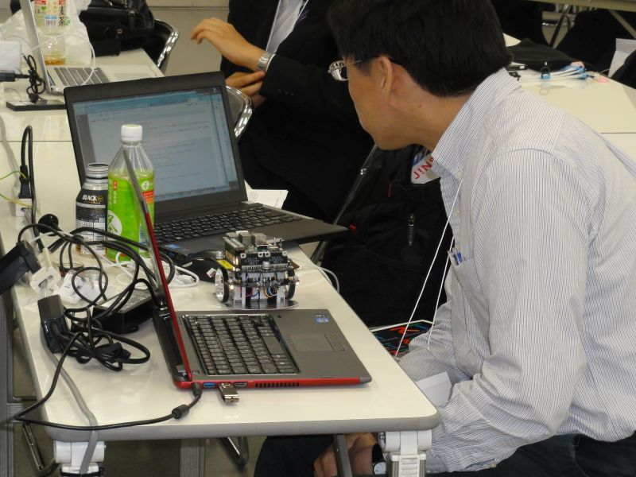

 
<a>No English version available.
</a>

<!-- -------jp page!!------- -->

<!-- #ref(dl_logo_wrob.jpg,60%,right,margin=10,around,url=http://biz.nikkan.co.jp/eve/s-robot/index.html) -->

#contents(4)

<!-- ** 開催案内 -->
## 開催報告

2016年10月19日(水)に東京ビックサイトにおいて、Japan Robot Week 2016－RTミドルウエア講習会を開催いたしました。

<!-- Japan Robot Week 2016でのRTミドルウエア講習会を開催いたします。&br; -->
<!-- RTミドルウエアはロボットシステムの構築を効率化するソフトウエアプラットフォームです。RTコンポーネントと呼ばれるモジュール化されたソフトウエアを多数組わせてロボットシステムを構築するため、システムの変更、拡張がしやすいだけでなく、既存のソフトウエア資産をの継承や他人が作ったコンポーネントとの組み合わせも容易になります。講習会では、RTミドルウエアの概要、RTコンポーネントの作成方法について解説します。受講者には各自ノートPCをお持ちいただき、実習形式で実際にRTコンポーネントを作成、既存のコンポーネントなどと組み合わせて簡単なシステムを構築していただきます。本講習会を受講することで、RTコンポーネント設計方法、実装の仕方、システムの作り方をマスターすることができます。 -->

## 日時・場所

- **日時**: 2016年10月19日(水), 10時00分～16時30分
- **場所**: [東京ビックサイト](http://www.bigsight.jp/) 東1ホール入口　ワークショップ会場A
<!-- --[[交通アクセス:http://www.bigsight.jp/general/access/index.html]] -->
- **主催**: [産業技術総合研究所](http://www.aist.go.jp), （一社）日本ロボット工業会・ロボットビジネス推進協議会
<!-- -''定員''：実習 30名, 聴講 30名（先着順で定員になり次第締め切り） -->
- **参加者**：実習 5名, 聴講のみ 4名（＋講師・スタッフ5名）
<!-- -''参加費'': 無料 -->
<!-- -''申し込み'':&color(red){実習を希望される方のみ}; 本ページの下の[[講習会申し込みフォーム:/ja/node/6095#entry]]からお申し込みください。 -->
<!-- -''申し込み'':&color(red){受付開始まで、もうしばらくお待ちください。};  -->
<!-- -- 前半の座学のみの聴講、実習の見学は登録不要です。 -->
<!-- -- 参加登録には当Webページのユーザ登録が必要です。[[ユーザ登録はこちら:http://openrtm.org/openrtm/ja/user/register]] -->
<!-- -- [[メーリングリスト:http://www.openrtm.org/mailman/listinfo/openrtm-users]]への登録をお勧めします。必須ではありませんが、Webでご案内する事前準備についてはメーリングリストにてお知らせします。 -->
<!-- -- なお、登録の際に問題が生じた場合は、 [[こちら（support@openrtm.org）:mailto:support@openrtm.org]] までお問い合わせください。 -->

<!-- &ref(irex2013_button.png,80%,left,url=#entry); -->

## プログラム
<!-- *** 未定 -->

<table class="table-alt">
  <tr>
    <td>10:00 -10:30</td>
    <td>**第1部：RTミドルウエアで始めるロボットプログラミング**  **担当**：安藤慶昭 氏 (産総研)   **概要**：国際標準準拠のロボット用ミドルウエアであるOpenRTM-aistの概要について説明します。OpenRTM-aistを使うと何が出来るのか、何が便利になるのか、また実際にどのように開発するのかといった基本的内容から、コンポーネントの基本機能や開発の実際、各種ツールの利用方法など技術的内容について解説します。  **資料:** <a href="./161019-01.pdf">161019-01.pdf</a></td>
  </tr>
  <tr>
    <td>11:30 -12:00</td>
    <td>**第2部：RTコンポーネントの作成入門**   **担当**：宮本信彦 氏(産総研)  **概要**：RTシステムを設計するツールRTSystemEditorおよびRTコンポーネントを作成するツールRTCBuilderの使用方法について解説するとともに、RTCBuilderを使用したRTコンポーネントの作成方法を実習形式で体験していただきます。   <a href="/ja/node/6057">チュートリアル（画像処理コンポーネントの作成 Windows編）</a>   <a href="/ja/node/6058">チュートリアル（画像処理コンポーネントの作成 Linux編）</a>   **資料:** <a href="161019-02.pdf">161019-02.pdf</a></td>
  </tr>
  <tr>
    <td>12:00 -13:00</td>
    <td>昼食</td>
  </tr>
  <tr>
    <td>13:00 -13:30</td>
    <td><a href="http://www.openrtm.org/openrtm/ja/news/business_award_160804_ja">RTミドルウェア普及貢献賞授賞式</a></td>
  </tr>
  <tr>
    <td>13:30 -16:30</td>
    <td>**第3部：プログラミング実習**   担当：宮本信彦 氏 (産総研) 他   **概要**：OpenRTM-aistを利用して<a href="http://products.rt-net.jp/micromouse/raspberry-pi-mouse">RaspberryPiマウス</a> を制御するプログラムを実際に作成します。  <a href="/ja/node/6042">チュートリアル（RaspberryPiマウス）</a>   **資料:** <a href="161019-03.pdf">161019-03.pdf</a></td>
  </tr>
</table>

 

小型ロボットを使って実習を行います。;

### RaspberryPiマウス
RaspberryPiマウスは、株式会社アールティから発売されているメインボードにRaspberry Piを使った左右独立二輪方式の小型移動プラットフォームロボットです。
RaspberryPiを利用しているので、実機上で開発したり、容易に拡張したりすることが可能です。今回は、あらかじめマウス制御用コンポーネントがインストールされている状態で、これを制御するRTコンポーネントを作成していただきます。

- [Raspberry Pi Mouse 活用事例](http://openrtm.org/openrtm/ja/content/raspberry_pi_mouse)

<!-- ** 講習会に参加される方へ -->

<!-- 第2,3部の実習には以下の準備が必要です。 -->

<!-- *** 必要機材 -->
### 講習会参加に必要な環境
- ノートPC
  - OS: Windowsをご用意下さい
  - Eclipseが動作する程度のスペックが必要です
  - メモリ: 1GB以上
  - CPU: Core2Duo以上
  - HDD空き: 5GB以上
- USBカメラ (ない場合には貸与いたします)

Windowsのファイアウォールは必ず切っておいてください。;
セキュリティーソフトにもファイアウォールが設定されている場合がありますので、そちらもOFFにしておいてください。;

### 事前にインストールするソフトウエア

あらかじめインストールしておくべきソフトウエアは以下のとおりです。以下のリンクをクリックし、ファイルをダウンロード・インストールしてください。 
一部のリンクはダウンロードページへ飛びますので、飛んだ先のページ内で適切なファイルをそれぞれダウンロードしてください。

#### Visual Studio 

- Visual Studio 2013推奨：[こちらのページ](https://www.visualstudio.com/ja-jp/downloads/download-visual-studio-vs#DownloadFamilies_2) から無償版をダウンロードできます。
  - 左のメニューから「Visual Studio 2013」→「Community 2013」のWebインストーラを選択。
  - インストールには時間がかかりますので、事前にインストールしておいてください。

#### OpenRTM-aist 1.1.2-RELEASE版 (C++版、Python版）

- 1.1.2 からは一つのインストーラですべての言語とVisual Studioのバージョンに対応しいます。32bit/64bitのみ選択してください。（32bit推奨）
  - [Windows用インストーラ(32bit)](/ja/content/openrtm-aist-c-112-release#toc2)
- 1.1.2 は インストールしているVisual Studioのバージョンをシステム環境変数で指定しますので、設定を確認して下さい。デフォルトはvc2013の設定になっています。
  - [Visual Studio のバージョン指定](/ja/content/openrtm-aist-c-112-release#toc4)
- 1.1.2の使用を推奨しますが、1.1.0, 1.1.1でも受講可能です。
- 1.1.1/1.1.0 をお使いの場合は必ず; Visual Studio のバージョンと一致させてください。
<!-- -- 他のバージョン用は、[[こちらのページ:http://openrtm.org/openrtm/ja/content/openrtm-aist-c-112-release]] からダウンロードできます。(非推奨) -->
- デフォルト設定のままインストールして下さい。
- [OpenRTM-aistを10分で始めよう！](http://openrtm.org/openrtm/ja/node/6026) を参考に、事前にサンプルコンポーネントを起動して動作確認を行っておいてください。

#### Python

- [Python2.7.10](https://www.python.org/ftp/python/2.7.10/python-2.7.10.msi)
<!-- 、または [[Python2.7(64bit):https://www.python.org/ftp/python/2.7.10/python-2.7.10.amd64.msi]] -->
  - Python2.7.11もすでにリリースされていますが非推奨です。;
  - OpenRTM-aistやPyYAMLをインストールする前にインストールしてください;

<!-- -- OpenRTM-aist Python の64bit版をインストールされる場合は、[[Python2.7(64bit):https://www.python.org/ftp/python/2.7.9/python-2.7.9.amd64.msi]] をインストールしてください。　 -->

#### その他

以下のソフトウェアも必須です。忘れずにインストールしてください。

- [PyYAML](http://pyyaml.org/download/pyyaml/PyYAML-3.11.win32-py2.7.exe)
<!-- -- Python2.7(64bit)をインストールされた場合は、[[PyYAML(64bit):http://pyyaml.org/download/pyyaml/PyYAML-3.11.win-amd64-py2.7.exe]] をインストールしてください。　 -->
- [CMake](https://cmake.org/files/v3.5/cmake-3.5.2-win32-x86.msi)
- [Doxygen](http://ftp.stack.nl/pub/users/dimitri/doxygen-1.8.11-setup.exe)
- 使い慣れたエディタ: EclipseやPythonに付属のエディタでも構いませんが、使い慣れたエディタが入っていた方が良いでしょう

## 資料

### 第１部：OpenRTM-aistおよび␋RTコンポーネントプログラミングの概要

<!-- Invalid YouTube URL: http://www.slideshare.net/67352401 -->



### 第２部：RTコンポーネントの作成入門 

<!-- Invalid YouTube URL: http://www.slideshare.net/67432411 -->


### 第３部：プログラミング実習

<!-- Invalid YouTube URL: http://www.slideshare.net/67432445 -->


<!-- &aname(entry); -->
<!-- **講習会申し込みフォーム -->

<!-- 以下の手順に従って、下記フォームから講習会へお申し込みください。 -->
<!-- //&br; -->
<!-- //#ref(reg_flow.png,60%,left,nolink) -->
<!-- //&br; -->
<!-- &color(red){このサイトにログイン後、下方に参加登録フォームが現れます。}; -->

<!-- #ref(registration_scheme.png,60%,left,nolink) -->

<!-- + ''ユーザ登録:'' 参加登録するまえに当Webページのユーザ登録をお願いします。[[ユーザ登録はこちら:http://openrtm.org/openrtm/ja/user/register]] -->
<!-- -- 当Webサイトにログイン済みの方は名前の欄にユーザ名が出ますが、氏名に書き換えてください。 -->
<!-- + ''ログイン:'' ユーザ登録後 openrtm.org のサイトにログインします。 -->
<!-- + ''参加登録:'' 下記の登録フォームに必要事項を記入し登録してください。 -->
<!-- //-- 申し込み内容はコースも含めて5日前まで変更できます。 -->
<!-- -- 申し込み内容は5日前まで変更できます。 -->
<!-- -- フォーム送信後、確認メールをお送りいたします。1日たっても確認メールが届かない場合は、[[こちら（tutorial@openrtm.org）:mailto:tutorial@openrtm.org]] までお問い合わせください。 -->

<!-- &color(red){定員に達しましたので申し込みを締め切らせていただきました。ありがとうございました。なお、見学だけであれば参加可能ですので、当日、会場までお越しください。}; -->
<!-- &color(red){第1部のみの聴講は申込不要です。}; -->

## 講習会の様子

 

 

 

 

<!-- -------jp page!!------- -->
