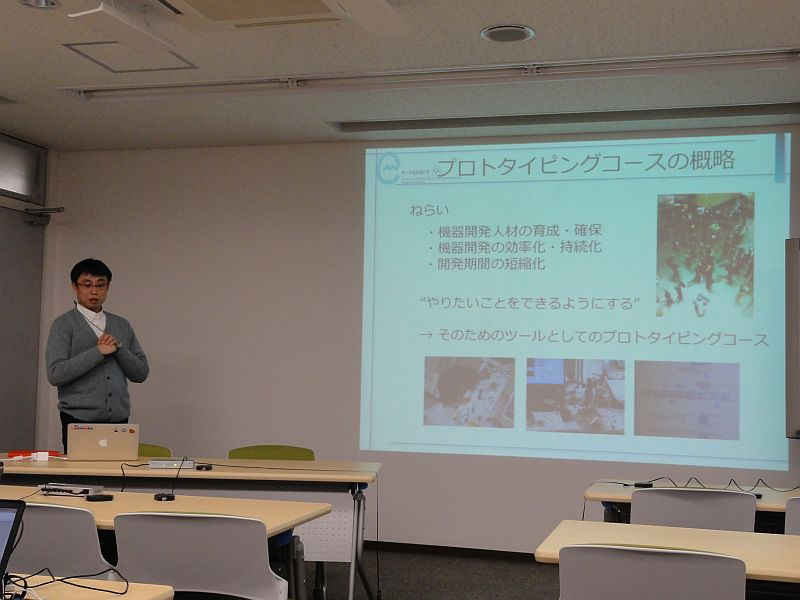
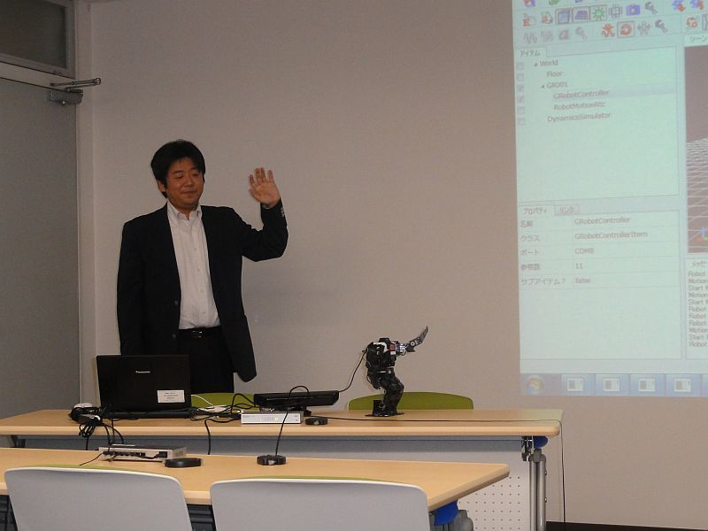
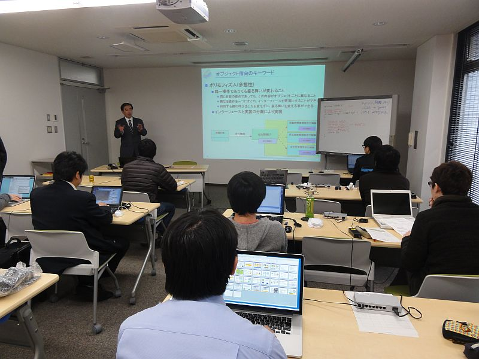
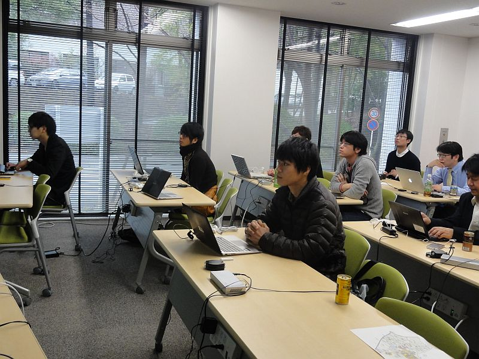
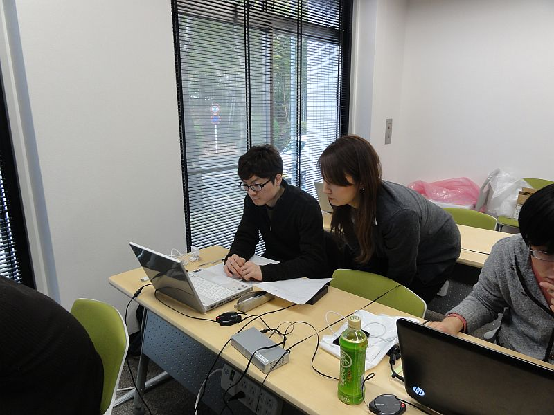

## 開催要旨

<!-- JSTプロジェクト「先端計測分析機器用共通ソフトウエアプラットフォームの開発」(研究代表者：大阪大学大学院・佐藤了平教授) プロジェクトの一環として、RTミドルウエアを利用したソフトウェア教育プログラムが大阪大学で開催されます。 -->
JSTプロジェクト「先端計測分析機器用共通ソフトウエアプラットフォームの開発」(研究代表者：大阪大学大学院・佐藤了平教授) プロジェクトの一環として、RTミドルウエアを利用したソフトウェア教育プログラムが大阪大学で開催されました。

JST先端計測分析機器用共通ソフトウエアプラットフォームの開発プロジェクトでは、電子顕微鏡等計測分析機器の開発効率化のため、システム設計へのSysMLの導入、ソフトウエアプラットフォームとしてのRTミドルウエアの利用が図られています。
先端計測分野においては、機器を利用する研究者自ら計測機器を設計・製作する必要があるため、計測システム自体をモジュール化・オープン化し、利用者自ら内部構成に手を入れ最適な計測システムを容易に構成できるシステムが求められています。

LabViewやRTミドルウエアを利用し、既存のソフトウエア・ハードウエア部品を組み合わせることで、希望する計測システムを構築し最先端の研究に利用することができる人材を育成するため、プロジェクトの一環として教育プログラムを実施することとなりました。

### 日時・場所

- 2013年1月21日（月）～1月22日（火）
  - 21日: 13:00-17:00
  - 22日: 10:00-17:00
- 大阪大学吹田キャンパス・産学連携本部Ｂ棟１Ｆ会議室
  - [大阪大学吹田キャンパス](http://www.osaka-u.ac.jp/ja/access/suita.html)
  - [産学連携本部](http://www.uic.osaka-u.ac.jp/access/index.html)
- 参加人数: 6名

<!-- *** 参加について -->

<!-- 本講習会は、クローズドな講習会ですので、本Webページでは参加を受け付けておりません。 -->
<!-- なお、講習会で使用した資料はこちらで公開いたしますので参考にしてください。 -->

<!-- 大阪大学市田先生のご厚意により、外部からも参加を受け付けていただけることになりました。 -->
<!-- ページ下部の[[申し込みフォーム:#entry]] よりお申し込みください。 -->

<!-- - 定員: 20名 -->

### プログラム

<table class="table-alt">
  <tr>
    <td>1月21日(月)</td>
    <td>第1日目 PFCoreトレーニング((初級編)</td>
    <td>講師</td>
  </tr>
  <tr>
    <td>13:00-13:20</td>
    <td>第１部：先端計測分野におけるRTミドルウェア(PFCore)　  講義資料: <a href="130122-02.pdf">130122-02.pdf</a></td>
    <td>市田秀樹 (阪大)</td>
  </tr>
  <tr>
    <td>13:20-14:10</td>
    <td>第２部：RTミドルウェア(PFCore)の概略紹介</td>
    <td>神徳徹雄 (産総研)</td>
  </tr>
  <tr>
    <td>14:10-15:05</td>
    <td>第３部：RTミドルウェア(PFcore)サンプルコンポーネントの紹介とその利用方法</td>
    <td>原功 (産総研)</td>
  </tr>
  <tr>
    <td>15:20-17:00</td>
    <td>第４部：RTミドルウェア(PFCore)開発支援ツールとシステム構築方法   講義資料: <a href="130121-04.pdf">130121-04.pdf</a></td>
    <td>坂本武志 (グローバルアシスト)</td>
  </tr>
</table>

<table class="table-alt">
  <tr>
    <td>1月22日（火）</td>
    <td>第2日目 PFCoreトレーニング(中級編)</td>
    <td>講師</td>
  </tr>
  <tr>
    <td>10:00-11:00</td>
    <td>第１部：RTコンポーネントプログラミングの概要   講義資料: <a href="130122-01.pdf">130122-01.pdf</a></td>
    <td>安藤慶昭 (産総研)</td>
  </tr>
  <tr>
    <td>11:00-12:00</td>
    <td>第２部：RTミドルウェア(PFcore)開発支援ツールとRTコンポーネントの作成方法   講義資料: <a href="130122-02.pdf">130122-02.pdf</a></td>
    <td>坂本武志 (グローバルアシスト)</td>
  </tr>
  <tr>
    <td>13:00-17:00</td>
    <td>第３部：RTコンポーネント開発実習   講義資料: <a href="130122-03.pdf">130122-03.pdf</a></td>
    <td>安藤慶昭 (産総研)</td>
  </tr>
</table>

## 講習会に参加される方へ
実習形式の講習会に参加される方は、以下の準備をお願いいたします。

### 用意するもの

実習には以下の準備が必要です。
- ノートPC
  - OS: Windowsを推奨します。応用コースの方は自分で対処出来る場合はどちらでも結構です
  - Eclipseが動作する程度のスペックが必要です
  - メモリ: 1GB以上
  - CPU: Core2Duo以上
  - HDD空き: 5GB以上 (Visual C++ Expressの場合)
- USBカメラ (USBカメラ無しで申込まれた方には貸与いたします)
- Windowsでも、Linuxでも構いませんが、USBカメラがOpenCVからつかえることが前提です。
- LANケーブル

### ソフトウエアのインストール

あらかじめインストールしておくべきソフトウエアは以下のとおりです。以下のリンクをクリックし、ファイルをダウンロード・インストールしてください。(一部のリンクはダウンロードページへ飛びますので、飛んだ先のページ内で適切なファイルをそれぞれダウンロードしてください。

Windows推奨ですが、Linuxでも実習可能です。

<table class="table-alt">
  <tr>
    <td>></td>
    <td>CENTER: OpenRTM-aist 1.1.0 C++ 関連</td>
  </tr>
  <tr>
    <td><a href="/ja/node/5012">C++, RELEASE版</a></td>
    <td>OpenRTM-aist C++版パッケージ。ダウンロードページに従い、自分の環境に合ったパッケージ、 PythonおよびPyYAML をインストールします。</td>
  </tr>
  <tr>
    <td><a href="http://go.microsoft.com/fwlink/?LinkId=190491&clcid=0x411">Visual C++ 2010</a> または   <a href="http://go.microsoft.com/?LinkId=9348304">Visual C++ 2008</a></td>
    <td>C++のコンポーネントをコンパイルするの必要 (Express版でもOK)</td>
  </tr>
  <tr>
    <td><a href="http://www.cmake.org/files/v2.8/cmake-2.8.8-win32-x86.exe">cmake-2.8.8</a></td>
    <td>Visual C++のプロジェクトを作成するのに必要</td>
  </tr>
  <tr>
    <td><a href="http://ftp.stack.nl/pub/users/dimitri/doxygen-1.8.1-setup.exe">doxygen</a></td>
    <td>ビルドの過程でドキュメントを整形するのに必要</td>
  </tr>
  <tr>
    <td>></td>
    <td>CENTER: OpenRTM-aist 1.1.0 Python 関連</td>
  </tr>
  <tr>
    <td><a href="http://openrtm.org/openrtm/node/4526">Python, RC1版</a></td>
    <td>OpenRTM-aist Python版パッケージ。ダウンロードページに従い、自分の環境にあったパッケージ、 Pythonをインストールします。</td>
  </tr>
  <tr>
    <td>></td>
    <td>CENTER: Eclipseツール</td>
  </tr>
  <tr>
    <td><a href="http://openrtm.org/openrtm/ja/node/4557">Eclipseツール</a></td>
    <td>コンポーネントを設計するツール: RTCBUilder, コンポーネントを操作するツール: RTSystemEditor が同梱されています。</td>
  </tr>
</table>

### 実習で必要なファイル

- [RTC.xml](http://www.openrtm.org/openrtm/sites/default/files/4965/RTC.xml)
- [Flipコンポーネントの作成](http://www.openrtm.org/openrtm/ja/node/5022)

### Linuxで必要なソフトウエア

上記に相当するLinuxのパッケージをインストールしておいてください。
加えて、OpenCVが必要になります。

<!-- &aname(entry); -->
<!-- **講習会申し込みフォーム -->

<!-- 以下の申し込みフォームページから講習会へお申し込みください。 -->
<!-- - 参加登録するには当Weサイトへのユーザ登録が必要です。[[ユーザ登録はこちら:http://openrtm.org/openrtm/ja/user/register]] -->
<!-- - 当Webサイトにログイン済みの方は名前の欄にユーザ名が出ますが、氏名に書き換えてください。 -->
<!-- - 受講したい日程をご指定ください。(2日間とも参加、または1日目のみ、2日目のみいずれか選択可能です。) -->
<!-- - 講習会で必要なUSBカメラの有無についてもお申し出ください。 -->
<!-- - フォーム送信後、確認メールをお送りいたします。1日たっても確認メールが届かない場合は、[[こちら（support@openrtm.org）:mailto:support@openrtm.org]] までお問い合わせください。 -->

## 講習会の様子

;

;

;

;

;

