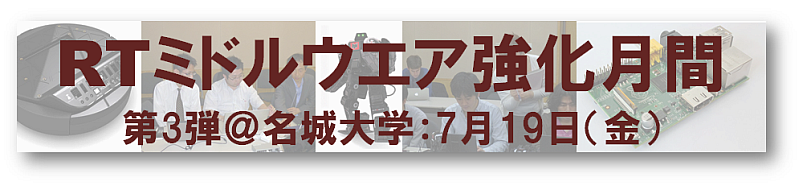

 
<a>No English version available.
</a>

<!-- -------jp page!!------- -->

#contents

## RTミドルウェア強化月間(第3弾)：名城大学・RTミドルウェア講習会

2013年7月19日(金)に名城大学天白キャンパスにおいて、RTミドルウェア講習会を開催いたしました。

<!-- RTミドルウェア強化月間第2弾として、2013年7月19日(金)に名城大学　天白キャンパスにおいて，RTミドルウェア講習会を開催します。&br; -->
<!-- 受講者には各自ノートPCをお持ちいただき、実習形式で実際にRTコンポーネントを作成、既存のコンポーネントなどと組み合わせて簡単なシステムを構築していただきます。&br; -->
<!-- 本講習会を受講することで、RTコンポーネント設計方法、実装の仕方、システムの作り方をマスターすることができます。&br; -->

## 日時・場所
- **日時**: 2013年7月19日(金), 13:00～17:00
- **場所・アクセス**: [名城大学　天白キャンパス](http://www.meijo-u.ac.jp/campus/shisetsu/tenpaku.html)、研究実験棟II メカトロニクス工学科会議室
- **主催**: (独)産業技術総合研究所
<!-- -''聴講料'': 無料  -->
<!-- -''定員'': 5名程度を予定しております。定員になり次第申し込みは終了させていただきます。 -->
- **参加者**: 7名（+講師・スタッフ2名）
<!-- -''参加登録'': [[参加登録フォームはこちら>#entry]] -->
<!-- -- 参加登録には当Webページのユーザ登録が必要です。[[ユーザ登録はこちら:http://openrtm.org/openrtm/ja/user/register]] -->
<!-- -- [[メーリングリスト:http://www.openrtm.org/mailman/listinfo/openrtm-users]]への登録をお勧めします。必須ではありませんが、Webでご案内する事前準備についてはメーリングリストにてお知らせします。 -->
<!-- -- なお、登録の際に問題が生じた場合は、 [[こちら（support@openrtm.org）:mailto:support@openrtm.org]] までお問い合わせください。 -->

### 他の強化月間講習会

- [RTミドルウェア強化月間(第1弾)：中央大学・RTミドルウェア講習会(2013年7月10日)](../chuo2013)
- [RTミドルウェア強化月間(第2弾)：大阪大学・RTミドルウェア講習会(2013年7月11日)](../osaka2013)
- [RTミドルウェア強化月間(第4弾)：早稲田大学・RTミドルウェア講習会(2013年7月24日)](../waseda2013)

## プログラム

<table class="table-alt">
  <tr>
    <td>13:00 -13:30</td>
    <td>**第1部：RTミドルウエア: OpenRTM-aist概要**   **担当**：大原賢一先生 (名城大)   **概要**：RTミドルウエアはロボットシステムをコンポーネント指向で構築するソフトウエアプラットフォームです。RTミドルウエアを利用することで、既存のコンポーネントを再利用し、モジュール指向の柔軟なロボットシステムを構築することができます。RTミドルウエアの産総研による実装であるOpenRTM-aistについてその概要について説明します。   **講義資料**:<a href="./130719-01.pdf">130719-01.pdf</a></td>
  </tr>
  <tr>
    <td>13:30 -14:30</td>
    <td>**第2部: RTコンポーネントの作成入門**  **担当**：大原賢一先生 (名城大)   **概要**：RTCBuilderを使用したRTコンポーネントの作成方法を説明します。   **講義資料**:<a href="./130719-02.pdf">130719-02.pdf</a></td>
  </tr>
  <tr>
    <td>14:45 -17:00</td>
    <td>**第3部：プログラミング実習**   担当：大原賢一先生 (名城大)   **概要**：OpenRTM-aistを利用してコンポーネントを作成し、他のコンポーネントと組み合わせて動作させてみます。   **講義資料**:<a href="./130719-03.pdf">130719-03.pdf</a></td>
  </tr>
</table>

<!-- ** 講習会に参加される方へ -->

### 必要機材
- ノートPC
  - OS: Windowsを推奨します。応用コースの方は自分で対処出来る場合はどちらでも結構です
  - Eclipseが動作する程度のスペックが必要です
  - メモリ: 1GB以上
  - CPU: Core2Duo以上
  - HDD空き: 5GB以上 (Visual C++ Expressの場合)
- USBカメラ (USBカメラ無しで申込まれた方には貸与いたします)

Windowsのファイアウォールは必ず切っておいてください。;

### 必要ソフトウエア
あらかじめインストールしておくべきソフトウエアは以下のとおりです。以下のリンクをクリックし、ファイルをダウンロード・インストールしてください。(一部のリンクはダウンロードページへ飛びますので、飛んだ先のページ内で適切なファイルをそれぞれダウンロードしてください。

- Visual C++ 2010
  - 無料のExpress版が [こちら](http://www.microsoft.com/visualstudio/jpn/downloads#d-2010-express) からダウンロードできます。
  - インストールには時間がかかりますので、ご注意ください。
  - VC2012には対応していません。また、VC2008は少々古いのでお勧めいたしません。
- [OpenRTM-aist-1.1.0 C++版](http://www.openrtm.org/openrtm/ja/node/5012)
  - インストールされているVCに一致するバージョンをダウンロードしてください。;
  - 64bit版はPythonとの相性が悪いので、32bit版をお勧めします。
<!-- - [[OpenRTM-aist-1.1.0-RC1 Python:http://www.openrtm.org/pub/Windows/OpenRTM-aist/python/OpenRTM-aist-Python-1.1.0-RC1.msi]] -->
- [Python 2.6(32bit)](http://www.python.org/ftp/python/2.6.6/python-2.6.6.msi)
- [PyYAML](http://pyyaml.org/download/pyyaml/PyYAML-3.10.win32-py2.6.exe)
- [CMake](http://www.cmake.org/files/v2.8/cmake-2.8.8-win32-x86.exe)
- [Doxygen](http://ftp.stack.nl/pub/users/dimitri/doxygen-1.8.1-setup.exe)
- [JDK](http://www.oracle.com/technetwork/java/javase/downloads/jdk7-downloads-1880260.html)
  - 32bit版をお勧めします。
- [Eclipse全部入り](http://www.openrtm.org/openrtm/ja/node/30)
  - [Windows用32bit版全部入り](http://openrtm.org/pub/openrtp/packages/1.1.0.rc4v20130216/eclipse381-openrtp110rc4v20130216-ja-win32.zip)を推奨します。
  - インストール後、メニューの「ヘルプ」→「新規ソフトウエアのインストール」を選択、更新サイトに http://openrtm.org/pub/openrtp/releases/updates を入力してRTSystemEditorとRTCBuilderをアップデートしておくことをお勧めします。
- 使い慣れたエディタ: EclipseやPythonに付属のエディタでも構いませんが、使い慣れたエディタが入っていた方が良いでしょう
- [RTC.xml](http://www.openrtm.org/openrtm/sites/default/files/5235/RTC.xml) 第2部で使用します。

### 講義資料

#### 第1部 RTミドルウエア: OpenRTM-aist概要
- [第1部 講義資料(PDF)](./130719-01.pdf)

<!-- Invalid YouTube URL: http://www.slideshare.net/24597323 -->


#### 第2部 RTコンポーネントの作成入門
- [第2部 講義資料(PDF)](./130719-02.pdf)

<!-- Invalid YouTube URL: http://www.slideshare.net/24603245 -->


#### 第3部 プログラミング実習
- [第3部 講義資料(PDF)](./130719-03.pdf)

<!-- Invalid YouTube URL: http://www.slideshare.net/24597377 -->


<!-- &aname(entry); -->
<!-- **講習会申し込みフォーム -->

<!-- 以下のフォームから講習会へお申し込みください。 -->
<!-- - 参加登録するまえに当Webページのユーザ登録をお願いします。[[ユーザ登録はこちら:http://openrtm.org/openrtm/ja/user/register]] -->
<!-- - 当Webサイトにログイン済みの方は&color(red){名前の欄のユーザ名を氏名に書き換えてください};。 -->
<!-- - フォーム送信後、確認メールをお送りいたします。1日たっても確認メールが届かない場合は、[[こちら（support@openrtm.org）:mailto:support@openrtm.org]] までお問い合わせください。 -->

<!-- &color(red){定員に達しましたので申し込みを締め切らせていただきました。ありがとうございました。なお、見学だけであれば参加可能ですので、当日、会場までお越しください。}; -->

## 講習会の様子

 

 

 

 

 

&aname(comment);
<!-- -------jp page!!------- -->
