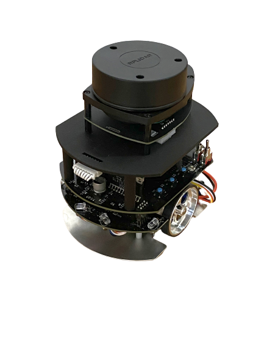

#contents(4)

## 開催概要

2024年11月21日(木)～11月22日(金)の日程で、高度ポリテクセンターの能力開発セミナーの一環として、「RTミドルウェアによるロボットプログラミング技術」講習会を開催いたします。

## 日時・場所

- **日時**: 2024年11月21日(木), 22日(金), 10時00分～16時45分
- **場所**: [高度ポリテクセンター](https://www.apc.jeed.go.jp/)
  - [交通アクセス](https://www.apc.jeed.go.jp/04_02.html)
- **主催**: 高度ポリテクセンター
  - [コース案内](https://www.apc.jeed.go.jp/zaishoku/2024/E0771.html)
<!-- -''参加者''：7名 -->
- **参加費**: 21,000円

## プログラム

<table class="table-alt">
  <tr>
    <th colspan="2">11月21日（木）</th>
  </tr>
  <tr>
    <td>10:00 -10:50</td>
    <td><strong>１．コース概要</strong> 　（１）ロボットシステムプログラミングの現状  　（２）ロボットOS・ミドルウェア  　（３）RTミドルウェア(RTM)を用いたロボット開発   　<strong>資料:</strong> <a href="241121_1_コース概要_印刷用.pdf">241121-01.pdf</a></td>
  </tr>
  <tr>
    <td>11:00 -11:45</td>
    <td><strong>２．プログラミングの基礎</strong>   　（１）OpenRTM-aistのインストール  　（２）RTCプログラミング概要   　・<a href="/ja/node/7295#toc4">インストールするソフトウェア</a>  　・<a href="/ja/node/6629">(参考)Windowsへのインストール</a>  　・<a href="/ja/node/7057">OpenRTMを10分で始めよう</a> 　<strong>資料:</strong><a href="241121_2_RTCプログラミングの基礎.pdf">241121-02.pdf</a></td>
  </tr>
  <tr>
    <td>11:45 -12:30</td>
    <td>昼食</td>
  </tr>
  <tr>
    <td>12:30-16:45</td>
    <td><strong>３．RTCプログラミング演習</strong>  　（１）RTCBuilderによるひな形コードの生成  　（２）プログラムの作成とコンパイル  　（３）シミュレータロボットと接続してテスト   　（４）実機ロボットと接続してテスト   　・<a href="/ja/node/6550">チュートリアル(RTコンポーネントの作成入門、Raspberry Pi Mouse、Windows)</a>   　・<a href="/ja/node/6042">チュートリアル（RaspberryPiマウス、Joystick操作）</a>   　　 <strong>資料:</strong> <a href="241121_3_RTCプログラミング演習.pdf">241121-03.pdf</a>   　 <strong>シミュレータ等:</strong> <a href="https://github.com/OpenRTM/RTM_Tutorial/releases/download/tutorial20241121/RTM_Tutorial.zip">RTM_Tutorial.zip</a></td>

  </tr>
</table>

<table class="table-alt">
  <tr>
    <th colspan="2">11月22日（金）</th>
  </tr>
  <tr>
    <td>10:00 -11:45</td>
    <td><strong>４．総合演習（１）</strong>  　（１）画像処理コンポーネントの作成   　（２）システム構築とテスト   　・<a href="/ja/node/7197">チュートリアル(画像処理実習)</a>    　　<strong>資料:</strong> <a href="241122_4_総合演習_1.pdf">241122-04.pdf</a></td>
  </tr>
  <tr>
    <td>11:45 -12:30</td>
    <td>昼食</td>
  </tr>
  <tr>
    <td>12:30 -16:45</td>
    <td><strong>５．総合演習（２）</strong>  　（１）SLAMについて   　（２）地図作成・ナビゲーション実習   　・<a href="/ja/node/7098">チュートリアル（MRPT RTC群によるSLAMナビゲーションシステム）</a>   　<strong>資料:</strong> <a href="241122_5_総合演習_2.pdf">241122-05.pdf</a>  　 <strong>SLAM用RTC等</strong>(RTCプログラミング演習のRTM_Tutorial.zipと同じ): <a href="https://github.com/OpenRTM/RTM_Tutorial/releases/download/tutorial20241121/RTM_Tutorial.zip">RTM_Tutorial.zip</a></td>
  </tr>
</table>

 

小型ロボットを使って実習を行います。;

### RaspberryPiマウス
RaspberryPiマウスは、株式会社アールティから発売されているメインボードにRaspberry Piを使った左右独立二輪方式の小型移動プラットフォームロボットです。
RaspberryPiを利用しているので、実機上で開発したり、容易に拡張したりすることが可能です。今回は、あらかじめマウス制御用コンポーネントがインストールされている状態で、これを制御するRTコンポーネントを作成していただきます。

- [Raspberry Pi Mouse 活用事例](http://openrtm.org/openrtm/ja/content/raspberry_pi_mouse)
- [MRPT RTC群によるSLAMナビゲーションシステム](https://openrtm.github.io/RasPiMouse_with_MRPT/)
  - [Githubリポジトリ](https://github.com/OpenRTM/RasPiMouse_with_MRPT)

### インストールするソフトウエア

以下のソフトウェアをインストールしてください。リンクが切れている場合は、最新バージョンをインストールしてください。
なお、通常はすべて64bit版をインストールしてください。（互換性のためにOpenRTMには32bit版も用意してありますが使用しないでください。）

- [Visual Studio 2022](/ja/node/6650)
  - 無償版（Community版）が利用できます。Visual C++がインストールされているかは必ず確認してください。
  - ポリテクセンターのPCにはインストール済みです。
- [Python 3.11](https://www.python.org/downloads/windows/)
  - [python-3.11.9-amd64.exe (64bit版)](https://www.python.org/ftp/python/3.11.9/python-3.11.9-amd64.exe)
- [CMake](https://cmake.org/download/)
  - [cmake-3.31.0-windows-x86_64.msi (64bit版)](https://github.com/Kitware/CMake/releases/download/v3.31.0/cmake-3.31.0-windows-x86_64.msi)
- [Doxygen](http://www.doxygen.nl/download.html) (32bit, 64bitの別なし）
  - [doxygen-1.12.0-setup.exe](https://www.doxygen.nl/files/doxygen-1.12.0-setup.exe)
<!-- - [[Graphviz:https://graphviz.gitlab.io/download/]] -->
<!-- -- [[stable_windows_10_cmake_Release_x64_graphviz-install-2.49.3-win64.exe:https://gitlab.com/api/v4/projects/4207231/packages/generic/graphviz-releases/2.49.3/stable_windows_10_cmake_Release_x64_graphviz-install-2.49.3-win64.exe]] -->
- [OpenRTM-aist-2.0.2-RELEASE](https://openrtm.org/openrtm/ja/download)
  - [OpenRTM-aist-2.0.2-RELEASE_x86_64.msi (64bit版)](https://openrtm.org/pub/Windows/OpenRTM-aist/2.0/OpenRTM-aist-2.0.2-RELEASE_x86_64.msi)
- [TeraTerm](https://teratermproject.github.io/)
  - [teraterm-5.3.exe](https://github.com/TeraTermProject/teraterm/releases/download/v5.3/teraterm-5.3.exe)
- 使い慣れたエディタ: EclipseやPythonに付属のエディタでも構いませんが、使い慣れたエディタが入っていた方が良いでしょう
  - [VScode](https://azure.microsoft.com/ja-jp/products/visual-studio-code/)

