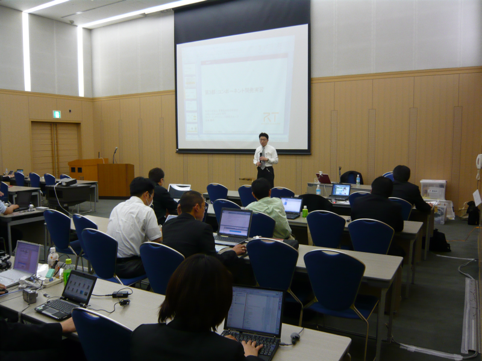
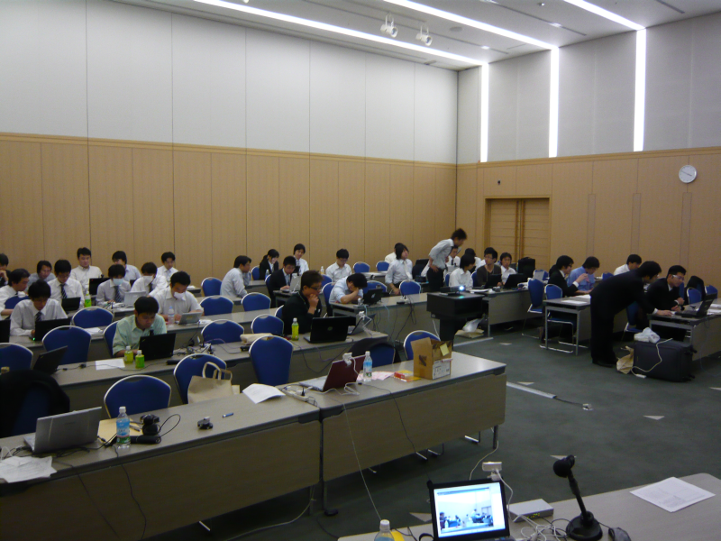
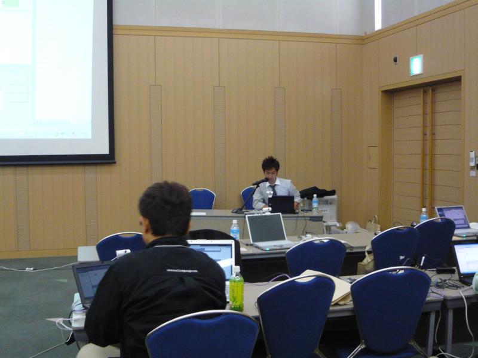
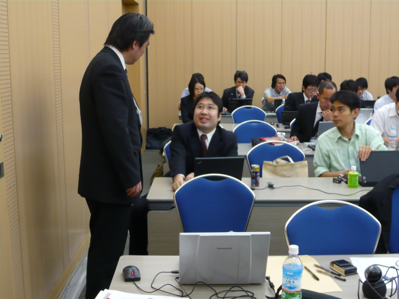

#contents

## 参加人数
- 44名
## 資料
- [第1部：OpenRTM-aist-1.0について(PDF)](./090524-01.pdf)(no_link)
- [第2部：RTCBuilder/RTSystemEditorの使い方(PDF)](./090524-02.pdf)(no_link)
- [第3部：コンポーネント開発実習(1)](./090524-03.pdf)(no_link)
- 第4部：コンポーネント開発実習(2)
## 開催案内: ROBOMEC09チュートリアル：RTミドルウエア講習会

[ROBOMEC09](http://www.jsme.or.jp/rmd/robomec2009/index.html)の[チュートリアル](http://www.jsme.or.jp/rmd/robomec2009/workshop.htm)として、RTミドルウエア講習会を開催させていただくことになりました。
- [ROBOMEC2009チュートリアル](http://www.jsme.or.jp/rmd/robomec2009/workshop.htm)

本チュートリアルではOpenRTM-aist-1.0の新機能を中心に、現在NEDO次世代ロボット知能化技術開発プロジェクトで行われている共通プラットフォーム開発についても紹介いたします。また、RTコンポーネントの作成方法、各種ツールの使い方などを実習形式で解説し、参加者の方に実際にRTコンポーネントを作成していただきます。
**OpenRTM-aist-1.0は4月頃リリース予定です。**;
講習会参加に当たっては、ノートPCへの事前のOpenRTM-aist-1.0のインストール等の準備をお願いいたします。
ダウンロードの準備ができしだい、メーリングリストやWebページ上でお知らせいたします。
今しばらくお待ちください。

- **日時**: 2009年5月24日, 10:00`17:00`
- **場所**: [福岡国際会議場 4F](http://www.marinemesse.or.jp/congress/) E会場
- **福岡国際会議場へのアクセス**:[マップ](http://www.marinemesse.or.jp/congress/access/)
- **定員**： 20名（ノートPCによる実習)
- **聴講料**：無料
- **申込方法**：[ROBOMEC09 参加登録サイト](http://www.knt.co.jp/ec/2009/robomec/)から事前のご登録をお願いいたします。

- **プログラム**:
<table class="table-alt">
  <tr>
    <td>**10:00-10:30**</td>
    <td>**第1部：OpenRTM-aist-1.0について**</td>
  </tr>
  <tr>
    <td></td>
    <td>担当：安藤慶昭 (産総研)</td>
  </tr>
  <tr>
    <td></td>
    <td>概要：RTミドルウエア概要、OMG標準化、OpenRTM-aist-1.0および、現在、NEDO次世代ロボット知能化技術開発プロジェクトで開発している共通プラットフォーム「OpenRTプラットフォーム」等について解説します。</td>
    <td></td>
  </tr>
  <tr>
    <td>**10:30-11:00**</td>
    <td>**第2部：RTCBuilder/RTSystemEditorの使い方**</td>
  </tr>
  <tr>
    <td></td>
    <td>担当：坂本武志(テクノロジックアート)</td>
    <td></td>
  </tr>
  <tr>
    <td></td>
    <td>概要：RTコンポーネントを作成するツールRTCBUilder、およびRTシステムを設計するツールRTSystemEditorの使い方について解説します。</td>
    <td></td>
  </tr>
  <tr>
    <td>**11:15-12:00**</td>
    <td>**第3部：コンポーネント開発実習(1)**</td>
  </tr>
  <tr>
    <td></td>
    <td>担当：安藤慶昭 (産総研)</td>
  </tr>
  <tr>
    <td></td>
    <td>概要：OpenRTMのインストール方法やテスト方法を解説します。開発実習を行うためのインストール作業や、サンプルコンポーネントを動作させて簡単なテストを行います。</td>
    <td></td>
  </tr>
  <tr>
    <td>**13:00-17:00**</td>
    <td>**第4部：コンポーネント開発実習(2)**</td>
  </tr>
  <tr>
    <td></td>
    <td>担当：栗原眞二 (産総研)</td>
  </tr>
  <tr>
    <td></td>
    <td>概要：OpenRTM-aistでのコンポーネント作成方法を実際に体験していただきます。RTCBuilderを使用したRTコンポーネントの設計と、RTSystemEditorでのRTシステムの作成を行います。</td>
    <td></td>
  </tr>
</table>

# 講習会の様子

 

 

 

 

