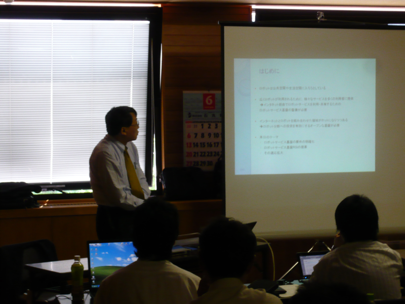
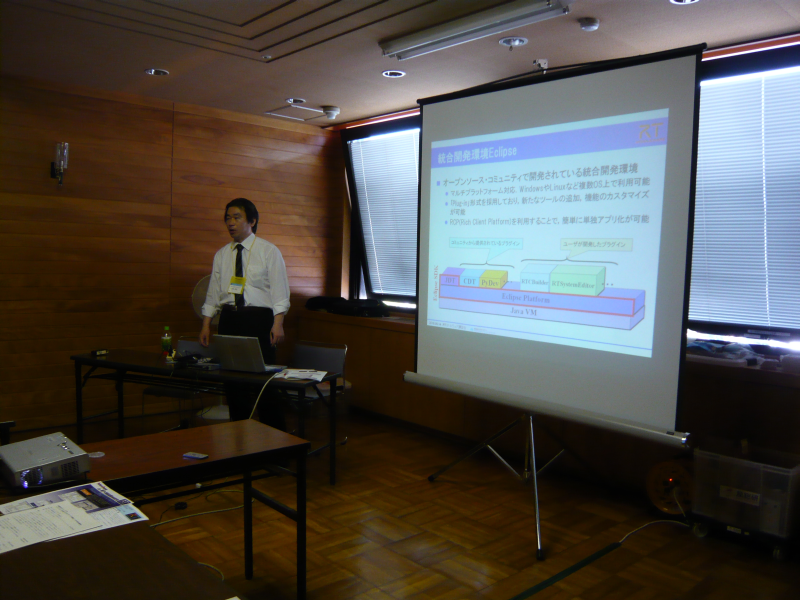
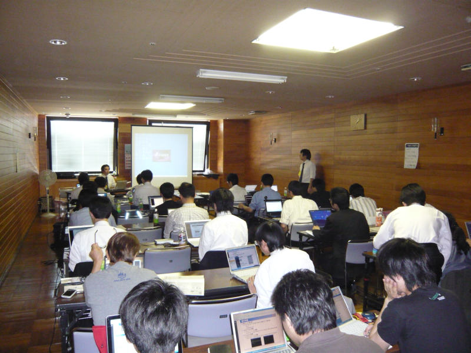

#contents


## 参加人数
27名

## 資料

- [RTミドルウェア講習会資料第1部](./100614-01.pdf)(PDF)
- [RTミドルウェア講習会資料第3部](./100614-03.pdf)(PDF)

## 開催案内: ROBOMEC2010講習会(2010年6月14日)
毎年恒例となりました、ROBOMECでのRTミドルウエア講習会を今年も開催いたします。詳細は未定ですが、新たにリリースされたOpenRTM-aist-1.0の機能紹介や、コンポーネントを実際に作成するうえで役に立つ技術を紹介いたします。

<span style="color:red;">今年は、第1部を [RSi(Robot Service Initiative)](http://robotservices.org/) との合同開催を予定しております。RSiはインターネットを利用しロボットを介して各種サービスを提供するプラットフォームであり、[RTミドルウエアとの連携](http://robonable.typepad.jp/trend/2007/12/rtrsirsirt_71a3.html)も行われています。</span>;

- **日時**: 平成22年6月14日(月), 10:00～17:00
- **場所**: [旭川地場産業振興センター](http://www.asahikawa-jibasan.jp/)　2階 研究開発室 (メイン会場：大雪アリーナの向かい)
  - アクセス: [交通アクセス](http://www.asahikawa-jibasan.jp/akusesu.html)
  - 詳細は[ROBOMEC2010 Webページ](http://www.jsme.or.jp/rmd/robomec2010/)をご覧ください。
- **聴講料**: 無料
- **定員**: 30名程度を予定しております。
- **参加登録**:
  1. ROBOMEC2010への参加登録をお願いいたします。
    - ROBOMEC2010への参加登録は[こちら](http://www.jsme.or.jp/rmd/robomec2010/)から
  1. メールでの申し込みをお願いいたします。
    - openrtm-tutorial@m.aist.go.jp 宛てに下記内容をお送りください。
```
 ・氏名
 ・所属
 ・メールアドレス
 ・USBカメラの有無 (実習で使用します。)
```
- **事前準備**: ノートPCを使用した実習を予定しております。詳細は後ほどこのページに掲載いたします。
- **プログラム**: <br>
<table class="table-alt">
  <tr>
    <td>**10:00-10:50**</td>
    <td>**第1部(その1)：OpenRTM-aist-1.0.0の新機能と今後の展望について**</td>
  </tr>
  <tr>
    <td></td>
    <td>担当：安藤慶昭 (産総研)</td>
  </tr>
  <tr>
    <td></td>
    <td>概要：OpenRTM-aist-1.0.0の新機能および、今後の展望について。</td>
    <td></td>
  </tr>
  <tr>
    <td>**11:00-11:50**</td>
    <td>**第1部(その2)：インターネットを利用したロボットサービスとRSiの取り組み**</td>
  </tr>
  <tr>
    <td></td>
    <td>担当：成田雅彦 氏 (産業技術大学院大学)</td>
  </tr>
  <tr>
    <td></td>
    <td>概要：RSi (Robot Service Initiative) および RSNP (Robot Service Network Protocol)について、産業技術大学院大学の成田雅彦先生からご講演いただきます。</td>
  </tr>
  <tr>
    <td>**11:50-12:00**</td>
    <td>**質疑応答・意見交換**</td>
  </tr>
  <tr>
    <td>**13:00-13:50**</td>
    <td>**第2部：OpenRTM-aist開発支援ツールの紹介とその利用法**</td>
  </tr>
  <tr>
    <td></td>
    <td>担当：坂本武志 氏 (株式会社テクノロジックアート)</td>
  </tr>
  <tr>
    <td></td>
    <td>概要：概要：RTコンポーネントを作成するツールRTCBuilder、およびRTシステムを設計するツールRTSystemEditerの使い方について解説します。</td>
    <td></td>
  </tr>
  <tr>
    <td>**14:00-17:00**</td>
    <td>**第3部：コンポーネント開発実習**</td>
  </tr>
  <tr>
    <td></td>
    <td>担当：栗原眞二 氏 (産総研)</td>
  </tr>
  <tr>
    <td></td>
    <td>概要：OpenRTMのインストール方法やテスト方法を解説します。OpenRTM-aistでのコンポーネント作成方法を実際に体験していただきます。RTCBuilderを使用したRTコンポーネントの設計とRTSystemEditerでのRTシステム作成を行います。</td>
    <td></td>
  </tr>
</table>


## 資料
- [第1部：OpenRTM-aist-1.0.0の新機能と今後の展望について(PDF)](./100614-01.pdf)(no_link)
- [第2部：OpenRTM-aist開発支援ツールの紹介とその利用法(PDF)](./100614-03.pdf)(no_link)
- [第3部:コンポーネント開発実習(OpenCVサンプル)](/ja/node/744)

## 講習会に参加される方へ
実習形式の講習会に参加される方は、以下の準備をお願いいたします。

### 用意するもの 
第3部の実習には以下の準備が必要です。
- ノートPC
- USBカメラ
  - Windowsでも、Linuxでも構いませんが、USBカメラがOpenCVからつかえることが前提です。
  - あらかじめLANにつながるように設定しておいてください。
### ソフトウエアのインストール 
あらかじめ下記のソフトウエアをインストールしておいてください。
Windows推奨ですが、Linuxでも実習可能です。

- OpenRTM-aist-1.0.0-RELEASE
  - C++版
  - Python版
- Eclipseおよび、RTSystemEditor, RTCBUilder
- 開発環境
  - C++: WindowsではVisual C++ 2008 (Express版でもOK、2010は未対応)
  - Python: Python 2.6 推奨

詳細は、[ダウンロード](node)ページをご覧ください。

### Windowsで必要なソフトウエア

- Python版で必要なもの
  - [Python2.6](http://www.python.org/ftp/python/2.6.2/python-2.6.2.msi)
  - [Python版, Win32](http://www.openrtm.org/pub/Windows/OpenRTM-aist/python/OpenRTM-aist-Python-1.0.0.msi)

- C++版で必要なもの
  - [Visual C++ Express](http://www.microsoft.com/japan/msdn/vstudio/2008/product/express/offline.aspx)
  - [OpenCV1.0](http://downloads.sourceforge.net/opencvlibrary/OpenCV_1.0.exe?modtime=1161287502&big_mirror=1)
  - [OpenCV2.1(VC2008用)](http://sourceforge.net/projects/opencvlibrary/files/opencv-win/2.1/OpenCV-2.1.0-win32-vs2008.exe/download)
  - [PyYAML(rtc-templateで使用)](http://pyyaml.org/download/pyyaml/PyYAML-3.09.win32-py2.6.exe)
  - [OpenRTM-aist-1.0.0-RELEASE(C++版), Win32 VC2008](http://www.openrtm.org/pub/Windows/OpenRTM-aist/cxx/OpenRTM-aist-1.0.0-RELEASE_vc9_100212.msi)

<span style="color:red;">OpenCV1.0とOpenCV2.1は共存可能です。OpenRTMに付属しているサンプルを動作させるのにOpenCV1.0が必要になります。実習では、OpenCV2.1ベースのコンポーネント群を使用します。</span>;

- RTSystemEditor,RTCBilder
  - [Eclipse3.4.2+RTSE(1.0.0-RELEASE)+RTCB(1.0.0-RELEASE)Windows用全部入り](http://www.openrtm.org/pub/OpenRTM-aist/tools/1.0.0/eclipse342_rtmtools100release_win32_ja.zip)

- サンプルRTC群
  - [OpenCV用RTC群(新しいデータタイプを使用)](http://www.openrtm.org/pub/OpenRTM-aist/components/OpenCV/OpenCV-RTC-0.0.1.msi)
  - [ARToolKitRTC](http://www.openrtm.org/pub/OpenRTM-aist/components/ARToolKit-RTC/ARToolKit_RTC.zip)

### Linuxで必要なソフトウエア
<span style="color:red;">講習会でLinux PCを使用される方向けの情報ですので、Windows PCをご使用の方は、ここは読み飛ばして下さい。</span>;


基本的に、[ダウンロード]({{ site.baseurl }}/ja/download)ページを参照して、必要なソフトウエアをダウンロードしてください。
Ubuntu, Fedora などメジャーなディストリビューション用のパッケージが用意されています。
また、これ等の加えてOpenCV2.0をインストールしてください。

## 第2部：「OpenRTM-aist開発支援ツールの紹介とその利用法」 で使用するファイル
- [rtc.conf](./rtc.conf) (no_link)
- [configsample.conf](./configsample.conf)(no_link)

## 講習会の様子
<div align="center"><a href="100614-01.png"></a></div>
<br>

<div align="center"><a href="100614-02.png"></a></div>
<br>

<div align="center"><a href="100614-03.png"></a></div>
<br>

