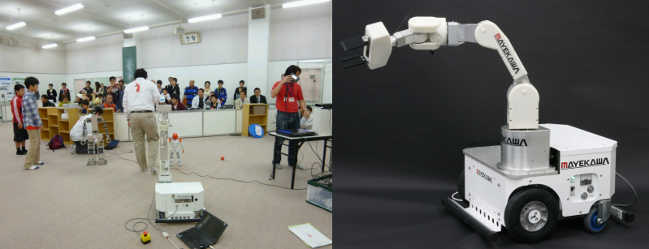
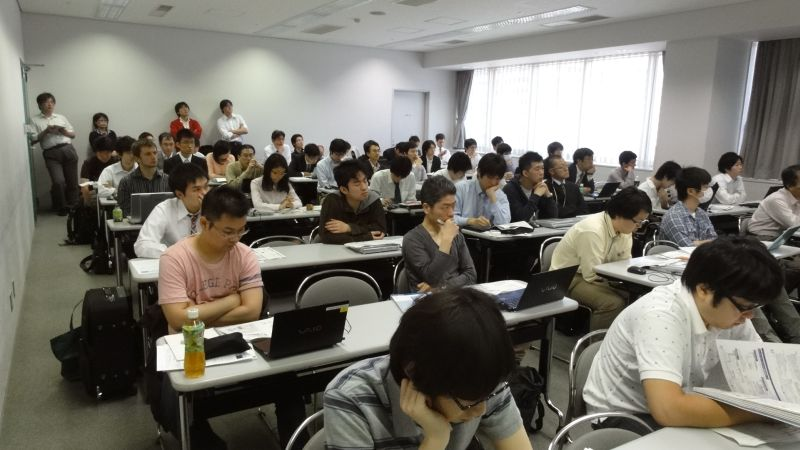
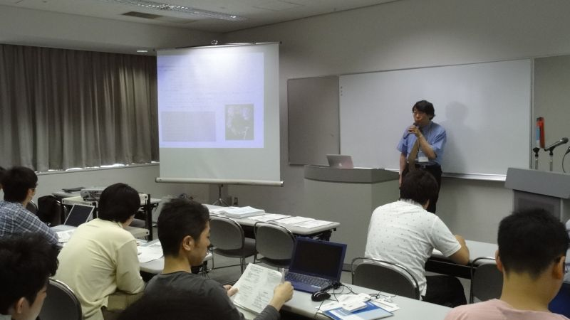
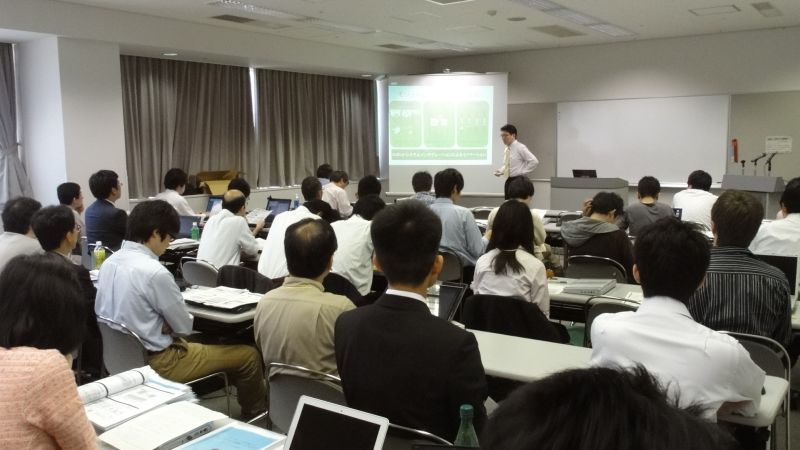
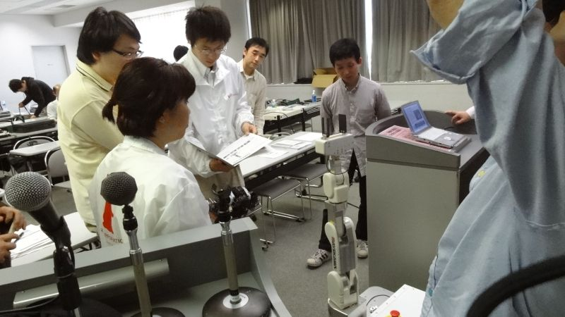
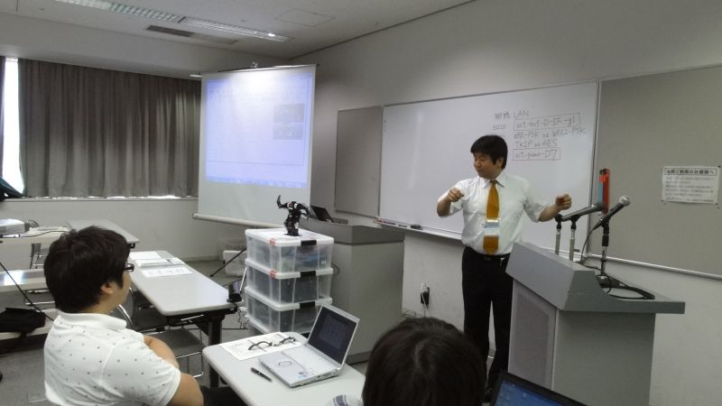
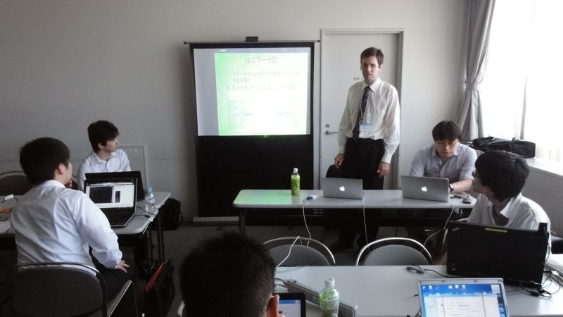
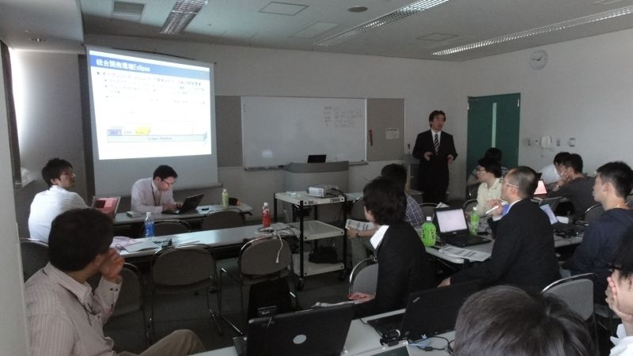

 
<a>No English version available.
</a>

<!-- -------jp page!!------- -->

#contents

<!-- ** 開催案内: ROBOMEC2012講習会 -->
## ROBOMEC2012講習会

<!-- 毎年恒例となりました、ROBOMECでのRTミドルウエア講習会を今年も開催いたします。 -->
<!-- 新たにリリースされたOpenRTM-aist-1.1の機能紹介や、コンポーネントを実際に作成するうえで役に立つ技術を紹介いたします。今年度はまじめての試みとして、従来同様の初心者向け基礎コースと、すでにOpenRTM-aistを使っているが、より高度な機能を使いこなしたい方のためのを応用コースの2コースを用意いたしました。 -->

<!-- 昨年同様、今年も、第1部を [[RSi (Robot Service Initiative):http://robotservices.org/]] との合同開催を予定しております。RSiはインターネットを利用しロボットを介して各種サービスを提供するプラットフォームです。 -->

ROBOMEC2012のチュートリアルとしてRTミドルウエア講習会が開催されました。
新たにリリースされたOpenRTM-aist-1.1の機能紹介や、コンポーネントを実際に作成するうえで役に立つ技術を紹介いたしました。今年度はまじめての試みとして、従来同様の初心者向け基礎コースと、すでにOpenRTM-aistを使っているが、より高度な機能を使いこなしたい方のためのを応用コースの2コースを用意しました。

<!-- 昨年同様、今年も、第1部を [[RSi (Robot Service Initiative):http://robotservices.org/]] との合同開催を予定しております。RSiはインターネットを利用しロボットを介して各種サービスを提供するプラットフォームです。 -->

- **日時**: 平成24年5月27日(日), 10:00～17:00
- **場所**: [アクトシティ浜松](http://www.actcity.jp/)　研修交流センター 51研修交流室
  - アクセス: [交通アクセス](http://www.actcity.jp/about/access.php)
<!-- --詳細は[[ROBOMEC2012 Webページ:http://www.jsme.or.jp/rmd/robomec2012/wstut.html#tut1]]をご覧ください。 -->
- **聴講料**: 無料 (本講習会のみの参加の場合ROBOMEC2012への参加登録は不要です)
<!-- -''定員'': 基礎コース・応用コース合わせて30名程度を予定しております。定員になり次第申し込みは終了させていただきます。 -->
- **参加者**: 35名
<!-- -''参加登録'': [[参加登録フォームはこちら>#entry]] -->
<!-- -- 参加登録には当Webページのユーザ登録が必要です。[[ユーザ登録はこちら:http://openrtm.org/openrtm/ja/user/register]] -->
<!-- -- [[メーリングリスト:http://www.openrtm.org/mailman/listinfo/openrtm-users]]への登録をお勧めします。必須ではありませんが、Webでご案内する事前準備についてはメーリングリストにてお知らせします。 -->
<!-- -- 講習会のみの参加の場合ROBOMEC2012への参加登録は不要です。 -->
<!-- -- なお、登録の際に問題が生じた場合は、 [[こちら（support@openrtm.org）:mailto:support@openrtm.org]] までお問い合わせください。 -->

<!-- &color(red){定員に達しましたので申し込みを締め切らせていただきました。ありがとうございました。~ -->
<!-- なお、見学だけであれば参加可能ですので、当日、会場までお越しください。}; -->

## 資料

- [第1部：OpenRTM-aist-1.0.0の新機能と今後の展望について(PDF)](./120526-02.pdf)
- [第2部：RTCを使ったロボット開発例(G-ROBOT)](http://openrtp.jp/wiki/_default/ja/Home/2012RTME8AC9BE7BF92E4BC9AE381A7E7B4B9E4BB8BE38197E3819FRTC.html)
- [第3部(基礎編)：コンポーネント作成ツール、構成ツールについて(PDF)](//120526-04.pdf)
- [第3部(応用編)：rtshellについて(PDF)](./rtshell_intro.pdf)
- [第4部(基礎編)：Flipコンポーネントの作成例](/ja/node/5022)
- [第4部(応用編)：OpenRTMの応用的利用について(PDF)](./openrtm_advanced_features.pdf)

## デモ (12:00-13:00)

12:00-13:00の昼休憩中に、株式会社アールティから近日発売される予定のロボットアーム「OROCHI」のデモンストレーションが行われました。 「OROCHI」はNEDOロボット知能化技術開発プロジェクトで前川製作所が開発した標準ハードウエア(リファレンスハードウエア)の一つで、RTミドルウエアで動作するロボットアームです。

<!-- RTミドルウエア講習会の実習参加には事前申込みが必要ですが、デモの見学および講習会の聴講のみであればどなたでもご自由にご参加いただけます。 -->

<!-- - ''日時'': 平成24年5月27日(日), 12:00～13:00 (昼休憩中) -->
<!-- - ''場所'': アクトシティ浜松　研修交流センター 51研修交流室 -->

<!-- - ''関連'' -->
<!-- -- [[株式会社アールティ:http://rt-net.jp/]] -->
<!-- -- [[株式会社前川製作所:http://www.mayekawa.co.jp/ja/]] -->
<!-- -- [[NEDO知能化プロジェクト:/ja/node/4864]] -->

#clear

## プログラム

<table class="table-alt">
  <tr>
    <td>**10:00 -10:50**</td>
    <td>></td>
    <td>**第1部(その1)：インターネットを利用したロボットサービスとRSiの取り組み（最新動向）**</td>
  </tr>
  <tr>
    <td></td>
    <td>></td>
    <td>担当：成田雅彦 氏 (産業技術大学院大学)</td>
  </tr>
  <tr>
    <td></td>
    <td>></td>
    <td>概要：インターネットやクラウドとロボットとの連携は急速に注目を集めている領域である。本講演では、インターネットやクラウドとロボットとの連携の動向を外観し、RSi（ロボットサービスイニシアティブ）の仕様であるRSNPと最新の取り組みを紹介する。－ RSiは、インターネットとロボットサービスに注目して活動している.ロボットの研究開発企業,コンテンツ提供企業,ソフトウエア／システム開発企業,大学や研究所からなる団体です－ 午後は, 別途チュートリアルにてRSNPを使ったロボットサービス開発のチュートリアルを行います。 ( http://rsi.c.fun.ac.jp/Plone/rssr/event/event2012-1 ) ご興味のあるかたはこちらにもご参加くさださい。</td>
  </tr>
  <tr>
    <td>**11:00-11:50**</td>
    <td>></td>
    <td>**第1部(その2)：OpenRTM-aist-1.1.0の新機能および今後の展望について**</td>
  </tr>
  <tr>
    <td></td>
    <td>></td>
    <td>担当：安藤慶昭 氏 (産総研)</td>
  </tr>
  <tr>
    <td></td>
    <td>></td>
    <td>概要：OpenRTM-aist-1.1.0の新機能および、今後の展望について。  <a href="./120526-02.pdf">講義資料</a></td>
  </tr>
  <tr>
    <td>**11:50-12:00**</td>
    <td>></td>
    <td>**質疑応答・意見交換**</td>
  </tr>
  <tr>
    <td>**12:00 -13:00**</td>
    <td>></td>
    <td>**昼食・デモ**</td>
  </tr>
  <tr>
    <td>**13:00 -13:30**</td>
    <td>></td>
    <td>**第2部：OpenRTM-aist サンプルコンポーネントの紹介とその利用法**</td>
  </tr>
  <tr>
    <td></td>
    <td>></td>
    <td>担当：原功 氏 (産総研)</td>
  </tr>
  <tr>
    <td></td>
    <td>></td>
    <td>概要：RTCを使ったロボット開発例を紹介し、RTCの便利さ，面白さを体感していただきます。 <a href="http://openrtp.jp/wiki/_default/ja/Home/2012RTME8AC9BE7BF92E4BC9AE381A7E7B4B9E4BB8BE38197E3819FRTC.html">講義資料</a></td>
  </tr>
  <tr>
    <td>**13:30-14:30**</td>
    <td>**第3部：(基礎コース)OpenRTM-aist開発支援ツールの紹介とその利用法**</td>
    <td>**第3部：(応用コース)OpenRTM-aist 高度なトピック**</td>
  </tr>
  <tr>
    <td></td>
    <td>担当：坂本武志 氏 (株式会社グローバルアシスト)</td>
    <td>担当：Geoffrey Biggs 氏 (産総研)</td>
  </tr>
  <tr>
    <td></td>
    <td>概要：コンポーネントを作成するツールRTCBuilderやコンポーネント操作ツールRTSystemEditorについて解説します。 <a href="./120526-04.pdf">講義資料</a></td>
    <td>概要：RTコンポーネントをコマンドラインから操作するツール rtshell の使い方カスタムECの作り方及び使い方カスタムトランスポートの作り方及び使い方等を紹介します。 <a href="./rtshell_intro.pdf">講義資料</a></td>
  </tr>
  <tr>
    <td>**14:45-17:00**</td>
    <td>**第4部：コンポーネント開発実習(基礎コース)**</td>
    <td>**第4部：RTシステム開発実習(応用コース)**</td>
  </tr>
  <tr>
    <td></td>
    <td>担当：安藤慶昭 氏,坂本武志 氏</td>
    <td>担当：Geoffrey Biggs 氏, 原功 氏</td>
  </tr>
  <tr>
    <td></td>
    <td>概要：OpenRTM-aistを利用して簡単なコンポーネント作成方法を実際に体験していただきます。  <a href="/ja/node/5022">講義資料</a></td>
    <td>概要：rtshell の使い方やデータポートで独自のデータ型の作り方・使い方を実際に体験していただきます。 <a href="./openrtm_advanced_features.pdf">講義資料</a></td>
  </tr>
</table>

## 講習会に参加される方へ
<!-- 実習形式の講習会に参加される方の事前準備をこのページにてご案内します。準備が出来ましたら[[メーリングリスト(openrtm-users):http://www.openrtm.org/openrtm/ja/content/%E3%83%A1%E3%83%BC%E3%83%AA%E3%83%B3%E3%82%B0%E3%83%AA%E3%82%B9%E3%83%88-0]]にてご案内します。 -->
実習形式の講習会に参加される方は、以下の準備をお願いいたします。

### 用意するもの

第4部の実習には以下の準備が必要です。
- ノートPC
  - OS: Windowsを推奨します。応用コースの方は自分で対処出来る場合はどちらでも結構です
  - Eclipseが動作する程度のスペックが必要です
  - メモリ: 1GB以上
  - CPU: Core2Duo以上
  - HDD空き: 5GB以上 (Visual C++ Expressの場合)
- USBカメラ (USBカメラ無しで申込まれた方には貸与いたします)
- Windowsでも、Linuxでも構いませんが、USBカメラがOpenCVからつかえることが前提です。
- LANケーブル

### ソフトウエアのインストール

あらかじめインストールしておくべきソフトウエアは以下のとおりです。以下のリンクをクリックし、ファイルをダウンロード・インストールしてください。(一部のリンクはダウンロードページへ飛びますので、飛んだ先のページ内で適切なファイルをそれぞれダウンロードしてください。

Windows推奨ですが、Linuxでも実習可能です。

<table class="table-alt">
  <tr>
    <td>></td>
    <td>CENTER: OpenRTM-aist 1.1.0 C++ 関連</td>
  </tr>
  <tr>
    <td><a href="/ja/node/5012">C++, RELEASE版</a></td>
    <td>OpenRTM-aist C++版パッケージ。ダウンロードページに従い、自分の環境に合ったパッケージ、 PythonおよびPyYAML をインストールします。</td>
  </tr>
  <tr>
    <td><a href="http://go.microsoft.com/fwlink/?LinkId=190491&clcid=0x411">Visual C++ 2010</a> または   <a href="http://go.microsoft.com/?LinkId=9348304">Visual C++ 2008</a></td>
    <td>C++のコンポーネントをコンパイルするの必要 (Express版でもOK)</td>
  </tr>
  <tr>
    <td><a href="http://www.cmake.org/files/v2.8/cmake-2.8.8-win32-x86.exe">cmake-2.8.8</a></td>
    <td>Visual C++のプロジェクトを作成するのに必要</td>
  </tr>
  <tr>
    <td><a href="http://ftp.stack.nl/pub/users/dimitri/doxygen-1.8.1-setup.exe">doxygen</a></td>
    <td>ビルドの過程でドキュメントを整形するのに必要</td>
  </tr>
  <tr>
    <td>></td>
    <td>CENTER: OpenRTM-aist 1.1.0 Python 関連</td>
  </tr>
  <tr>
    <td><a href="http://openrtm.org/openrtm/node/4526">Python, RC1版</a></td>
    <td>OpenRTM-aist Python版パッケージ。ダウンロードページに従い、自分の環境にあったパッケージ、 Pythonをインストールします。</td>
  </tr>
  <tr>
    <td>></td>
    <td>CENTER: Eclipseツール</td>
  </tr>
  <tr>
    <td><a href="http://openrtm.org/openrtm/ja/node/4557">Eclipseツール</a></td>
    <td>コンポーネントを設計するツール: RTCBUilder, コンポーネントを操作するツール: RTSystemEditor が同梱されています。</td>
  </tr>
  <tr>
    <td>></td>
    <td>CENTER: 応用版 (以上も含めて)</td>
  </tr>
  <tr>
    <td><a href="http://www.openrtm.org/openrtm/ja/node/5013/">rtshell</a></td>
    <td>rtshellの実習に必須</td>
  </tr>
</table>

### 実習で必要なファイル

- [RTC.xml](./RTC.xml)

### Linuxで必要なソフトウエア

上記に相当するLinuxのパッケージをインストールしておいてください。
加えて、OpenCVが必要になります。

<!-- &aname(entry); -->
<!-- **講習会申し込みフォーム -->
<!-- 以下のフォームから講習会へお申し込みください。（本講習会のみの参加の場合ROBOMEC2012への参加登録は不要です。） -->
<!-- - 参加登録するまえに当Webページのユーザ登録をお願いします。[[ユーザ登録はこちら:http://openrtm.org/openrtm/ja/user/register]] -->
<!-- - 当Webサイトにログイン済みの方は名前の欄にユーザ名が出ますが、氏名に書き換えてください。 -->
<!-- - 受講したいコースを基礎・応用コースの中から選択してください。 -->
<!-- - 講習会で必要なUSBカメラの有無についてもお申し出ください。 -->
<!-- - 申し込み内容はコースも含めて5日前まで変更できます。 -->
<!-- - フォーム送信後、確認メールをお送りいたします。1日たっても確認メールが届かない場合は、[[こちら（support@openrtm.org）:mailto:support@openrtm.org]] までお問い合わせください。 -->
<!-- &color(red){定員に達しましたので申し込みを締め切らせていただきました。ありがとうございました。~ -->
<!-- なお、見学だけであれば参加可能ですので、当日、会場までお越しください。}; -->

## 講習会の様子

 

 

 

 

 

 

 
<!-- -------jp page!!------- -->
