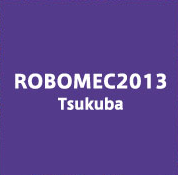
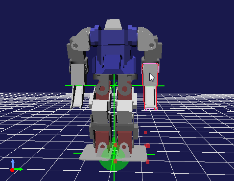
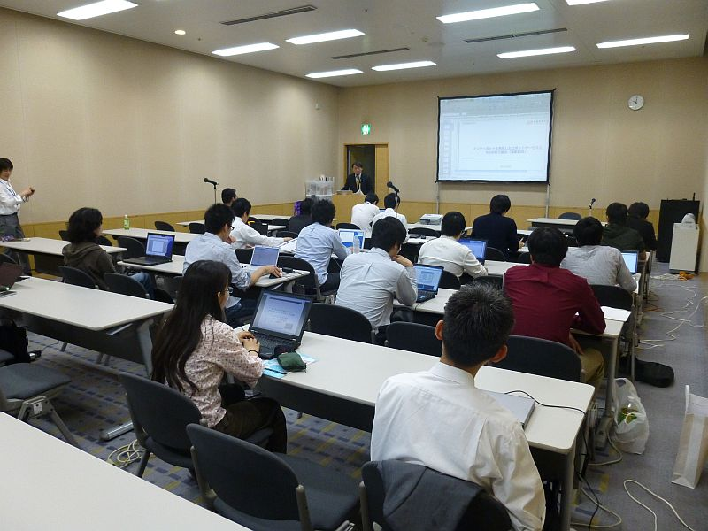
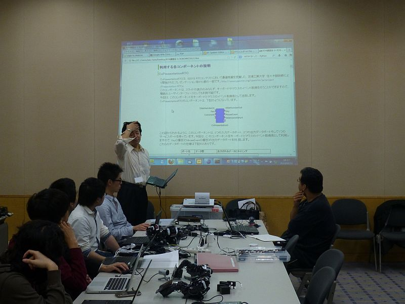
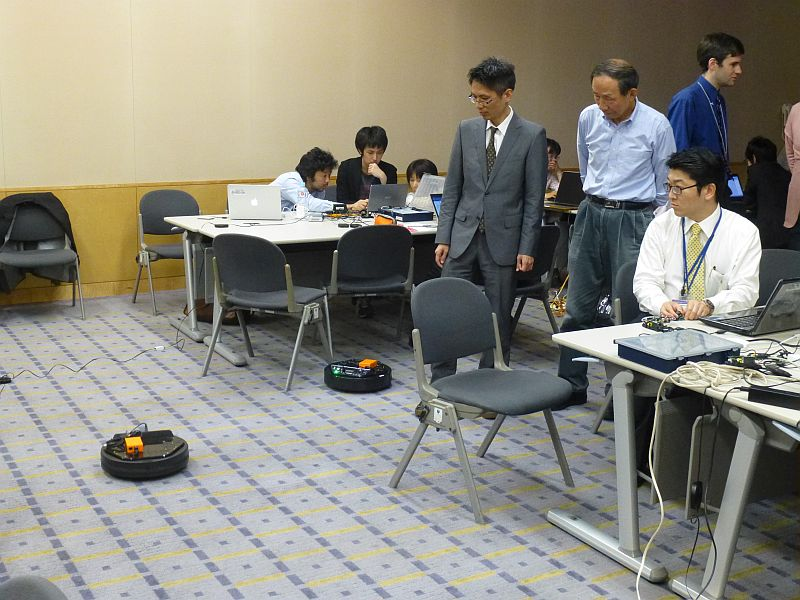
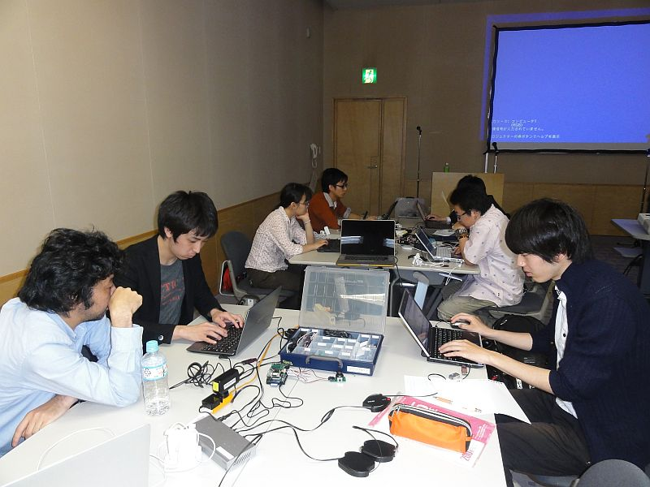
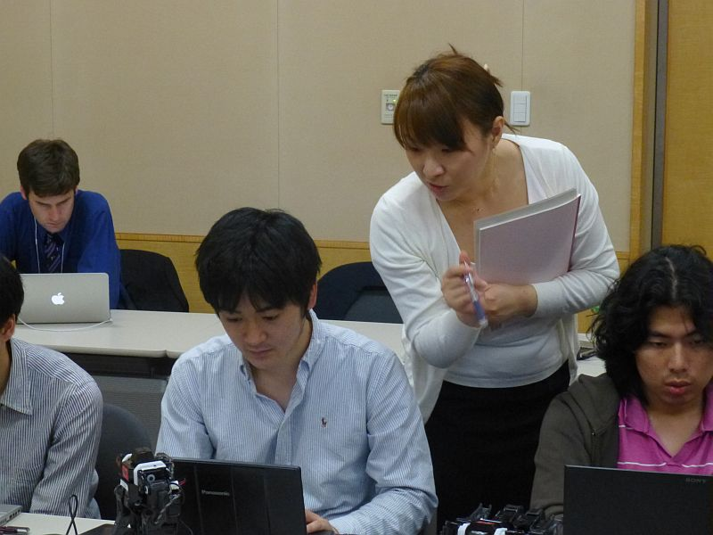
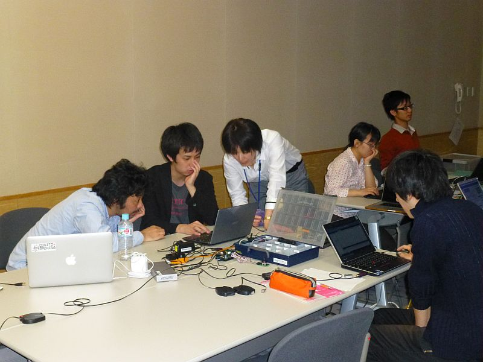
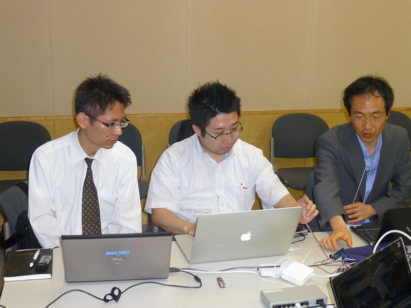

 
<a>No English version available.
</a>

<!-- -------jp page!!------- -->

<!-- #ref(http://www.jsme.or.jp/rmd/robomec2007/JA/IMAGE/RMDTM.GIF,80%,right,margin=10,around,url=/ja/tutorial/robomec2013) -->

#contents

<!-- ** 開催案内: ROBOMEC2013講習会 -->
## ROBOMEC2013講習会

2013年5月22日(水)につくば市のつくば国際会議場において、ROBOMECでのRTミドルウエア講習会を開催いたしました。

<!-- 毎年恒例となりました、ROBOMECでのRTミドルウエア講習会を今年も開催いたします。RTミドルウエアはロボットシステムの構築を効率化するソフトウエアプラットフォームです。 -->
<!-- 講習会では、RTミドルウエアの概要、RTコンポーネントの作成方法について解説します。 -->
<!-- 受講者には各自ノートPCをお持ちいただき、実習形式で実際にRTコンポーネントを作成、既存のコンポーネントなどと組み合わせて簡単なシステムを構築していただきます。本講習会を受講することで、RTコンポーネント設計方法、実装の仕方、システムの作り方をマスターすることができます。 -->

<!-- &color(red){なお、講習会でどのようなことをやってほしいかについて、現在コメントを募集しております。当Webページにログインの上、[[こちらから>#comment]]コメントをご投稿ください。可能な限り講習会の内容に反映させていただきます。}; -->

## 日時・場所
- **主催**: (独)産業技術総合研究所
- **協賛**: (公社)計測自動制御学会システムインテグレーション部門
- **日時**: 2013年5月22日(水), 10:00～17:00   [ROBOMEC2013チュートリアルとして開催](http://www.jsme.or.jp/rmd/robomec2013)
- **場所**: [つくば国際会議場](http://www.epochal.or.jp/)、小会議室303
  - アクセス: [交通アクセス](http://www.epochal.or.jp/access/index.html)
  - 詳細は[ROBOMEC2013 Webページ](http://www.jsme.or.jp/rmd/robomec2013)をご覧ください。
<!-- -''聴講料'': 無料 (本講習会のみの参加の場合ROBOMEC2013への参加登録は不要です) -->
<!-- -''定員'': 20名程度を予定しております。定員になり次第申し込みは終了させていただきます。 -->
- **参加者**: 第1部37名、実習22名（+講師・スタッフ9名）
<!-- -''参加登録'': [[参加登録フォームはこちら>#entry]] -->
<!-- -- 参加登録には当Webページのユーザ登録が必要です。[[ユーザ登録はこちら:http://openrtm.org/openrtm/ja/user/register]] -->
<!-- -- [[メーリングリスト:http://www.openrtm.org/mailman/listinfo/openrtm-users]]への登録をお勧めします。必須ではありませんが、Webでご案内する事前準備についてはメーリングリストにてお知らせします。 -->
<!-- -- 講習会のみの参加の場合ROBOMEC2013への参加登録は不要です。 -->
<!-- -- なお、登録の際に問題が生じた場合は、 [[こちら（support@openrtm.org）:mailto:support@openrtm.org]] までお問い合わせください。 -->

<!-- #br -->

<!-- #clear -->

<!-- #ref(robomec2013_button.png,left,url=#entry) -->

<!-- ** 過去の講習会 -->

<!-- こちらから、過去の講習会の資料および写真などがご覧いただけます。 -->

<!-- - [[ROBOMEC2012:/tutorial/robomec2012]] -->
<!-- - [[ROBOMEC2011:/tutorial/robomec2011]] -->
<!-- - [[ROBOMEC2010:/tutorial/robomec2010]] -->

## プログラム

<table class="table-alt">
  <tr>
    <td>10:00 -10:50</td>
    <td>**第1部(その1)：インターネットを利用したロボットサービスとRSiの取り組み（最新動向）**  **担当**：成田雅彦 先生 (産業技術大学院大学)   **概要**：インターネットやクラウドとロボットとの連携は急速に注目を集めている領域です。本講演では、インターネットやクラウドとロボットとの連携の動向を外観し、RSi（ロボットサービスイニシアティブ）の仕様であるRSNPと最新の取り組みを紹介します。</td>
  </tr>
  <tr>
    <td>11:00 -11:50</td>
    <td>**第1部(その2)：OpenRTM-aistおよびRTコンポーネントプログラミングの概要**   **担当**：安藤慶昭 氏 (産総研)  **概要**：RTミドルウエアはロボットシステムをコンポーネント指向で構築するソフトウエアプラットフォームです。RTミドルウエアを利用することで、既存のコンポーネントを再利用し、モジュール指向の柔軟なロボットシステムを構築することができます。RTミドルウエアの産総研による実装であるOpenRTM-aistについてその概要およびRTコンポーネントの機能やプログラミングの流れについて説明します。   **講義資料**:<a href="./130522-01.pdf">130522-01.pdf</a></td>
  </tr>
  <tr>
    <td>11:50 -12:00</td>
    <td>質疑応答・意見交換</td>
  </tr>
  <tr>
    <td>12:00 -13:00</td>
    <td>昼食</td>
  </tr>
  <tr>
    <td>13:00 -14:00</td>
    <td>**第2部: RTコンポーネントの作成入門**  **担当**：坂本武志 氏 (株式会社グローバルアシスト)  **概要**：RTCBuilderを使用したRTコンポーネントの作成方法を実習形式で体験していただきます。   **講義資料**:<a href="./130522-02.pdf">130522-02.pdf</a></td>
  </tr>
  <tr>
    <td>14:00 -16:45</td>
    <td>**第3部：プログラミング実習**   担当：Geoffrey Biggs 氏 (産総研)、坂本武志 氏 (株式会社グローバルアシスト)、原功 氏 (産総研)、安藤慶昭 氏 (産総研)   **概要**：OpenRTM-aistを利用してコンポーネントを作成し実際にロボットを動かしていただきます。  今回は2つのコース (Kobuki & Raspberry Piコース, G-ROBOT & Choreonoidコース) を用意しました。   **講義資料**:<a href="./130522-03.pdf">130522-03.pdf</a></td>
  </tr>
</table>

<!-- |CENTER:100|LEFT:|LEFT:200|c -->
<!-- |5月22日(水) |概要 | 講師 | -->
<!-- | 10:00-10:50 | 第１部(その1)：インターネットを利用したロボットサービスとRSiの取り組み（最新動向）　| 成田雅彦 先生 (産業技術大学院大学) | -->
<!-- | 11:00-11:50 | 第１部(その2)：OpenRTM-aistおよびRTコンポーネントプログラミングの概要　講義資料:[[130522-01.pdf:http://openrtm.org/openrtm/sites/default/files/5235/130522-01.pdf]]| 安藤慶昭 (産総研) | -->
<!-- | 13:00-14:00 | 第２部：RTコンポーネントの作成入門　講義資料:[[130522-02.pdf:http://openrtm.org/openrtm/sites/default/files/5235/130522-02.pdf]] | 坂本 武志(グローバルアシスト) | -->
<!-- | 14:00-16:45 | 第３部：プログラミング実習　講義資料:[[130522-03.pdf:http://openrtm.org/openrtm/sites/default/files/5235/130522-03.pdf]] | 原功 (産総研)  安藤慶昭 (産総研)| -->

### Kobuki & Raspberry Piコース

ARMプロセッサを搭載した小型のシングルボードコンピュータRaspberry Piを使用して、移動ロボット Kobukiを動かしたり、Raspberry Pi用IOボードを利用したジョイスティックを作成したりします。
これらを組み合わせてKobukiを遠隔操作したり、自律走行させたりすることを目標にします。

 

;

### G-ROBOT & Choreonoidコース

G-ROBOTを操作するインターフェースを実際に作ってみたり、産総研で開発されたロボットのモーションエディタ・シミュレータ Choreonoid 上のG-ROBOTを動かしたりします。

 

;

<!-- ** 講習会に参加される方へ -->

<!-- *** 用意するもの -->
### 必要機材
<!-- 第3部の実習には以下の準備が必要です。 -->
- ノートPC
  - OS: Windowsを推奨します。応用コースの方は自分で対処出来る場合はどちらでも結構です
  - Eclipseが動作する程度のスペックが必要です
  - メモリ: 1GB以上
  - CPU: Core2Duo以上
  - HDD空き: 5GB以上 (Visual C++ Expressの場合)
- USBカメラ (USBカメラ無しで申込まれた方には貸与いたします)

Windowsのファイアウォールは必ず切っておいてください。;

<!-- *** 事前にインストールするソフトウエア -->
### 必要ソフトウエア
<!-- あらかじめインストールしておくべきソフトウエアは以下のとおりです。以下のリンクをクリックし、ファイルをダウンロード・インストールしてください。(一部のリンクはダウンロードページへ飛びますので、飛んだ先のページ内で適切なファイルをそれぞれダウンロードしてください。 -->

- Visual C++ 2010
  - 無料のExpress版が [こちら](http://www.microsoft.com/visualstudio/jpn/downloads#d-2010-express) からダウンロードできます。
  - インストールには時間がかかりますので、ご注意ください。
  - VC2012には対応していません。また、VC2008は少々古いのでお勧めいたしません。
- [OpenRTM-aist-1.1.0 C++版](http://www.openrtm.org/openrtm/ja/node/5012)
  - インストールされているVCに一致するバージョンをダウンロードしてください。;
  - 64bit版はPythonとの相性が悪いので、32bit版をお勧めします。
- [OpenRTM-aist-1.1.0-RC1 Python](http://www.openrtm.org/pub/Windows/OpenRTM-aist/python/OpenRTM-aist-Python-1.1.0-RC1.msi)
- [Python 2.6(32bit)](http://www.python.org/ftp/python/2.6.6/python-2.6.6.msi)
- [PyYAML](http://pyyaml.org/download/pyyaml/PyYAML-3.10.win32-py2.6.exe)
- [CMake](http://www.cmake.org/files/v2.8/cmake-2.8.8-win32-x86.exe)
- [Doxygen](http://ftp.stack.nl/pub/users/dimitri/doxygen-1.8.1-setup.exe)
- [JDK](http://www.oracle.com/technetwork/java/javase/downloads/jdk7-downloads-1880260.html)
  - 32bit版をお勧めします。
- [Eclipse全部入り](http://www.openrtm.org/openrtm/ja/node/30)
  - [Windows用32bit版全部入り](http://openrtm.org/pub/openrtp/packages/1.1.0.rc4v20130216/eclipse381-openrtp110rc4v20130216-ja-win32.zip)を推奨します。
  - インストール後、メニューの「ヘルプ」→「新規ソフトウエアのインストール」を選択、更新サイトに http://openrtm.org/pub/openrtp/releases/updates を入力してRTSystemEditorとRTCBuilderをアップデートしておくことをお勧めします。
- [TeraTerm](http://sourceforge.jp/projects/ttssh2/downloads/58215/teraterm-4.77.exe/)
- Bonjour: インストール方法については[こちら](http://openrtm.org/openrtm/ja/node/266#toc8)
  - [iTunes](http://www.apple.com/jp/itunes/download/)や[Bonjour Print Services for Windows](http://support.apple.com/kb/DL999?viewlocale=ja_JP)がインストールされていれば不要です。
- 使い慣れたエディタ: EclipseやPythonに付属のエディタでも構いませんが、使い慣れたエディタが入っていた方が良いでしょう
<!-- - [[RTC.xml:http://www.openrtm.org/openrtm/sites/default/files/5235/RTC.xml]] 第2部で使用します。 -->

### 講義資料

#### 第1部（その１） インターネットを利用したロボットサービスとRSiの取り組み（最新動向）
- [第1部（その１） 講義資料(PDF)](./130522-00.pdf)

<!-- Invalid YouTube URL: http://www.slideshare.net/23094570 -->


#### 第1部（その２） OpenRTM-aistおよびRTコンポーネントプログラミングの概要
- [第1部（その２） 講義資料(PDF)](./130522-01.pdf)

<!-- Invalid YouTube URL: http://www.slideshare.net/21590268 -->


#### 第2部 RTコンポーネントの作成入門
- [第2部 講義資料(PDF)](./130522-02.pdf)

<!-- Invalid YouTube URL: http://www.slideshare.net/21569432 -->


#### 第3部 Kobuki & Raspberry Piコース
- [第3部 講義資料(PDF)](./130522-03.pdf)

<!-- Invalid YouTube URL: http://www.slideshare.net/21589716 -->


<!-- **** 実習で必要なファイル -->
<!-- - [[RTC.xml:http://www.openrtm.org/openrtm/sites/default/files/5235/RTC.xml]] -->

#### Kobuki & Raspberry Piコース

Kobuki & Raspberry Piコースでは以下の内容を実施、紹介しました。
<!-- Kobuki & Raspberry Piコースでは以下の内容を予定しております。 -->
<!-- 特別な準備は必要ありませんが、上記のソフトウエアはすべてインストールしておくようお願いいたします。 -->

- [Raspberry Pi + OpenRTM-aist 活用事例](http://openrtm.org/openrtm/ja/content/raspberrypi-openrtm-tutorial)
  - [移動ロボットKobukiの制御](http://openrtm.org/openrtm/ja/node/273)
  - [PiRT-Unitを利用したIOプログラミング](http://openrtm.org/openrtm/ja/node/637)

#### G-ROBOT & Choreonoidコース

G-ROBOT & Choreonoidコースでは以下の内容を実施しました。
<!-- G-ROBOT & Choreonoidコースでは以下の内容を予定しております。 -->
<!-- 特別な準備は必要ありませんが、上記のソフトウエアはすべてインストールしておくようお願いいたします。 -->

- [G-ROBOTS GR-001をキーボードで操作するためのRTコンポーネントを作成する](http://www.openrtp.jp/wiki/_default/ja/RTC/RTM_Seminar2013.html)

<!-- &aname(entry); -->
<!-- **講習会申し込みフォーム -->

<!-- 以下のフォームから講習会へお申し込みください。（本講習会のみの参加の場合ROBOMEC2013への参加登録は不要です。） -->
<!-- - 参加登録するまえに当Webページのユーザ登録をお願いします。[[ユーザ登録はこちら:http://openrtm.org/openrtm/ja/user/register]] -->
<!-- - 当Webサイトにログイン済みの方は名前の欄にユーザ名が出ますが、氏名に書き換えてください。 -->
<!-- - 受講したいコースを基礎・応用コースの中から選択してください。 -->
<!-- - 講習会で必要なUSBカメラの有無についてもお申し出ください。 -->
<!-- - 申し込み内容はコースも含めて5日前まで変更できます。 -->
<!-- - フォーム送信後、確認メールをお送りいたします。1日たっても確認メールが届かない場合は、[[こちら（support@openrtm.org）:mailto:support@openrtm.org]] までお問い合わせください。 -->

<!-- &color(red){定員に達しましたので申し込みを締め切らせていただきました。ありがとうございました。なお、見学だけであれば参加可能ですので、当日、会場までお越しください。}; -->

## 講習会の様子

 

 

 

 

 

 

 

&aname(comment);
<!-- -------jp page!!------- -->
