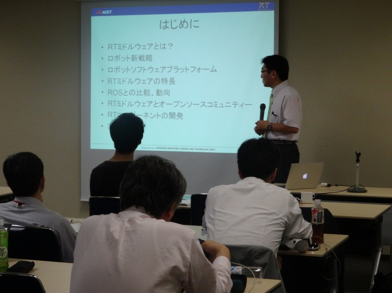
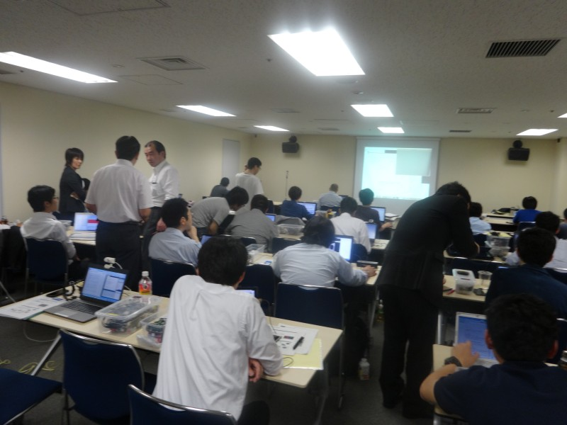
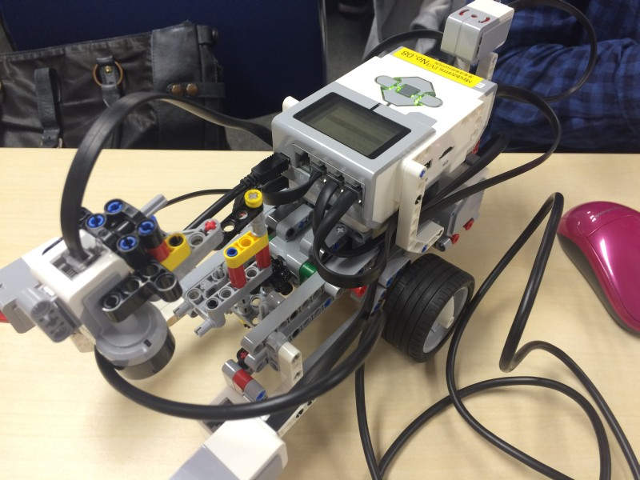
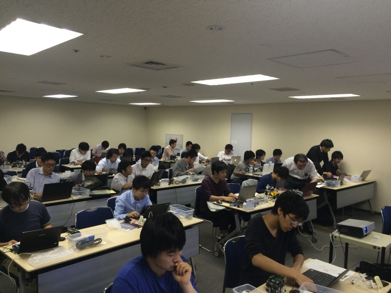
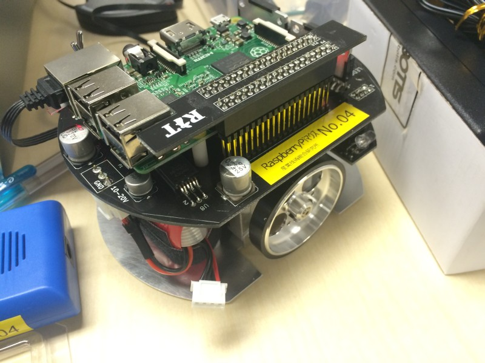

#contents

<!-- ** 開催案内: ROBOMECH2016講習会 -->
## ROBOMECH2016講習会

<!-- 毎年恒例となりました、ROBOMECHでのRTミドルウエア講習会を今年も開催いたします。 -->
2016年6月8日(水) にパシフィコ横浜において、ROBOMECでのRTミドルウエア講習会を開催いたしました。

RTミドルウエアはロボットシステムの構築を効率化するソフトウエアプラットフォームです。RTコンポーネントと呼ばれるモジュール化されたソフトウエアを多数組わせてロボットシステムを構築するため、システムの変更、拡張がしやすいだけでなく、既存のソフトウエア資産をの継承や他人が作ったコンポーネントとの組み合わせも容易になります。講習会では、RTミドルウエアの概要、RTコンポーネントの作成方法について解説します。受講者には各自ノートPCをお持ちいただき、実習形式で実際にRTコンポーネントを作成、既存のコンポーネントなどと組み合わせて簡単なシステムを構築していただきます。本講習会を受講することで、RTコンポーネント設計方法、実装の仕方、システムの作り方をマスターすることができます。

## 日時・場所
- **主催**: 国立研究開発法人 産業技術総合研究所
- **協賛**: ROBOMECH2016, (公社)計測自動制御学会システムインテグレーション部門
- **日時**: 2016年6月8日(水), 10:00～16:45   [ROBOMEC2016チュートリアルとして開催](http://robomech.org/2016/%E9%96%8B%E5%82%AC%E8%A1%8C%E4%BA%8B/)
- **場所**: [パシフィコ横浜](http://www.pacifico.co.jp/) E204号室
  - アクセス: [交通アクセス](http://www.pacifico.co.jp/visitor/accessmap.html)
  - 詳細は[ROBOMEC2016 Webページ](http://robomech.org/2016/)をご覧ください。
<!-- -''聴講料'': 無料 -->
<!-- -- &color(red){可能な限りROBOMECH2016への参加登録をお願いします。}; -->
<!-- -''定員'': 第1部50名, 実習（第2, 3部）30名程度を予定しております。定員になり次第申し込みは終了させていただきます。第1部のみご参加の方は申し込み不要です。 -->
- **参加者**: 第1部43名、実習（第2, 3部）30名（+講師・スタッフ10名）
<!-- - ''参加登録'': &color(red){第1部のみの聴講は申込不要。}; -->
<!-- -''参加登録'': [[参加登録フォームはこちら>#entry]] -->
<!-- -- 参加登録には当Webページのユーザ登録が必要です。[[ユーザ登録はこちら:http://openrtm.org/openrtm/ja/user/register]] -->
<!-- -- [[メーリングリスト:http://www.openrtm.org/mailman/listinfo/openrtm-users]]への登録をお勧めします。必須ではありませんが、Webでご案内する事前準備についてはメーリングリストにてお知らせします。 -->
<!-- -- 講習会のみの参加の場合ROBOMEC2013への参加登録は不要です。 -->
<!-- -- なお、登録の際に問題が生じた場合は、 [[こちら（robomech2016@openrtm.org）:mailto:robomech2016@openrtm.org]] までお問い合わせください。 -->

<!-- &br; -->
<!-- #ref(robomech2016_button.png,left,url=#entry) -->

## 過去の講習会

<!-- こちらから、過去の講習会の資料および写真などがご覧いただけます。 -->

- [ROBOMECH2015](../robomech2015)
- [ROBOMECH2014](../robomech2014) (2014年から ROBOMEC->ROBOMECHになりました。)
- [ROBOMEC2013](../robomec2013)

## プログラム

<table class="table-alt">
  <tr>
    <td>10:00 -10:50</td>
    <td>></td>
    <td>**第1部(その1)：インターネットを利用したロボットサービスとRSiの取り組み2016**  **担当**：成田雅彦 氏（産業技術大学院大学）  **概要**：IOTのキーワードが広まりつつあります．本講演では，これに呼応したRSi（ロボットサービスイニシアティブ）の取り組みとして，ロボットサービスシミュレータ，SLAMモジュール，T型ロボットとの連携，ラズベリパイでの利用，ベイエリアおもてなしロボット研究会の活動などを紹介し，今後を展望したいと思います．  **講義資料**:<a href="href=./160608-01.pdf">160608-01.pdf</a></td>
  </tr>
  <tr>
    <td>11:00 -11:50</td>
    <td>></td>
    <td>**第1部(その2)：OpenRTM-aistおよびRTコンポーネントプログラミングの概要**   **担当**：安藤慶昭 氏 (産総研)  **概要**：RTミドルウェア(OpenRTM-aist)はロボットシステムをコンポーネント指向で構築するソフトウェアプラットフォームです。RTミドルウェアを利用することで、既存のコンポーネントを再利用し、モジュール指向の柔軟なロボットシステムを構築することができます。RTミドルウエアについて、その概要およびRTコンポーネントの機能やプログラミングの流れについて説明します。  **講義資料**:<a href="./160608-02.pdf">160608-02.pdf</a></td>
  </tr>
  <tr>
    <td>11:50 -12:00</td>
    <td>></td>
    <td>質疑応答・意見交換</td>
  </tr>
  <tr>
    <td>12:00 -13:00</td>
    <td>></td>
    <td>昼食</td>
  </tr>
  <tr>
    <td>13:00 -14:30</td>
    <td>></td>
    <td>**第2部: RTコンポーネントの作成入門**  **担当**：原功氏、安藤慶昭氏（産業技術総合研究所）坂本武志 氏 (株式会社グローバルアシスト)  **概要**：RTシステムを設計するツールRTSystemEditorおよびRTコンポーネントを作成するツールRTCBuilderの使用方法について解説するとともに、RTCBuilderを使用したRTコンポーネントの作成方法を実習形式で体験していただきます。  <a href="/ja/node/5022">チュートリアル（画像処理コンポーネントの作成 Windows編）</a>   <a href="/ja/node/430">チュートリアル（画像処理コンポーネントの作成 Linux編）</a></td>
  </tr>
  <tr>
    <td>14:45 -16:45</td>
    <td>></td>
    <td>**第3部：プログラミング実習**   担当：宮本信彦 氏 (産総研) 他   **概要**：OpenRTM-aistを利用して<a href="http://products.rt-net.jp/micromouse/raspberry-pi-mouse">RaspberryPiマウス</a> または <a href="http://www.afrel.co.jp/lineup/mindstorm-ev3">LEGO Mindstorms EV3</a> を制御するプログラムを実際に作成します。  <a href="/ja/node/6042">チュートリアル（RaspberryPiマウス）</a>  <a href="/ja/node/6041">チュートリアル（EV3）</a></td>
  </tr>
</table>

 

2種類の小型ロボットを使って実習を行います。;

### RaspberryPiマウス
RaspberryPiマウスは、株式会社アールティから発売されているメインボードにRaspberry Piを使った左右独立二輪方式の小型移動プラットフォームロボットです。
RaspberryPiを利用しているので、実機上で開発したり、容易に拡張したりすることが可能です。今回は、あらかじめマウス制御用コンポーネントがインストールされている状態で、これを制御するRTコンポーネントを作成していただきます。

- [Raspberry Pi Mouse 活用事例](http://openrtm.org/openrtm/ja/content/raspberry_pi_mouse)

### LEGO Mindstorms EV3

LEGO Mindstorms EV3 は LEGO の Mindstorms シリーズの新しいパッケージです。EV3のメインのコントローラは、Linuxが標準搭載され、様々な言語でロボットの開発が可能になりました。USBインターフェースが搭載され、無線LANのUSBアダプタを挿すことで無線LANなどで外部と通信することも可能になりました。
搭載されるOSがLinuxになったことで、これまでよりもさらに柔軟に、かつ高度なロボット開発が可能になります。

- [LEGO Mindstorms EV3 活用事例](http://openrtm.org/openrtm/ja/casestudy/lego_mindstorm_ev3)

<!-- ** 講習会に参加される方へ -->

<!-- 第2,3部の実習には以下の準備が必要です。 -->

### 必要機材
- ノートPC
  - OS: Windowsをご用意下さい
  - Eclipseが動作する程度のスペックが必要です
  - メモリ: 1GB以上
  - CPU: Core2Duo以上
  - HDD空き: 5GB以上

Windowsのファイアウォールは必ず切っておいてください。;
セキュリティーソフトにもファイアウォールが設定されている場合がありますので、そちらもOFFにしておいてください。;

### 事前にインストールするソフトウエア

あらかじめインストールしておくべきソフトウエアは以下のとおりです。以下のリンクをクリックし、ファイルをダウンロード・インストールしてください。 
一部のリンクはダウンロードページへ飛びますので、飛んだ先のページ内で適切なファイルをそれぞれダウンロードしてください。

#### Visual Studio 

- Visual Studio 2013推奨：[こちらのページ](https://www.visualstudio.com/ja-jp/downloads/download-visual-studio-vs#DownloadFamilies_2) から無償版をダウンロードできます。
  - 左のメニューから「Visual Studio 2013」→「Community 2013」のWebインストーラを選択。
  - インストールには時間がかかりますので、事前にインストールしておいてください。

#### OpenRTM-aist 1.1.2-RELEASE版 (C++版、Python版）

- 1.1.2 からは一つのインストーラですべての言語とVisual Studioのバージョンに対応しいます。32bit/64bitのみ選択してください。（32bit推奨）
  - [Windows用インストーラ(32bit)](/content/openrtm-aist-c-112-release#toc2)
- 1.1.2 は インストールしているVisual Studioのバージョンをシステム環境変数で指定しますので、設定を確認して下さい。デフォルトはvc2013の設定になっています。
  - [Visual Studio のバージョン指定](/content/openrtm-aist-c-112-release#toc4)
- 1.1.2の使用を推奨しますが、1.1.0, 1.1.1でも受講可能です。
- 1.1.1/1.1.0 をお使いの場合は必ず; Visual Studio のバージョンと一致させてください。
<!-- -- 他のバージョン用は、[[こちらのページ:http://openrtm.org/openrtm/ja/content/openrtm-aist-c-112-release]] からダウンロードできます。(非推奨) -->
- デフォルト設定のままインストールして下さい。
- [OpenRTM-aistを10分で始めよう！](http://openrtm.org/openrtm/ja/content/lets_start) を参考に、事前にサンプルコンポーネントを起動して動作確認を行っておいてください。

#### Python

- [Python2.7.10](https://www.python.org/ftp/python/2.7.10/python-2.7.10.msi)
<!-- 、または [[Python2.7(64bit):https://www.python.org/ftp/python/2.7.10/python-2.7.10.amd64.msi]] -->
  - Python2.7.11もすでにリリースされていますが非推奨です。;
  - OpenRTM-aistやPyYAMLをインストールする前にインストールしてください;

<!-- -- OpenRTM-aist Python の64bit版をインストールされる場合は、[[Python2.7(64bit):https://www.python.org/ftp/python/2.7.9/python-2.7.9.amd64.msi]] をインストールしてください。　 -->

#### その他

以下のソフトウェアも必須です。忘れずにインストールしてください。

- [PyYAML](http://pyyaml.org/download/pyyaml/PyYAML-3.11.win32-py2.7.exe)
<!-- -- Python2.7(64bit)をインストールされた場合は、[[PyYAML(64bit):http://pyyaml.org/download/pyyaml/PyYAML-3.11.win-amd64-py2.7.exe]] をインストールしてください。　 -->
- [CMake](https://cmake.org/files/v3.5/cmake-3.5.2-win32-x86.msi)
- [Doxygen](http://ftp.stack.nl/pub/users/dimitri/doxygen-1.8.11-setup.exe)
- 使い慣れたエディタ: EclipseやPythonに付属のエディタでも構いませんが、使い慣れたエディタが入っていた方が良いでしょう

 
 

### 講義資料
#### 第1部（その１） インターネットを利用したロボットサービスとRSiの取り組み2016
- [第1部（その１） 講義資料(PDF)](./160608-01.pdf)

<!-- Invalid YouTube URL: http://www.slideshare.net/62877975 -->



#### 第1部（その２） OpenRTM-aistおよびRTコンポーネントプログラミングの概要 
- [第1部（その２） 講義資料(PDF)](./160608-02.pdf)

<!-- Invalid YouTube URL: http://www.slideshare.net/62819850 -->


<!-- **** 第2部 RTコンポーネントの作成入門 -->
<!-- - [[第2部 講義資料(PDF):http://openrtm.org/openrtm/sites/default/files/5586/140525-03.pdf]] -->
<!-- <nowiki> -->
<!-- [video:http://www.slideshare.net/35243586] -->
<!-- </nowiki> -->
<!-- **** 第3部 プログラミング実習 -->
<!-- - [[第3部（ロボット制御コース） 講義資料(PDF):/sites/default/files/5784/150517-03.pdf]] -->

<!-- <nowiki> -->
<!-- [video:http://www.slideshare.net/48419860] -->
<!-- </nowiki> -->

<!-- - [[第3部（JVRC参加コース） 講義資料(PDF):/sites/default/files/5784/150517-04.pdf]] -->

<!-- <nowiki> -->
<!-- [video:http://www.slideshare.net/48238532] -->
<!-- </nowiki> -->

<!-- &aname(entry); -->
<!-- **講習会申し込みフォーム -->

<!-- 以下の手順に従って、下記フォームから講習会へお申し込みください。 -->
<!-- &br; -->
<!-- #ref(reg_flow.png,60%,left,nolink) -->
<!-- &br; -->
<!-- &color(red){このサイトにログイン後、下方に参加登録フォームが現れます。}; -->

<!-- #ref(registration_scheme.png,60%,left,nolink) -->

<!-- + ''ユーザ登録:'' 参加登録するまえに当Webページのユーザ登録をお願いします。[[ユーザ登録はこちら:http://openrtm.org/openrtm/ja/user/register]] -->
<!-- -- 当Webサイトにログイン済みの方は名前の欄にユーザ名が出ますが、氏名に書き換えてください。 -->
<!-- + ''ログイン:'' ユーザ登録後 openrtm.org のサイトにログインします。 -->
<!-- + ''参加登録:'' 下記の登録フォームに必要事項を記入し登録してください。 -->
<!-- -- 申し込み内容はコースも含めて5日前まで変更できます。 -->
<!-- -- フォーム送信後、確認メールをお送りいたします。1日たっても確認メールが届かない場合は、[[こちら（robomech2016@openrtm.org）:mailto:robomech2016@openrtm.org]] までお問い合わせください。 -->

<!-- &color(red){定員に達しましたので申し込みを締め切らせていただきました。ありがとうございました。なお、見学だけであれば参加可能ですので、当日、会場までお越しください。}; -->
<!-- &color(red){第1部のみの聴講は申込不要です。}; -->

## 講習会の様子

 

 

 

 

 

