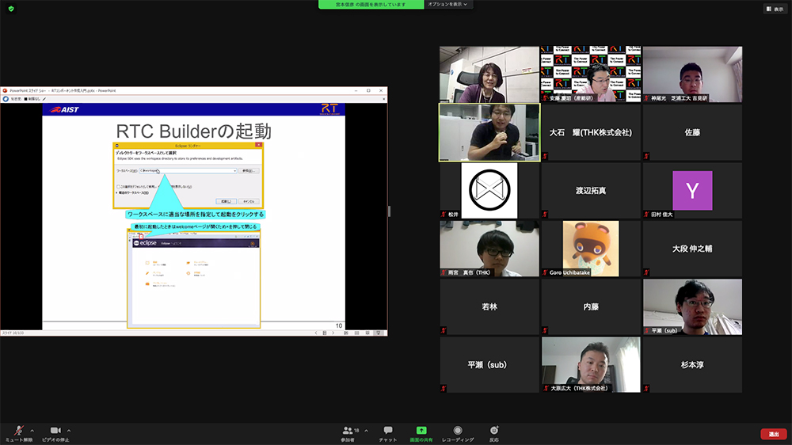

<br>
<a>No English version available.
</a>

<!-- -------jp page!!------- -->

<!-- #ref(https://robomech.org/2020/wp-content/uploads/2019/09/head000.jpg,left,100%,margin=10,url=/ja/tutorial/robomech2020) -->
<!-- #ref(robomech2019_title.png,left,60%,margin=10,url=/ja/tutorial/robomech2019) -->

#contents

## ROBOMECH2021オンライン講習会


2021年6月6日(日)にオンラインで講習会を開催しました。

<!-- ROBOMECH2020の現地開催中止に伴い、本講座のオンラインでの開催を決定いたしました。 -->
<!-- 参加登録は下記フォームからお申し込みください。参加登録には当Webページのユーザ登録が必要です。 -->
<!-- 詳しいプログラムは準備中です。もう少々お待ちください。 -->
<!-- また、PCの貸し出しを検討しております。もう少々お待ちください。 -->

<!-- ROBOMECH2020の現地開催中止に伴い、本講座も現地開催中止を決定いたしました。 -->
<!-- 現在テレビ会議での開催の可否を検討しております。もう少々お待ちください。 -->


<!-- 毎年恒例となりました、ROBOMECHでのRTミドルウエア講習会を今年も開催いたします。 -->

<!-- 新型コロナウイルス感染拡大防止の観点から、2021年6月6日(日)ROBOMECH2021 RTミドルウエア講習会をオンラインで開催いたします。 -->

<!-- RTミドルウエアはロボットシステムの構築を効率化するソフトウエアプラットフォームです。RTコンポーネントと呼ばれるモジュール化されたソフトウエアを多数組わせてロボットシステムを構築するため、システムの変更、拡張がしやすいだけでなく、既存のソフトウエア資産をの継承や他人が作ったコンポーネントとの組み合わせも容易になります。講習会では、RTミドルウエアの概要、RTコンポーネントの作成方法について解説します。受講者には各自PCをご準備いただき、実習形式で実際にRTコンポーネントを作成、既存のコンポーネントなどと組み合わせて簡単なシステムを構築していただきます。本講習会を受講することで、RTコンポーネント設計方法、実装の仕方、システムの作り方をマスターすることができます。 -->


## 日時・場所
<!-- -''主催'': 国立研究開発法人 産業技術総合研究所 -->
- **主催**: 一般社団法人 日本機械学会 ロボティクス・メカトロニクス部門
<!-- -''主催'': (公社)計測自動制御学会システムインテグレーション部門 RTシステムインテグレーション部会 -->
<!-- -''協賛'': ROBOMECH2021, (公社)計測自動制御学会システムインテグレーション部門 -->
- **日時**: 2021年6月6日(日) ROBOMECH2021チュートリアルとして開催<br> 
<!-- [[ROBOMECH2021チュートリアルとして開催:https://robomech.org/2021/workshop-tutorial/]] -->
<!-- -''場所'': [[大阪南港ATCホール:https://atchall.com/]] (予定) -->
<!-- --アクセス: [[交通アクセス:https://atchall.com/access]] -->
  - 詳細は[ROBOMECH2021 Webページ](https://robomech.org/2021/)をご覧ください。
<!-- - Slack参加リンク（講習会中のみ掲示): https://join.slack.com/t/openrtm-users/shared_invite/zt-6024yig0-OjDk6yXSsDo8SX6NOuv5yA -->

<!-- -ROBOMECH2020の現地開催中止に伴い、本講座のオンラインでの開催を決定いたしました。 -->
- **聴講料**: 無料
  - <span style="color:red;">必須ではありませんが可能な限りROBOMECH2021への参加登録をお願いします。</span>;
- **定員**: 20名
- **参加者数**: 14名（スタッフ３名）
<!-- -- 以下の機材の貸し出しを行っております。ご希望の方は参加登録時にお申込みください。 -->
<!-- -- Lidar付きRaspberryPi Mouseは先着8名まで &color(red){受付終了しました。}; -->
<!-- -- 通常版RaspberryPi Mouseは先着12名まで &color(red){受付終了しました。}; -->
<!-- -- いずれも先着順となりますので、ご希望に添えない場合もございます。予めご了承ください。 -->

<!-- -''定員'': 第1部50名, 実習（第2, 3部）20名程度を予定しております。定員になり次第申し込みは終了させていただきます。 -->
<!-- 第1部10名, 実習（第2, 3部）30名程度を予定しております。定員になり次第申し込みは終了させていただきます。第1部のみご参加の方は申し込み不要です。// -->
<!-- -''参加者'': 1部10名、実習（第2部）8名（+講師・スタッフ3名） -->
<!-- - ''参加登録'': &color(red){第1部のみの聴講は申込不要。}; -->
<!-- -''参加登録'':  -->
<!-- - [[参加登録フォームはこちら:https://goo.gl/forms/vDW0jAmboChrlhkC2]] -->
<!-- -- 参加登録には当Webページのユーザ登録が必要です。[[ユーザ登録はこちら:/openrtm/ja/user/register]] -->
<!-- -- [[メーリングリスト:http://www.openrtm.org/mailman/listinfo/openrtm-users]]への登録をお勧めします。必須ではありませんが、Webでご案内する事前準備についてはメーリングリストにてお知らせします。 -->
<!-- -- 講習会のみの参加の場合ROBOMECH2019への参加登録は不要です。 -->
<!-- -- なお、登録の際に問題が生じた場合は、 [[こちら（robomech2017@openrtm.org）:mailto:robomech2017@openrtm.org]] までお問い合わせください。 -->

<!-- &br; -->
<!-- #ref(robomech2016_button.png,left,url=#entry) -->

## 過去の講習会

こちらから、過去の講習会の資料および写真などがご覧いただけます。

- [ROBOMECH2020](../robomech2020)
- [ROBOMECH2019](../robomech2019)
- [ROBOMECH2018](../robomech2018)
- [ROBOMECH2017](../robomech2017)


## プログラム
<!-- 準備中です。 -->
<!-- オンライン開催に伴い、一部プログラムが変更になりました。 -->

<table class="table-alt">
  <tr>
    <td>11:00 -11:50</td>
    <td>**第1部：OpenRTM-aistおよびRTコンポーネントプログラミングの概要**<br>  **担当**：安藤慶昭 氏 (産総研) <br> **概要**： RTミドルウェア(OpenRTM-aist)はロボットシステムをコンポーネント指向で構築するソフトウェアプラットフォームです。RTミドルウェアを利用することで、既存のコンポーネントを再利用し、モジュール指向の柔軟なロボットシステムを構築することができます。RTミドルウエアについて、その概要およびRTコンポーネントの機能やプログラミングの流れについて説明します。<br>**講義資料**:<a href="200527-01.pdf">200527-01.pdf</a></td>
  </tr>
  <tr>
    <td>11:50 -12:00</td>
    <td>質疑応答・意見交換</td>
  </tr>
  <tr>
    <td>12:00 -12:10</td>
    <td>実習に必要なソフトウェアのインストールの確認</td>
  </tr>
  <tr>
    <td>12:10 -13:10</td>
    <td>休憩</td>
  </tr>
  <tr>
    <td>13:10 -15:00</td>
    <td>第2部：RTコンポーネントの作成入門 <br> - 担当：宮本 信彦 氏(産総研) <br> - 概要：RTシステムを設計するツールRTSystemEditorおよびRTコンポーネントを作成するツールRTCBuilderの使用方法について解説するとともに、移動ロボットのシミュレータを用いた実習によりRTCBuilder、RTSystemEditorの利用法の学習します。 <br> <a href="/ja/node/6550">チュートリアル(第2部、Windows)</a> <br> <a href="/ja/node/6551">チュートリアル(第2部、Ubuntu)</a> <br>**講義資料**:<a href="RTコンポーネント作成入門.pdf">RTコンポーネント作成入門.pdf</a></td>
  </tr>
  <tr>
    <td>15:00 -16:00</td>
    <td>第3部：rtshell入門 <br> - 担当：宮本 信彦 氏(産総研) <br> - 概要：RTシステムの起動、終了を自動化するスクリプトファイルの作成方法を解説します。 <br> <a href="/ja/node/7097">チュートリアル(第3部)</a> <br>**講義資料**:<a href="rtshell入門.pdf">rtshell入門.pdf</a></td>
  </tr>
  <tr>
    <td>16:00 -17:00</td>
    <td>第4部：RTコンポーネント作成入門-Ⅱ(希望者のみ) <br> - 担当：宮本 信彦 氏(産総研) <br> - 概要：OpenRTM-aistを利用して移動ロボット実機を制御するプログラムを作成します。希望者にRaspberry Piマウスを貸し出します。希望する場合は申し込みフォームに郵便番号・住所・受取担当者を入力してください。<br> <a href="/ja/node/6550#realrobot">チュートリアル(第4部、Windows)</a>  <br> <a href="/ja/node/6551#realrobot">チュートリアル(第4部、Ubuntu)</a><br> <a href="/ja/node/7098">チュートリアル(SLAM実習)</a> <br>**講義資料**:<a href="SLAM実習.pdf">SLAM実習.pdf</a></td>
  </tr>
</table>

### 使用する小型移動ロボット実機

#### RaspberryPi Mouse 通常版

<div align="center"><a href="https://www.rt-shop.jp/blog/wp-content/uploads/2020/03/img_raspimouse01-765x800.png"></a></div>

#### RaspberryPi Mouse LiDAR付き

<div align="center"><a href="https://rt-net.jp/mobility/wp-content/uploads/2019/12/23b47429c42d672e7f94ae0a3c9c9d6c.png"></a></div>

<br>


## 講義資料
### 第1部
<nowiki>
[video:slideshare.net/?id=249150493&doc=200606-01-210608010949]


</nowiki>

<!-- *** 第2部 -->

<!-- *** 参考資料 -->

<!-- - [[Raspberry Pi Mouse 活用事例:/ja/node/6005]] -->


## 事前準備

### PCおよびZoom接続可能なデバイス

第2部ではプログラミング実習を行うため、Windows PC（ノートPC、デスクトップ（ただし無線LANインターフェースが必要））の用意をお願いします。
また、ロボット実機貸与を希望される方は、演習で使用するPCとは別に、Zoom接続可能なデバイスをご用意ください。

- Windows PC (ノートPC、デスクトップ何れも可）
  - LinuxがインストールされたPCでも実習は可能ですが、説明は基本的にWindowsベースで進めさせていただきます。
- 実機を使った実習を希望される方
  - Zoom接続可能なデバイス (スマホ、タブレット、PC等）

実機を使用した演習では、ノートPCと実機（RaspberryPi Mouse）を無線LAN経由で1対1接続させるため、インターネットアクセスができなくなります。
このため、Zoomに接続可能なデバイス（スマホ、タブレット、PC）を別途ご用意いただくことをおすすめいたします。
なお、実機との接続は一時的なものですので、不便ですがノートPCのみでも受講は可能です。


### 資料
以下のZIPファイルをダウンロードして[Lhaplus](https://forest.watch.impress.co.jp/library/software/lhaplus/)等で展開してください。

- [RTM_Tutorial.zip](https://github.com/OpenRTM/RTM_Tutorial/releases/download/online_0.3/RTM_Tutorial.zip)

&aname(install);

### インストールするソフトウェア
#### Windowsの場合
以下のソフトウェアをインストールしてください。リンクが切れている場合は、最新バージョンをインストールしてください。
なお、Windowsが64bit版の場合はそれぞれ64bit版のものを、32bit版の場合は32bit版のものをダウンロードします。

- [Visual Studio 2019](/ja/node/6650)
  - Visual C++がインストールされているかは必ず確認してください。
- [Python 3.8](https://www.python.org/downloads/windows/)(Python 3.9はOpenRTM-aistが未対応のため不可)
  - [python-3.8.10-amd64.exe (64bit版)](https://www.python.org/ftp/python/3.8.10/python-3.8.10-amd64.exe)
<!-- -- [[python-3.8.10.exe (32bit版):https://www.python.org/ftp/python/3.8.10/python-3.8.10.exe]] -->
- [CMake](https://cmake.org/download/)
  - [cmake-3.20.2-windows-x86_64.msi (64bit版)](https://github.com/Kitware/CMake/releases/download/v3.20.2/cmake-3.20.2-windows-x86_64.msi)
<!-- -- [[cmake-3.20.2-windows-i386.msi (32bit版):https://github.com/Kitware/CMake/releases/download/v3.20.2/cmake-3.20.2-windows-i386.msi]] -->
- [Doxygen](http://www.doxygen.nl/download.html) 
<!-- (32bit, 64bitの別なし） -->
  - [doxygen-1.9.1-setup.exe](https://doxygen.nl/files/doxygen-1.9.1-setup.exe)
- [OpenRTM-aist-1.2.2-RELEASE](https://openrtm.org/openrtm/ja/download)
  - [OpenRTM-aist-1.2.2-RELEASE_x86_64.msi (64bit版)](https://github.com/OpenRTM/OpenRTM-aist/releases/download/v1.2.2/OpenRTM-aist-1.2.2-RELEASE_x86_64.msi)
<!-- -- [[OpenRTM-aist-1.2.2-RELEASE_x86.msi (32bit版):https://github.com/OpenRTM/OpenRTM-aist/releases/download/v1.2.2/OpenRTM-aist-1.2.2-RELEASE_x86.msi]] -->


#### Ubuntuの場合

##### OpenRTM-aist

```
 $ wget https://raw.githubusercontent.com/OpenRTM/OpenRTM-aist/master/scripts/pkg_install_ubuntu.sh
 $ sudo sh pkg_install_ubuntu.sh -l all --yes
```

##### JDK

```
 # Ubuntu 18.04、18.10、20.04の場合
 $ sudo apt-get install openjdk-8-jdk
 # Ubuntu 16.04の場合
 $ sudo apt-get install default-jdk
```

Ubuntu 18.04、18.10、20.04の場合は以下のコマンドでjava8に切り替えます。

```
 $ sudo update-alternatives --config java
```

##### Git

```
 $ sudo apt-get install git
```

##### Premake(RaspberryPiMouseSimulator に必要)

```
 $ sudo apt-get install premake4
```

##### GLUT(RaspberryPiMouseSimulator に必要)

```
 $ sudo apt-get install freeglut3-dev
```

##### RaspberryPiMouseSimulator コンポーネント

```
 $ wget https://raw.githubusercontent.com/OpenRTM/RTM_Tutorial/master/script/install_raspimouse_simulator.sh
 $ sh install_raspimouse_simulator.sh
```

##### Code::Blocks(任意)

```
 $ sudo apt-get install codeblocks
```

##### cmake-gui(任意)

```
 $ sudo apt-get install cmake-qt-gui
```

### オンライン開催での注意事項
今回のRTミドルウェア講習会はZoomを使用してオンラインで開催します。
以下の受講者用マニュアルをご一読ください。

- [受講者用マニュアル](https://nobu19800.github.io/RTM_Tutorial_Zoom/audience_manual.html)
<br>

<!-- &aname(entry); -->
<!-- **講習会申し込み方法 -->
<!-- 準備中です。 -->
<!-- connpassから参加申し込みを行ってください。 -->
<!-- - https://connpass.com/event/176130/ -->
<!-- ※5月15日以前にこのページの申し込みフォームから申し込みを行った場合については、既に申し込みを受理しているため再度connpassから申し込みを行う必要はありません。 -->
<!-- connpassのアカウントがない場合は、以下の手順に従って下記フォームから講習会へお申し込みください。 -->
<!-- #ref(registration_scheme.png,60%,left,nolink) -->
<!-- #ref(reg_flow.png,60%,left,nolink) -->
<!-- &br; -->
<!-- &color(red){このサイトにログイン後、下方に参加登録フォームが現れます。}; -->

<!-- + ''ユーザ登録:'' 参加登録するまえに当Webページのユーザ登録をお願いします。[[ユーザ登録はこちら:http://openrtm.org/openrtm/ja/user/register]] -->
<!-- -- 当Webサイトにログイン済みの方は名前の欄にユーザ名が出ますが、氏名に書き換えてください。 -->
<!-- + ''ログイン:'' ユーザ登録後 openrtm.org のサイトにログインします。 -->
<!-- + ''参加登録:'' 下記の登録フォームに必要事項を記入し登録してください。 -->
<!-- -- 申し込み内容はコースも含めて5日前まで変更できます。 -->
<!-- -- フォーム送信後、確認メールをお送りいたします。1日たっても確認メールが届かない場合は、[[こちら（robomech2017@openrtm.org）:mailto:robomech2017@openrtm.org]] までお問い合わせください。 -->


<!-- &color(red){定員に達しましたので申し込みを締め切らせていただきました。ありがとうございました。なお、見学だけであれば参加可能ですので、当日、会場までお越しください。}; -->
<!-- &color(red){第1部のみの聴講は申込不要です。}; -->

<!-- ** 講義資料 -->
<!-- *** 第1部（その１） OpenRTM-aistおよびRTコンポーネントプログラミングの概要 -->
<!-- - [[第1部（その１） 講義資料(PDF):/sites/default/files/6707/190605-01.pdf]] -->

<!-- <nowiki> -->
<!-- [video:https://www.slideshare.net/149148327] -->
<!-- </nowiki> -->

<!-- *** 第2部 RTコンポーネントの作成入門 -->
<!-- - [[第2部 講義資料(PDF):/sites/default/files/6707/190605-02.pdf]] -->

<!-- <nowiki> -->
<!-- [video:https://www.slideshare.net/149148524] -->
<!-- </nowiki> -->

<!-- *** 第3部 RTシステム構築実習 -->
<!-- - [[第3部 講義資料(PDF):/sites/default/files/6707/190605-03.pdf]] -->

<!-- <nowiki> -->
<!-- [video:https://www.slideshare.net/149148614] -->
<!-- </nowiki> -->

<!-- **** 第4部 RTミドルウェア応用実習  -->
<!-- - [[第4部 講義資料(PDF):/sites/default/files/6707/190605-04.pdf]] -->

<!-- <nowiki> -->
<!-- [video:https://www.slideshare.net/149148646] -->
<!-- </nowiki> -->


## 講習会の様子
<div align="center"><a href="20210606_all.jpg"></a></div>
<!-- #br -->

<!-- #ref(20190605_2.jpg,center,nolink) -->
<!-- #br -->

<!-- #ref(20190605_3.jpg,center,nolink) -->
<!-- #br -->

<!-- #ref(20170510-03.jpg,center,20%,nolink) -->
<!-- #br -->

<!-- #ref(20170510-08.jpg,center,16%,nolink) -->
<!-- #br -->

<!-- #ref(20170510-06.jpg,center,16%,nolink) -->
<!-- #br -->


<!-- -------jp page!!------- -->
