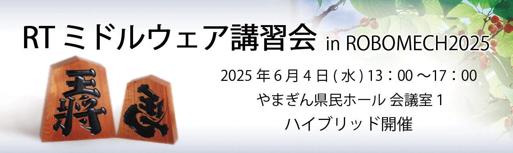
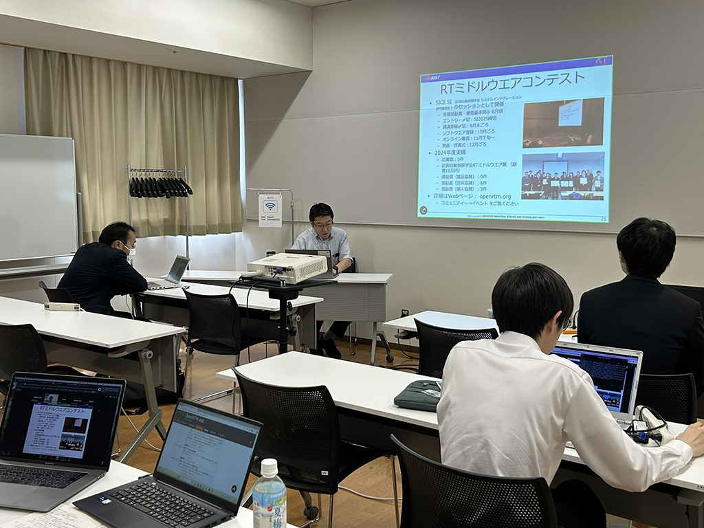
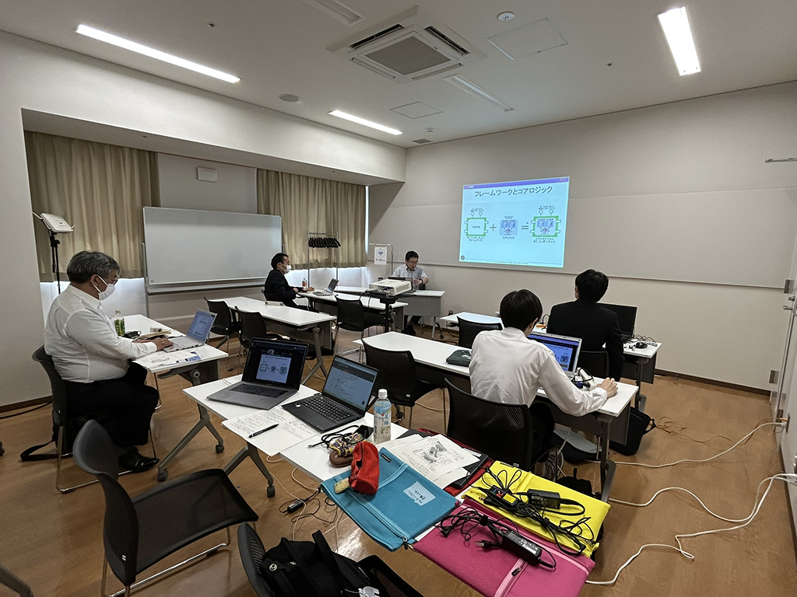
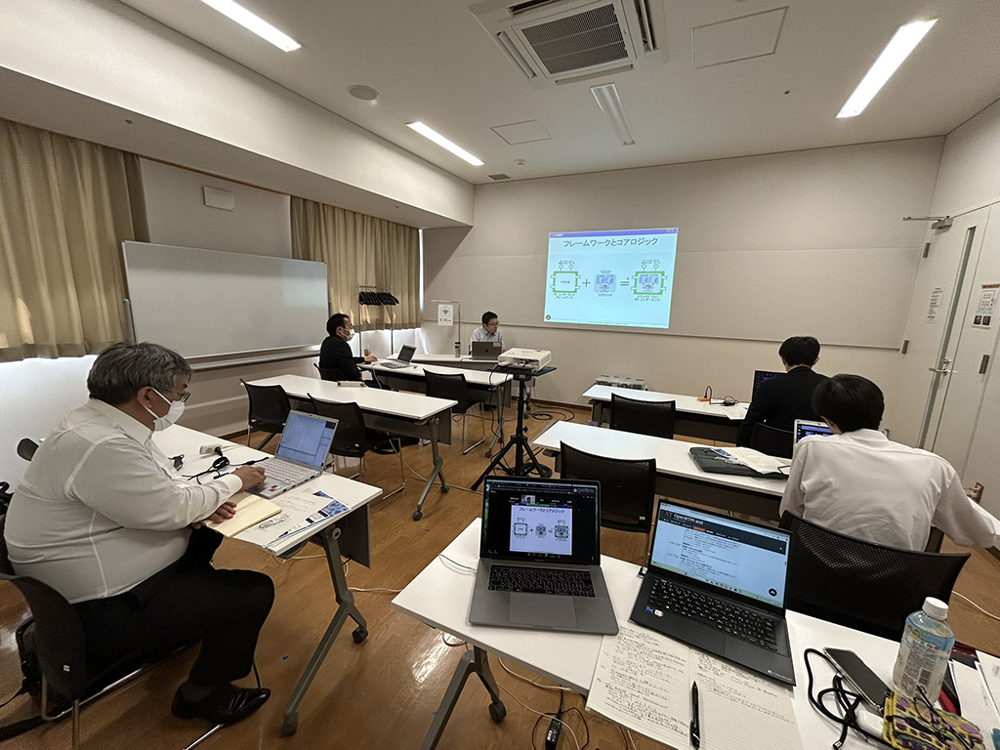
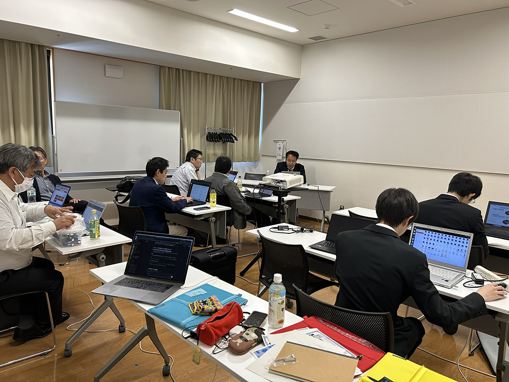
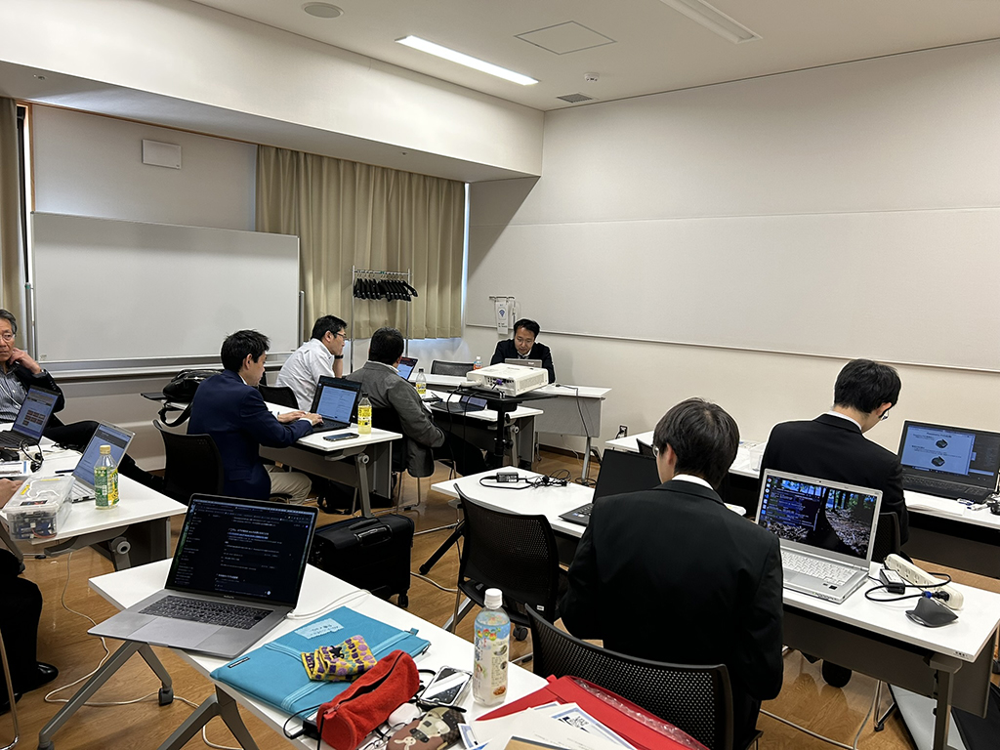

<div align="left"></div>
<!-- #ref(robomech2019_title.png,left,60%,margin=10,url=/ja/tutorial/robomech2019) -->

#contents

## ROBOMECH2025講習会


<!-- 毎年恒例となりました、ROBOMECHでのRTミドルウエア講習会を今年も開催いたします。 -->


RTミドルウエアはロボットシステムの構築を効率化するソフトウエアプラットフォームです。RTコンポーネントと呼ばれるモジュール化されたソフトウエアを多数組わせてロボットシステムを構築するため、システムの変更、拡張がしやすいだけでなく、既存のソフトウエア資産をの継承や他人が作ったコンポーネントとの組み合わせも容易になります。講習会では、RTミドルウエアの概要、RTコンポーネントの作成方法について解説します。受講者には各自PCをご準備いただき、実習形式で実際にRTコンポーネントを作成、既存のコンポーネントなどと組み合わせて簡単なシステムを構築していただきます。本講習会を受講することで、RTコンポーネント設計方法、実装の仕方、システムの作り方をマスターすることができます。


## 日時・場所
- **主催**: 国立研究開発法人 産業技術総合研究所
- **主催**: (公社)計測自動制御学会システムインテグレーション部門 RTシステムインテグレーション部会
- **主催**: ロボットビジネス推進協議会RTミドルウェアWG
- **協賛**: ROBOMECH2025, (公社)計測自動制御学会システムインテグレーション部門
- **日時**: 2025年6月4日(水)[ROBOMECH2025チュートリアルとして開催](https://robomech.org/2025/workshop-tutorial/#rtmiddle)
- **場所(現地参加)**: [やまぎん県民ホール 会議室１ ](https://yamagata-bunka.jp/) （山形県総合文化芸術館）
  - アクセス: [交通アクセス](https://yamagata-bunka.jp/access/)
<!-- -- 詳細は[[ROBOMECH2025 Webページ:https://robomech.org/2025/]] をご覧ください。（準備中） -->
<!-- - ※オンライン参加の場合はZoomのミーティング情報を5/28に通知 -->
<!-- - 定員: 10人 -->
- **参加者数**: 4名（+講師・スタッフ4名）


<!-- - Slack参加リンク（講習会中のみ掲示): https://join.slack.com/t/openrtm-users/shared_invite/zt-6024yig0-OjDk6yXSsDo8SX6NOuv5yA -->


<!-- -''定員'': 10名程度を予定しております。定員になり次第申し込みは終了させていただきます。 -->
<!-- 第1部10名, 実習（第2, 3部）30名程度を予定しております。定員になり次第申し込みは終了させていただきます。第1部のみご参加の方は申し込み不要です。// -->
<!-- -''参加者'': 1部10名、実習（第2部）8名（+講師・スタッフ3名） -->
<!-- - ''参加登録'': &color(red){第1部のみの聴講は申込不要。}; -->
<!-- -''参加登録'':  -->
<!-- - [[参加登録フォームはこちら:https://goo.gl/forms/vDW0jAmboChrlhkC2]] -->
<!-- -- 参加登録には当Webページのユーザ登録が必要です。[[ユーザ登録はこちら:/openrtm/ja/user/register]] -->
<!-- -- [[メーリングリスト:http://www.openrtm.org/mailman/listinfo/openrtm-users]]への登録をお勧めします。必須ではありませんが、Webでご案内する事前準備についてはメーリングリストにてお知らせします。 -->
<!-- -- 講習会のみの参加の場合ROBOMECH2019への参加登録は不要です。 -->
<!-- -- なお、登録の際に問題が生じた場合は、 [[こちら（robomech2017@openrtm.org）:mailto:robomech2017@openrtm.org]] までお問い合わせください。 -->

<!-- &br; -->
<!-- #ref(robomech2016_button.png,left,url=#entry) -->

## 過去の講習会

こちらから、過去の講習会の資料および写真などがご覧いただけます。

- [ROBOMECH2024](../robomech2024)
- [ROBOMECH2023](../robomech2023)
- [ROBOMECH2022](../robomech2022)
- [ROBOMECH2021](../robomech2021)
- [ROBOMECH2020](../robomech2020)
- [ROBOMECH2019](../robomech2019)
- [ROBOMECH2018](../robomech2018)
- [ROBOMECH2017](../robomech2017)


## プログラム

<!-- - [[Zoomミーティングでオンライン参加する:https://us02web.zoom.us/j/83027823205?pwd=453NB7UOSRz1kLPwBCmdws1WMdCvIg.1]](ミーティング ID: 830 2782 3205 、 パスコード: 815587 ) -->
<!-- -- [[オンライン開催での注意事項:https://openrtm.org/openrtm/ja/tutorial/robomech2025#toc20]]をご確認ください。 -->

<table class="table-alt">
  <tr>
    <td>13:00-13:50</td>
    <td><strong>第1部：OpenRTM-aistおよびRTコンポーネントプログラミングの概要</strong> <br> - 概要：RTミドルウェア(OpenRTM-aist)はロボットシステムをコンポーネント指向で構築するソフトウェアプラットフォームです。RTミドルウェアを利用することで、既存のコンポーネントを再利用し、モジュール指向の柔軟なロボットシステムを構築することができます。RTミドルウエアについて、その概要およびRTコンポーネントの機能やプログラミングの流れについて説明します。<br>講義資料:<a href="RTミドルウェアの概要.pdf">RTミドルウェアの概要.pdf</a> <br></td>
  </tr> <tr>
    <td>13:50-14:00</td>
    <td>質疑応答・意見交換</td>
  </tr>
  <tr>
    <td>14:00-15:00</td>
    <td><strong>第2部：RTコンポーネントの作成入門-Ⅰ</strong> <br>  - 概要：RTシステムを設計するツールRTSystemEditorおよびRTコンポーネントを作成するツールRTCBuilderの使用方法について解説するとともに、移動ロボットのシミュレータを用いた実習によりRTCBuilder、RTSystemEditorの利用法の学習します。 <br> <a href="/ja/node/6550">チュートリアル(第2部、Windows)</a> <br> <a href="/ja/node/6551">チュートリアル(第2部、Ubuntu)</a> <br>講義資料:<a href="RTコンポーネント作成入門.pdf">RTコンポーネント作成入門.pdf</a></td>
  </tr>
  <tr>
    <td>15:00-16:00</td>
    <td><strong>第3部：Processing実習</strong><br> - 概要：初心者向けのプログラミング言語のProcessingでRTコンポーネントを作成します。 <br> <a href="/ja/node/7232">チュートリアル(第3部)</a> <br><strong>講義資料</strong>:<a href="Processing実習.pdf">Processing実習.pdf</a></td>
  </tr>
  <tr>
    <td>16:00-17:00</td>
    <td><strong>第4部：RTコンポーネント作成入門-Ⅱ</strong>  <br>- 概要：OpenRTM-aistを利用して移動ロボット実機を制御するプログラムを作成します。現地参加でのみの実施です。<br> <a href="/ja/node/6550#realrobot">チュートリアル(第4部、Windows)</a>  <br> <a href="/ja/node/6551#realrobot">チュートリアル(第4部、Ubuntu)</a></td>
  </tr>
</table>


### 使用する小型移動ロボット実機

※現地参加の場合にロボットを貸し出します。

#### RaspberryPi Mouse

<div align="center"><a href="https://www.rt-shop.jp/blog/wp-content/uploads/2020/03/img_raspimouse01-765x800.png"></a></div>

<!-- **** RaspberryPi Mouse LiDAR付き -->

<!-- #ref(https://rt-net.jp/mobility/wp-content/uploads/2019/12/23b47429c42d672e7f94ae0a3c9c9d6c.png,100%) -->

<br>


## 事前準備


<!-- *** PCおよびZoom接続可能なデバイス -->

<!-- 第2部ではプログラミング実習を行うため、Windows PC（ノートPC、デスクトップ（ただし無線LANインターフェースが必要））の用意をお願いします。 -->
<!-- また、ロボット実機貸与を希望される方は、演習で使用するPCとは別に、Zoom接続可能なデバイスをご用意ください。 -->

<!-- - Windows PC (ノートPC、デスクトップ何れも可） -->
<!-- -- LinuxがインストールされたPCでも実習は可能ですが、説明は基本的にWindowsベースで進めさせていただきます。 -->
<!-- - 実機を使った実習を希望される方 -->
<!-- -- Zoom接続可能なデバイス (スマホ、タブレット、PC等） -->

<!-- 実機を使用した演習では、ノートPCと実機（RaspberryPi Mouse）を無線LAN経由で1対1接続させるため、インターネットアクセスができなくなります。 -->
<!-- このため、Zoomに接続可能なデバイス（スマホ、タブレット、PC）を別途ご用意いただくことをおすすめいたします。 -->
<!-- なお、実機との接続は一時的なものですので、不便ですがノートPCのみでも受講は可能です。 -->

### PC
第2部ではプログラミング実習を行うため、PCの用意をお願いします。
スマホやタブレットでは参加できません。

### 資料

- [RTM_Tutorial.zip](https://github.com/OpenRTM/RTM_Tutorial/releases/download/tutorial20250604/RTM_Tutorial.zip)

&aname(install);

### インストールするソフトウェア
#### Windowsの場合
以下のソフトウェアをインストールしてください。
<!-- なお、Windowsが64bit版の場合はそれぞれ64bit版のものを、32bit版の場合は32bit版のものをダウンロードします。 -->

- [Visual Studio 2022](/ja/node/6650)
  - Visual C++がインストールされているかは必ず確認してください。
  - Visual Studio 2019でも可
- [Python 3.11.9](https://www.python.org/ftp/python/3.11.9/python-3.11.9-amd64.exe)
  - Python 3.9、3.10、3.12、3.13でも可
<!-- -- [[python-3.8.10-amd64.exe (64bit版):https://www.python.org/ftp/python/3.8.10/python-3.8.10-amd64.exe]] -->
<!-- -- [[python-3.8.10.exe (32bit版):https://www.python.org/ftp/python/3.8.10/python-3.8.10.exe]] -->
- [CMake 3.31.6](https://github.com/Kitware/CMake/releases/download/v3.31.6/cmake-3.31.6-windows-x86_64.msi)
  - CMake 4.0.0は不可
<!-- -- [[cmake-3.20.2-windows-x86_64.msi (64bit版):https://github.com/Kitware/CMake/releases/download/v3.20.2/cmake-3.20.2-windows-x86_64.msi]] -->
<!-- -- [[cmake-3.20.2-windows-i386.msi (32bit版):https://github.com/Kitware/CMake/releases/download/v3.20.2/cmake-3.20.2-windows-i386.msi]] -->
- [Doxygen](http://www.doxygen.nl/download.html) 
<!-- (32bit, 64bitの別なし） -->
<!-- -- [[doxygen-1.9.1-setup.exe:https://doxygen.nl/files/doxygen-1.9.1-setup.exe]] -->
- [OpenRTM-aist-2.1.0-RC](https://openrtm.org/pub/Windows/OpenRTM-aist/2.1/RC/)
  - OpenRTM-aist 2.0.2以前のバージョンは不可
<!-- - [[OpenRTM-aist-2.0.1-RELEASE:https://openrtm.org/pub/Windows/OpenRTM-aist/2.0/]] -->
<!-- -- OpenRTM-aist-1.2.2でも可 -->
<!-- - [[OpenRTM-aist-2.0.0-RELEASE(準備中):https://openrtm.org/openrtm/ja/download]] -->
<!-- - [[OpenRTM-aist-1.2.2-RELEASE:https://openrtm.org/openrtm/ja/download]] -->
<!-- -- [[OpenRTM-aist-1.2.2-RELEASE_x86_64.msi (64bit版):https://github.com/OpenRTM/OpenRTM-aist/releases/download/v1.2.2/OpenRTM-aist-1.2.2-RELEASE_x86_64.msi]] -->
<!-- -- [[OpenRTM-aist-1.2.2-RELEASE_x86.msi (32bit版):https://github.com/OpenRTM/OpenRTM-aist/releases/download/v1.2.2/OpenRTM-aist-1.2.2-RELEASE_x86.msi]] -->
- [Processing 3.5.4](https://github.com/processing/processing/releases/download/processing-0270-3.5.4/processing-3.5.4-windows64.zip)
  - Processing 4.3.4は不可
- [Visual Studio Code(インストールを推奨)](https://azure.microsoft.com/ja-jp/products/visual-studio-code/)

#### Ubuntuの場合

##### OpenRTM-aist

```
 $ bash <(curl -s https://raw.githubusercontent.com/OpenRTM/OpenRTM-aist/master/scripts/openrtm2_install_ubuntu.sh)
```

<!-- ***** JDK -->

<!-- # Ubuntu 18.04、18.10、20.04の場合 -->
<!-- $ sudo apt-get install openjdk-8-jdk -->
<!-- # Ubuntu 16.04の場合 -->
<!-- $ sudo apt-get install default-jdk -->

<!-- Ubuntu 18.04、18.10、20.04の場合は以下のコマンドでjava8に切り替えます。 -->

<!-- $ sudo update-alternatives --config java -->

##### Git

```
 $ sudo apt-get install git
```

##### Premake(RaspberryPiMouseSimulator に必要)

```
 $ sudo apt-get install premake4
```

##### GLUT(RaspberryPiMouseSimulator に必要)

```
 $ sudo apt-get install freeglut3-dev
```

##### RaspberryPiMouseSimulator コンポーネント

```
 $ wget https://raw.githubusercontent.com/OpenRTM/RTM_Tutorial/master/script/install_raspimouse_simulator.sh
 $ sh install_raspimouse_simulator.sh
```

## Processing

```
 $ wget https://github.com/processing/processing/releases/download/processing-0270-3.5.4/processing-3.5.4-linux64.tgz
 $ tar xf processing-3.5.4-linux64.tgz
```

##### Code::Blocks(任意)

```
 $ sudo apt-get install codeblocks
```

##### cmake-gui(任意)

```
 $ sudo apt-get install cmake-qt-gui
```

### オンライン開催での注意事項
今回のRTミドルウェア講習会はZoomを使用してオンラインで開催します。
以下の受講者用マニュアルをご一読ください。

- [受講者用マニュアル](https://nobu19800.github.io/RTM_Tutorial_Zoom/audience_manual.html)
<br>

&aname(entry);
## 講習会申し込み方法

<!-- connpassから参加申し込みを行ってください。 -->
<!-- - https://connpass.com/event/176130/ -->
<!-- ※5月15日以前にこのページの申し込みフォームから申し込みを行った場合については、既に申し込みを受理しているため再度connpassから申し込みを行う必要はありません。 -->
<!-- connpassのアカウントがない場合は、以下の手順に従って下記フォームから講習会へお申し込みください。 -->
<!-- #ref(registration_scheme.png,60%,left,nolink) -->
<!-- #ref(reg_flow.png,60%,left,nolink) -->
<!-- &br; -->
<!-- &color(red){このサイトにログイン後、下方に参加登録フォームが現れます。}; -->

下記はopenrtm.orgから申し込む手順です。[connpass](https://connpass.com/event/344120/)上でも募集をしておりますので、そちらからの登録も受け付けております。

1. **ユーザ登録:** 参加登録するまえに当Webページのユーザ登録をお願いします。[ユーザ登録はこちら](http://openrtm.org/openrtm/ja/user/register)
  - 当Webサイトにログイン済みの方は名前の欄にユーザ名が出ますが、氏名に書き換えてください。
1. **ログイン:** ユーザ登録後 openrtm.org のサイトにログインします。
1. **参加登録:** 下記の登録フォームに必要事項を記入し登録してください。
  - 申し込み内容はコースも含めて5日前まで変更できます。
  - フォーム送信後、確認メールをお送りいたします。1日たっても確認メールが届かない場合は、[こちら（rtm-tutorial@aist.go.jp）](mailto:rtm-tutorial@aist.go.jp) までお問い合わせください。
<!-- #ref(registration_scheme.png,60%,left,nolink) -->


<!-- &color(red){定員に達しましたので申し込みを締め切らせていただきました。ありがとうございました。なお、見学だけであれば参加可能ですので、当日、会場までお越しください。}; -->
<!-- &color(red){第1部のみの聴講は申込不要です。}; -->

<!-- ** 講義動画 -->

<!-- ただいま準備中です。 -->

<!-- *** 第1部：OpenRTM-aistおよびRTコンポーネントプログラミングの概要 -->
<!-- <nowiki> -->
<!-- [video:https://www.youtube.com/watch?v=oqn8Y4Ul59M width:640] -->
<!-- </nowiki> -->

<!-- *** 第2部：RTコンポーネントの作成入門-Ⅰ -->
<!-- - [[第2部 講義資料(PDF):/sites/default/files/6707/190605-02.pdf]] -->

<!-- <nowiki> -->
<!-- [video:https://www.youtube.com/watch?v=Vlvhrx_Srvk width:640] -->
<!-- </nowiki> -->

<!-- *** 第3部：rtshell入門 -->
<!-- - [[第3部 講義資料(PDF):/sites/default/files/6707/190605-03.pdf]] -->

<!-- <nowiki> -->
<!-- [video:https://www.youtube.com/watch?v=wYSmlKRqAJY width:640] -->
<!-- </nowiki> -->


<!-- *** 第4部：Processing実習  -->
<!-- - [[第4部 講義資料(PDF):/sites/default/files/6707/190605-04.pdf]] -->

<!-- <nowiki> -->
<!-- [video:https://www.youtube.com/watch?v=WW68gc5T2tA width:640] -->
<!-- </nowiki> -->


<!-- *** 第5部：RTコンポーネント作成入門-Ⅱ -->

<!-- <nowiki> -->
<!-- [video:https://www.youtube.com/watch?v=dnqJPQY84U0 width:640] -->
<!-- </nowiki> -->


## 講習会の様子
<div align="center"><a href="robomech2025_01.JPEG"></a></div>
<br>

<div align="center"><a href="robomech2025_02.JPEG"></a></div>
<br>

<div align="center"><a href="robomech2025_03.JPEG"></a></div>
<br>

<div align="center"><a href="robomech2025_04.JPEG"></a></div>
<br>

<div align="center"><a href="robomech2025_05.JPEG"></a></div>
<br>

