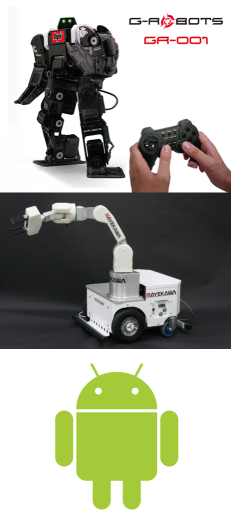
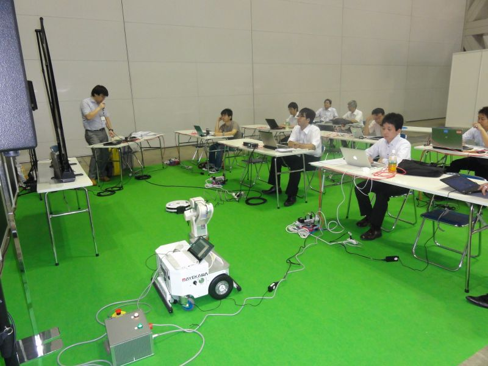
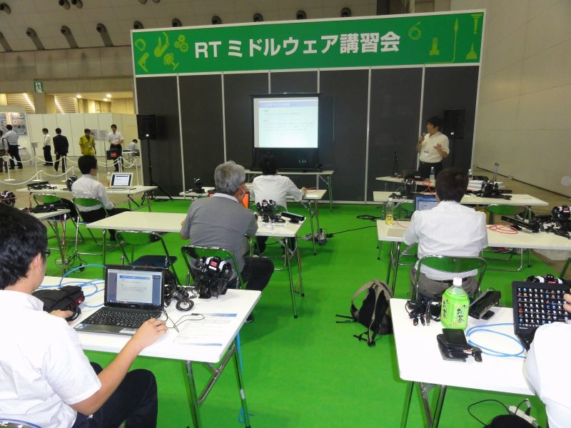
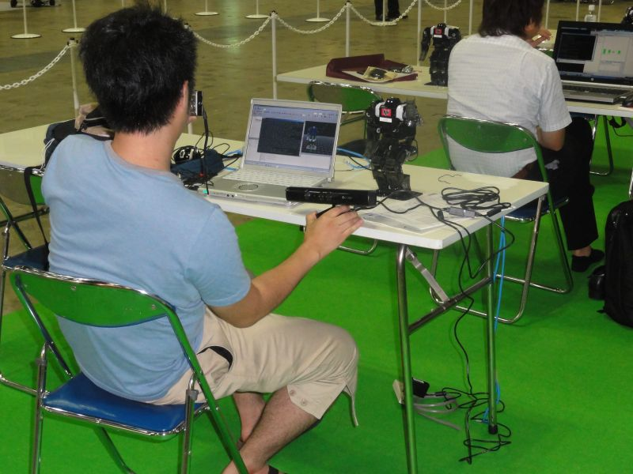
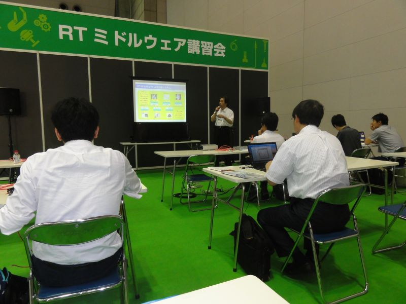
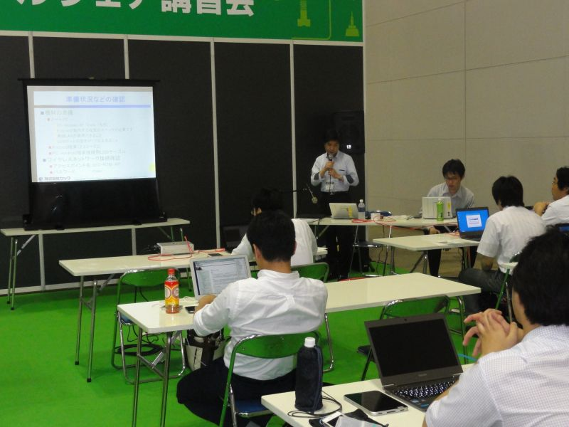
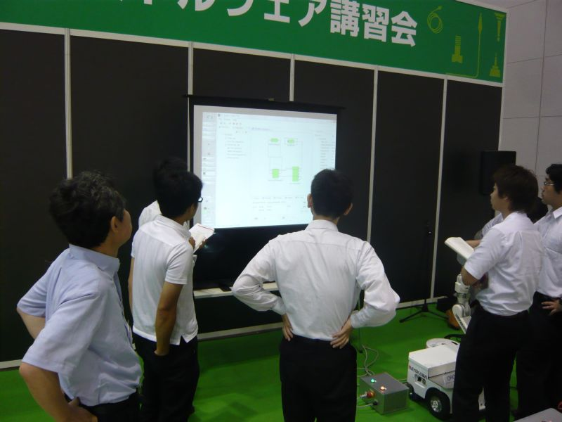
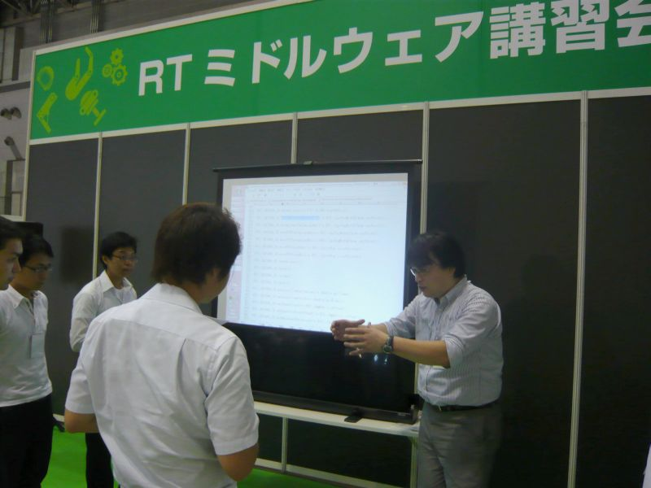

 
<a>No English version available.
</a>

<!-- -------jp page!!------- -->

#contents

<!-- ** 開催案内: ROBOTECH RTミドルウエア講習会 (2012年7月11日～13日)  -->
## ROBOTECH RTミドルウエア講習会 (2012年7月11日～13日) 

<!-- 2012年7月11日(水)～13日(金)、東京ビッグサイトで行われる第3回ROBOTECH次世代ロボット製造技術展 (第23回マイクロマシン／MEMS展共同開催) において、ロボットビジネス推進協議会主催のRTミドルウエア講習会が開催されます。 -->

2012年7月11日(水)～13日(金)、東京ビッグサイトで行われる第3回ROBOTECH次世代ロボット製造技術展 (第23回マイクロマシン／MEMS展共同開催) において、ロボットビジネス推進協議会主催のRTミドルウエア講習会が開催されました。

<!-- 講習会は、ロボットを構成する様々な要素をモジュール化し、容易に組み合わせることができるようにするソフトウエア基盤となるRTミドルウエアについて、参加者の方にRTコンポーネントの作成方法、各種ツールの使い方などをノートPCを使った実習形式により講習いたします。 -->
<!-- 本講習会を開催することで、RTミドルウエア技術に興味を持たれる方の理解を深め、これからのロボットソフトウエア開発者に不可欠なRTミドルウエアに精通する技術者の輪が広がるものと期待しています。 -->

<!-- 皆様の積極的なご参加を頂きますよう、お願い申し上げます。 -->

- **日時**: 平成24年7月11日～13日 (三日間), 10:30～16:00 (受付 10:00-)
- **場所**: 東京ビッグサイト 東ホール 特設会場
  - [交通アクセス](http://www.bigsight.jp/general/access/index.html)
  - 詳細は[ROBOTECH Webページ](http://www.micromachine.jp/)をご覧ください。
- **参加費**: 無料
- **定員**: 15名/1コマ(事前登録), 1日2コマ×3日間
- **参加者数**: 49名 (3日間)
<!-- -''参加登録'': 以下の参加登録フォームからお申し込みください。 -->
<!-- -- 参加登録には当Webページのユーザ登録が必要です。[[ユーザ登録はこちら:http://openrtm.org/openrtm/ja/user/register]] -->
<!-- -- [[メーリングリスト:http://www.openrtm.org/mailman/listinfo/openrtm-users]]への登録をお勧めします。必須ではありませんが、Webでご案内する事前準備についてはメーリングリストにてお知らせします。 -->
<!-- -- なお、登録の際に問題が生じた場合は、 [[こちら（support@openrtm.org）:mailto:support@openrtm.org]] までお問い合わせください。 -->
<!-- -''問合せ先'': -->
<!-- -- ロボットビジネス推進協議会事務局 一般社団法人日本ロボット工業会（担当：畑） -->
<!-- -- 〒105-0011  東京都港区芝公園3-5-8  機械振興会館 -->
<!-- -- TEL：03-3434-2919 -->

<!-- &ref(day1_am.png,50%,margin=5 5 5 5,url=/ja/node/5017); -->
<!-- &ref(day2_am.png,50%,margin=5 5 5 5,url=/ja/node/5025); -->
<!-- &ref(day3_am.png,50%,margin=5 5 5 5,url=/ja/node/5026); -->

<!-- &ref(day1_pm.png,50%,margin=5 5 5 5,url=/ja/node/5029); -->
<!-- &ref(day2_pm.png,50%,margin=5 5 5 5,url=/ja/node/5030); -->
<!-- &ref(day3_pm.png,50%,margin=5 5 5 5,url=/ja/node/5031); -->

## プログラム

<table class="table-alt">
  <tr>
    <td>時間/開催日</td>
    <td>CENTER: 7/11(水)</td>
    <td>CENTER: 7/12（木）</td>
    <td>CENTER: 7/13（金）</td>
  </tr>
  <tr>
    <td>**10:00-10:30**</td>
    <td>></td>
    <td>></td>
    <td>CENTER: 受付</td>
  </tr>
  <tr>
    <td>**10:30-12:30**</td>
    <td>RTミドルウエア   インストールワークショップ１   講師：菅 佑樹 氏  <a href="/ja/node/5017">講習概要</a> <a href="./120711-01.pdf">講演資料</a></td>
    <td>RTミドルウエア   インストールワークショップ２   講師：菅 佑樹 氏  <a href="/ja/node/5025">講習概要</a> <a href="./120712-01.pdf">講演資料</a></td>
    <td>RTミドルウエア   インストールワークショップ３   講師：坂本 武志 氏 (グローバルアシスト)   <a href="/ja/node/5026">講習概要</a> <a href="./120713-01.pdf">講演資料</a></td>
  </tr>
  <tr>
    <td>**12:30-13:30**</td>
    <td>></td>
    <td>></td>
    <td>CENTER: 昼食休憩</td>
  </tr>
  <tr>
    <td>**13:30-14:00**</td>
    <td>></td>
    <td>></td>
    <td>CENTER: 受付</td>
  </tr>
  <tr>
    <td>**14:00-16:00**</td>
    <td>RTミドルウエア   人型ロボットワークショップ（仮題）  講師：原功　氏 （産業技術総合研究所）  <a href="/ja/node/5029">講習概要</a> <a href="./120711-02.pdf">講演資料</a></td>
    <td>RTミドルウエア   リファレンスロボットアーム   OROCHIワークショップ  講師：菅 佑樹 氏   <a href="/ja/node/5030">講習概要</a> <a href="./120712-02.pdf">講演資料</a></td>
    <td>RTミドルウエア   Androidワークショップ（仮題）   講師：(株)セック川口 仁 氏   <a href="/ja/node/5031">講習概要</a> <a href="./120713-02.pdf">講演資料</a></td>
  </tr>
</table>

### 講師

- 菅 佑樹 氏：RTミドルウエアコンテスト　３回優勝
- 原 功 氏：独立行政法人　産業技術総合研究所
- 坂本 武志 氏: 株式会社グローバルアシスト 
- 川口 仁 氏: 株式会社セック 開発本部第四開発部主任

## 内容紹介

### RTミドルウエアインストールワークショップ(その1)

- **講師**：菅 佑樹 氏
- **必要機材**：WindowsXP以上が動作するPC
- **必要ソフトウエア**：OpenRTM-aist-1.1.0, Python2.6, RTC Builder, RTSytemEditor, JDK7
- **概要**： ロボット用の分散コンポーネントミドルウエアであるOpenRTM-aistの概要についてインストール手順から説明します。OpenRTM-aistを使うと何が出来るのか、何が便利になるのか、また実際にどのように開発するのかといった基本的内容から、コンポーネントの基本機能や開発の実際、各種ツールの利用方法など技術的内容について解説します。
  - [講習概要](/ja/node/5017) ([7月12日分](/ja/node/5025):内容は同じです)
  - [講演資料・RTミドルウエア「OppenRTM‐aist」入門](./120711-01.pdf)

### RTミドルウエア人型ロボットワークショップ

- **講師**：原　功 氏　（独）産業技術総合研究所（予定）
- **必要機材**：Windows7以上が動作するPC （USBポートの空きが2つ以上あること、CPUは2.66GHz以上で複数コアがある方が望ましい）
- **必要ソフトウエア**：OpenRTM-aist-1.1.0, RT SytemEditor, VC++2010, Choreonoid-1.1, OpenHRI, KINECT for Windows SDK
- **概要**：多関節型のロボットの動作パターンを生成するためのツールであるChoreonidについて解説し、G-ROBOTを使って幾つかの動作パターンを作成する実習を行います。また、OpenHRIを用いてG-ROBOTに音声コマンドを作成していきます。
  - [講習概要](/ja/node/5029)
  - [講演資料・RTミドルウエア 人型ロボットワークショップ](./120711-02.pdf)

### RTミドルウエア　リファレンスロボットアーム「OROCHI」ワークショップ

- **講師**：菅　佑樹（予定）
- **必要機材**：なし
- **必要ソフトウエア**：なし
- **概要**：RTミドルウエアプロジェクトで開発された、RTミドルウエアの実証実験用標準機（リファレンスハードウエア）である「OROCHI」の使用法について解説します。講演とデモですので、ご用意いただくものはございません。RTミドルウエアに対応したロボットのメリットや使いこなしについて講演いたします。
  - [講習概要](/ja/node/5030)
  - [講演資料・RTミドルウエアリファレンスハードウエア OROCHI](./120712-02.pdf)

### RTミドルウエアインストールワークショップ(その2)
- **講師**：坂本 武志 氏
- **必要機材**：WindowsXP以上が動作するPC
- **必要ソフトウエア**：OpenRTM-aist-1.1.0, Python2.6, RTC Builder, RTSytemEditor, JDK7
- **概要**： ロボット用の分散コンポーネントミドルウエアであるOpenRTM-aistの概要についてインストール手順から説明します。OpenRTM-aistを使うと何が出来るのか、何が便利になるのか、また実際にどのように開発するのかといった基本的内容から、コンポーネントの基本機能や開発の実際、各種ツールの利用方法など技術的内容について解説します。
  - その1とは内容が異なります
  - [講習概要](/ja/node/5026)
  - [講演資料・RTミドルウェアインストールワークショップ](./120713-01.pdf)

### RTミドルウエアAndroidワークショップ

- **講師**：(株)セック（予定）
- **必要機材**：WindowsXP以上が動作するPC （USBポートの空きが1つ以上あること）, Android端末（2.3.3～3.2）, PC-Android端末接続用USBケーブル
- **必要ソフトウエア**：* OpenRTM-aist(C++) 1.0.2-RELEASE;(omni-ORB, RT SytemEditor, サンプルRTCを含む), ** RTM on Android, Androidアプリ開発環境（JDK, Android SDK,2.3.3 Eclipse[Javaの開発環境を含む]）, Android端末接続用USBドライバ（ADBコマンドが使えるようにしておく）
- **概要**：（予定）株式会社セックが開発したAndroid用RTミドルウェアであるRTM on Androidの解説をし、RTM on Androidを利用したサンプルRTC開発を体験してもらい、Android端末へインストールしてPC上で動作するOpenRTM-aist(1.0.2)によるRTCとの相互接続を体験する実習を行います。
また、RTM on Androidを利用したデモ実演により、RTM on Androidの可能性を紹介します。
  - [講習概要](/ja/node/5031)
  - [講演資料](./120713-02.pdf)
  - * 参考URL: http://openrtm.org/openrtm/ja/node/4720
  - **参考URL: http://www.sec.co.jp/robot/download_rtm.html

<!-- &aname(entry); -->

<!-- **講習会申し込みフォーム -->

<!-- 以下の申し込みフォームページから講習会へお申し込みください。 -->
<!-- - 参加登録する前に当Webページのユーザ登録をお願いします。[[ユーザ登録はこちら:http://openrtm.org/openrtm/ja/user/register]] -->
<!-- - 当Webサイトにログイン済みの方は名前の欄にユーザ名が出ますが、氏名に書き換えてください。 -->
<!-- - 受講したい日程をお間違えのないようお願い致します。(申し込みは自分で取消・修正できます) -->
<!-- - 講習会で必要なUSBカメラの有無についてもお申し出ください。 -->
<!-- - フォーム送信後、確認メールをお送りいたします。1日たっても確認メールが届かない場合は、[[こちら（support@openrtm.org）:mailto:support@openrtm.org]] までお問い合わせください。 -->

<!-- &ref(day1_am.png,50%,margin=5 5 5 5,url=/ja/node/5017); -->
<!-- &ref(day2_am.png,50%,margin=5 5 5 5,url=/ja/node/5025); -->
<!-- &ref(day3_am.png,50%,margin=5 5 5 5,url=/ja/node/5026); -->

<!-- &ref(day1_pm.png,50%,margin=5 5 5 5,url=/ja/node/5029); -->
<!-- &ref(day2_pm.png,50%,margin=5 5 5 5,url=/ja/node/5030); -->
<!-- &ref(day3_pm.png,50%,margin=5 5 5 5,url=/ja/node/5031); -->

## 講習会の様子

;

;

;

;

;

;

;
<!-- -------jp page!!------- -->
