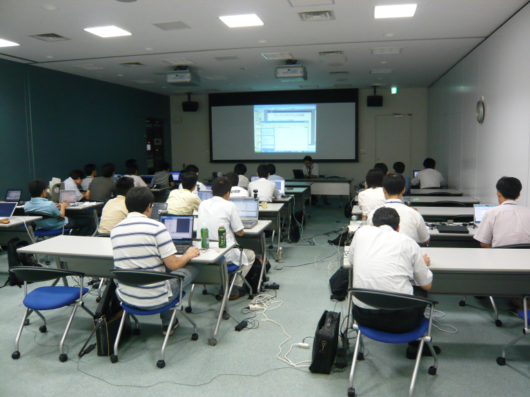
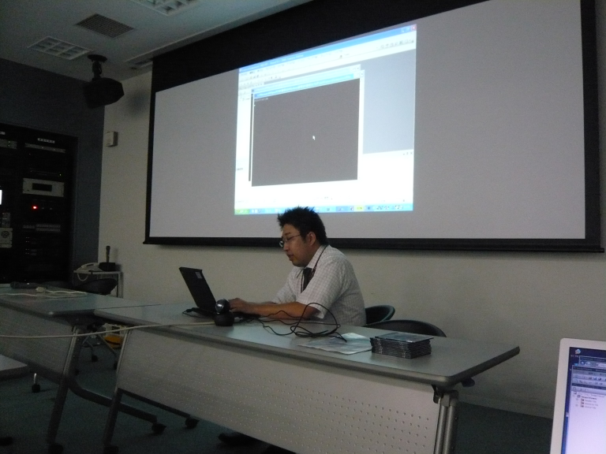
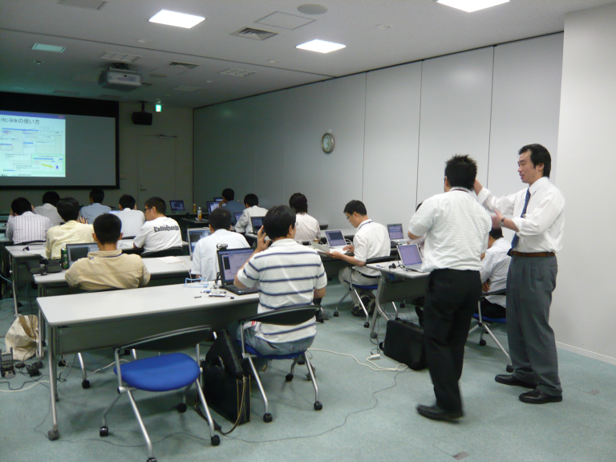
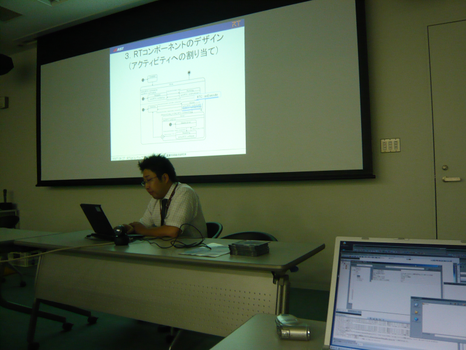

#contents

## 参加人数
29名

## 資料
- [第1部：OMG標準準拠ミドルウェアOpenRTM-aist-0.4.0について(PDF)](./070827-01.pdf)(no_link)
- [第2部：UMLを利用したRTコンポーネントの開発について(PDF)](./070827-02.pdf)(no_link)
  - [PatternWeaver(試用版、Eclipseを含む)]()(no_link)
  - [カメラコンポーネント・モデルファイル](./070827PWModel.zip)(no_link)
- [第3部：コンポーネント開発実習(PDF)](./070827-03.pdf)(no_link)
  - [実習のための準備(USBカメラの動作確認について)](./OpenCV_resume.pdf)(no_link)
  - [OpenCVテスト用ソースコード](./CameraTest.cpp)(no_link)
  - [カメラコンポーネント・ソースコード](./CameraTest.cpp)(no_link)

## 開催案内
Windows版OpenRTM-aist-0.4.0を対象とした講習会を8月27日、産総研つくばサイトで行います。参加ご希望の方は安藤<n-ando@aist.go.jp>までご連絡お願いいたします。

すでにある程度OpenRTM-aistを使ったことがある方を対象としております。
また、今回の講習会ではWindows版OpenRTM-aistを対象としたコンポーネント作成の実習を行う予定ですので、OpenRTM-aistを予めご自分のノートPC上の[[Windowsへインストール>インストール(C++, Windows)]]した上でご参加くださいますようお願いいたします。

- **日時**: 2007年8月27日, 13:30`17:30`
- **場所**: [産総研 本部・交流会議室１室](http://www.aist.go.jp/aist_j/guidemap/tsukuba/center/tsukuba_map_c02.html)
  - 予め情報棟で受付を済ませ名札を受け取ってから会議室にお越しください。
- **産総研へのアクセス**
  - [つくばセンターアクセスマップ](http://www.aist.go.jp/aist_j/guidemap/tsukuba/tsukuba_map_main.html)
  - [つくばエクスプレス+連絡バス](http://www.aist.go.jp/aist_j/guidemap/tsukuba/tsukuba_express.html)
  - [高速バス](http://www.aist.go.jp/aist_j/guidemap/tsukuba/tsukuba_highwaybus.html)
- **定員**： 約25名（ノートPCによる実習)
- **聴講料**：無料
- **申込方法**：産総研 安藤<n-ando@aist.go.jp> までメールにてお申し込みください。
- **受講に必要な物**
  - まず[実習のための準備(USBカメラの動作確認について)](./OpenCV_resume.pdf)(no_link)をよくお読みください。
    - [サンプルプログラム](./CameraTest.cpp)(no_link)
  - ノートPC (WindowsXPがインストールされている物)
    - Windows Vista は使用できません。(Eclipse 3.1が動作しないため)
  - Visual C++ 2005
    - Visual C++ Express Edition をご利用の方は Microsoft Platform SDK も予めインストールしておいてください。
  - OpenRTM-aist-0.4.0-p2 (Windows版)
    - ACE, omniORB が必要です。[こちら>インストール(C++, Windows)]()を参考にインストールしておいてください。 
    - Python2.4が必要です。[こちら>インストール(C++, Windows) ]()を参考にインストールしておいてください。
    - USBカメラコンポーネントが動くことを予めご確認された上でご参加ください。
  - RtcLink/RtcTemplate on Eclipse および PatternWeaver
    - マニュアルに従い予めJavaをインストールしておいてください。 
    - [PatternWeaver(試用版、Eclipseを含む)](http://www.openrtm.org/OpenRTM-aist/download/PatternWeaverCE22iforRTM.EXE)をダウンロードしてください。自己解凍アーカイブになっています。任意のディレクトリ(C:\を推奨)に展開してください。
    - こちらから[[RtcLink:RtcLink・RtcTemplate]]をダウンロードしjp.go.aist.rtm.rtclink_0.4.0.jarをPatternWeaverを解凍したディレクトリ内のpluginディレクトリにそのままコピーしてください。
    - ブラウザによってはjp.go.aist.rtm.rtclink_0.4.0.jarの拡張子がzipになることがありますが、その場合jarに戻した上でコピーしてください。
  - USBカメラ
    - USBカメラコンポーネントで動作する物
  - LANケーブル(1本、2～3m程度の物)
  - テーブルタップ(1本、2～3m程度の物)

- **プログラム**:

<table class="table-alt">
  <tr>
    <th>**13:30-14:00**</th>
    <th>**第1部：OMG標準準拠ミドルウェアOpenRTM-aist-0.4.0について**</th>
  </tr>
  <tr>
    <td></td>
    <td>担当：安藤慶昭 (産総研)</td>
  </tr>
  <tr>
    <td></td>
    <td>概要：RTミドルウエアの 新しいリリース OpenRTM-aist-0.4.0および、7月23日にリリースされたWindows版のOpenRTM-aistの概要について解説します。</td>
  </tr>
  <tr>
    <td>**14:15-15:45**</td>
    <td>**第2部：UMLを利用したRTコンポーネントの開発について**</td>
  </tr>
  <tr>
    <td></td>
    <td>担当：坂本武志(テクノロジックアート)</td>
    <td></td>
  </tr>
  <tr>
    <td></td>
    <td>概要：オブジェクト指向の基本的な考え方，UML2の基本について解説するとともに、UMLモデリングツール PatternWeaver for RT-Middlewareを用いたRTコンポーネントの開発方法について解説します。</td>
  </tr>
  <tr>
    <td>**16:00-17:30**</td>
    <td>**第3部：コンポーネント開発実習**</td>
  </tr>
  <tr>
    <td></td>
    <td>担当：大原賢一(産総研)</td>
    <td></td>
  </tr>
  <tr>
    <td></td>
    <td>概要：OpenRTM-aist-0.4.0でのコンポーネント作成方法を体験していただくために、例題として画像取得コンポーネントと画像処理コンポーネントを参加者の方に作成していただきます。事前に用意した画像表示コンポーネントを組み合わせることで、コンポーネント開発から、コンポーネントの再利用というところまで、一連のOpenRTM-aist-0.4.0の利点を体験していただきます。</td>
    <td></td>
  </tr>
</table>

## 講習会の様子 

 

 

 

