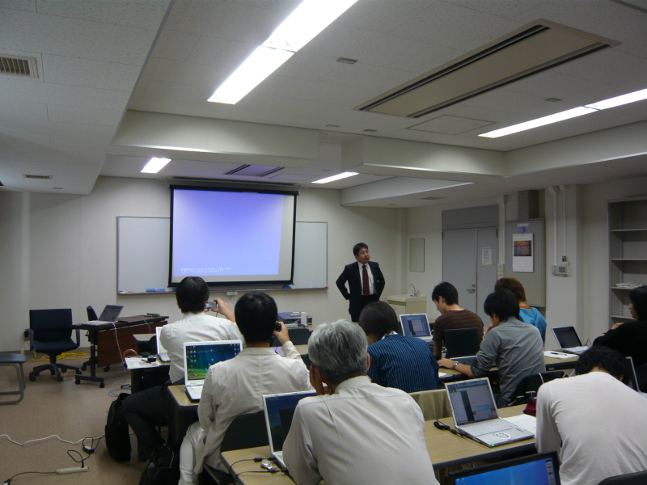
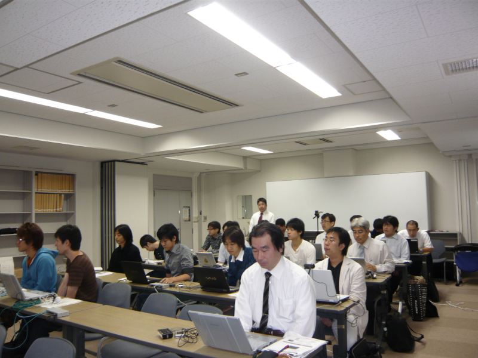
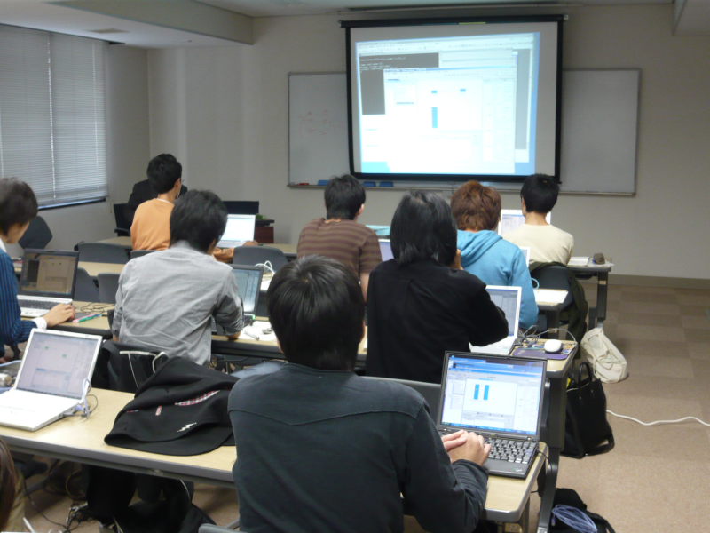

#contents

## 関西地区特別講演会(2009年10月8日)
### 参加人数
21名

### 資料
- [第1部：OMG標準準拠ミドルウェアOpenRTM-aistについて](./091008-01.pdf)(PDF)(no_link)
- [第2部：OpenRTM-aist開発支援ツールの紹介とその利用方法](./091008-02.pdf)(PDF)(no_link)
- [第3部：RTコンポーネント開発実習](./091008-03.pdf)(PDF)(no_link)

### 開催案内 

- **日時**: 2009年10月8日, 10:00`17:00`
- **場所**: [大阪大学　豊中キャンパス](http://www.osaka-u.ac.jp/ja/access/toyonaka.html)
- **プログラム**:
<table class="table-alt">
  <tr>
    <td>**10:00-11:00**</td>
    <td>**第1部：OMG標準準拠ミドルウェアOpenRTM-aistについて**</td>
  </tr>
  <tr>
    <td></td>
    <td>担当：安藤慶昭 (産総研)</td>
  </tr>
  <tr>
    <td></td>
    <td>概要：RTミドルウエア概要、OMG標準化、OpenRTM-aist-1.0および、現在、NEDO次世代ロボット知能化技術開発プロジェクトで開発している共通プラットフォーム「OpenRTプラットフォーム」等について解説します。</td>
    <td></td>
  </tr>
  <tr>
    <td>**11:10-12:10**</td>
    <td>**第2部：OpenRTM-aist開発支援ツールの紹介とその利用法**</td>
  </tr>
  <tr>
    <td></td>
    <td>担当：坂本武志(テクノロジックアート)</td>
    <td></td>
  </tr>
  <tr>
    <td></td>
    <td>概要：RTコンポーネントを作成するツールRTCBuilder、およびRTシステムを設計するツールRTSystemEditerの使い方について解説します。</td>
    <td></td>
  </tr>
  <tr>
    <td>**13:00-16:00**</td>
    <td>**第3部：コンポーネント開発実習**</td>
  </tr>
  <tr>
    <td></td>
    <td>担当：大原賢一 (大阪大学)</td>
  </tr>
  <tr>
    <td></td>
    <td>概要：OpenRTMのインストール方法やテスト方法を解説します。OpenRTM-aistでのコンポーネント作成方法を実際に体験していただきます。RTCBuilderを使用したRTコンポーネントの設計とRTSystemEditerでのRTシステム作成を行います。</td>
    <td></td>
  </tr>
  <tr>
    <td>**16:00-17:30**</td>
    <td>**研究室ツアー**</td>
  </tr>
</table>

## 講習会の様子

