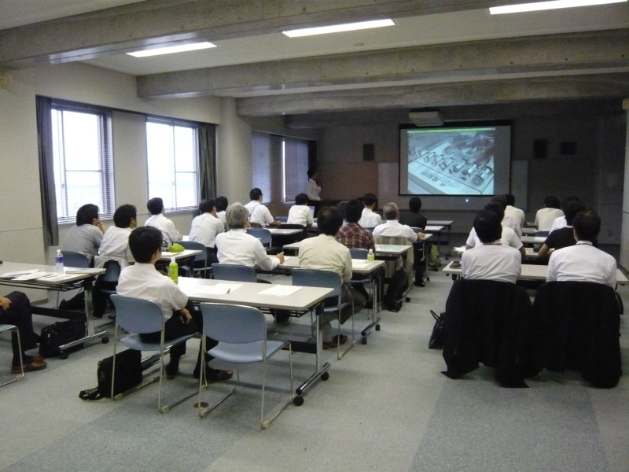

 
<a>No English version available.
</a>

<!-- -------jp page!!------- -->

init
#contents
## 長野県組込みシステムコンソーシアム(2010年7月15日)
- 主催：[財団法人長野県テクノ財団浅間テクノポリス地域センター](http://www.asatech.or.jp/)
  - [組込みシステムコンソーシアム](http://www.asatech.or.jp/laboratory/lab013_1.html)
- 共催：独立行政法人産業技術総合研究所
### 日時、場所
- 日時：平成２２年７月１５日（木）　１４：３０～１７：００（終了後、交流会）
- 場所：長野市若里１－１８－１　長野県工業技術総合センター　４階　第２研修室　

### プログラム 

<table class="table-alt">
  <tr>
    <td>**「ロボットソフトウェア基盤：ＲＴミドルウェア」**</td>
  </tr>
  <tr>
    <td>講師:独立行政法人産業技術総合研究所　知能システム研究部門   統合知能研究グループ 主任研究員　　　　　　安藤 慶昭</td>
  </tr>
  <tr>
    <td>**「次世代ロボット技術の現状と安全・信頼性への取り組み」**</td>
  </tr>
  <tr>
    <td>講師:独立行政法人産業技術総合研究所　知能システム研究部門   ディペンダブルシステム研究グループ 研究員   (兼)株式会社Ｄ３基盤技術　取締役　    　中坊 嘉宏</td>
  </tr>
</table>

### 参加者数
- 30名

### 発表資料
- [テーマ1**「ロボットソフトウェア基盤：ＲＴミドルウェア」**(安藤)](./100715-01.pdf)(no_link)
  - [NEDO次世代ロボット知能化技術開発プロジェクト・知能化モジュール集](./chinou.pdf)(no_link)
  - [RTCカタログ(産総研オープンラボ2009編)](./OpenLab_RTCCatalog2009.pdf)(no_link)
- テーマ2**「次世代ロボット技術の現状と安全・信頼性への取り組み」**(中坊)
<!-- :http://www.openrtm.org/OpenRTM-aist/download/resume/100715/100715-02.pdf]] -->
- 
### 会場の様子

 

<!-- -------jp page!!------- -->
