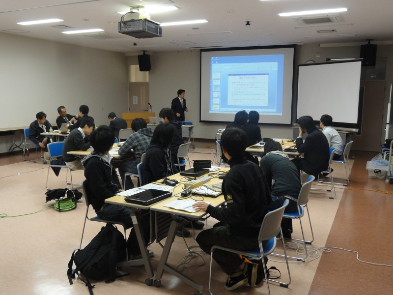
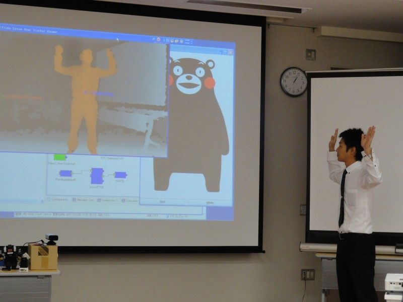
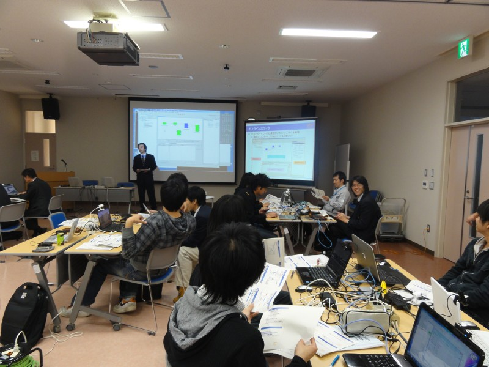
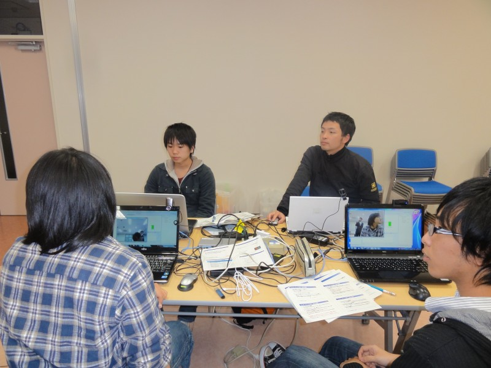
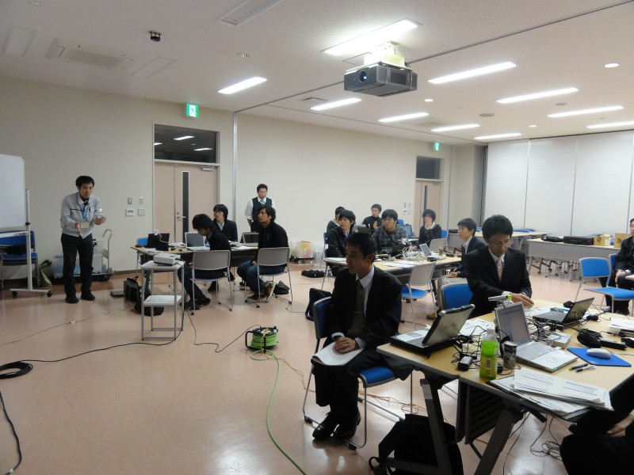

 
<a>No English version available.
</a>

<!-- -------jp page!!------- -->

#contents(4)

## 熊本県産業技術センターRTミドルウエア講習会(2011年11月25日)

熊本県産業技術センターおよび熊本県産業技術振興協会ものづくり専門部会の主催でRTミドルウエア講習会として第7回技術普及講習会「RT ミドルウェアの概要と実習」を開催いたしました。講習会の資料、実習で使用したファイルおよび講習会の様子の写真を掲載しています。

<!-- 熊本県産業技術センターおよび熊本県産業技術振興協会ものづくり専門部会の主催でRTミドルウエア講習会として第7回技術普及講習会「RT ミドルウェアの概要と実習」を開催させていただくことになりました。どなたでも参加できますので奮ってお申し込みください。 -->

- **セミナー名**：熊本県産業技術センター第7回技術普及講習会（組込み技術）「RT ミドルウェアの概要と実習」
  - http://www.kmt-iri.go.jp/news/newinfo_meisai.php?no=99
- **日時**: 平成23年11月25日(金), 11時00分～17時00分
- **場所**: [熊本県産業技術センター](http://www.kmt-iri.go.jp/)　大会議室
  - [交通アクセス](http://www.kmt-iri.go.jp/outline/contact/access.html)
- **主催**: 熊本県産業技術センター、熊本県産業技術振興協会　ものづくり専門部会、（独）産業技術総合研究所
- **定員**：20名程度（先着順で定員になり次第締め切り）
- **参加費**: 無料
- **参加者**: 15名

<!-- -''申し込み'': lecture-20111125@kmt-iri.go.jp 宛てに以下の内容をお送りください。(詳細は[[こちら:http://www.kmt-iri.go.jp/news/newinfo_meisai.php?no=99]]) -->
<!-- 第 7 回技術普及講習会（組込み技術）「RT ミドルウェアの概要と実習」 -->
<!-- 平成 23 年 11 月 25 日（金） -->
<!-- 参 加： 座学のみ参加 ・ 実習のみ参加 ・ 両方参加（実習の見学も含む） -->
<!-- 組織名： -->
<!-- 氏 名： -->
<!-- 電 話： -->
<!-- メールアドレス： -->
<!-- - ''連絡先'': その他お問い合わせは以下の宛先にお願いいたします。 -->
<!-- 〒862-0901 熊本市東町 3-11-38  -->
<!-- 熊本県産業技術センター 技術交流企画室 道野 隆二 -->
<!-- Email: lecture-20111125@kmt-iri.go.jp -->
<!-- 電話 096-368-2101 FAX 096-369-193 -->

### プログラム

<table class="table-alt">
  <tr>
    <td>**11:00-11:30**</td>
    <td>**第1部：RTミドルウェアの概略紹介**</td>
  </tr>
  <tr>
    <td></td>
    <td>担当：安藤慶昭 (産総研)</td>
  </tr>
  <tr>
    <td></td>
    <td>概要：RTミドルウェア、RTコンポーネントの概要を説明します。また、Web上で自分の作品を公開できる仕組みについて紹介します。</td>
    <td></td>
  </tr>
  <tr>
    <td>**11:30-12:00**</td>
    <td>**第2部：RTミドルウェアの概略、導入方法の紹介**</td>
  </tr>
  <tr>
    <td></td>
    <td>担当：栗原眞二 (産総研)</td>
  </tr>
  <tr>
    <td></td>
    <td>概要：サンプルシステムを用いた概略紹介。RTミドルウェアの導入方法について紹介します。</td>
    <td></td>
  </tr>
  <tr>
    <td>**13:00-13:45**</td>
    <td>**第3部：RTコンポーネントの作り方**</td>
  </tr>
  <tr>
    <td></td>
    <td>担当：安藤慶昭 (産総研)</td>
  </tr>
  <tr>
    <td></td>
    <td>概要：RTコンポーネントのテンプレート作成ツールRTCBuilderを用いたコンポーネントの設計と実装方法について説明します。</td>
    <td></td>
  </tr>
  <tr>
    <td>**14:00-15:00**</td>
    <td>**第4部：RTミドルウエアによるシステム構築**</td>
  </tr>
  <tr>
    <td></td>
    <td>担当：坂本武志 氏 (株式会社グローバルアシスト)</td>
  </tr>
  <tr>
    <td></td>
    <td>概要：RTコンポーネントを組み合わせてシステムを構築する巣方法について説明します。</td>
    <td></td>
  </tr>
  <tr>
    <td>**15:00-17:00**</td>
    <td>**第5部：RTコンポーネント作成実習**</td>
  </tr>
  <tr>
    <td></td>
    <td>担当：坂本武志 氏 (株式会社グローバルアシスト)</td>
  </tr>
  <tr>
    <td></td>
    <td>概要：参加者全員で実際にコンポーネントを作成してシステムを構築してみます。</td>
    <td></td>
  </tr>
</table>

### 資料
- [第1部：RTミドルウェアの概略紹介](./111125-01.pdf)
- [第2部：RTミドルウェアの概略、導入方法の紹介](./111125-02.pdf)
- [第3部：RTコンポーネントの作り方](./111125-03.pdf)
- [第4部：RTミドルウエアによるシステム構築](./111125-04.pdf)
- [第5部：RTコンポーネント作成実習](./111125-05.pdf)

## 講習会に参加される方へ
実習形式の講習会に参加される方は、以下の準備をお願いいたします。

&aname(preparation);
### 用意するもの 
実習では以下の準備が必要です。

- ノートPC
- USBカメラ (できれば各自持参して頂きたいですが、こちらでも数個は準備いたしておりますので貸出す事は可能です。;)
- Windowsでも、Linuxでも構いませんが、USBカメラがOpenCVからつかえることが前提です。
  - 動作確認済みのUSBカメラ
    - Logicool Qcam® Orbit AF (ドライバのインストールが必要,WindowsXP,Windows7で動作確認済み)
    - ELECOM UCAM-DLM130HWH (ドライバのインストール不要,WindowsXPでは動作するが、Windows7ではCameraコンポーネントにて画像が取得できない場合がある。)
- あらかじめLANにつながるように設定しておいてください。
- LANケーブル(各テーブルにHUBを配置する予定ですので、長さは1～3ｍくらいのもので構いません。)

### ソフトウエアのインストール 
あらかじめ下記のソフトウエアをインストールしておいてください。
Windows推奨ですが、Linuxでも実習可能です。

- OpenRTM-aist-1.1.0-RC3
  - C++版
- Eclipseおよび、RTSystemEditor, RTCBUilder (7/20以降にこちらのページからダウンロードできるようにします。)
- 開発環境および、パッケージング
  - C++: WindowsではVisual C++ 2008 (Express版でもOK、2005,2010は本講習会ではサポート外です。;)
  - Java Development Kit6(Eclipseを動作させるために必要です。)
  - CMake-2.8.5
  - Doxygen
  - Wix

&aname(install);
### Windowsで必要なソフトウエア

ソフトウエアのインストールなどあまり行ったことが無い方は、[「RTM講習会参加者の事前準備(Windows編)」](http://www.openrtm.org/openrtm/ja/node/1689)にインストール方法をまとめておりますのでそちらを参考にインストールをお願い致します。;

- C++版で必要なもの
  - [Visual C++ Express](http://www.microsoft.com/japan/msdn/vstudio/2008/product/express/)
  - [OpenRTM-aist-1.1.0-RC3(C++版), Win32 VC2008](http://www.openrtm.org/OpenRTM-aist/download/RTMTutorial201107/OpenRTM-aist-1.1.0-RC3_vc9.msi)~
(MD5:7fb431b64d2ac9a27956fba447fd9e8c)

  - [Eclipse3.4.2+RTSE(1.1.0-RC2)+RTCB(1.1.0-RC2)Windows用全部入り](http://www.openrtm.org/OpenRTM-aist/download/RTMTutorial201107/eclipse342_rtmtools110-rc2_win32_ja.zip)~
(MD5:2e6f9fa3e370b6e7ac1f9340d36c7abf)

- パッケージングで必要なもの
  - [cmake-2.8.5-win32-x86.exe](http://www.cmake.org/files/v2.8/cmake-2.8.5-win32-x86.exe)
  - [cmake-2.8-WiX-patch.zip](http://www.openrtm.org/OpenRTM-aist/download/RTMTutorial201107/cmake-2.8-WiX-patch.zip)
  - [doxygen-1.7.3-setup.exe](http://www.openrtm.org/pub/OpenRTM-aist/ROBOMEC2011/doxygen-1.7.3-setup.exe)
  - [Wix3.msi](http://www.openrtm.org/pub/OpenRTM-aist/ROBOMEC2011/Wix3.msi)
  - [Java Development Kit6(Java SE Development Kit 6 Update 27)](http://www.oracle.com/technetwork/java/javasebusiness/downloads/java-archive-downloads-javase6-419409.html)~
※ Java Development Kit6は"jdk-6u27-windows-i586.exe"をダウンロードしてください。

- cmake-2.8-WiX-patchの適用方法
  - cmake-2.8-WiX-patch.zipを解凍
  - cmake-2.8-WiX-patch\bin\cpack.exeをC:\Program Files\CMake 2.8\binにコピー（上書き）する。
  - cmake-2.8-WiX-patch\share\cmake-2.8\Modules\CPack.cmakeをC:\Program Files\CMake 2.8\share\cmake-2.8\Modulesにコピー（上書書き）する。
  - cmake-2.8-WiX-patch\share\cmake-2.8\Modules\CPackWIX.cmakeをC:\Program Files\CMake 2.8\share\cmake-2.8\Modulesにコピー（上書き）する。

- 第4部で使用するファイル
  - [RTC.xml](./RTC.xml)

## 講習会の様子

 

 

 

 

 

<!-- -------jp page!!------- -->
