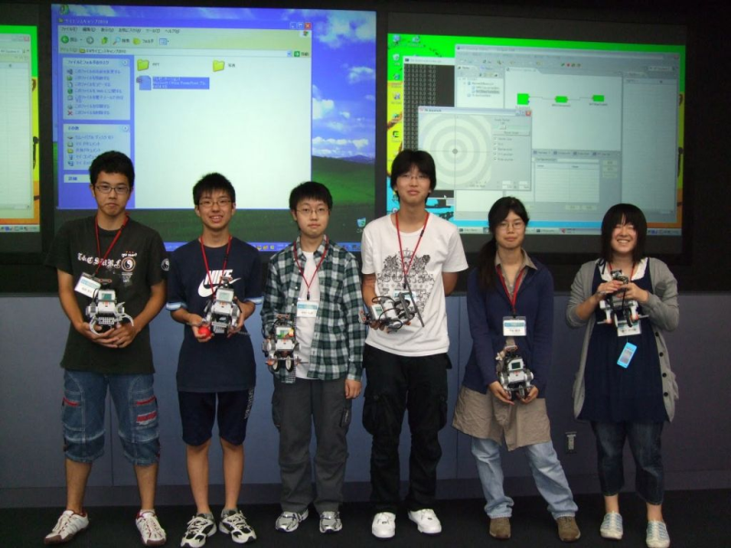
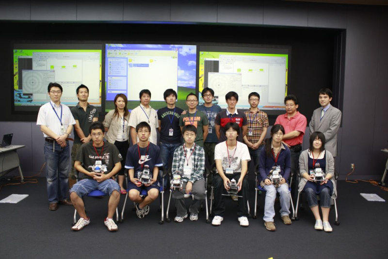
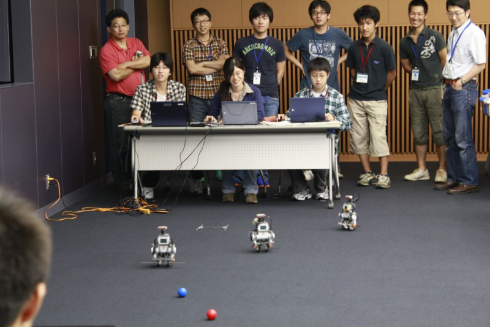
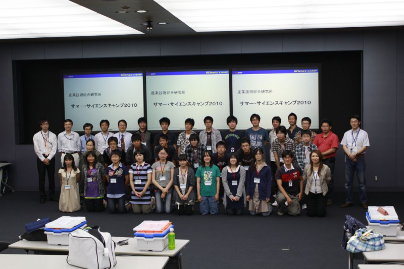

 
<a>No English version available.
</a>

<!-- -------jp page!!------- -->

#contents
#clear

- [サマーサイエンスキャンプWebページ](http://ppd.jsf.or.jp/camp/)

サイエンスキャンプは、文部科学省の科学技術関係人材総合プランの施策「サイエンス・パートナーシップ・プロジェクト」の一環として、最先端の研究施設・実験装置等を有する大学・公的研究機関・民間企業の研究所が、夏休み・冬休み・春休みの３日間高校生を受け入れて、ライフサイエンス、情報通信、環境、ナノテクノロジー・材料、エネルギー、製造技術、（宇宙・海洋等の）フロンティア、地球科学などの科学技術分野において、直接指導を行う実験や実習を主体とした、科学技術体験合宿プログラムです。

## 日時・参加人数 
- **日時**: 2010年8月25日-27日
- **場所**: [産総研 本部・交流会室1](http://www.aist.go.jp/aist_j/guidemap/tsukuba/center/tsukuba_map_c02.html)
- **参加者**:6名

## 資料 
- [講義資料「RTで自分のアイディアを実現しよう](./SC2010_text.pdf)

- [RTコンポーネント作成(NXTway編)](/ja/node/268)

## 参加者全体発表資料 

- [全体発表資料「RTで自分のアイディアを実現する」](./SC2010_presentation.pdf)

## 写真

 

 

 

 

## プログラム

<table class="table-alt">
  <tr>
    <td></td>
    <td>CENTER:**8月25日(初日)**</td>
  </tr>
  <tr>
    <td>14:15-15:00</td>
    <td>コース概要・自己紹介</td>
  </tr>
  <tr>
    <td>15:00-15:15</td>
    <td>休憩</td>
  </tr>
  <tr>
    <td>15:15-16:00</td>
    <td>ロボット工学概論</td>
  </tr>
  <tr>
    <td>16:00-16:15</td>
    <td>休憩</td>
  </tr>
  <tr>
    <td>16:15-17:15</td>
    <td>ロボット制御の基礎・宿題の説明</td>
  </tr>
  <tr>
    <td>17:30-</td>
    <td>サイエンススクエア見学</td>
  </tr>
</table>

 

<table class="table-alt">
  <tr>
    <td>></td>
    <td>CENTER:**8月26日(2日目)**</td>
  </tr>
  <tr>
    <td>09:00-09:45</td>
    <td>ロボットプログラミングの基礎</td>
  </tr>
  <tr>
    <td>09:45-10:00</td>
    <td>休憩</td>
  </tr>
  <tr>
    <td>10:00-12:00</td>
    <td>インストール作業、動作確認</td>
  </tr>
  <tr>
    <td>12:00-13:00</td>
    <td>昼食</td>
  </tr>
  <tr>
    <td>13:00-13:45</td>
    <td>自己紹介2</td>
  </tr>
  <tr>
    <td>13:45-14:00</td>
    <td>休憩</td>
  </tr>
  <tr>
    <td>14:00-17:15</td>
    <td>移動ロボット課題</td>
  </tr>
</table>

 

<table class="table-alt">
  <tr>
    <td>></td>
    <td>CENTER:**8月27日(3日目)**</td>
  </tr>
  <tr>
    <td>09:00-09:50</td>
    <td>グループ発表準備（１）</td>
  </tr>
  <tr>
    <td>09:45-10:00</td>
    <td>休憩</td>
  </tr>
  <tr>
    <td>10:00-11:15</td>
    <td>グループ発表準備（２）</td>
  </tr>
  <tr>
    <td>11:15-11:30</td>
    <td>休憩</td>
  </tr>
  <tr>
    <td>11:30-12:00</td>
    <td>感想とコメント</td>
  </tr>
  <tr>
    <td>12:00-13:00</td>
    <td>昼食</td>
  </tr>
  <tr>
    <td>13:00-15:00</td>
    <td>成果発表会・閉講式</td>
  </tr>
</table>

## インストールするソフトウエア
- プログラミング言語Pythonのインタプリタ(msiを実行してインストール)
  - [Python2.5](http://www.python.org/ftp/python/2.5.1/python-2.5.1.msi)
- RTミドルウエアのPython版(msiを実行してインストール)
  - [OpenRTM-aist-Python, Win32](http://www.openrtm.org/pub/Windows/OpenRTM-aist/python/OpenRTM-aist-Python-1.0.0.msi)
- RTミドルウエアC++版を使うために必要なライブラリ(Microsoftのサイトに飛ぶのでダウンロードボタンを押してインストール)
  - [VC2008DLL](http://www.microsoft.com/japan/msdn/vstudio/2008/product/express/offline.aspx)
- RTミドルウエアのC++版(msiを実行してインストール)
  - [OpenRTM-aist-C++](http://www.openrtm.org/pub/Windows/OpenRTM-aist/cxx/OpenRTM-aist-1.0.0-RELEASE_vc9_100212.msi)

- TkJoyStickからの入力データをBlueToothを介してNXTにセットするためのコンポーネント
  - [NXTBlueTooth.zip](http://www.openrtm.org/OpenRTM-aist/download/SC2010/NXTBlueTooth.zip)

- TkJoyStickからの出力を車輪速度に変換しOutPortから出力するコンポーネント(宿題の回答を埋め込んだプログラム)
  - [MRCConvertor.zip](http://www.openrtm.org/OpenRTM-aist/download/SC2010/MRCConvertor.zip)

これ等をインストールした後、以下のドキュメントに従ってロボットを動かします。
- [RTコンポーネント作成(NXTway編)](/ja/node/268)

<!-- -------jp page!!------- -->
