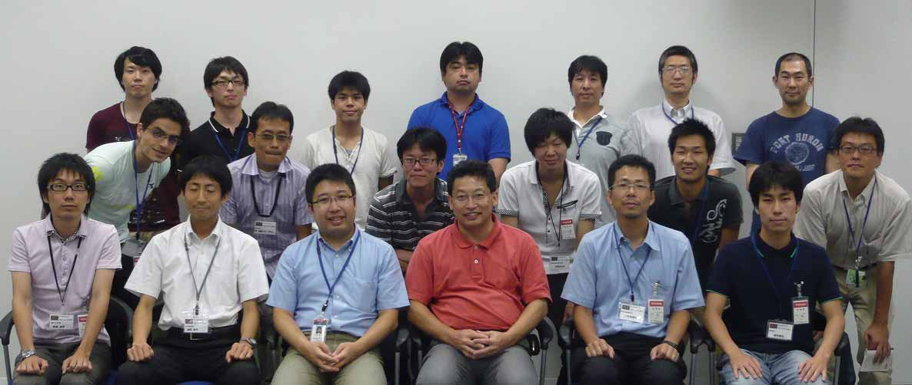

<br>
<a>No English version available.
</a>

<!-- -------jp page!!------- -->

#contents

## 開催報告：RTミドルウエアサマーキャンプ2011

大阪大学の大原先生のご尽力と多くの特別講師やサポートスタッフのご支援のおかげで、個性的な9名の参加者と共に、初めての試みであるサマーキャンプを作り上げて行くことが出来ました。皆さまに御礼申し上げます。
<div align="center"></div>

### 講義資料（抜粋）：
<!-- - [[RTミドルウエア概要:http://www.openrtm.org/openrtm/sites/default/files/3850/RTMSC2011OpenRTM-aist-1.1について」(1日目).pdf]]（産総研　栗原眞二 氏) -->
- <a href="RTM_SC2011OpenRTM-aist-1.1について_1day.pdf">RTM_SC2011OpenRTM-aist-1.1について_1day.pdf</a>（産総研　栗原眞二 氏)
- [RTCBuilderを用いたサンプルコンポーネントの作成およびRTSystemEditorを用いたコンポーネントの動作確認](./SC2011_sakamoto_pub.pdf)（グローバルアシスト　坂本武志 氏）
- <a href="SC2011_nakamoto_pub.pdf">SC2011_nakamoto_pub.pdf</a>;（セック　中本啓之 氏）
- [OpenRTM-aist Webページの活用法](./RTサマーキャンプ_OpenRTM-asitWebページ活用.pdf)（富士ソフト　片見剛人 氏）
- OpenHRIの活かし方（産総研　松坂要佐 氏）<br>
[ [チュートリアル](http://openhri.net/doc/tutorial/index-ja.html), [旗上げサンプル](http://openhri.net/doc/examples/flaggame/index-ja.html) ]
- [RTMサマーキャンプの進め方.pdf](./RTMサマーキャンプの進め方.pdf)（大阪大学　大原賢一 氏）
- [コンポーネント作成演習](./RTMSC2011_コンポーネント作成演習.pdf)（産総研　栗原眞二 氏)
- 双腕ロボットへの適用例とハードウェア設計支援ツール（ゼネラルロボティックス　斉藤元 氏）
- [移動ロボットの開発経験](./SC2011_tanaka_pub.pdf)（産総研　田中秀幸 氏）
- RTShellの使い方　（産総研　ジェフ ビグズ　氏）
- [Choreonoid](./SC2011_nakaoka_pub.pdf)（産総研　中岡慎一郎 氏）

### 参加者の声：
- RTMのユーザ・開発者の方々と交流がしたく参加させて頂きました．
公式HPは整理が進んでおり多くのことはそれを調べることで解決できると思います．
それでも分からないことやMLでは聞きづらいこともあるのではないでしょうか．
私にはありました．今回のキャンプによってそれらの問題の多くが解決しました．
他の参加者との交流，研究見学などは私に大変良い刺激を与えてくれました．
素晴らしいキャンプだったので来年も是非開いて頂きたいです．
RTMを触ったことのある人やちょっとでも興味のある人は参加して絶対損はありません．
<br>（新井康允　信州大学修士1年）
- ＲＴミドルウェアに触ったことがなかったのですが５日間で使えるようになりま
した。ありがとうございました。<br>（小森谷大介　群馬高専５年）
- RTミドルウエアを初めて使用して，本当にロボットシステムが作れるのかが心配でした．しかし，先生の皆様，講師の皆様方にサポートをもらい，なんとかロボットシステムの作成することができ，良い経験ができました．
<br> （松中翔平 大阪工業大学 修士1年）

## 開催案内: RTミドルウエアサマーキャンプ2011

- **日時**: 2011年8月29日(月)～9月2日（金）
- **場所**: [産業技術総合研究所　つくばセンター中央第二](http://www.aist.go.jp/aist_j/guidemap/tsukuba/center/tsukuba_map_c.html)　　本部・情報棟１階　交流会議室
  - 産総研つくばセンターまでの交通案内 : [交通アクセス](http://www.aist.go.jp/aist_j/guidemap/tsukuba/tsukuba_map_main.html)
  - つくば中央　つくばエクスプレス乗り換え案内 : [AISTのホームページ](http://www.aist.go.jp/aist_j/guidemap/tsukuba/tsukuba_c_express.html)
- **主催（共同開催）**: 
  - [産業技術総合研究所　知能システム研究部門](http://www.aist.go.jp/)
  - [計測自動制御学会SI部門　RTシステムインテグレーション部会](http://www.si-sice.org/si_div/)

- **聴講料**: 無料　ただし、宿泊費や食事代等の実費は参加者負担~
（宿泊費は　2600円／泊の産総研ゲストハウス（さくら館）ファミリールームを宿泊者で等分してお支払いただきます．）
- **定員**: 最大10人程度（８月１５日現在：まだ募集しております．）
- **参加登録**:
  1. メールでの申し込みをお願いいたします。
    - ＲＴミドルウェアサマーキャンプ　幹事　大阪大学　大原賢一 (k-ohara(at)ieee.org) 宛てに下記内容をお送りください。~
&color(red){なお，参加予定人数に達するか，8月19日正午を持って締め切らせて
いただきます．};
```
 ・氏名
 ・所属
 ・メールアドレス
 ・電話番号:
 ・プログラミングやＲＴＭに関する知識・経験について：
 ・サマーキャンプで開発したいシステムの概要（課題持ち込み型の場合）
   または要望（課題は実施側にお任せの場合）：
```

- **実施内容**: <br>
パイオニアなどの移動ロボット，USBカメラ，レーザレンジファインダなど，
実際のハードウェアを対象としたRTコンポーネントを用いるとともに，産業技術
総合研究所で開発されたコンポーネントを始め，公開されているコンポーネント
についても積極的な利用を推奨する．
これらのコンポーネントの組み合わせ，および自身での足りない部分のコンポーネントの実装を通じて技術習得やアイディア創造を目指す．
最終日には成果発表会を行う．合宿により、全国から集まった
参加者同士の交流によるネットワーク作りにも期待する．~
RTミドルウエアコンテスト参加を目指して開発案件を抱えている個人・グルー
プの（使う機材を持参しての）参加も歓迎．

- **スケジュール（案）**: （下記スケジュールは現状の予定であり，参加者のRTミドルウエアの習熟度や要望に応じて，臨機応変に変更する可能性があります。）

<table class="table-alt">
  <tr>
    <td>**１日目（８月２９日）**</td>
    <td></td>
  </tr>
  <tr>
    <td>**13:00-13:15**</td>
    <td>**実行委員長挨拶と本講習会の趣旨，スケジュールの説明　（産総研　神徳徹雄 氏）**</td>
  </tr>
  <tr>
    <td>**13:15-14:05**</td>
    <td>**参加者自己紹介と本講習会でのモチベーションについて（一人10分くらい）**</td>
  </tr>
  <tr>
    <td>**14:05-14:20**</td>
    <td>**休憩**</td>
  </tr>
  <tr>
    <td>**14:20-15:30**</td>
    <td>**OpenRTM-aist-1.1について（産総研　栗原眞二 氏)**</td>
  </tr>
  <tr>
    <td>**15:30-15:40**</td>
    <td>**休憩**</td>
  </tr>
  <tr>
    <td>**15:40-17:00**</td>
    <td>**特別講義：「RTCBuilderを用いたサンプルコンポーネントの作成および<br>RTSystemEditorを用いたコンポーネントの動作確認」<br>（グローバルアシスト　坂本武志 氏）**</td>
  </tr>
  <tr>
    <td>**17:00-17:15**</td>
    <td>**さくら館部屋割りと産総研周囲の食事処などの紹介（産総研　尾形仁子 氏）**</td>
  </tr>
  <tr>
    <td></td>
  </tr>
  <tr>
    <td>**２日目（８月３０日）**</td>
    <td></td>
  </tr>
  <tr>
    <td>**10:00-11:30**</td>
    <td>**特別講義：「システム構成例とデバッガ」（セック　中本啓之 氏）**</td>
  </tr>
  <tr>
    <td>**11:30-12:15**</td>
    <td>**特別講義：「OpenRTM-aist Webページの活用法」（富士ソフト　片見剛人 氏）**</td>
  </tr>
  <tr>
    <td>**12:15-13:00**</td>
    <td>**お昼休み**</td>
  </tr>
  <tr>
    <td>**13:00-14:00**</td>
    <td>**特別講義：「OpenHRIの活かし方」（産総研　松坂要佐 氏）**</td>
  </tr>
  <tr>
    <td>**14:20-14:40**</td>
    <td>**実習について（大阪大学　大原賢一 氏）**</td>
  </tr>
  <tr>
    <td>**14:40-17:00**</td>
    <td>**実習、コンポーネント作成演習（産総研　栗原眞二 氏)**</td>
  </tr>
  <tr>
    <td></td>
  </tr>
  <tr>
    <td>**３日目（８月３１日）**</td>
    <td></td>
  </tr>
  <tr>
    <td>**8:30-10:00**</td>
    <td>**実習**</td>
  </tr>
  <tr>
    <td>**10:00-11:00**</td>
    <td>**特別講義：「双腕ロボットへの適用例とハードウェア設計支援ツール」（ゼネラルロボティックス　斉藤元 氏）**</td>
  </tr>
  <tr>
    <td>**11:00-12:15**</td>
    <td>**実習**</td>
  </tr>
  <tr>
    <td>**12:15-13:00**</td>
    <td>**お昼休み**</td>
  </tr>
  <tr>
    <td>**13:00-16:00**</td>
    <td>**実習**</td>
  </tr>
  <tr>
    <td>**16:00-18:00**</td>
    <td>**見学会**</td>
  </tr>
  <tr>
    <td>**18:00-**</td>
    <td>**懇親会**</td>
  </tr>
  <tr>
    <td></td>
  </tr>
  <tr>
    <td>**4日目（9月１日）**</td>
    <td></td>
  </tr>
  <tr>
    <td>**8:30-10:00**</td>
    <td>実習</td>
  </tr>
  <tr>
    <td>**10:00-11:00**</td>
    <td>特別講義：「移動ロボットの開発経験」（産総研　田中秀幸 氏）</td>
  </tr>
  <tr>
    <td>**11:00-12:00**</td>
    <td>特別講義：「RTShellの活用法」（産総研　ジェフ ビグズ 氏) </td>
  </tr>
  <tr>
    <td>**12:00-13:00**</td>
    <td>お昼休み</td>
  </tr>
  <tr>
    <td>**13:00-17:00**</td>
    <td>実習</td>
  </tr>
  <tr>
    <td>**５日目（９月２日）**</td>
    <td></td>
  </tr>
  <tr>
    <td>**8:30-10:00**</td>
    <td>実習</td>
  </tr>
  <tr>
    <td>**10:00-11:00**</td>
    <td>特別講義：「Choreonoid」（産総研　中岡慎一郎 氏）</td>
  </tr>
  <tr>
    <td>**11:00-12:15**</td>
    <td>実習</td>
  </tr>
  <tr>
    <td>**12:15-13:00**</td>
    <td>お昼休み</td>
  </tr>
  <tr>
    <td>**13:00-15:00**</td>
    <td>実習</td>
  </tr>
  <tr>
    <td>**15:00-17:45**</td>
    <td>開発成果プレゼン</td>
  </tr>
  <tr>
    <td>**17:45-18:00**</td>
    <td>実行委員長より終了挨拶</td>
  </tr>
</table>

## 講習会に参加される方へ
実習形式の講習会に参加される方は、以下の準備をお願いいたします。

&aname(preparation);
### 用意するもの 
実習では以下の準備が必要です。

- ノートPC
- あらかじめLANにつながるように設定しておいてください。
- LANケーブル(各テーブルにHUBを配置する予定ですので、長さは1～3ｍくらいのもので構いません。)

### 注意事項
<span style="color:red;">講習会に適さないソフトウェアの利用は固く禁止いたします。</span>;

### その他

- [特別講演１で使用するファイル(RTC.xml)](http://www.openrtm.org/OpenRTM-aist/download/RTMSC2011/RTC.xml)
- [コンポーネント作成演習で使用するサンプルコンポーネント(USBCamera.zip)](./USBCamera.zip)
- [Pioneer 3DX制御のための参照コンポーネント](http://210.154.184.16/pukiwiki/?ID_363)
- [OpenCV_RTC.zip(ソース)](http://www.openrtm.org/openrtm/sites/default/files/158/OpenCVRTC-1.0.0.zip)
- [受付システムについて](http://210.154.184.16/pukiwiki/?SYS_001_V100)
<!-- -------jp page!!------- -->
