

#contents

## 開催報告

名城大学の大原先生のご尽力と多くの特別講師やサポートスタッフのご支援のおかげで、個性的な17名の参加者と共に、今年も、サマーキャンプを作り上げて行くことが出来ました。皆さまに御礼申し上げます。
この合宿研修の成果を、RTミドルウエアコンテストで発表いただけることを、期待しております。

<a href="2014camp-00.png">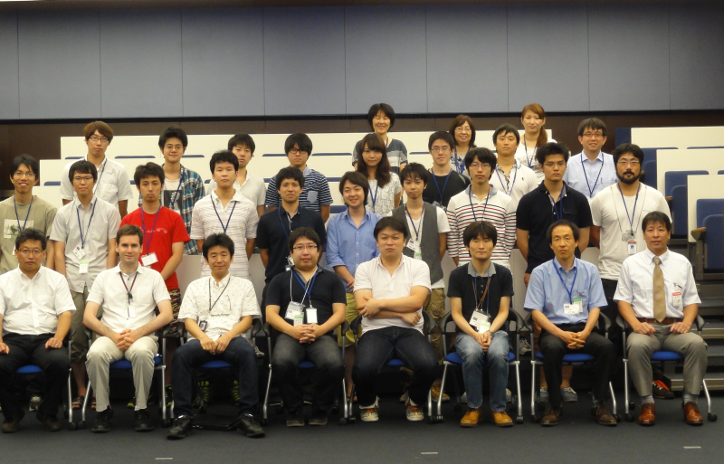</a>

<!-- **開催のご案内 -->

<!-- 今年で4回目となりました、RTミドルウエアキャンプを8月4日から8月8日の5日間、茨城県つくば市の(独)産業技術総合研究所において開催いたします。 -->
<!-- RTミドルウエアやロボット開発に精通する講師陣のもとで、RTミドルウエアを用いた様々なロボットシステム開発を体験する機会を5日間にわたり提供します。RTミドルウエアを用いたプログラミングの方法や、実践的なロボットシステムへの応用、RTミドルウエアコンテストでの必勝法等、様々な講義を予定しています。宿泊施設として産総研のさくら館(要実費)を提供することを予定しており、一緒に参加した仲間とともに密度の濃い開発経験を通して、より実践的なロボットシステム構築方法を身に付けることができます。 -->

<!-- ''参加資格は、少なくとも1回以上RTミドルウエア講習会を受講した経験があるか、同等以上のプログラミングスキルを身に着けていることを条件とします。また、参加者は12月に行われるRTミドルウエアコンテストへの参加が期待されています。'' -->

## 開催要旨

本サマーキャンプでは、RTミドルウエアやロボット開発に精通する講師陣のもとで、RTミドルウエアを用いた様々なロボットシステム開発を体験する機会を提供します。この企画により、一緒に参加した仲間とともに密度の濃い開発経験を通して、より実践的なロボットシステム構築方法を身に付けることを目的としています。

### 共同開催
- 産業技術総合研究所　知能システム研究部門
  - 計測自動制御学会ＳＩ部門　ＲＴシステムインテグレーション部会
  - ロボットビジネス推進協議会

<!-- *** 協力企業 -->
<!-- #ref(rt.png) -->
<!-- #ref(ga.png) -->
<!-- #ref(sec.png) -->

### 日時・場所
- 2014年8月4日（月）～8月8日（金）
- 産業技術総合研究所　つくばセンター中央第二　
本部・情報棟１階　[ネットワーク会議室](http://www.aist.go.jp/aist_j/guidemap/tsukuba/center/tsukuba_map_c.html)
<!-- -- [[google map:https://maps.google.com/maps/ms?msid=202092058111064603321.0004e2699244f546ec525&msa=0&ll=36.05949,140.134263&spn=0.009098,0.011297]] -->
<!-- - アクセス -->
<!-- -- 東京駅から並木2丁目:[[高速バス時刻表:http://www.kantetsu.co.jp/bus/highway/center/timetable.pdf]] -->
<!-- --- 東京駅八重洲南口高速バス乗り場からつくばセンター・筑波大学行きに乗り、並木2丁目停留所にて下車してください。 -->
<!-- --- 東京駅から1時間：下りは渋滞が少なくほぼ時間通り到着します。 -->
<!-- -- 秋葉原駅からTXつくば駅経由:[[産総研連絡バス時刻表:http://www.aist.go.jp/aist_j/guidemap/pdf/tsukuba_c_iki.pdf]] -->
<!-- --- つくばエクスプレス秋葉原駅から終点つくば駅(快速：45分)まで乗車し、つくば駅から産総研連絡バスに乗車、つくば中央第1にて下車してください。 -->
<!-- --- 連絡バス所用時間：20分から25分程度。 -->
<!-- -- 常磐線荒川沖駅から路線バス:[[荒川沖バス時刻表:http://www.kantetsu.co.jp/bus/rosen/timetable/timetable/tc/08.pdf]] -->
<!-- --- 常磐線荒川沖駅にて降りていただき、関東鉄道バス西４乗り場筑波大学中央・筑波大学病院行きのバスに乗車し、並木2丁目で下車してください。 -->
<!-- --- バスの所要時間は15分程度です。 -->
- 参加者: 17名（+講師・スタッフ27名）

### 参加資格
- RTミドルウェア講習会に参加したことがある，もしくは同等程度の経験を有していること．

または，

- 下記のサマーキャンプ受講希望者向けの講習会に参加する意思があること

  - [Robomec2014講習会](http://www.openrtm.org/openrtm/ja/node/5586)
  - [RTミドルウェア強化月間(第1弾)：名城大学・RTミドルウェア講習会(2014年6月24日)](../meijo2014)
  - [RTミドルウェア強化月間(第2弾)：早稲田大学・RTミドルウェア講習会(2014年6月25日)](../waseda2014)
  - [RTミドルウェア強化月間(第3弾)：中央大学・RTミドルウェア講習会(2014年6月26日)](../chuo2014)
  - [RTミドルウェア強化月間(第4弾)：大阪大学・RTミドルウェア講習会(2014年6月27日)](../osaka2014)

<!-- *** 参加人数 -->
<!-- - 最大10名程度（グループでの参加を推奨） -->
<!-- - スタッフ側のボランティアも随時募集 -->

### 参加費
無料（ただし，宿泊費や食事代は参加者の自己負担．産総研の宿泊施設を安価で提供）

<!-- *** 実施概要 -->
<!-- 参加者各自がそれぞれの目的意識を持ち、その目的に向けた開発の初期工程の支援を本サマーキャンプの目的とする。~ -->
<!-- 本サマーキャンプで利用するRTコンポーネントは、NEDO知能化プロジェクトの成果，過去のRTミドルウェアコンテストの作品，さらには有志により開発されたRTコンポーネントを再利用することを基本とし，適宜各自の目的にあったRTコンポーネントの開発を促すことで，RTコンポーネントの開発，およびRTミドルウェアを用いたロボットシステム開発を行う．~ -->
<!-- 開発だけでなく，RTミドルウェアに見識のある講師を依頼し，RTミドルウェアによるロボットシステムの開発方法，RTミドルウェアでの開発を支援するツール群の利用方法からRTミドルウェアを用いたシステム事例の紹介まで行い，幅広くRTミドルウェアについての知識提供の機会を設ける。サマーキャンプ最終日には成果発表会を行う．~ -->

（参考）
- [サマーキャンプ2011](../summercamp2011)
- [サマーキャンプ2012](../summercamp2012)
- [サマーキャンプ2013](../summercamp2013)

## サマーキャンプ参加者向けSysML講習会
今年度から，サマーキャンプの前に，SysMLモデリング講習会を実施しました．~
SysMLのモデリングはシステムを俯瞰しながらシステム全体を記述していくのに適したモデリング言語であり，~
RTコンポーネントの再利用性を高めていく上で有用なツールとなっています．~
<!-- 参加者の皆さんの意思疎通のツール，さらには研究室に戻ってからも活躍してくれるツールになるかと思いますので，参加者の方全員に参加をお願いする予定です．~ -->

<!-- 日時：7月中旬（決定次第参加者にアナウンス） -->

## プログラム
<table class="table-alt">
  <tr>
    <td>8月4日(月)</td>
    <td>第1日目</td>
    <td>-</td>
  </tr>
  <tr>
    <td>12:30 - 13:00</td>
    <td>受付</td>
    <td>-</td>
  </tr>
  <tr>
    <td>13:00 - 13:10</td>
    <td>開催の挨拶</td>
    <td>中坊 嘉宏 (産業技術総合研究所)</td>
  </tr>
  <tr>
    <td>13:10 - 14:40</td>
    <td>自己紹介・決意表明</td>
    <td>-</td>
  </tr>
  <tr>
    <td>14:40 - 15:00</td>
    <td>RTミドルウェアサマーキャンプガイダンス</td>
    <td>大原 賢一 (名城大学)</td>
  </tr>
  <tr>
    <td>15:00 - 15:20</td>
    <td>RTミドルウェアコンテスト必勝法  **講義資料**:<a href="./RTミドルウエアコンテスト必勝法2014_submit.pdf">RTミドルウエアコンテスト必勝法2014_submit.pdf</a></td>
    <td>佐々木 毅 (芝浦工業大学)</td>
  </tr>
  <tr>
    <td>15:20 - 16:20</td>
    <td>SysMLを用いたシステムモデルの構築実習</td>
    <td>坂本 武志 (グローバルアシスト)</td>
  </tr>
  <tr>
    <td>16:20 - 17:50</td>
    <td>産総研見学会</td>
    <td>中坊 嘉宏 (産業技術総合研究所)</td>
  </tr>
  <tr>
    <td>18:00 -</td>
    <td>懇親会</td>
    <td>-</td>
  </tr>
</table>

<table class="table-alt">
  <tr>
    <td>8月5日(火)</td>
    <td>第2日目</td>
    <td>-</td>
  </tr>
  <tr>
    <td>09:00 - 10:00</td>
    <td>実習</td>
    <td>-</td>
  </tr>
  <tr>
    <td>10:00 - 10:20</td>
    <td>移動ロボット等、利用可能なRTC群の事例紹介  **講義資料**:<a href="./RTCの紹介.pdf">有用なRTCの紹介.pdf</a></td>
    <td>菅 佑樹 (SUGAR SWEET ROBOTICS)</td>
  </tr>
  <tr>
    <td>10:20 - 10:40</td>
    <td>カメラ系コンポーネント群の紹介  **講義資料**:<a href="./CameraCommonInterface.pdf">CameraCommonInterface.pdf</a></td>
    <td>大原 賢一 (名城大学)</td>
  </tr>
  <tr>
    <td>10:40 - 11:00</td>
    <td>Choreonoid上でのRTC開発方法</td>
    <td>中岡 慎一郎 (産業技術総合研究所)</td>
  </tr>
  <tr>
    <td>11:00 - 11:20</td>
    <td>RTM on Androidの紹介  **講義資料**:<a href="./RTMSummerCamp2014_SEC_20140805.pdf">RTMSummerCamp2014_SEC_20140805.pdf</a></td>
    <td>中本 啓之 (セック)</td>
  </tr>
  <tr>
    <td>11:20 - 11:40</td>
    <td>ロボカップに置けるRTミドルウェアの運用事例紹介   **講義資料**:<a href="./20140805RTMCamp2014.pdf">20140805RTMCamp2014.pdf</a></td>
    <td>岡田 浩之 (玉川大学)</td>
  </tr>
  <tr>
    <td>13:00 - 13:40</td>
    <td>ChoreonoidとOpenHRIを用いたシステム構築事例   **講義資料**:<a href="./ChoreonoidとOpenHRIを用いたシステム構築事例.pdf">ChoreonoidとOpenHRIを用いたシステム構築事例.pdf</a></td>
    <td>原 功 (産業技術総合研究所)</td>
  </tr>
  <tr>
    <td>13:40 - 16:30</td>
    <td>モデリング実習</td>
    <td>-</td>
  </tr>
  <tr>
    <td>16:30 - 17:00</td>
    <td>モデリング結果発表・講評</td>
    <td>-</td>
  </tr>
</table>

<table class="table-alt">
  <tr>
    <td>8月6日(水)</td>
    <td>第3日目</td>
    <td>-</td>
  </tr>
  <tr>
    <td>09:00 - 10:00</td>
    <td>実習</td>
    <td>-</td>
  </tr>
  <tr>
    <td>10:00 - 10:20</td>
    <td>ROSとRTMの相互運用   **講義資料**:<a href="./20140806-okada-openrtm.pdf">20140806-okada-openrtm.pdf</a></td>
    <td>岡田 慧 (東京大学)</td>
  </tr>
  <tr>
    <td>10:20 - 12:00</td>
    <td>実習</td>
    <td>-</td>
  </tr>
  <tr>
    <td>12:00 - 13:00</td>
    <td>昼食</td>
    <td>-</td>
  </tr>
  <tr>
    <td>13:00 - 14:00</td>
    <td>rtshell入門  **講義資料**:<a href="./rtshell.pdf">rtshell.pdf</a></td>
    <td>ジェフ ビグス (産業技術総合研究所)</td>
  </tr>
  <tr>
    <td>14:00 - 17:00</td>
    <td>実習</td>
    <td>-</td>
  </tr>
</table>

<table class="table-alt">
  <tr>
    <td>8月7日(木)</td>
    <td>第4日目</td>
    <td>-</td>
  </tr>
  <tr>
    <td>09:00 - 17:00</td>
    <td>実習</td>
    <td>-</td>
  </tr>
</table>

<table class="table-alt">
  <tr>
    <td>8月8日(金)</td>
    <td>第5日目</td>
    <td>-</td>
  </tr>
  <tr>
    <td>9:00 - 12:00</td>
    <td>実習</td>
    <td>-</td>
  </tr>
  <tr>
    <td>13:00 - 16:00</td>
    <td>成果報告会</td>
    <td>-</td>
  </tr>
  <tr>
    <td>16:00 - 16:10</td>
    <td>閉会の挨拶</td>
    <td>-</td>
  </tr>
  <tr>
    <td>16:10 - 17:00</td>
    <td>片付け</td>
    <td>-</td>
  </tr>
  <tr>
    <td>17:00 - 20:00</td>
    <td>RTミドルウェア情報交換会</td>
    <td>-</td>
  </tr>
</table>

### 産総研見学会

- 生活支援RTルーム（阪口、鍛冶、関山）
- 高精度な姿勢検出が可能な視覚マーカ（田中）
- アンドロイドを用いたコミュニケーション支援（松本(吉)）
- 移動知能とフィールドロボット研究（松本(治)、横塚）
- 全方向ステレオシステム（佐藤）

## 課題について
基本的には各参加者に課題を持ち寄っていただき，講師陣は参加者のサポートを行う形態を取ります．~
<!-- ただし，RTミドルウエア初心者でテーマ設定に悩む場合は，下記のような課題も考えております．~ -->

<!-- ***課題例 -->
<!-- |人型ロボット(G-Robot)を使ったモーション生成| -->
<!-- |ルンバ/Pioneer/Kobukiを用いた課題自律移動ロボットの制御| -->
<!-- |共通カメラインタフェースを用いたカメラコンポーネントを用いた物体認識| -->
<!-- |RTミドルウェアリファレンスハードウェア「OROCHI」を用いた物体把持| -->
<!-- |OpenHRIを用いた音声認識を用いた課題| -->
<!-- |RTスペース操作用コンポーネントの開発| -->
<!-- |レーザレンジファインダを用いた環境認識| -->
<!-- |AR Toolkitを用いた拡張現実感| -->

<!-- （注）変更する可能性もございますことご了承下さい． -->

<!-- **講習会申し込みフォーム -->
<!-- 以下のフォームからRTミドルウェアサマーキャンプ2014にお申し込み下さい． -->
<!-- - 参加登録するまえに当Webページのユーザ登録をお願いします。[[ユーザ登録はこちら:http://openrtm.org/openrtm/ja/user/register]] -->
<!-- - 当Webサイトにログイン済みの方は名前の欄にユーザ名が出ますが、必ず、氏名に書き換えてください。 -->

<!-- **講演会のみのご参加について -->
<!-- 講演会のみご参加される方は，RTミドルウェアサマーキャンプ実行委員会幹事の名城大学大原(kohara(at)meijo-u.ac.jp)までご連絡ください． -->

## 実行委員会
<table class="table-alt">
  <tr>
    <td>委員長</td>
    <td>中坊　嘉宏</td>
    <td><a href="https://unit.aist.go.jp/is/dsrg/21.html">産業技術総合研究所知能システム研究部門ディペンダブルシステム研究グループリーダー</a></td>
  </tr>
  <tr>
    <td>幹事</td>
    <td>大原　賢一</td>
    <td><a href="http://mechatronics.meijo-u.ac.jp/study/ohara.html">名城大学理工学部メカトロニクス工学科准教授</a></td>
  </tr>
  <tr>
    <td>委員</td>
    <td>安藤　慶昭</td>
    <td><a href="https://staff.aist.go.jp/n-ando/index-j.html">産業技術総合研究所知能システム研究部門ディペンダブルシステムグループ主任研究員</a></td>
  </tr>
  <tr>
    <td>委員</td>
    <td>岡田　慧</td>
    <td><a href="http://www.jsk.t.u-tokyo.ac.jp/`k-okada/">東京大学大学院情報理工学系研究科知能機械情報学専攻准教授</a></td>
    <td></td>
  </tr>
  <tr>
    <td>委員</td>
    <td>岡田　浩之</td>
    <td><a href="http://www.tamagawa.ac.jp/teachers/okada/index.html">玉川大学工学部機械システム学科教授</a></td>
  </tr>
  <tr>
    <td>委員</td>
    <td>神徳　徹雄</td>
    <td><a href="https://staff.aist.go.jp/t.kotoku/">産業技術総合研究所イノベーション推進本部</a></td>
  </tr>
  <tr>
    <td>委員</td>
    <td>坂本　武志</td>
    <td><a href="http://globalassist.co.jp">株式会社グローバルアシスト</a></td>
  </tr>
  <tr>
    <td>委員</td>
    <td>佐々木　毅</td>
    <td><a href="http://www.sic.shibaura-it.ac.jp/`sasaki-t/">芝浦工業大学デザイン工学部エンジニアリングデザイン領域准教授</a></td>
    <td></td>
  </tr>
  <tr>
    <td>委員</td>
    <td>ジェフ　ビグス</td>
    <td><a href="http://staff.aist.go.jp/geoffrey.biggs/">産業技術総合研究所知能システム研究部門ディペンダブルシステムグループ主任研究員</a></td>
  </tr>
  <tr>
    <td>委員</td>
    <td>菅　佑樹</td>
    <td><a href="http://sugarsweetrobotics.com/">株式会社SUGAR SWEET ROBOTICS</a></td>
  </tr>
  <tr>
    <td>委員</td>
    <td>中岡　慎太郎</td>
    <td><a href="https://staff.aist.go.jp/s.nakaoka/">産業技術総合研究所知能システム研究部門ヒューマノイド研究グループ主任研究員</a></td>
  </tr>
  <tr>
    <td>委員</td>
    <td>中本　啓之</td>
    <td><a href="http://www.sec.co.jp">株式会社セック</a></td>
  </tr>
  <tr>
    <td>委員</td>
    <td>原　功</td>
    <td><a href="http://hara.jpn.com">産業技術総合研究所知能システム研究部門ディペンダブルシステムグループ主任研究員</a></td>
  </tr>
  <tr>
    <td>委員</td>
    <td>平井　成興</td>
    <td><a href="http://www.furo.org/ja/member/hirai.html">千葉工業大学未来ロボット技術研究センターfuro副所長</a></td>
  </tr>
  <tr>
    <td>委員</td>
    <td>山下　智輝</td>
    <td><a href="http://www.mayekawa.co.jp/ja/">株式会社前川製作所</a></td>
  </tr>
</table>

<!-- *** サポート＆協力スタッフ -->
<!-- |原田　研介|産総研（見学対応御礼）| -->
<!-- |阪口　健|産総研（見学対応御礼）| -->
<!-- |田中　秀幸|産総研（見学対応御礼）| -->
<!-- |谷川　民生|産総研| -->
<!-- |宮本　晴美|産総研| -->
<!-- |韓 越興|産総研| -->
<!-- |橋川　史崇|産総研[明治大]| -->
<!-- |山口　渡|産総研[筑波大]| -->
<!-- |江崎　伸明|産総研[首都大学東京]| -->
<!-- |尾形　仁子|産総研| -->

<!-- ** 参加者の方へ -->
<!-- *** 自己紹介スライドの準備 -->

<!-- 参加されるかたは、以下の自己紹介用スライドのテンプレートに従って自己紹介を作成して camp2014-contact@openrtm.org までお送りください。&color(red){(〆切: 7月18日) -->

<!-- - 自己紹介用スライドテンプレート: &ref(2014.ppt); -->

<!-- ** お問い合わせ -->

<!-- 基本的な情報はホームページから提供いたします． -->
<!-- 参加申込みいただいた方は連絡したメールに返信ください． -->

<!-- RTミドルウエアサマーキャンプ実行委員会 -->
<!-- camp2014-contact(at)openrtm.org -->
<!-- (at)を＠におきかえてください． -->

## 講義資料

### RTミドルウェアコンテスト必勝法
- [講義資料(PDF)](./RTミドルウエアコンテスト必勝法2014_submit.pdf)

<!-- Invalid YouTube URL: http://www.slideshare.net/37893723 -->


### 移動ロボット等、利用可能なRTC群の事例紹介 
- [講義資料(PDF)](./RTCの紹介.pdf)

<!-- Invalid YouTube URL: http://www.slideshare.net/37893831 -->



### カメラ系コンポーネント群の紹介 
- [講義資料(PDF)](./CameraCommonInterface.pdf)

<!-- Invalid YouTube URL: http://www.slideshare.net/37893877 -->


### RTM on Androidの紹介  
- [講義資料(PDF)](./RTMSummerCamp2014_SEC_20140805.pdf)

<!-- Invalid YouTube URL: http://www.slideshare.net/37893923 -->


### ロボカップに置けるRTミドルウェアの運用事例紹介  
- [講義資料(PDF)](./20140805RTMCamp2014.pdf)

<!-- Invalid YouTube URL: http://www.slideshare.net/37893972 -->


### ChoreonoidとOpenHRIを用いたシステム構築事例   
- [講義資料(PDF)](./ChoreonoidとOpenHRIを用いたシステム構築事例.pdf)

<!-- Invalid YouTube URL: http://www.slideshare.net/37894175 -->


### ROSとRTMの相互運用   
- [講義資料(PDF)](./20140806-okada-openrtm.pdf)

<!-- Invalid YouTube URL: http://www.slideshare.net/37894199 -->


### rtshell入門   
- [講義資料(PDF)](./rtshell.pdf)

<!-- Invalid YouTube URL: http://www.slideshare.net/25107982 -->


## 開発成果

&aname(summercamp2014_group1);
### グループ１

- **課題**: 人とロボットのアルゴリズム体操
- 人とロボットのアルゴリズム行進（）の動作をGrobotで実現させる
  - 参考：https://www.youtube.com/watch?v=ip1-p_ReE-U
- プロジェクトページ: http://openrtm.org/openrtm/ja/project/SummerCamp2014_group1

<!-- Invalid YouTube URL: http://www.slideshare.net/37897859 -->


<iframe width="560" height="315" src="https://www.youtube.com/embed/5AOxgQI-Qok" frameborder="0" allowfullscreen></iframe>

<iframe width="560" height="315" src="https://www.youtube.com/embed/F6YMIWNyhKk" frameborder="0" allowfullscreen></iframe>

&aname(summercamp2014_group2);
### グループ２

- **課題**: 邪魔にならない掃除ロボット
- 掃除ロボットはヒトの代わりに掃除をしてくれる便利さから使用者数が増えているが、検知に接触センサが使われるためヒトの邪魔になる
- 接触を使わずに障害物検知を行う掃除ロボットを開発する
- プロジェクトページ: http://openrtm.org/openrtm/ja/project/SummerCamp2014_group2

<!-- Invalid YouTube URL: http://www.slideshare.net/37897896 -->


<iframe width="560" height="315" src="https://www.youtube.com/embed/Og6ubBTVtcE" frameborder="0" allowfullscreen></iframe>

<iframe width="560" height="315" src="https://www.youtube.com/embed/2YZMXCmwXCE" frameborder="0" allowfullscreen></iframe>

&aname(summercamp2014_group3);
### グループ３

- **課題**: お絵描きKobuki
- Kinectで入力した絵をKobukiにGrobotを乗せて描かせる
- プロジェクトページ: http://openrtm.org/openrtm/ja/project/SummerCamp2014_group3

<!-- Invalid YouTube URL: http://www.slideshare.net/37897917 -->


<iframe width="560" height="315" src="https://www.youtube.com/embed/Q-XkSfqgbas" frameborder="0" allowfullscreen></iframe>

<iframe width="560" height="315" src="https://www.youtube.com/embed/ZHiQKnMZN6k" frameborder="0" allowfullscreen></iframe>

&aname(summercamp2014_group4);
### グループ４

- **課題**: 競KOBUKI
- 複数のKOBUKIの競争を、主に声援によって応援することでロボットと気持を通じ合わせ一緒に遊ぶ事ができる
- 発話内容と必殺応援カードにより各KOBUKIのスピートを変化させる
- プロジェクトページ: http://openrtm.org/openrtm/ja/project/SummerCamp2014_group4

<!-- Invalid YouTube URL: http://www.slideshare.net/37897942 -->


<iframe width="560" height="315" src="https://www.youtube.com/embed/h1Y7gSEeeVc" frameborder="0" allowfullscreen></iframe>

<iframe width="560" height="315" src="https://www.youtube.com/embed/R7Pko7s2yRU" frameborder="0" allowfullscreen></iframe>

## 講習会の様子

<a href="2014camp-02.jpg">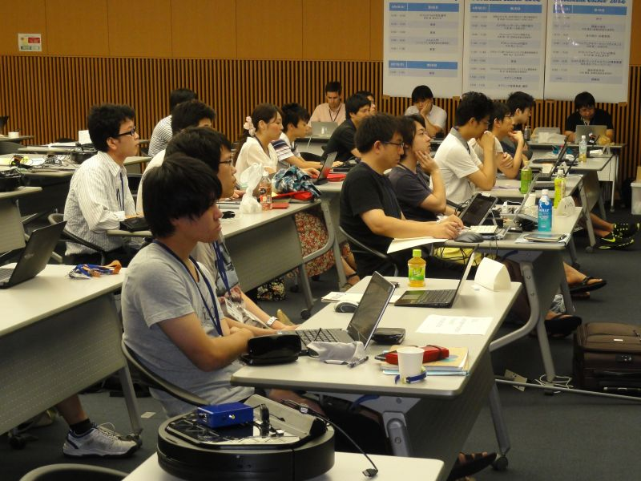</a>

 

<a href="2014camp-03.jpg">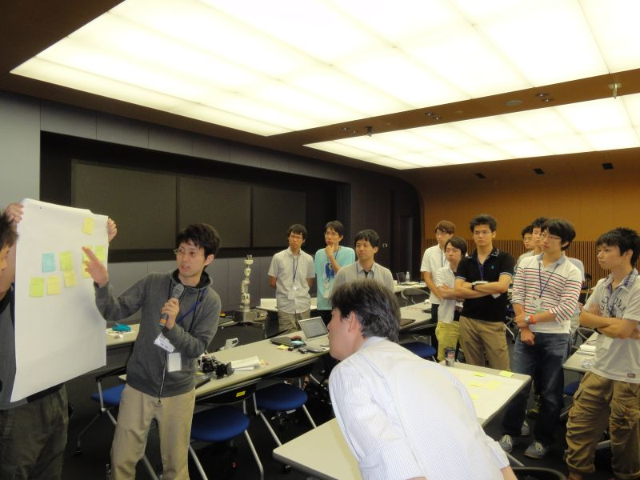</a>

 

<a href="2014camp-04.jpg">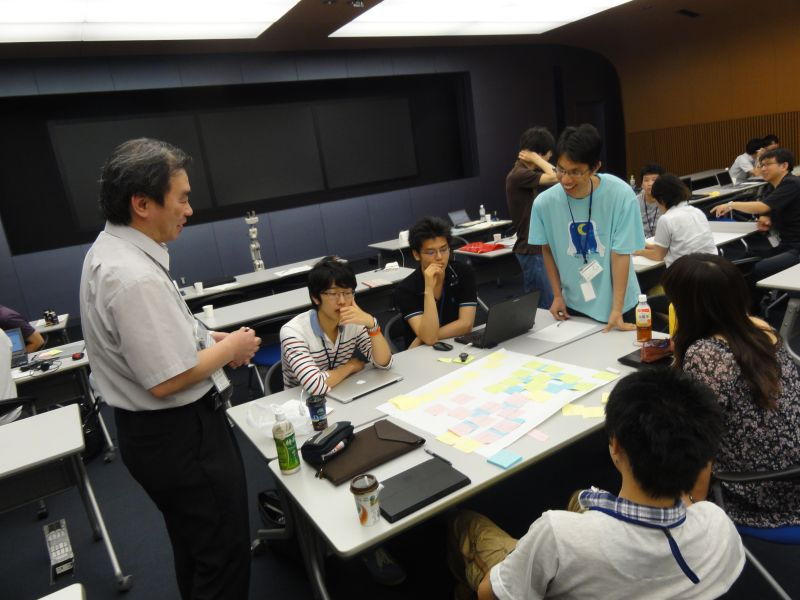</a>

 

<a href="2014camp-05.jpg">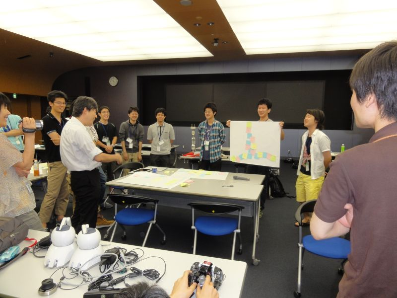</a>

 

<a href="2014camp-06.jpg">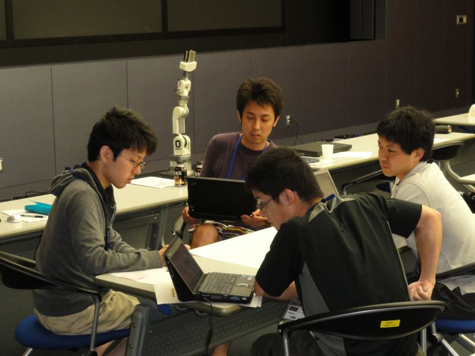</a>

 

<a href="2014camp-07.jpg">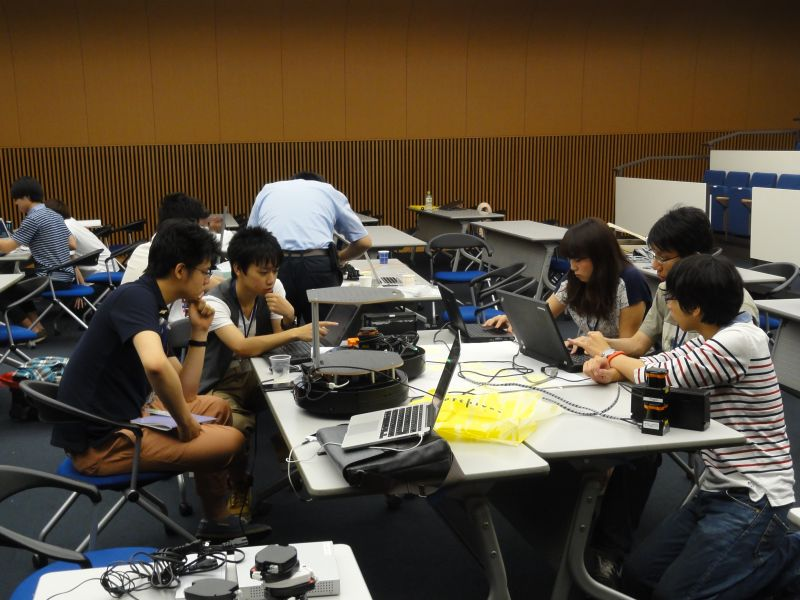</a>

 

<a href="2014camp-08.jpg">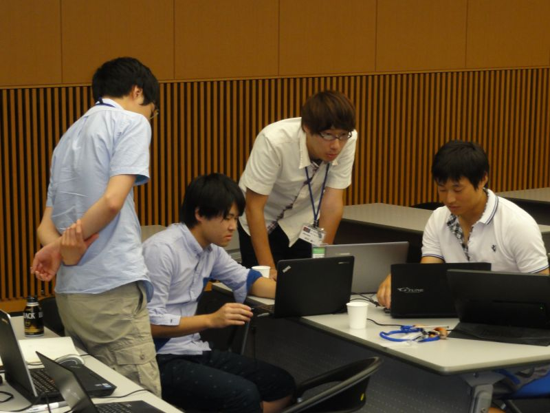</a>

 

<a href="2014camp-09.jpg">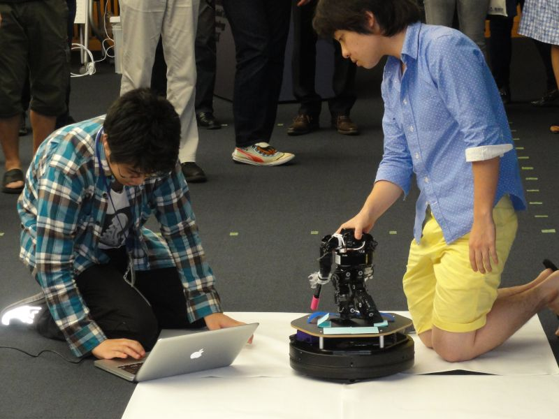</a>

 

<a href="2014camp-10.jpg">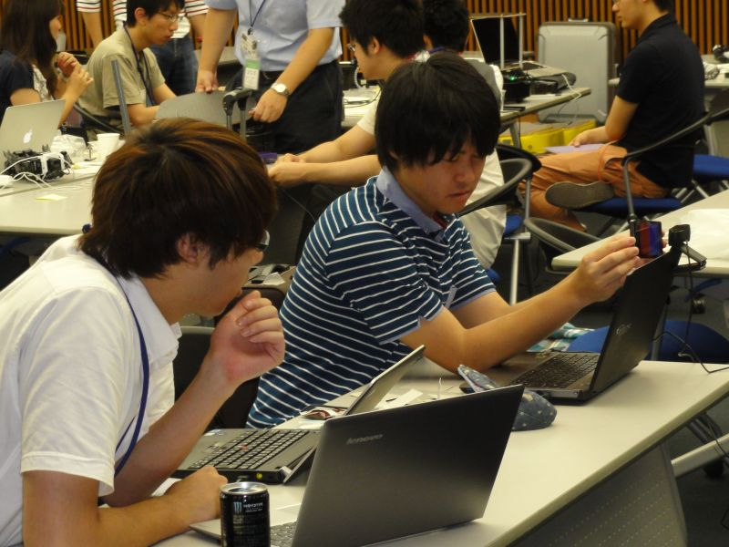</a>

 

<a href="2014camp-11.jpg">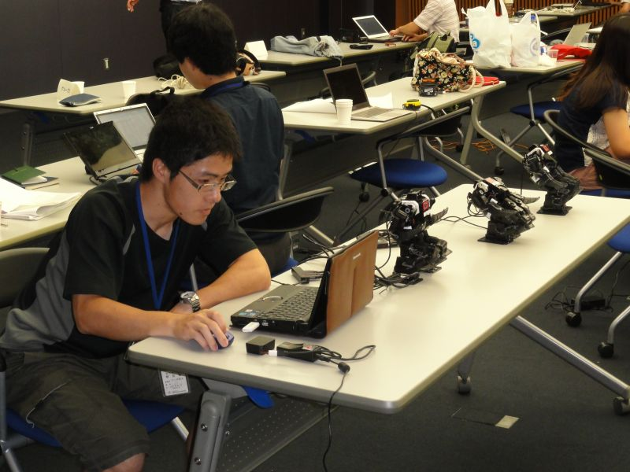</a>

 

&aname(comment);
