

#contents

## 開催報告

名城大学の大原先生のご尽力と多くの特別講師やサポートスタッフのご支援のおかげで、17名の参加者と共に、今年も、サマーキャンプを作り上げて行くことが出来ました。皆さまに御礼申し上げます。
この合宿研修の成果を、RTミドルウエアコンテストで発表いただけることを、期待しております。

<a href="summercamp2016-0.jpg">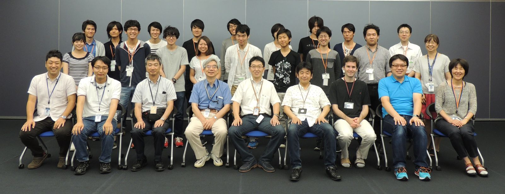</a>

<!-- **開催のご案内 -->

<!-- 今年で6回目となりました、RTミドルウエアキャンプを8月1日から8月5日の5日間、茨城県つくば市の産業技術総合研究所において開催いたします。 -->
<!-- RTミドルウエアやロボット開発に精通する講師陣のもとで、RTミドルウエアを用いた様々なロボットシステム開発を体験する機会を5日間にわたり提供します。RTミドルウエアを用いたプログラミングの方法や、実践的なロボットシステムへの応用、RTミドルウエアコンテストでの必勝法等、様々な講義を予定しています。宿泊施設として産総研のさくら館(要実費)を提供することを予定しており、一緒に参加した仲間とともに密度の濃い開発経験を通して、より実践的なロボットシステム構築方法を身に付けることができます。 -->

<!-- ''参加資格は、少なくとも1回以上RTミドルウエア講習会を受講した経験があるか、同等以上のプログラミングスキルを身に着けていることを条件とします。また、参加者は12月に行われるRTミドルウエアコンテストへの参加が期待されています。'' -->

### 参加者の声

- 最初は我々の開発課題が実現可能なのかどうか分からず、不安な気持ちを拭えない状態での参加だったのですが、講師の先生方には質問に対して懇切丁寧にご回答いただき、何とか実装までにこぎつけることができました。今はOpenRTMの中身も多少理解できる程度にまでなり、今回は参加してよかったと思っております。講師の先生方をはじめ、スタッフの皆さま、誠にありがとうございました。(社会人)
- 知識ゼロからのスタートでチームの方や講師の方々には大変なご迷惑をお掛けしましたが，5日間で大きく成長できたと思います。
RTMのスペシャリストの方々が何人もサポートについて下さり，質問しやすい環境で作業に取り組むことができ充実した毎日でした。
終わってしまった今，少し寂しくなっています。RTMロスです。笑（M1）
- 意外とかなり楽しかったです(B4)
- 自分一人では作ることができないシステムでも，チームで協力してRTミドルウェアを使って構築することができた。

## 開催要旨

本サマーキャンプでは、RTミドルウエアやロボット開発に精通する講師陣のもとで、RTミドルウエアを用いた様々なロボットシステム開発を体験する機会を提供します。この企画により、一緒に参加した仲間とともに密度の濃い開発経験を通して、より実践的なロボットシステム構築方法を身に付けることを目的としています。

### 共同開催
- 産業技術総合研究所　ロボットイノベーション研究センター
  - （公社）計測自動制御学会SI部門　RTシステムインテグレーション部会
  - （一社）日本ロボット工業会・ロボットビジネス推進協議会

<!-- *** 協力企業 -->
<!-- #ref(rt.png) -->
<!-- #ref(ga.png) -->
<!-- #ref(sec.png) -->

### 日時・場所
- 2016年8月1日（月）～8月5日（金）
- 産業技術総合研究所　つくばセンター中央第二　
[本部・情報棟１階　ネットワーク会議室](http://www.aist.go.jp/aist_j/guidemap/tsukuba/center/tsukuba_map_c.html)
<!-- -- [[google map:https://maps.google.com/maps/ms?msid=202092058111064603321.0004e2699244f546ec525&msa=0&ll=36.05949,140.134263&spn=0.009098,0.011297]] -->
<!-- - アクセス -->
<!-- -- 東京駅から並木2丁目:[[高速バス時刻表:http://www.kantetsu.co.jp/bus/highway/center/timetable.pdf]] -->
<!-- --- 東京駅八重洲南口高速バス乗り場からつくばセンター・筑波大学行きに乗り、並木2丁目停留所にて下車してください。 -->
<!-- --- 東京駅から1時間：下りは渋滞が少なくほぼ時間通り到着します。 -->
<!-- -- 秋葉原駅からTXつくば駅経由:[[産総研連絡バス時刻表:http://www.aist.go.jp/aist_j/guidemap/pdf/tsukuba_c_iki.pdf]] -->
<!-- --- つくばエクスプレス秋葉原駅から終点つくば駅(快速：45分)まで乗車し、つくば駅から産総研連絡バスに乗車、つくば中央第1にて下車してください。 -->
<!-- --- 連絡バス所用時間：20分から25分程度。 -->
<!-- -- 常磐線荒川沖駅から路線バス:[[荒川沖バス時刻表:http://www.kantetsu.co.jp/bus/rosen/timetable/timetable/tc/08.pdf]] -->
<!-- --- 常磐線荒川沖駅にて降りていただき、関東鉄道バス西４乗り場筑波大学中央・筑波大学病院行きのバスに乗車し、並木2丁目で下車してください。 -->
<!-- --- バスの所要時間は15分程度です。 -->
- 参加者: 17名（+講師・スタッフ 延べ21名）

### 参加資格
- RTミドルウェア講習会に参加したことがある，もしくは同等程度の経験を有していること．

または，

- 下記のサマーキャンプ受講希望者向けの講習会に参加する意思があること
  - [ROBOMECH2015講習会](/ja/node/5784)(終了)
  - RTM強化月間：6月下旬から7月の間に東京（2回）、名城大（1回）講習会を開催予定
    - [RTミドルウェア強化月間(第1弾)：名城大学・RTミドルウェア講習会](../bootcamp_meijo_2016)
    - [RTミドルウェア強化月間(第2弾)：早稲田大学・RTミドルウェア講習会](../bootcamp_waseda_2016)
    - [RTミドルウェア強化月間(第3弾)：中央大学・RTミドルウェア講習会](../bootcamp_chuo_2016)

<!-- *** 参加人数 -->
<!-- - 最大20名程度（グループでの参加を推奨） -->
<!-- - スタッフ側のボランティアも随時募集 -->

### 参加費
無料（ただし，宿泊費や食事代は参加者の自己負担．産総研の宿泊施設を安価で提供）

### 実施概要
<!-- 現在実施内容を詰めておりますので，少々お待ちください． -->

参加者各自がそれぞれの目的意識を持ち、その目的に向けた開発の初期工程の支援を本サマーキャンプの目的とする。~
本サマーキャンプで利用するRTコンポーネントは、NEDO知能化プロジェクトの成果，過去のRTミドルウェアコンテストの作品，さらには有志により開発されたRTコンポーネントを再利用することを基本とし，適宜各自の目的にあったRTコンポーネントの開発を促すことで，RTコンポーネントの開発，およびRTミドルウェアを用いたロボットシステム開発を行う．~
開発だけでなく，RTミドルウェアに見識のある講師を依頼し，RTミドルウェアによるロボットシステムの開発方法，RTミドルウェアでの開発を支援するツール群の利用方法からRTミドルウェアを用いたシステム事例の紹介まで行い，幅広くRTミドルウェアについての知識提供の機会を設ける。サマーキャンプ最終日には成果発表会を行う．~

（参考）
- [サマーキャンプ2011](../summercamp2011)
- [サマーキャンプ2012](../summercamp2012)
- [サマーキャンプ2013](../summercamp2013)
- [サマーキャンプ2014](../summercamp2014)
- [サマーキャンプ2015](../summercamp2015)

## プログラム
<table class="table-alt">
  <tr>
    <td>8月1日(月)</td>
    <td>第1日目</td>
    <td>-</td>
  </tr>
  <tr>
    <td>12:30 - 13:00</td>
    <td>受付</td>
    <td>-</td>
  </tr>
  <tr>
    <td>13:00 - 13:10</td>
    <td>開催の挨拶</td>
    <td>安藤 慶昭 (産業技術総合研究所)</td>
  </tr>
  <tr>
    <td>13:10 - 14:30</td>
    <td>自己紹介・決意表明</td>
    <td>-</td>
  </tr>
  <tr>
    <td>14:30 - 14:40</td>
    <td>RTミドルウェアサマーキャンプガイダンス</td>
    <td>大原 賢一 (名城大学)</td>
  </tr>
  <tr>
    <td>14:40 - 14:50</td>
    <td>RTミドルウェアサマーキャンプの過ごし方</td>
    <td>大原 賢一 (名城大学)</td>
  </tr>
  <tr>
    <td>14:50 - 15:10</td>
    <td>講義1: 琴坂研究室でのRTミドルウエアの取り組み   **講義資料**:<a href="./2016SummerCamp-01.pdf">2016SummerCamp-01.pdf</a></td>
    <td>琴坂 信哉 (埼玉大学)</td>
  </tr>
  <tr>
    <td>15:10 - 15:20</td>
    <td>休憩</td>
    <td>-</td>
  </tr>
  <tr>
    <td>15:20 - 16:20</td>
    <td>講義2: SysML講習会   **講義資料**:<a href="./2016SummerCamp-021.pdf">2016SummerCamp-021.pdf(事前講習会資料）</a>,  <a href="./2016SummerCamp-022.pdf">2016SummerCamp-022.pdf</a></td>
    <td>坂本 武志 (グローバルアシスト)</td>
  </tr>
  <tr>
    <td>16:20 - 17:50</td>
    <td>産総研見学会   Aコース   16:20 - 16:40 HRP 阪口　 （本部情報棟 3F)   16:45 - 17:05 RSP 花井 (本館 E棟4F)   17:10 - 17:30 RT ROOM 関山 (本館 E棟2F)   17:35 - 17:55 SM 横塚 (本部情棟報1F)     Bコース   16:20 - 16:40 SM 横塚　　　(本部情棟報1F)   16:45 - 17:05 RT ROOM 関山 (本館 E棟2F)   17:10 - 17:30 RSP 花井 (本館 E棟4F)   17:35 - 17:55 HRP 阪口 （本部情報棟 3F)</td>
    <td>原 功</td>
  </tr>
  <tr>
    <td>18:00 -</td>
    <td>懇親会＠さくら館</td>
    <td>-</td>
  </tr>
</table>

<table class="table-alt">
  <tr>
    <td>8月2日(火)</td>
    <td>第2日目</td>
    <td>-</td>
  </tr>
  <tr>
    <td>09:00 - 11:00</td>
    <td>SysMLモデリングおよび実習</td>
    <td>-</td>
  </tr>
  <tr>
    <td>11:00 - 11:30</td>
    <td>講義5: ROS-RTM相互運用とJSKでの取り組み   **講義資料**:<a href="/sites/default/files/6048/2016SummerCamp-05.pdf">2016SummerCamp-05.pdf</a></td>
    <td>岡田 慧 (東京大学)</td>
  </tr>
  <tr>
    <td>11:30 - 12:00</td>
    <td>講義6: 利用可能なRTコンポーネント   **講義資料**:<a href="./2016SummerCamp-06.pdf">2016SummerCamp-06.pdf</a></td>
    <td>菅 佑樹 (SUGAR SWEET ROBOTICS)</td>
  </tr>
  <tr>
    <td>12:00 - 13:00</td>
    <td>昼休み</td>
    <td>-</td>
  </tr>
  <tr>
    <td>13:00 - 14:00</td>
    <td>SysMLモデリング結果発表・講評</td>
    <td>-</td>
  </tr>
  <tr>
    <td>14:00 - 17:00</td>
    <td>実習</td>
    <td>-</td>
  </tr>
</table>

<table class="table-alt">
  <tr>
    <td>8月3日(水)</td>
    <td>第3日目</td>
    <td>-</td>
  </tr>
  <tr>
    <td>09:00 - 10:00</td>
    <td>自習時間</td>
    <td>-</td>
  </tr>
  <tr>
    <td>10:00 - 10:30</td>
    <td>講義7: 効率よいRTシステム運用法   **講義資料**:<a href="./2016SummerCamp-07.pdf">2016SummerCamp-07.pdf</a> , <a href="./2016SummerCamp-07.zip">2016SummerCamp-07.zip</a></td>
    <td>宮本 信彦 (産業技術総合研究所)</td>
  </tr>
  <tr>
    <td>10:30 - 11:00</td>
    <td>講義8: rtshell   **講義資料**:<a href="./2016SummerCamp-08.pdf">2016SummerCamp-08.pdf</a></td>
    <td>ジェフ ビグス (産業技術総合研究所)</td>
  </tr>
  <tr>
    <td>11:00 - 16:30</td>
    <td>実習</td>
    <td>-</td>
  </tr>
  <tr>
    <td>16:30 - 17:00</td>
    <td>各チームの進捗報告</td>
    <td>-</td>
  </tr>
</table>

<table class="table-alt">
  <tr>
    <td>8月4日(木)</td>
    <td>第4日目</td>
    <td>-</td>
  </tr>
  <tr>
    <td>09:00 - 16:30</td>
    <td>実習</td>
    <td>-</td>
  </tr>
  <tr>
    <td>16:30 - 17:00</td>
    <td>各チームの進捗報告</td>
    <td>-</td>
  </tr>
</table>

<table class="table-alt">
  <tr>
    <td>8月5日(金)</td>
    <td>第5日目</td>
    <td>-</td>
  </tr>
  <tr>
    <td>9:00 - 12:00</td>
    <td>実習</td>
    <td>-</td>
  </tr>
  <tr>
    <td>13:00 - 16:00</td>
    <td>成果報告会</td>
    <td>-</td>
  </tr>
  <tr>
    <td>16:00 - 16:10</td>
    <td>閉会の挨拶</td>
    <td>平井成興（ビジ協・NEDO）</td>
  </tr>
  <tr>
    <td>16:10 - 17:00</td>
    <td>片付け</td>
    <td>-</td>
  </tr>
  <tr>
    <td>17:00 - 20:00</td>
    <td>RTミドルウェア情報交換会（BOFミーティング）</td>
    <td>-</td>
  </tr>
</table>

<!-- *** 産総研見学会 -->

<!-- - 生活支援RTルーム（阪口、鍛冶、関山） -->
<!-- - 高精度な姿勢検出が可能な視覚マーカ（田中） -->
<!-- - アンドロイドを用いたコミュニケーション支援（松本(吉)） -->
<!-- - 移動知能とフィールドロボット研究（松本(治)、横塚） -->
<!-- - 全方向ステレオシステム（佐藤） -->

## 課題について
基本的には各参加者に課題を持ち寄っていただき，講師陣は参加者のサポートを行う形態を取ります．~
<!-- ただし，RTミドルウエア初心者でテーマ設定に悩む場合は，下記のような課題も考えております．~ -->

<!-- ***課題例 -->
<!-- |CENTER:200|LEFT:100|c -->
<!-- |Robocup@Homeの競技|[[資料>http://www.openrtm.org/openrtm/sites/default/files/rulehome2015.pdf]]| -->
<!-- |MobileRobotiNavigationFrameworkを用いたアプリケーション開発|[[資料>http://ogata-lab.jp/ja/technology_ja/mobile_nav_rtcs_ja.html]]| -->

<!-- ***課題例 -->
<!-- |人型ロボット(G-Robot)を使ったモーション生成| -->
<!-- |ルンバ/Pioneer/Kobukiを用いた課題自律移動ロボットの制御| -->
<!-- |共通カメラインタフェースを用いたカメラコンポーネントを用いた物体認識| -->
<!-- |RTミドルウェアリファレンスハードウェア「OROCHI」を用いた物体把持| -->
<!-- |OpenHRIを用いた音声認識を用いた課題| -->
<!-- |RTスペース操作用コンポーネントの開発| -->
<!-- |レーザレンジファインダを用いた環境認識| -->
<!-- |AR Toolkitを用いた拡張現実感| -->

<!-- （注）変更する可能性もございますことご了承下さい． -->

<!-- **講習会申し込みフォーム -->
<!-- 以下のフォームからRTミドルウェアサマーキャンプ2015にお申し込み下さい． -->
<!-- - 参加登録するまえに当Webページのユーザ登録をお願いします．[[ユーザ登録はこちら:http://openrtm.org/openrtm/ja/user/register]] -->
<!-- - 当Webサイトにログイン済みの方は名前の欄にユーザ名が出ますが、必ず、氏名に書き換えてください． -->

<!-- **講演会のみのご参加について -->
<!-- 講演会のみご参加される方は，RTミドルウェアサマーキャンプ実行委員会幹事の~ -->
<!-- 名城大学大原(kohara(at)meijo-u.ac.jp)までご連絡ください． -->

## 実行委員会
<table class="table-alt">
  <tr>
    <td>実行委員長</td>
    <td>安藤　慶昭</td>
    <td>産業技術総合研究所ロボットイノベーション研究センター　ロボットソフトウェアプラットフォーム研究チーム長</td>
  </tr>
  <tr>
    <td>幹事</td>
    <td>大原　賢一</td>
    <td><a href="http://mechatronics.meijo-u.ac.jp/study/ohara.html">名城大学理工学部メカトロニクス工学科　准教授</a></td>
  </tr>
  <tr>
    <td>委員</td>
    <td>原　功</td>
    <td><a href="http://hara.jpn.com">産業技術総合研究所ロボットイノベーション研究センター　ロボットソフトウェア研究ラボ　ラボ長</a></td>
  </tr>
  <tr>
    <td>委員</td>
    <td>菅　佑樹</td>
    <td><a href="http://sugarsweetrobotics.com/">株式会社SUGAR SWEET ROBOTICS</a></td>
  </tr>
  <tr>
    <td>委員</td>
    <td>ジェフ　ビグス</td>
    <td><a href="http://staff.aist.go.jp/geoffrey.biggs/">産業技術総合研究所ロボットイノベーション研究センター　ロボットソフトウェア研究ラボ　主任研究員</a></td>
  </tr>
  <tr>
    <td>委員</td>
    <td>平井　成興</td>
    <td><a href="http://www.furo.org/ja/member/hirai.html">新エネルギー産業技術総合開発機構 技術戦略研究センター・新領域・融合ユニット長（ロボット・AI）</a></td>
  </tr>
  <tr>
    <td>委員</td>
    <td>神徳　徹雄</td>
    <td><a href="https://staff.aist.go.jp/t.kotoku/">産業技術総合研究所イノベーション推進本部</a></td>
  </tr>
  <tr>
    <td>委員</td>
    <td>坂本　武志</td>
    <td><a href="http://globalassist.co.jp">株式会社グローバルアシスト</a></td>
  </tr>
  <tr>
    <td>委員</td>
    <td>岡田　慧</td>
    <td><a href="http://www.jsk.t.u-tokyo.ac.jp/`k-okada/">東京大学大学院情報理工学系研究科知能機械情報学専攻准教授</a></td>
    <td></td>
  </tr>
  <tr>
    <td>委員</td>
    <td>岡田　浩之</td>
    <td><a href="http://www.tamagawa.ac.jp/teachers/okada/index.html">玉川大学工学部機械システム学科教授</a></td>
  </tr>
  <tr>
    <td>委員</td>
    <td>琴坂　信哉</td>
    <td><a href="http://design.mech.saitama-u.ac.jp/people/staff/kotosaka.html">埼玉大学理工学研究科人間支援・生産科学部門准教授</a></td>
  </tr>
  <tr>
    <td>委員</td>
    <td>佐々木　毅</td>
    <td><a href="http://www.sic.shibaura-it.ac.jp/`sasaki-t/">芝浦工業大学デザイン工学部エンジニアリングデザイン領域准教授</a></td>
    <td></td>
  </tr>
  <tr>
    <td>委員</td>
    <td>中岡　慎太郎</td>
    <td><a href="https://staff.aist.go.jp/s.nakaoka/">産業技術総合研究所知能システム研究部門ヒューマノイド研究グループ主任研究員</a></td>
  </tr>
</table>
<!-- |委員|中本　啓之|[[株式会社セック:http://www.sec.co.jp]]| -->
<!-- |委員|山下　智輝|[[株式会社前川製作所:http://www.mayekawa.co.jp/ja/]]| -->

<!-- *** サポート＆協力スタッフ -->
<!-- |原田　研介|産総研（見学対応御礼）| -->
<!-- |阪口　健|産総研（見学対応御礼）| -->
<!-- |田中　秀幸|産総研（見学対応御礼）| -->
<!-- |谷川　民生|産総研| -->
<!-- |宮本　晴美|産総研| -->
<!-- |韓 越興|産総研| -->
<!-- |橋川　史崇|産総研[明治大]| -->
<!-- |山口　渡|産総研[筑波大]| -->
<!-- |江崎　伸明|産総研[首都大学東京]| -->
<!-- |尾形　仁子|産総研| -->

<!-- ** 参加者の方へ -->
<!-- *** 自己紹介スライドの準備 -->

<!-- 参加されるかたは、以下の自己紹介用スライドのテンプレートに従って自己紹介を作成してください． -->
<!-- 送付方法は事務局より連絡させていただきます． -->

<!-- - 自己紹介用スライドテンプレート: &ref(2015.ppt); -->

<!-- ** お問い合わせ -->

<!-- 基本的な情報はホームページから提供いたします． -->
<!-- 参加申込みいただいた方は連絡したメールに返信ください． -->

<!-- RTミドルウエアサマーキャンプ実行委員会~ -->
<!-- summercamp2015(at)openrtm.org~ -->
<!-- (at)を＠におきかえてください．~ -->

<!-- &aname(comment); -->

## 講義資料

### 琴坂研究室でのRTミドルウエアの取り組み
- [講義資料(PDF)](/sites/default/files/6048/2016SummerCamp-01.pdf)

<!-- Invalid YouTube URL: http://www.slideshare.net/64567568 -->


### SysML講習会
- [事前講習会の講義資料(PDF)](/sites/default/files/6048/2016SummerCamp-021.pdf)

<!-- Invalid YouTube URL: http://www.slideshare.net/64600227 -->


- [講義資料(PDF)](/sites/default/files/6048/2016SummerCamp-022.pdf)

<!-- Invalid YouTube URL: http://www.slideshare.net/64600261 -->


### ROS-RTM相互運用とJSKでの取り組み
- [事前講習会の講義資料(PDF)](/sites/default/files/6048/2016SummerCamp-05.pdf)

<!-- Invalid YouTube URL: http://www.slideshare.net/64602848 -->


### 利用可能なRTコンポーネント
- [事前講習会の講義資料(PDF)](./2016SummerCamp-06.pdf)

### 効率よいRTシステム運用法
- [講義資料(PDF)](./2016SummerCamp-07.pdf)
- [複合コンポーネント作成支援ツールの使い方](http://compositettool.tyonmage.com/)

<!-- Invalid YouTube URL: http://www.slideshare.net/64456374 -->


### rtshell入門
- [講義資料(PDF)](./2016SummerCamp-08.pdf)

<!-- Invalid YouTube URL: http://www.slideshare.net/64643799 -->


## 開発成果

&aname(summercamp2016_group1);
### グループ１

- **課題**: OpenRTMへのPub/Sub型メッセージ通信の実装
  - OpenRTM-aistのデータポートの拡張
  - OpenRTM-aistのデータポート通信の代わりにSolaceアプライアンスを用いたPub/Sub型メッセージ通信を選択できるように拡張を行う

<!-- Invalid YouTube URL: http://www.slideshare.net/64789063 -->


<iframe width="560" height="315" src="https://www.youtube.com/embed/uPMIyC22--M" frameborder="0" allowfullscreen></iframe>

<iframe width="560" height="315" src="https://www.youtube.com/embed/1Sc4omUcuQ0" frameborder="0" allowfullscreen></iframe>

&aname(summercamp2016_group2);
### グループ２

- **課題**: G-SURFER on Kobuki
  - KobukiとGROBOTSの連動動作システムの実装
  - Kobuki上にGROBOTSをのせてGROBOTSが落ちないように姿勢を制御する
- プロジェクトページ: http://openrtm.org/openrtm/ja/project/SummerCamp2016_group2

<!-- Invalid YouTube URL: http://www.slideshare.net/64789208 -->


<iframe width="560" height="315" src="https://www.youtube.com/embed/ZQddrBitbnU" frameborder="0" allowfullscreen></iframe>

<iframe width="560" height="315" src="https://www.youtube.com/embed/3ogC6j7tU4g" frameborder="0" allowfullscreen></iframe>

<iframe width="560" height="315" src="https://www.youtube.com/embed/RT-h1-7i7BE" frameborder="0" allowfullscreen></iframe>

&aname(summercamp2016_group3);
### グループ３

- **課題**: かき混ぜロボット
  - OROCHIのエンドエフェクタに取り付けた泡だて器を用いてボウルの中身をかき混ぜるシステム
- プロジェクトページ: http://openrtm.org/openrtm/ja/project/SummerCamp2016_group3

<iframe width="560" height="315" src="https://www.youtube.com/embed/i27a1z1IgWM" frameborder="0" allowfullscreen></iframe>

<iframe width="560" height="315" src="https://www.youtube.com/embed/TYKdhRcbfuI" frameborder="0" allowfullscreen></iframe>

<iframe width="560" height="315" src="https://www.youtube.com/embed/FT5u048-NEk" frameborder="0" allowfullscreen></iframe>

&aname(summercamp2016_group4);
### グループ４

- **課題**: ロボットで福笑い！
  - KOBUKIとGROBOTSを用いて音声認識により福笑いを行う
- プロジェクトページ: http://openrtm.org/openrtm/ja/project/SummerCamp2016_group4

<!-- Invalid YouTube URL: http://www.slideshare.net/64789332 -->


<iframe width="560" height="315" src="https://www.youtube.com/embed/V4uePx5kaU0" frameborder="0" allowfullscreen></iframe>

<iframe width="560" height="315" src="https://www.youtube.com/embed/wmhZVJomCzs" frameborder="0" allowfullscreen></iframe>

&aname(summercamp2016_group5);
### グループ５

- **課題**: ひとりでもだるまさんが転んだ
  - 人とのコミュニケーションが不足しやすい長期入院患者などを支援するロボットシステムの開発
  - Grobotが「だるまさんが転んだ」をできるようなシステムを開発
- プロジェクトページ: http://openrtm.org/openrtm/ja/project/SummerCamp2016_group5

<!-- Invalid YouTube URL: http://www.slideshare.net/64789448 -->


<iframe width="560" height="315" src="https://www.youtube.com/embed/Z1Q29GeZ2rc" frameborder="0" allowfullscreen></iframe>

<iframe width="560" height="315" src="https://www.youtube.com/embed/d0xuTl73ng8" frameborder="0" allowfullscreen></iframe>

## 講習会の様子

<a href="summercamp2016-01.JPG">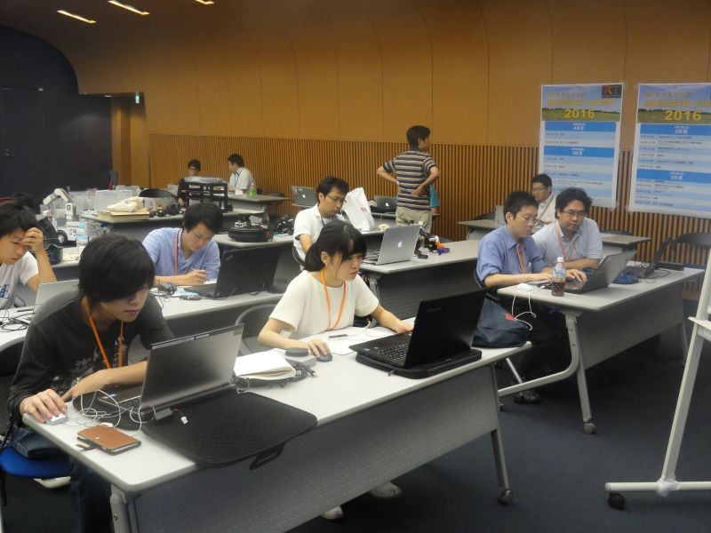</a>

 

<a href="summercamp2016-02.JPG">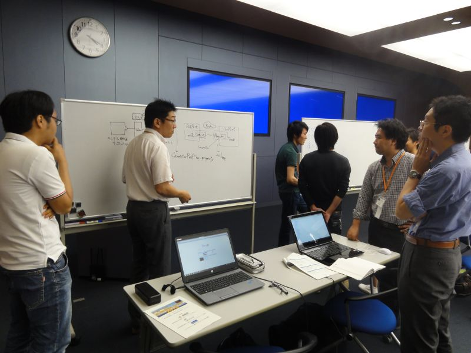</a>

 

<a href="summercamp2016-03.JPG">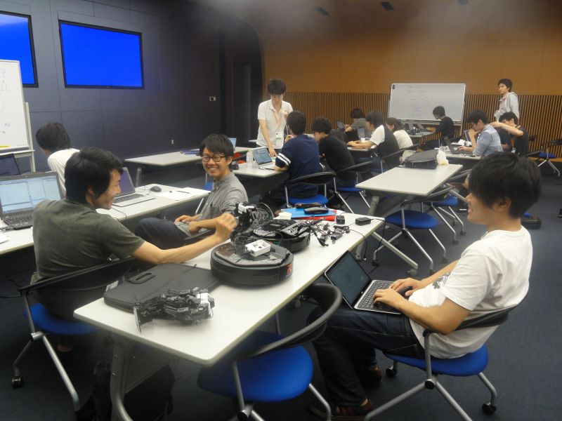</a>

 

<a href="summercamp2016-04.JPG">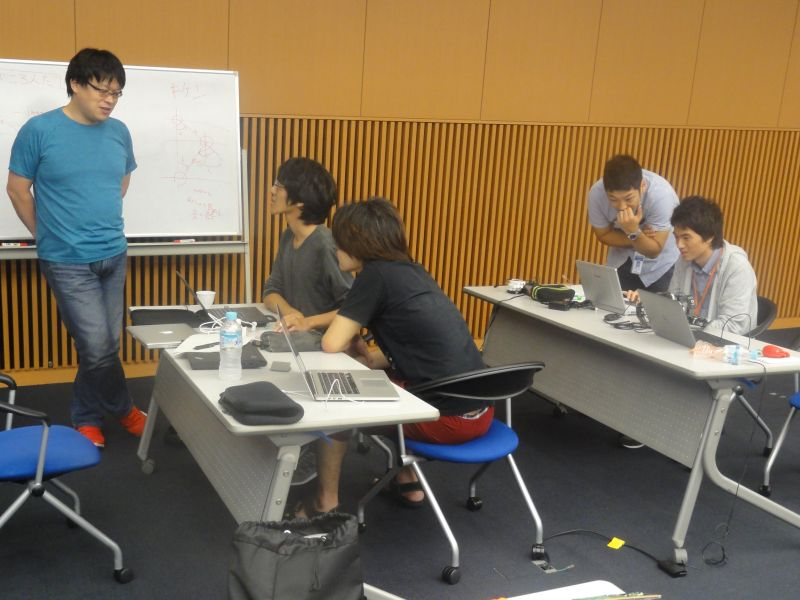</a>

 

<a href="summercamp2016-05.JPG">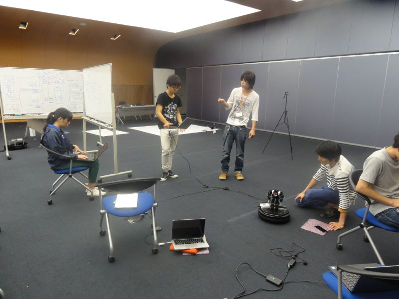</a>

 

<a href="summercamp2016-06.JPG">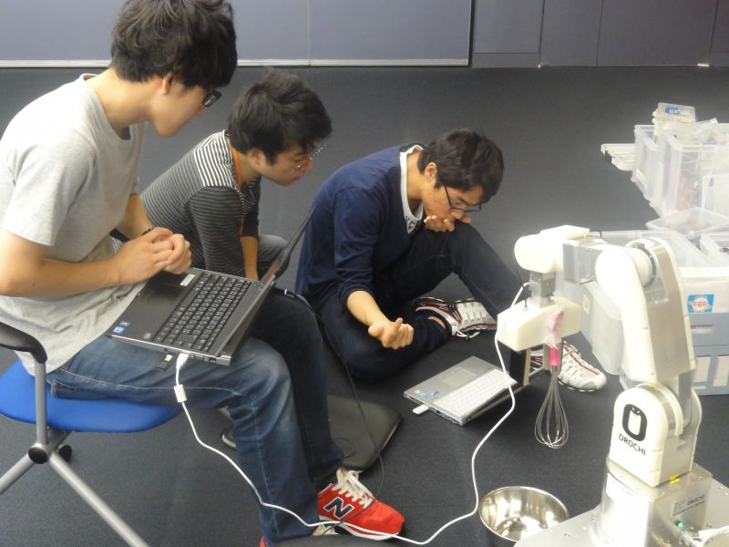</a>

 

<a href="summercamp2016-07.JPG">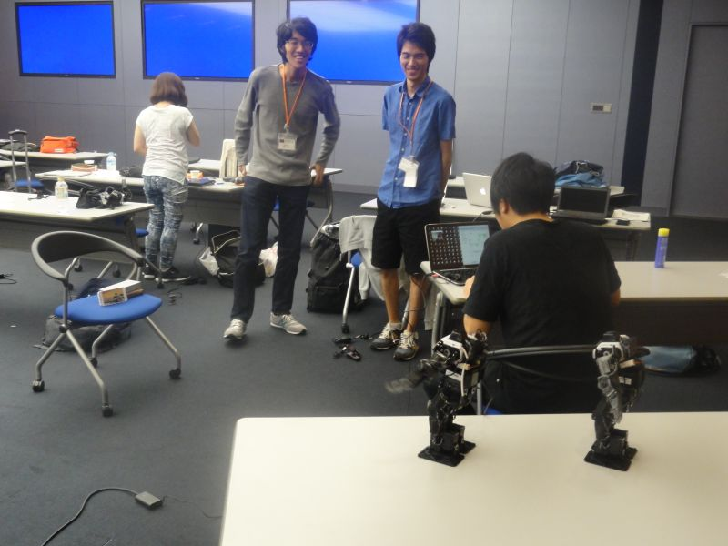</a>

 

<a href="summercamp2016-08.JPG">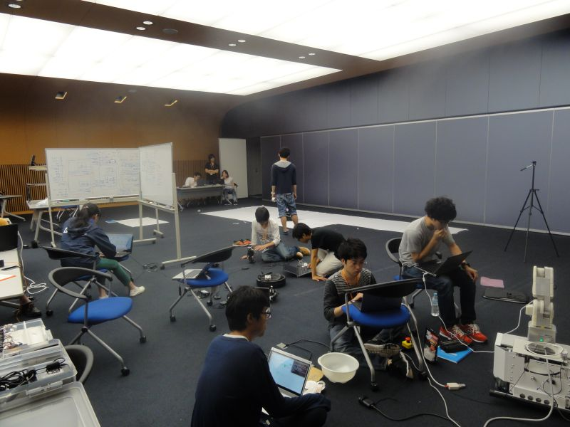</a>

 

<a href="summercamp2016-09.JPG">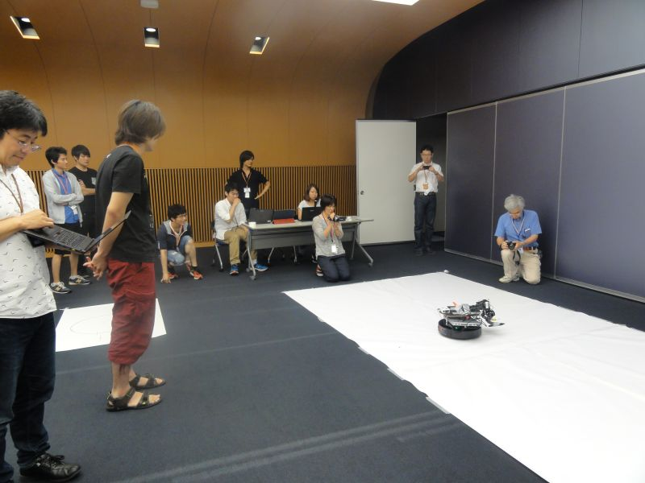</a>

 

<a href="summercamp2016-10.JPG">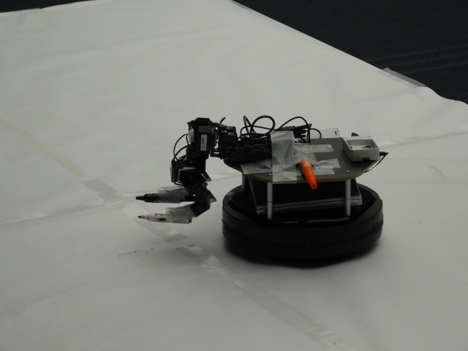</a>

 
