
<a href="summercamp_logo2017.png">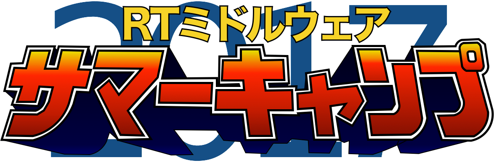</a>

#contents

## 開催報告

名城大学の大原先生のご尽力と多くの特別講師やサポートスタッフのご支援のおかげで、15名の参加者と共に、今年も、サマーキャンプを作り上げて行くことが出来ました。皆さまに御礼申し上げます。
この合宿研修の成果を、RTミドルウエアコンテストで発表いただけることを、期待しております。

<a href="summercamp2017-0.jpg">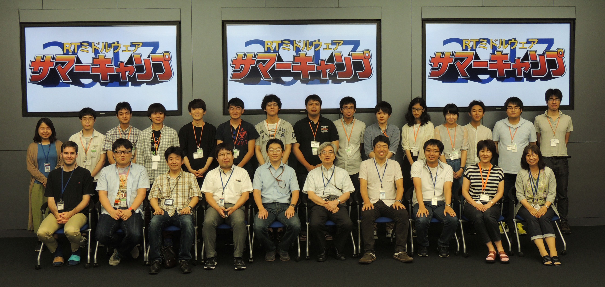</a>

## 開催要旨

本サマーキャンプでは、RTミドルウエアやロボット開発に精通する講師陣のもとで、RTミドルウエアを用いた様々なロボットシステム開発を体験する機会を提供します。この企画により、一緒に参加した仲間とともに密度の濃い開発経験を通して、より実践的なロボットシステム構築方法を身に付けることを目的としています。

### 共同開催
- 産業技術総合研究所　ロボットイノベーション研究センター
  - （公社）計測自動制御学会SI部門　RTシステムインテグレーション部会
  - （一社）日本ロボット工業会・ロボットビジネス推進協議会

### 後援
- 国立研究開発法人　新エネルギー・産業技術開発機構(NEDO)

### 日時・場所
- 2017年7月31日（月）～8月4日（金）
- 産業技術総合研究所　つくばセンター中央第二　本部・情報棟１階　ネットワーク会議室　
  - [ガイドマップ](http://openrtm.org/openrtm/ja/tutorial/guidemap)
  - [google map](https://maps.google.com/maps/ms?msid=202092058111064603321.0004e2699244f546ec525&msa=0&ll=36.05949,140.134263&spn=0.009098,0.011297)
- アクセス
  - 東京駅から並木2丁目:[高速バス時刻表](http://time.jrbuskanto.co.jp/bk03080.html)
    - 東京駅八重洲南口高速バス乗り場からつくばセンター・筑波大学行きに乗り、並木2丁目停留所にて下車してください。
    - 東京駅から1時間：下りは渋滞が少なくほぼ時間通り到着します。
  - 秋葉原駅からTXつくば駅経由:[産総研連絡バス時刻表](https://unit.aist.go.jp/tkb1/to_tsukuba_c_tx_bus20170401.pdf)
    - つくばエクスプレス秋葉原駅から終点つくば駅(快速：45分)まで乗車し、つくば駅から産総研連絡バスに乗車、つくば中央第1にて下車してください。
    - 連絡バス所用時間：20分から25分程度。
    - [連絡バス乗り場](http://www.aist.go.jp/aist_j/guidemap/tsukuba/tsukuba_c_express.html)
  - 常磐線荒川沖駅から路線バス:[荒川沖バス時刻表](http://kantetsu.co.jp/bus/timetable_files/tc/tc06.pdf)
    - 常磐線荒川沖駅にて降りていただき、関東鉄道バス西４乗り場筑波大学中央・筑波大学病院行きのバスに乗車し、並木2丁目で下車してください。
    - バスの所要時間は15分程度です。
<!-- -参加者: 17名（+講師・スタッフ 延べ21名） -->

<!-- ***サマーキャンプ2017レジュメ -->

<!-- サマーキャンプ2017レジュメを公開しました。 -->

<!-- - [[サマーキャンプ2017レジュメ:http://www.openrtm.org/openrtm/sites/default/files/6286/%E3%82%B5%E3%83%9E%E3%83%BC%E3%82%AD%E3%83%A3%E3%83%B3%E3%83%972017%E3%83%AC%E3%82%B8%E3%83%A5%E3%83%A1.pdf]] -->

### 参加資格
- RTミドルウェア講習会に参加したことがある，もしくは同等程度の経験を有していること．

または，

- 下記のサマーキャンプ受講希望者向けの講習会に参加する意思があること
  - [ROBOMECH2017講習会](../robomech2017)(終了)
  - RTM強化月間
    - [RTミドルウェア強化月間(第1弾)：早稲田大学・RTミドルウェア講習会](../bootcamp_waseda_2017)
    - [RTミドルウェア強化月間(第2弾)：名城大学・RTミドルウェア講習会](../bootcamp_meijo_2017)
    - [RTミドルウェア強化月間(第3弾)：都産技研・RTミドルウェア講習会](../bootcamp_sangiken_2017)

### 参加人数
- 参加者：15名
- 講師・スタッフ：20名
<!-- スタッフ側のボランティアも随時募集 -->

### 参加費
無料（ただし，宿泊費や食事代は参加者の自己負担．産総研の宿泊施設を安価で提供）

### 実施概要
参加者各自がそれぞれの目的意識を持ち、その目的に向けた開発の初期工程の支援を本サマーキャンプの目的とする。~
本サマーキャンプで利用するRTコンポーネントは、NEDO知能化プロジェクトの成果，過去のRTミドルウェアコンテストの作品，さらには有志により開発されたRTコンポーネントを再利用することを基本とし，適宜各自の目的にあったRTコンポーネントの開発を促すことで，RTコンポーネントの開発，およびRTミドルウェアを用いたロボットシステム開発を行う．~
開発だけでなく，RTミドルウェアに見識のある講師を依頼し，RTミドルウェアによるロボットシステムの開発方法，RTミドルウェアでの開発を支援するツール群の利用方法からRTミドルウェアを用いたシステム事例の紹介まで行い，幅広くRTミドルウェアについての知識提供の機会を設ける。サマーキャンプ最終日には成果発表会を行い、その後作品とスライド等はホームページに掲載する．~

（参考）
- [サマーキャンプ2011](../summercamp2011)
- [サマーキャンプ2012](../summercamp2012)
- [サマーキャンプ2013](../summercamp2013)
- [サマーキャンプ2014](../summercamp2014)
- [サマーキャンプ2015](../summercamp2015)
- [サマーキャンプ2016](../summercamp2016)

## プログラム
事情により変更する可能性もありますので，ご注意ください．;
<table class="table-alt">
  <tr>
    <td>CENTER: ** 7月31日(月) ** </td>
    <td></td>
    <td>CENTER: **第1日目** </td>
  </tr>
  <tr>
    <td>10:30-11:00</td>
    <td>受付</td>
    <td>-</td>
  </tr>
  <tr>
    <td>11:00-11:10</td>
    <td>「NEDO特別講座」 について</td>
    <td>福田有里（NEDO）</td>
  </tr>
  <tr>
    <td>11:10-12:00</td>
    <td>NEDO特別講座講演１「企業における組織行動事例」**講義資料**:<a href="./企業内の組織行動20170731.pdf">企業内の組織行動20170731.pdf</a></td>
    <td>西之坊穂 (摂南大学)</td>
  </tr>
  <tr>
    <td>12:00-13:00</td>
    <td>NEDO特別講座講演２「IoT×デザイン思考による商店街の活性化」**講義資料**:<a href="./20170731NEDOつくば（油井）.pdf">20170731NEDOつくば（油井）.pdf</a></td>
    <td>油井毅 (大阪工業大学)</td>
  </tr>
  <tr>
    <td>13:00-14:00</td>
    <td>休憩</td>
  </tr>
  <tr>
    <td>14:00 - 14:10</td>
    <td>開催の挨拶</td>
    <td>安藤 慶昭 (産業技術総合研究所)</td>
  </tr>
  <tr>
    <td>14:10 - 14:30</td>
    <td>RTミドルウェアサマーキャンプガイダンス</td>
    <td>大原賢一 (名城大学)</td>
  </tr>
  <tr>
    <td>14:30 - 15:50</td>
    <td>産総研見学会</td>
    <td>-</td>
  </tr>
  <tr>
    <td>16:00 - 16:50</td>
    <td>自己紹介・決意表明</td>
    <td>-</td>
  </tr>
  <tr>
    <td>16:50 - 18:00</td>
    <td>講義1: SysML実習</td>
    <td>坂本武志 (グローバルアシスト)</td>
  </tr>
  <tr>
    <td>18:30 -</td>
    <td>懇親会＠さくら館</td>
    <td>-</td>
  </tr>
</table>

<table class="table-alt">
  <tr>
    <td>CENTER: **8月1日(火)** </td>
    <td> </td>
    <td>CENTER:**第2日目**</td>
  </tr>
  <tr>
    <td>09:30 - 10:00</td>
    <td>RTミドルウェアツール紹介１： RT Shellを使った効率の良いRTシステム運用  **講義資料**:<a href="./rtshell_2017.pdf">rtshell_2017.pdf </a></td>
    <td>ビグス　ジェフ (産業技術総合研究所)</td>
  </tr>
  <tr>
    <td>10:00 - 10:30</td>
    <td>RTミドルウェアツール紹介2： マネージャーやコンポーネントのコンポジット化  **講義資料**:<a href="./2017SummerCamp-03.pdf">2017SummerCamp-03.pdf</a> , <a href="./2017SummerCamp-03.zip">2017SummerCamp-03.zip</a></td>
    <td>宮本信彦 (産業技術総合研究所)</td>
  </tr>
  <tr>
    <td>10:30 - 11:00</td>
    <td>RTミドルウェアツール紹介3： 効率の良いRTコンポーネント開発のための支援ツール  **講義資料**:<a href="./2017SummerCamp-04.pdf">2017SummerCamp-04.pdf</a></td>
    <td>高橋三郎 (産業技術総合研究所)</td>
  </tr>
  <tr>
    <td>11:00 - 11:30</td>
    <td>RTシステム構築事例紹介1：  東京都立産業技術研究センターのRTMの取り組み   T型ロボットデモストレーション</td>
    <td>佐々木智典  (東京都立産業技術研究センター)</td>
  </tr>
  <tr>
    <td>11:30 - 12:00</td>
    <td>RTシステム構築事例紹介2： つかえるRTコンポーネントの紹介(課題)  **講義資料**:<a href="./有用なRTCの紹介.pdf">有用なRTCの紹介.pdf</a></td>
    <td>菅佑樹 (Sugar Sweet Robotics)</td>
  </tr>
  <tr>
    <td>12:00 - 13:00</td>
    <td>昼休み</td>
    <td>-</td>
  </tr>
  <tr>
    <td>13:00 - 15:00</td>
    <td>開発システム検討</td>
    <td>-</td>
  </tr>
  <tr>
    <td>15:00 - 16:00</td>
    <td>開発目標システム発表</td>
    <td>-</td>
  </tr>
  <tr>
    <td>16:00 - 18:00</td>
    <td>RTシステム構築実習1</td>
    <td>-</td>
  </tr>
</table>

<table class="table-alt">
  <tr>
    <td>CENTER: ** 8月2日(水) ** </td>
    <td></td>
    <td>CENTER: ** 第3日目** </td>
  </tr>
  <tr>
    <td>09:00 - 16:30</td>
    <td>RTシステム構築実習2</td>
    <td>-</td>
  </tr>
  <tr>
    <td>16:30 - 17:00</td>
    <td>各チームの進捗報告</td>
    <td>-</td>
  </tr>
</table>

<table class="table-alt">
  <tr>
    <td>CENTER: ** 8月3日(木) ** </td>
    <td></td>
    <td>CENTER: **第4日目** </td>
  </tr>
  <tr>
    <td>09:00 - 16:30</td>
    <td>RTシステム構築実習3</td>
    <td>-</td>
  </tr>
  <tr>
    <td>16:30 - 17:00</td>
    <td>各チームの進捗報告</td>
    <td>-</td>
  </tr>
</table>

<table class="table-alt">
  <tr>
    <td>CENTER: ** 8月4日(金) ** </td>
    <td>></td>
    <td>CENTER: **第5日目** </td>
  </tr>
  <tr>
    <td>9:00 - 12:00</td>
    <td>RTシステム構築実習4</td>
    <td>-</td>
  </tr>
  <tr>
    <td>13:00 - 16:00</td>
    <td>成果報告会</td>
    <td>-</td>
  </tr>
  <tr>
    <td>16:00 - 16:10</td>
    <td>閉会の挨拶</td>
    <td>平井成興 （ビジ協・NEDO）</td>
  </tr>
  <tr>
    <td>16:10 - 17:00</td>
    <td>片付け</td>
    <td>-</td>
  </tr>
  <tr>
    <td>17:00 - 20:00</td>
    <td>RTミドルウェア情報交換会（BOFミーティング）</td>
    <td>-</td>
  </tr>
</table>

<!-- ※本サマーキャンプでの成果物（作品・スライド）や成果発表の動画等は、ホームページで公開します。 -->

### 産総研見学会

<table class="table-alt">
  <tr>
    <td>時間</td>
    <td>グループ1</td>
    <td>グループ2</td>
  </tr>
  <tr>
    <td>14:30-14:45</td>
    <td>全方向ステレオシステム (ビジョンG)</td>
    <td>移動知能とフィールドロボット研究 (スマモビT)</td>
  </tr>
  <tr>
    <td>14:45-15:00</td>
    <td>ヒューマノイドロボット (HRG)</td>
    <td>全方向ステレオシステム (ビジョンG)</td>
  </tr>
  <tr>
    <td>15:00-15:15</td>
    <td>移動知能とフィールドロボット研究 (スマモビT)</td>
    <td>ヒューマノイドロボット (HRG)</td>
  </tr>
  <tr>
    <td>15:15-15:30</td>
    <td>双腕ロボットとティーチングFW (ソフプラT)</td>
    <td>生活支援RTルーム (スマコミT)</td>
  </tr>
  <tr>
    <td>15:30-15:45</td>
    <td>生活支援RTルーム (スマコミT)</td>
    <td>双腕ロボットとティーチングFW (ソフプラT)</td>
  </tr>
</table>

<!-- - 生活支援RTルーム（阪口、鍛冶、関山） -->
<!-- - 高精度な姿勢検出が可能な視覚マーカ（田中） -->
<!-- - アンドロイドを用いたコミュニケーション支援（松本(吉)） -->
<!-- - 移動知能とフィールドロボット研究（松本(治)、横塚） -->
<!-- - 全方向ステレオシステム（佐藤） -->

## 課題について
基本的には各参加者に課題を持ち寄っていただき，講師陣は参加者のサポートを行う形態を取ります．~
<!-- ただし，RTミドルウエア初心者でテーマ設定に悩む場合は，下記のような課題も考えております．~ -->

<!-- ***課題例 -->
<!-- |CENTER:200|LEFT:100|c -->
<!-- |Robocup@Homeの競技|[[資料>http://www.openrtm.org/openrtm/sites/default/files/rulehome2015.pdf]]| -->
<!-- |MobileRobotiNavigationFrameworkを用いたアプリケーション開発|[[資料>http://ogata-lab.jp/ja/technology_ja/mobile_nav_rtcs_ja.html]]| -->

### 課題例
<!-- |人型ロボット(G-Robot)を使ったモーション生成| -->

<table class="table-alt">
  <tr>
    <td>Pioneer/Kobukiを用いた課題自律移動ロボットの制御</td>
  </tr>
  <tr>
    <td>RTミドルウェアリファレンスハードウェア「OROCHI」を用いた物体把持</td>
  </tr>
</table>

（注）変更する可能性もございますことご了承下さい．

<!-- **講習会申し込みフォーム -->
<!-- 以下のフォームからRTミドルウェアサマーキャンプ2017にお申し込み下さい． -->
<!-- - 参加登録するまえに当Webページのユーザ登録をお願いします．[[ユーザ登録はこちら:http://openrtm.org/openrtm/ja/user/register]] -->
<!-- - 当Webサイトにログイン済みの方は名前の欄にユーザ名が出ますが、必ず、氏名に書き換えてください． -->

<!-- **講演会のみのご参加について -->
<!-- 講演会のみご参加される方は，RTミドルウェアサマーキャンプ実行委員会幹事の~ -->
<!-- 名城大学大原(kohara(at)meijo-u.ac.jp)までご連絡ください． -->

## 実行委員会

<table class="table-alt">
  <tr>
    <td>実行委員長</td>
    <td>安藤　慶昭</td>
    <td><a href="https://staff.aist.go.jp/n-ando/index-j.html">産業技術総合研究所ロボットイノベーション研究センター　ロボットソフトウェアプラットフォーム研究チーム長</a></td>
  </tr>
  <tr>
    <td>幹事</td>
    <td>大原　賢一</td>
    <td><a href="http://mechatronics.meijo-u.ac.jp/study/ohara.html">名城大学理工学部メカトロニクス工学科　准教授</a></td>
  </tr>
  <tr>
    <td>委員</td>
    <td>原　功</td>
    <td><a href="http://hara.jpn.com">産業技術総合研究所ロボットイノベーション研究センター　ロボットソフトウェア研究ラボ　ラボ長</a></td>
  </tr>
  <tr>
    <td>委員</td>
    <td>菅　佑樹</td>
    <td><a href="http://sugarsweetrobotics.com/">株式会社SUGAR SWEET ROBOTICS</a></td>
  </tr>
  <tr>
    <td>委員</td>
    <td>ジェフ　ビグス</td>
    <td><a href="http://staff.aist.go.jp/geoffrey.biggs/">産業技術総合研究所ロボットイノベーション研究センター　ロボットソフトウェア研究ラボ　主任研究員</a></td>
  </tr>
  <tr>
    <td>委員</td>
    <td>平井　成興</td>
    <td>日本ロボット工業会・ロボットビジネス推進協議会・RTミドルウェアWG 主査</td>
  </tr>
  <tr>
    <td>委員</td>
    <td>神徳　徹雄</td>
    <td><a href="https://staff.aist.go.jp/t.kotoku/">産業技術総合研究所イノベーション推進本部</a></td>
  </tr>
  <tr>
    <td>委員</td>
    <td>坂本　武志</td>
    <td><a href="http://globalassist.co.jp">株式会社グローバルアシスト</a></td>
  </tr>
</table>
<!-- |委員|岡田　慧|[[東京大学大学院情報理工学系研究科知能機械情報学専攻准教授:http://www.jsk.t.u-tokyo.ac.jp/~k-okada/]]| -->
<!-- |委員|岡田　浩之|[[玉川大学工学部機械システム学科教授:http://www.tamagawa.ac.jp/teachers/okada/index.html]]| -->
<!-- |委員|琴坂　信哉|[[埼玉大学理工学研究科人間支援・生産科学部門准教授:http://design.mech.saitama-u.ac.jp/people/staff/kotosaka.html]]| -->
<!-- |委員|佐々木　毅|[[芝浦工業大学デザイン工学部エンジニアリングデザイン領域准教授:http://www.sic.shibaura-it.ac.jp/~sasaki-t/]]| -->
<!-- |委員|中岡　慎太郎|[[産業技術総合研究所知能システム研究部門ヒューマノイド研究グループ主任研究員:https://staff.aist.go.jp/s.nakaoka/]]| -->
<!-- |委員|中本　啓之|[[株式会社セック:http://www.sec.co.jp]]| -->
<!-- |委員|山下　智輝|[[株式会社前川製作所:http://www.mayekawa.co.jp/ja/]]| -->

<!-- *** サポート＆協力スタッフ -->
<!-- |原田　研介|産総研（見学対応御礼）| -->
<!-- |阪口　健|産総研（見学対応御礼）| -->
<!-- |田中　秀幸|産総研（見学対応御礼）| -->
<!-- |谷川　民生|産総研| -->
<!-- |宮本　晴美|産総研| -->
<!-- |韓 越興|産総研| -->
<!-- |橋川　史崇|産総研[明治大]| -->
<!-- |山口　渡|産総研[筑波大]| -->
<!-- |江崎　伸明|産総研[首都大学東京]| -->
<!-- |尾形　仁子|産総研| -->

## 参加者の方へ
### 自己紹介スライドの準備

参加されるかたは、以下の自己紹介用スライドのテンプレートに従って自己紹介を作成してください．
送付方法は事務局より連絡させていただきます．

- 自己紹介用スライドテンプレート: <a href="./Introduction2017.pptx">RTMサマーキャンプ参加者自己紹介テンプレート</a>;

## お問い合わせ

基本的な情報はホームページから提供いたします．
参加申込みいただいた方は連絡したメールに返信ください．

RTミドルウエアサマーキャンプ実行委員会~
summercamp2017(at)openrtm.org~
(at)を＠におきかえてください．~

&aname(entry);
## 講習会申し込みフォーム

以下のフォームから講習会へお申し込みください。
- 参加登録するまえに当Webページのユーザ登録をお願いします。[ユーザ登録はこちら](http://openrtm.org/openrtm/ja/user/register)
- 当Webサイトにログイン済みの方は名前の欄のユーザ名を氏名に書き換えてください;。
- フォーム送信後、確認メールをお送りいたします。1日たっても確認メールが届かない場合は、こちら support(at)openrtm.org までお問い合わせください。

## 講義資料

### NEDO特別講座

- ロボットサービス・ビジネススクール　講義資料



<!-- Invalid YouTube URL: http://www.slideshare.net/78438623 -->

- [企業内の組織行動　講義資料(PDF)](./企業内の組織行動20170731.pdf)



<!-- Invalid YouTube URL: http://www.slideshare.net/78432458 -->

- IoT×デザイン思考による商店街の活性化 講義資料



<!-- Invalid YouTube URL: http://www.slideshare.net/78438622 -->

## 講座
- SysML実習
  - 準備中です。少々お待ちください。

## RTミドルウェアツール紹介

- RT Shellを使った効率の良いRTシステム運用
<!-- Invalid YouTube URL: http://www.slideshare.net/78476564 -->


- マネージャーやコンポーネントのコンポジット化
<!-- Invalid YouTube URL: http://www.slideshare.net/78439481 -->


- 効率の良いRTコンポーネント開発のための支援ツール
<!-- Invalid YouTube URL: http://www.slideshare.net/78439402 -->


## RTシステム構築事例紹介1

- 東京都立産業技術研究センターのRTMの取り組み T型ロボットデモストレーション
  - 準備中です。少々お待ちください。

- つかえるRTコンポーネントの紹介(課題)
<!-- Invalid YouTube URL: http://www.slideshare.net/78476633 -->



## 開発成果

&aname(summercamp2017_group1);
### グループ１

- **課題**: 自撮りロボット！
- [プロジェクトページ](/ja/project/SummerCamp2017_group1)

<!-- Invalid YouTube URL: http://www.slideshare.net/78651769 -->


  - 開発モデル発表

<iframe width="560" height="315" src="https://www.youtube.com/embed/m8LZNVZVZ9Y" frameborder="0" allowfullscreen></iframe>

  - 成果報告

<iframe width="560" height="315" src="https://www.youtube.com/embed/gWYLmccFF7s" frameborder="0" allowfullscreen></iframe>

&aname(summercamp2017_group2);
### グループ2

- **課題**: 打ち上がれ！オレの花火！～インスタラクティブ花火第１回つくば花火大会～
- [プロジェクトページ](/ja/project/SummerCamp2017_group2)

<!-- Invalid YouTube URL: http://www.slideshare.net/78651760 -->


  - 開発モデル発表

<iframe width="560" height="315" src="https://www.youtube.com/embed/Y1Lqnnn4NVo" frameborder="0" allowfullscreen></iframe>

  - 成果報告

<iframe width="560" height="315" src="https://www.youtube.com/embed/78S534Pva44" frameborder="0" allowfullscreen></iframe>

&aname(summercamp2017_group3);
### グループ3

- **課題**: ロボットクエスト
- [プロジェクトページ](/ja/project/SummerCamp2017_group3) 

<!-- Invalid YouTube URL: http://www.slideshare.net/78651746 -->


  - 開発モデル発表

<iframe width="560" height="315" src="https://www.youtube.com/embed/Jjbvwq2TAd4" frameborder="0" allowfullscreen></iframe>

  - 成果報告

<iframe width="560" height="315" src="https://www.youtube.com/embed/afvd6rpMyx4" frameborder="0" allowfullscreen></iframe>

  - 成功時の動作

<iframe width="560" height="315" src="https://www.youtube.com/embed/f-zpkKHFVV4" frameborder="0" allowfullscreen></iframe>

&aname(summercamp2017_group4);
### グループ4

- **課題**: 名刺交換ロボット
- [プロジェクトページ](/ja/project/SummerCamp2017_group4)

<!-- Invalid YouTube URL: http://www.slideshare.net/78651727 -->


  - 開発モデル発表

<iframe width="560" height="315" src="https://www.youtube.com/embed/-i9TpUQ4SGo" frameborder="0" allowfullscreen></iframe>

  - 成果報告

<iframe width="560" height="315" src="https://www.youtube.com/embed/Ebl0I3brEnU" frameborder="0" allowfullscreen></iframe>

&aname(summercamp2017_group5);
### グループ5

- **課題**: ちょっと安全なピッキングロボットシステム
  - 
  - 
- [プロジェクトページ](/ja/project/SummerCamp2017_group5)

<!-- Invalid YouTube URL: http://www.slideshare.net/79007428 -->


  - 開発モデル発表

<iframe width="560" height="315" src="https://www.youtube.com/embed/-Pk-2OuMLWg" frameborder="0" allowfullscreen></iframe>

  - 成果報告

<iframe width="560" height="315" src="https://www.youtube.com/embed/Iaqhzlu31G4" frameborder="0" allowfullscreen></iframe>

## 講習会の様子

<a href="sc2017_1.JPG">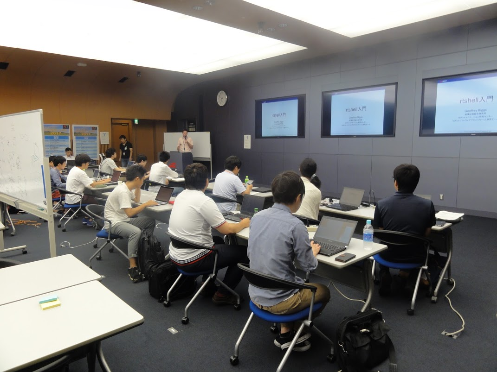</a>

 

<a href="sc2017_2.JPG">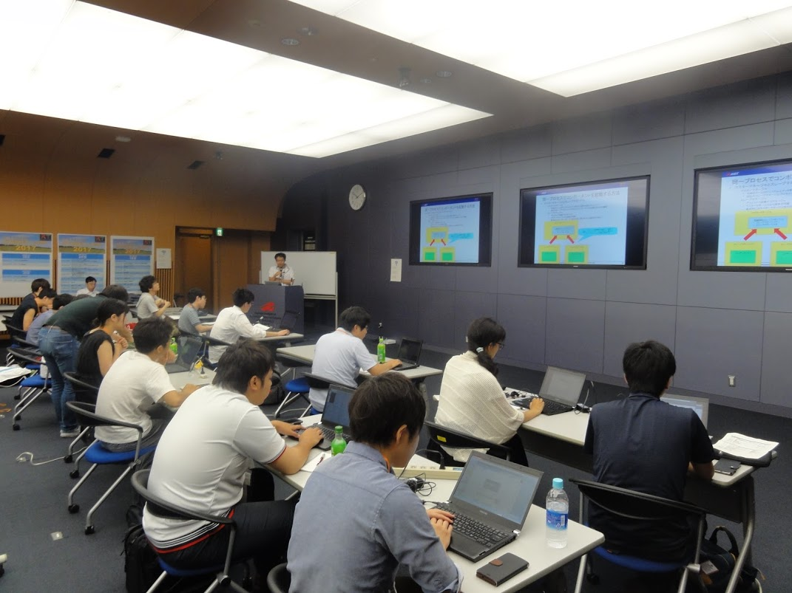</a>

 

<a href="sc2017_3.JPG">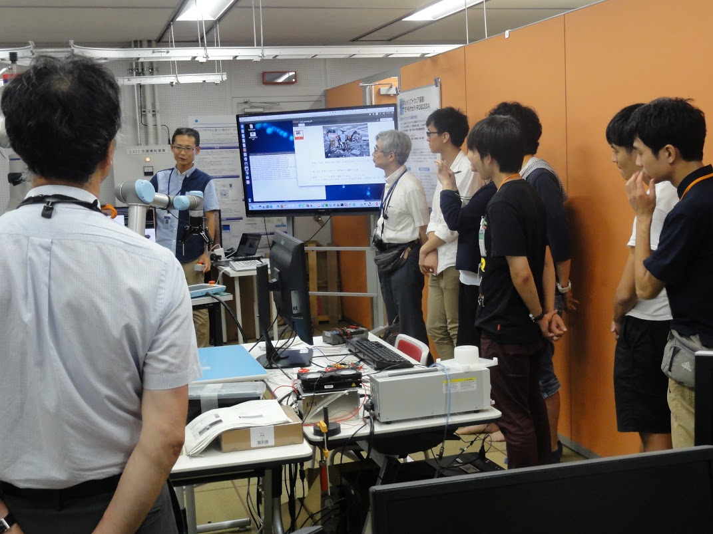</a>

 

 

<a href="sc2017_6.JPG">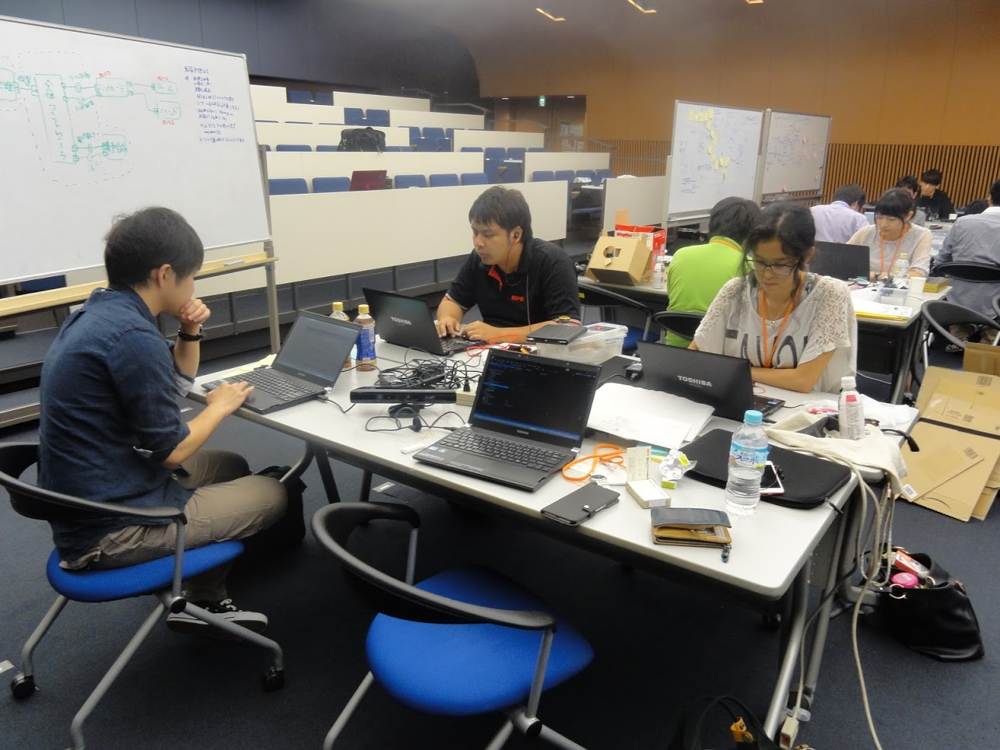</a>

 

<a href="sc2017_7.JPG">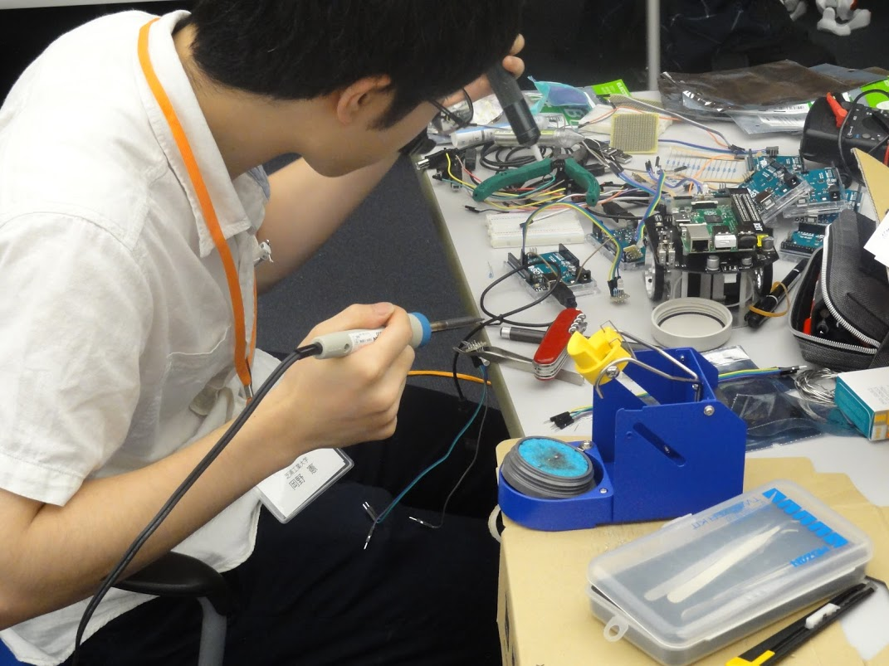</a>

 

<a href="sc2017_8.JPG">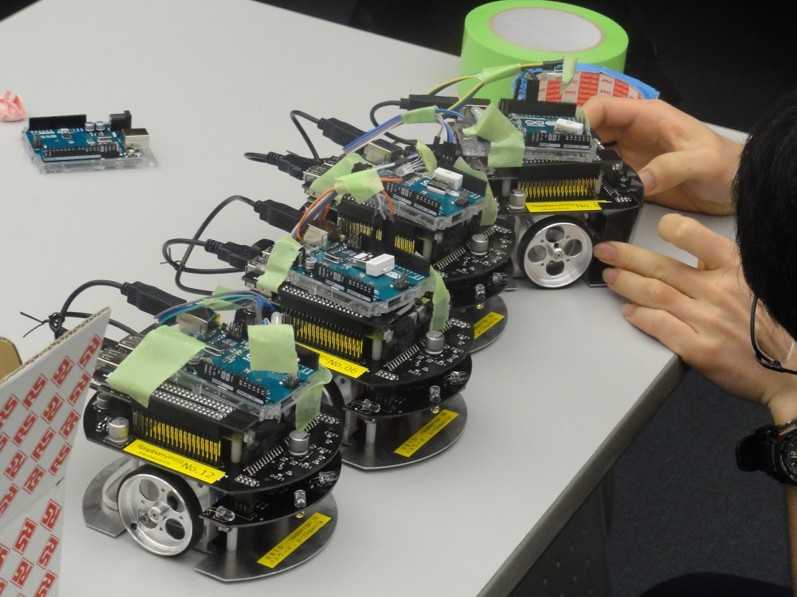</a>

 

<a href="sc2017_9.JPG">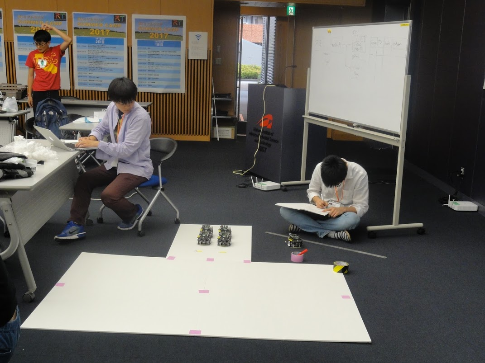</a>

 

<a href="sc2017_10.JPG">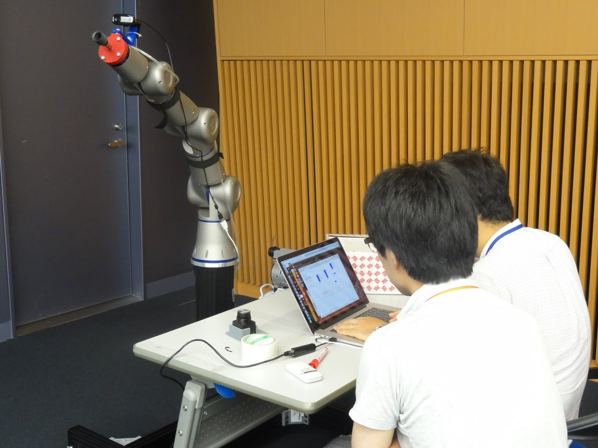</a>

 

<a href="sc2017_11.JPG">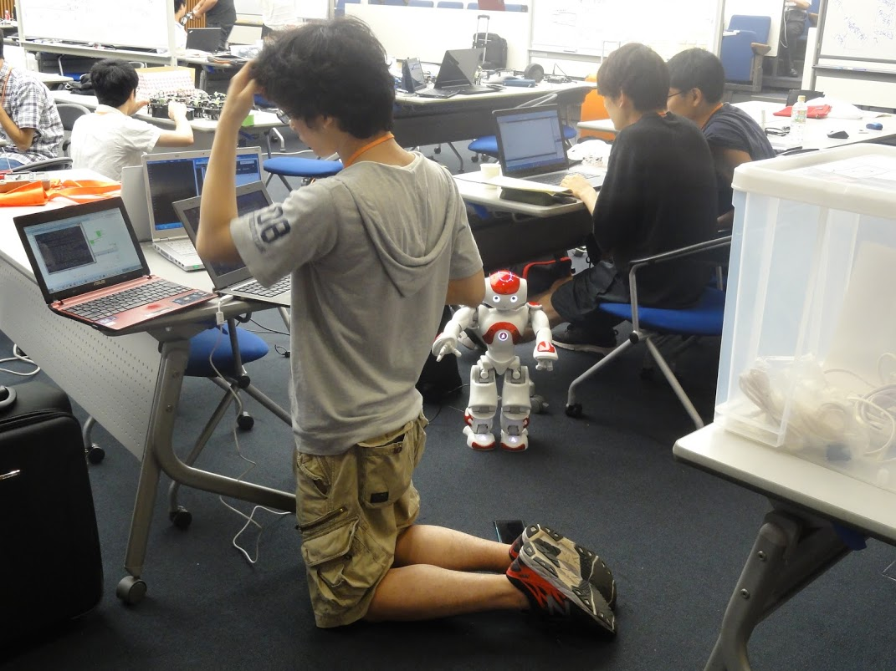</a>

 

