 
<a>No English version available.
</a>

<!-- -------jp page!!------- -->

<a href="summercamp2018_title.png">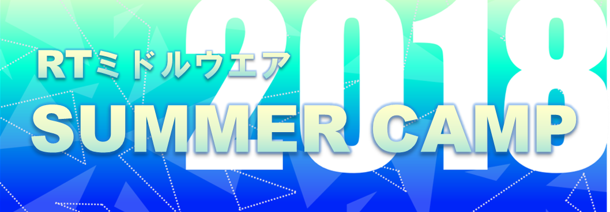</a>

#contents

## 開催報告

名城大学の大原先生のご尽力と多くの特別講師やサポートスタッフのご支援のおかげで、12名の参加者と共に、今年も、サマーキャンプを作り上げて行くことが出来ました。皆さまに御礼申し上げます。
この合宿研修の成果を、RTミドルウエアコンテストで発表いただけることを、期待しております。

<a href="syuugou2.jpg">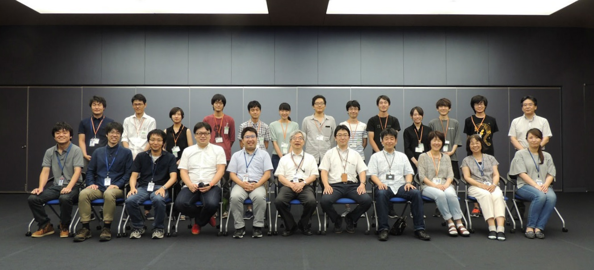</a>

<!-- **開催のご案内 -->

<!-- 今年で8回目となりました、RTミドルウエアキャンプを7月末日から8月上旬の5日間、茨城県つくば市の産業技術総合研究所において開催いたします。/RTミドルウエアやロボット開発に精通する講師陣のもとで、RTミドルウエアを用いた様々なロボットシステム開発を体験する機会を5日間にわたり提供します。RTミドルウエアを用いたプログラミングの方法や、実践的なロボットシステムへの応用、RTミドルウエアコンテストでの必勝法等、様々な講義を予定しています。宿泊施設として産総研のさくら館(要実費)を提供することを予定しており、一緒に参加した仲間とともに密度の濃い開発経験を通して、より実践的なロボットシステム構築方法を身に付けることができます。 -->

<!-- ''参加資格は、少なくとも1回以上RTミドルウエア講習会を受講した経験があるか、同等以上のプログラミングスキルを身に着けていることを条件とします。また、参加者は12月に行われるRTミドルウエアコンテストへの参加が期待されています。'' -->

<!-- *** 参加者の声 -->

<!-- - 最初は我々の開発課題が実現可能なのかどうか分からず、不安な気持ちを拭えない状態での参加だったのですが、講師の先生方には質問に対して懇切丁寧にご回答いただき、何とか実装までにこぎつけることができました。今はOpenRTMの中身も多少理解できる程度にまでなり、今回は参加してよかったと思っております。講師の先生方をはじめ、スタッフの皆さま、誠にありがとうございました。(社会人) -->
<!-- - 知識ゼロからのスタートでチームの方や講師の方々には大変なご迷惑をお掛けしましたが，5日間で大きく成長できたと思います。 -->
<!-- RTMのスペシャリストの方々が何人もサポートについて下さり，質問しやすい環境で作業に取り組むことができ充実した毎日でした。 -->
<!-- 終わってしまった今，少し寂しくなっています。RTMロスです。笑（M1） -->
<!-- - 意外とかなり楽しかったです(B4) -->
<!-- - 自分一人では作ることができないシステムでも，チームで協力してRTミドルウェアを使って構築することができた。 -->

## 開催要旨

本サマーキャンプでは、RTミドルウエアやロボット開発に精通する講師陣のもとで、RTミドルウエアを用いた様々なロボットシステム開発を体験する機会を提供します。この企画により、一緒に参加した仲間とともに密度の濃い開発経験を通して、より実践的なロボットシステム構築方法を身に付けることを目的としています。

### 共同開催
- 産業技術総合研究所　ロボットイノベーション研究センター
  - （公社）計測自動制御学会SI部門　RTシステムインテグレーション部会
  - （一社）日本ロボット工業会・ロボットビジネス推進協議会

### 後援
- 国立研究開発法人　新エネルギー・産業技術開発機構(NEDO)

<!-- *** 協力企業 -->
<!-- #ref(rt.png) -->
<!-- #ref(ga.png) -->
<!-- #ref(sec.png) -->

### 日時・場所
- 2018年7月30日～8月3日
- 産業技術総合研究所　つくばセンター中央第二　本部・情報棟１階　ネットワーク会議室　
  - [ガイドマップ](/ja/tutorial/guidemap)
  - [google map](https://maps.google.com/maps/ms?msid=202092058111064603321.0004e2699244f546ec525&msa=0&ll=36.05949,140.134263&spn=0.009098,0.011297)
- アクセス
  - 東京駅から並木2丁目:[高速バス時刻表](http://time.jrbuskanto.co.jp/bk03080.html)
    - 東京駅八重洲南口高速バス乗り場からつくばセンター・筑波大学行きに乗り、並木2丁目停留所にて下車してください。
    - 東京駅から1時間：下りは渋滞が少なくほぼ時間通り到着します。
  - 秋葉原駅からTXつくば駅経由:[産総研連絡バス時刻表](https://unit.aist.go.jp/tkb1/to_tsukuba_c_tx_bus20170401.pdf)
    - つくばエクスプレス秋葉原駅から終点つくば駅(快速：45分)まで乗車し、つくば駅から産総研連絡バスに乗車、つくば中央第1にて下車してください。
    - 連絡バス所用時間：20分から25分程度。
    - [連絡バス乗り場](http://www.aist.go.jp/aist_j/guidemap/tsukuba/tsukuba_c_express.html)
  - 常磐線荒川沖駅から路線バス:[荒川沖バス時刻表](http://kantetsu.co.jp/bus/timetable_files/tc/tc06.pdf)
    - 常磐線荒川沖駅にて降りていただき、関東鉄道バス西４乗り場筑波大学中央・筑波大学病院行きのバスに乗車し、並木2丁目で下車してください。
    - バスの所要時間は15分程度です。
<!-- -参加者: 17名（+講師・スタッフ 延べ21名） -->

<!-- ***サマーキャンプ2018レジュメ -->

<!-- サマーキャンプ2018レジュメを公開しました。 -->

<!-- - [[サマーキャンプ2017レジュメ:http://www.openrtm.org/openrtm/sites/default/files/6286/%E3%82%B5%E3%83%9E%E3%83%BC%E3%82%AD%E3%83%A3%E3%83%B3%E3%83%972017%E3%83%AC%E3%82%B8%E3%83%A5%E3%83%A1.pdf]] -->

### 参加資格
- RTミドルウェア講習会に参加したことがある，もしくは同等程度の経験を有していること．

または，

- 下記のサマーキャンプ受講希望者向けの講習会に参加する意思があること
  - [ROBOMECH2018講習会]({{ site.baseurl }}/ja/tutorial/robomech2018)(終了)
  - RTM強化月間
    - RTミドルウェア強化月間(第1弾)：早稲田大学・RTミドルウェア講習会(終了)
    - RTミドルウェア強化月間(第2弾)：名城大学・RTミドルウェア講習会(終了)
    - RTミドルウェア強化月間(第3弾)：都産技研・RTミドルウェア講習会(終了)

### 参加人数
- 参加者：13名 (欠席1名)
<!-- - 講師・スタッフ：20名 -->
<!-- スタッフ側のボランティアも随時募集 -->

### 参加費
無料（ただし，宿泊費や食事代は参加者の自己負担．産総研の宿泊施設を安価で提供）

### 実施概要
参加者各自がそれぞれの目的意識を持ち、その目的に向けた開発の初期工程の支援を本サマーキャンプの目的とする。~
本サマーキャンプで利用するRTコンポーネントは、NEDO知能化プロジェクトの成果，過去のRTミドルウェアコンテストの作品，さらには有志により開発されたRTコンポーネントを再利用することを基本とし，適宜各自の目的にあったRTコンポーネントの開発を促すことで，RTコンポーネントの開発，およびRTミドルウェアを用いたロボットシステム開発を行う．~
開発だけでなく，RTミドルウェアに見識のある講師を依頼し，RTミドルウェアによるロボットシステムの開発方法，RTミドルウェアでの開発を支援するツール群の利用方法からRTミドルウェアを用いたシステム事例の紹介まで行い，幅広くRTミドルウェアについての知識提供の機会を設ける。サマーキャンプ最終日には成果発表会を行い、その後作品とスライド等はホームページに掲載する．~

（参考）
- [サマーキャンプ2011]({{ site.baseurl }}/ja/tutorial/summercamp2011)
- [サマーキャンプ2012]({{ site.baseurl }}/ja/tutorial/summercamp2012)
- [サマーキャンプ2013]({{ site.baseurl }}/ja/tutorial/summercamp2013)
- [サマーキャンプ2014]({{ site.baseurl }}/ja/tutorial/summercamp2014)
- [サマーキャンプ2015]({{ site.baseurl }}/ja/tutorial/summercamp2015)
- [サマーキャンプ2016]({{ site.baseurl }}/ja/tutorial/summercamp2016)
- [サマーキャンプ2017]({{ site.baseurl }}/ja/tutorial/summercamp2017)

## プログラム

事情により変更する可能性もありますので，ご注意ください．;

<table class="table-alt">
  <tr>
    <td>CENTER: **7月30日(月)** </td>
    <td></td>
    <td>CENTER: **第1日目**</td>
  </tr>
  <tr>
    <td>12:30-13:00</td>
    <td>受付開始</td>
  </tr>
  <tr>
    <td>13:00-13:05</td>
    <td>開催の挨拶</td>
    <td>安藤 慶昭  (産業技術総合研究所)</td>
  </tr>
  <tr>
    <td>13:05-13:25</td>
    <td>RTミドルウェアサマーキャンプガイダンス</td>
    <td>大原賢一 (名城大)</td>
  </tr>
  <tr>
    <td>13:30-15:00</td>
    <td>産総研見学会</td>
  </tr>
  <tr>
    <td>15:00 - 15:50</td>
    <td>自己紹介・決意表明</td>
    <td>-</td>
  </tr>
  <tr>
    <td>16:00 - 17:30</td>
    <td>講義1: SysML実習 <a href="/sites/default/files/6548/2018SummerCamp-01.pdf ">講義資料</a></td>
    <td>坂本武志 (グローバルアシスト)</td>
  </tr>
  <tr>
    <td>18:00 -</td>
    <td>懇親会＠さくら館</td>
    <td>-</td>
  </tr>
</table>

<table class="table-alt">
  <tr>
    <td>CENTER: **7月31日(火)**</td>
    <td></td>
    <td>CENTER:**第2日目**</td>
  </tr>
  <tr>
    <td>09:30-10:00</td>
    <td>RTミドルウェアツール紹介１：  RT Shellを使った効率の良いRTシステム運用   <a href="/sites/default/files/6548/2018SummerCamp-02.pdf ">講義資料</a></td>
    <td>ビグス　ジェフ (産業技術総合研究所)</td>
  </tr>
  <tr>
    <td>10:00-10:30</td>
    <td>RTミドルウェアツール紹介2：  表計算ソフトによるRTコンポーネントの動作確認手順について  <a href="/sites/default/files/6548/2018SummerCamp-03.pdf ">講義資料</a></td>
    <td>宮本 信彦  (産業技術総合研究所)</td>
  </tr>
  <tr>
    <td>10:30-11:00</td>
    <td>RTミドルウェアツール紹介3：  効率の良いRTコンポーネント開発のための支援ツール  <a href="/sites/default/files/6548/2018SummerCamp-04.pdf ">講義資料</a></td>
    <td>黒瀬 竜一  (産業技術総合研究所)</td>
  </tr>
  <tr>
    <td>11:00-11:30</td>
    <td>RTシステム構築事例紹介1：   東京都立産業技術研究センターのRTMの取り組みT型ロボットデモストレーション</td>
    <td>佐々木智典  (東京都立産業技術 研究センター)</td>
  </tr>
  <tr>
    <td>11:30-12:00</td>
    <td>RTシステム構築事例紹介2：  つかえるRTコンポーネントの紹介  <a href="/sites/default/files/6548/2018SummerCamp-05.pdf ">講義資料</a></td>
    <td>原 功  (産業技術総合研究所)</td>
  </tr>
  <tr>
    <td>12:00-13:00</td>
    <td>昼休み</td>
  </tr>
  <tr>
    <td>13:00-15:00</td>
    <td>開発システム検討</td>
    <td>坂本武志 (グローバルアシスト)</td>
  </tr>
  <tr>
    <td>15:00-16:00</td>
    <td>開発目標システム発表</td>
  </tr>
  <tr>
    <td>16:00-18:00</td>
    <td>RTシステム構築実習1</td>
  </tr>
</table>

<table class="table-alt">
  <tr>
    <td>CENTER: **8月1日(水)** </td>
    <td></td>
    <td>CENTER: **第3日目**</td>
  </tr>
  <tr>
    <td>09:00 - 16:30</td>
    <td>RTシステム構築実習2</td>
    <td>-</td>
  </tr>
  <tr>
    <td>16:30 - 17:00</td>
    <td>各チームの進捗報告</td>
    <td>-</td>
  </tr>
</table>

<table class="table-alt">
  <tr>
    <td>CENTER: **8月2日(木)** </td>
    <td></td>
    <td>CENTER: **第4日目**</td>
  </tr>
  <tr>
    <td>09:00 - 16:30</td>
    <td>RTシステム構築実習3</td>
    <td>-</td>
  </tr>
  <tr>
    <td>16:30 - 17:00</td>
    <td>各チームの進捗報告</td>
    <td>-</td>
  </tr>
</table>

<table class="table-alt">
  <tr>
    <td>CENTER: ** 8月3日(金) ** </td>
    <td> </td>
    <td>CENTER: **第5日目**</td>
  </tr>
  <tr>
    <td>09:00 - 12:00</td>
    <td>RTシステム構築実習4</td>
    <td>-</td>
  </tr>
  <tr>
    <td>13:00 - 16:00</td>
    <td>成果報告会</td>
    <td>-</td>
  </tr>
  <tr>
    <td>16:00 - 16:10</td>
    <td>閉会の挨拶</td>
    <td>平井成興 （ビジ協・NEDO）</td>
  </tr>
  <tr>
    <td>16:10 - 17:00</td>
    <td>片付け</td>
    <td>-</td>
  </tr>
  <tr>
    <td>18:00 - 20:00</td>
    <td>RTミドルウェア情報交換会（BOFミーティング）</td>
    <td>-</td>
  </tr>
</table>

※本サマーキャンプでの成果物（作品・スライド）や成果発表の動画等は、ホームページで公開します。

### 産総研見学会

<table class="table-alt">
  <tr>
    <td>時間</td>
    <td>グループ1</td>
    <td>グループ2</td>
  </tr>
  <tr>
    <td>13:30-13:45</td>
    <td>フィールド(E-421-2)</td>
    <td>スマモビ（本部情報棟 1F）</td>
  </tr>
  <tr>
    <td>13:50-14:05</td>
    <td>RSP(E-413-2)</td>
    <td>フィールド(E-421-2)</td>
  </tr>
  <tr>
    <td>14:10-14:25</td>
    <td>スマコミ（RT-Room: E-234）</td>
    <td>RSP(E-413-2)</td>
  </tr>
  <tr>
    <td>14:30-14:45</td>
    <td>スマモビ（本部情報棟 1F）</td>
    <td>スマコミ（RT-Room: E-234)</td>
  </tr>
</table>

<!-- - 生活支援RTルーム（阪口、鍛冶、関山） -->
<!-- - 高精度な姿勢検出が可能な視覚マーカ（田中） -->
<!-- - アンドロイドを用いたコミュニケーション支援（松本(吉)） -->
<!-- - 移動知能とフィールドロボット研究（松本(治)、横塚） -->
<!-- - 全方向ステレオシステム（佐藤） -->

## 課題について
基本的には各参加者に課題を持ち寄っていただき，講師陣は参加者のサポートを行う形態を取ります．~
<!-- ただし，RTミドルウエア初心者でテーマ設定に悩む場合は，下記のような課題も考えております．~ -->

<!-- ***課題例 -->
<!-- |CENTER:200|LEFT:100|c -->
<!-- |Robocup@Homeの競技|[[資料>http://www.openrtm.org/openrtm/sites/default/files/rulehome2015.pdf]]| -->
<!-- |MobileRobotiNavigationFrameworkを用いたアプリケーション開発|[[資料>http://ogata-lab.jp/ja/technology_ja/mobile_nav_rtcs_ja.html]]| -->

### 課題例
<!-- |人型ロボット(G-Robot)を使ったモーション生成| -->
<table class="table-alt">
  <tr>
    <th>Pioneer/Kobukiを用いた課題自律移動ロボットの制御</th>
  </tr>
  <tr>
    <td>RTミドルウェアリファレンスハードウェア「OROCHI」を用いた物体把持</td>
  </tr>
</table>
<!-- |OpenHRIを用いた音声認識を用いた課題| -->
<!-- |RTスペース操作用コンポーネントの開発| -->
<!-- |レーザレンジファインダを用いた環境認識| -->
<!-- |AR Toolkitを用いた拡張現実感| -->

（注）変更する可能性もございますことご了承下さい．

<!-- **講習会申し込みフォーム -->
<!-- 以下のフォームからRTミドルウェアサマーキャンプ2017にお申し込み下さい． -->
<!-- - 参加登録するまえに当Webページのユーザ登録をお願いします．[[ユーザ登録はこちら:http://openrtm.org/openrtm/ja/user/register]] -->
<!-- - 当Webサイトにログイン済みの方は名前の欄にユーザ名が出ますが、必ず、氏名に書き換えてください． -->

<!-- **講演会のみのご参加について -->
<!-- 講演会のみご参加される方は，RTミドルウェアサマーキャンプ実行委員会幹事の~ -->
<!-- 名城大学大原(kohara(at)meijo-u.ac.jp)までご連絡ください． -->

## 実行委員会
<table class="table-alt">
  <tr>
    <th>実行委員長</th>
    <th>安藤　慶昭</th>
    <th><a href="https://staff.aist.go.jp/n-ando/index-j.html">産業技術総合研究所ロボットイノベーション研究センター　ロボットソフトウェアプラットフォーム研究チーム長</a></th>
  </tr>
  <tr>
    <td>幹事</td>
    <td>大原　賢一</td>
    <td><a href="http://mechatronics.meijo-u.ac.jp/study/ohara.html">名城大学理工学部メカトロニクス工学科　准教授</a></td>
  </tr>
  <tr>
    <td>委員</td>
    <td>原　功</td>
    <td><a href="http://hara.jpn.com">産業技術総合研究所ロボットイノベーション研究センター　ロボットソフトウェア研究ラボ　ラボ長</a></td>
  </tr>
  <tr>
    <td>委員</td>
    <td>菅　佑樹</td>
    <td><a href="http://sugarsweetrobotics.com/">株式会社SUGAR SWEET ROBOTICS</a></td>
  </tr>
  <tr>
    <td>委員</td>
    <td>ジェフ　ビグス</td>
    <td><a href="http://staff.aist.go.jp/geoffrey.biggs/">産業技術総合研究所ロボットイノベーション研究センター　ロボットソフトウェア研究ラボ　主任研究員</a></td>
  </tr>
  <tr>
    <td>委員</td>
    <td>平井　成興</td>
    <td>日本ロボット工業会・ロボットビジネス推進協議会・RTミドルウェアWG 主査</td>
  </tr>
  <tr>
    <td>委員</td>
    <td>神徳　徹雄</td>
    <td>産業技術総合研究所</td>
  </tr>
  <tr>
    <td>委員</td>
    <td>坂本　武志</td>
    <td>(株)グローバルアシスト</td>
  </tr>
  <tr>
    <td>委員</td>
    <td>佐々木　毅</td>
    <td>芝浦工業大学</td>
  </tr>
  <tr>
    <td>委員</td>
    <td>ジェフ　ビグス</td>
    <td>産業技術総合研究所</td>
  </tr>
  <tr>
    <td>委員</td>
    <td>菅　祐樹</td>
    <td>(株)Sugar Sweet Robotics</td>
  </tr>
  <tr>
    <td>委員</td>
    <td>原　功</td>
    <td>産業技術総合研究所</td>
  </tr>
  <tr>
    <td>委員</td>
    <td>平井　成興</td>
    <td>NEDO、ロボットビジネス推進協議会</td>
  </tr>
</table>

### サポート＆協力スタッフ
<!-- |原田　研介|産総研（見学対応御礼）| -->
<!-- |阪口　健|産総研（見学対応御礼）| -->
<!-- |田中　秀幸|産総研（見学対応御礼）| -->
<table class="table-alt">
  <tr>
    <th>相川　小弓</th>
    <th>産総研</th>
  </tr>
  <tr>
    <td>河内　のぶ</td>
    <td>産総研</td>
  </tr>
  <tr>
    <td>黒瀬　竜一</td>
    <td>産総研</td>
  </tr>
  <tr>
    <td>宮本　信彦</td>
    <td>産総研</td>
  </tr>
  <tr>
    <td>稲葉　晴美</td>
    <td>産総研</td>
  </tr>
</table>

## 参加者の方へ
### 自己紹介スライドの準備

参加されるかたは、自己紹介用スライドのテンプレートに従って自己紹介を作成してください．
送付方法は事務局より連絡させていただきます．
※テンプレートは準備中です。もう少々お待ちください。
<!-- - 自己紹介用スライドテンプレート: &ref(RTMサマーキャンプ参加者自己紹介テンプレート); -->

<!-- &aname(entry); -->
<!-- **講習会申し込みフォーム -->
<!-- 準備中です。少々お待ちください -->

<!-- 以下のフォームから講習会へお申し込みください。 -->
<!-- - 参加登録するまえに当Webページのユーザ登録をお願いします。[[ユーザ登録はこちら:http://openrtm.org/openrtm/ja/user/register]] -->
<!-- - 当Webサイトにログイン済みの方は&color(red){名前の欄のユーザ名を氏名に書き換えてください};。 -->
<!-- - フォーム送信後、確認メールをお送りいたします。1日たっても確認メールが届かない場合は、こちら support(at)openrtm.org までお問い合わせください。 -->

## 講義資料

## 講座
- [SysML実習](/sites/default/files/6548/2018SummerCamp-01.pdf )
<!-- Invalid YouTube URL: http://www.slideshare.net/108196432 -->

## RTミドルウェアツール紹介
- [RT Shellを使った効率の良いRTシステム運用](/sites/default/files/6548/2018SummerCamp-02.pdf )
<!-- Invalid YouTube URL: http://www.slideshare.net/108197316 -->

- [表計算ソフトによるRTコンポーネントの動作確認手順について](/sites/default/files/6548/2018SummerCamp-03.pdf )
<!-- Invalid YouTube URL: http://www.slideshare.net/108197497 -->

- [開発プロセスと RT コンポーネントのデバッグ･テスト手法](/sites/default/files/6548/2018SummerCamp-04.pdf )
<!-- Invalid YouTube URL: http://www.slideshare.net/108197695 -->

- [つかえるRTコンポーネントの紹介](/sites/default/files/6548/2018SummerCamp-05.pdf )
<!-- Invalid YouTube URL: http://www.slideshare.net/108197806 -->

## 開発成果

&aname(summercamp2018_group1);
### グループ1

- **課題**: モバイルロボットゲームパック
  - [プロジェクトページ](/ja/project/SummerCamp2018_group1)

<!-- Invalid YouTube URL: http://www.slideshare.net/108736729 -->

  - 開発モデル発表

<iframe width="560" height="315" src="https://www.youtube.com/embed/Ir7IzYPpSz0" frameborder="0" allowfullscreen></iframe>

  - 成果報告

<iframe width="560" height="315" src="https://www.youtube.com/embed/FWxefLb69HU" frameborder="0" allowfullscreen></iframe>

&aname(summercamp2018_group2);
### グループ2

- **課題**:NAOの大冒険
- [プロジェクトページ](/ja/project/SummerCamp2018_group2)

<!-- Invalid YouTube URL: http://www.slideshare.net/108735739 -->

  - 開発モデル発表

<iframe width="560" height="315" src="https://www.youtube.com/embed/bc2Fg0u0iQM" frameborder="0" allowfullscreen></iframe>

  - 成果報告

<iframe width="560" height="315" src="https://www.youtube.com/embed/RtAw4KkpQPo" frameborder="0" allowfullscreen></iframe>

&aname(summercamp2018_group3);
### グループ3
- **課題**:じゃんけんロボットシステム
  - [プロジェクトページ](/ja/project/SummerCamp2018_group3)
<!-- Invalid YouTube URL: http://www.slideshare.net/108736424 -->

  - 開発モデル発表

<iframe width="560" height="315" src="https://www.youtube.com/embed/47vOBBoKiNA" frameborder="0" allowfullscreen></iframe>

  - 成果報告

<iframe width="560" height="315" src="https://www.youtube.com/embed/B45teQvMjpY" frameborder="0" allowfullscreen></iframe>

&aname(summercamp2018_group4);
### グループ4
- **課題**:T型自律走行ロボット
  - [プロジェクトページ](/ja/project/SummerCamp2018_group4)

<!-- Invalid YouTube URL: http://www.slideshare.net/108736510 -->

  - 開発モデル発表

<iframe width="560" height="315" src="https://www.youtube.com/embed/WQZwcAaY7Zs" frameborder="0" allowfullscreen></iframe>

  - 成果報告

<iframe width="560" height="315" src="https://www.youtube.com/embed/yMCdjIn_QSc" frameborder="0" allowfullscreen></iframe>

## サマーキャンプの様子

<a href="pic-00.jpg">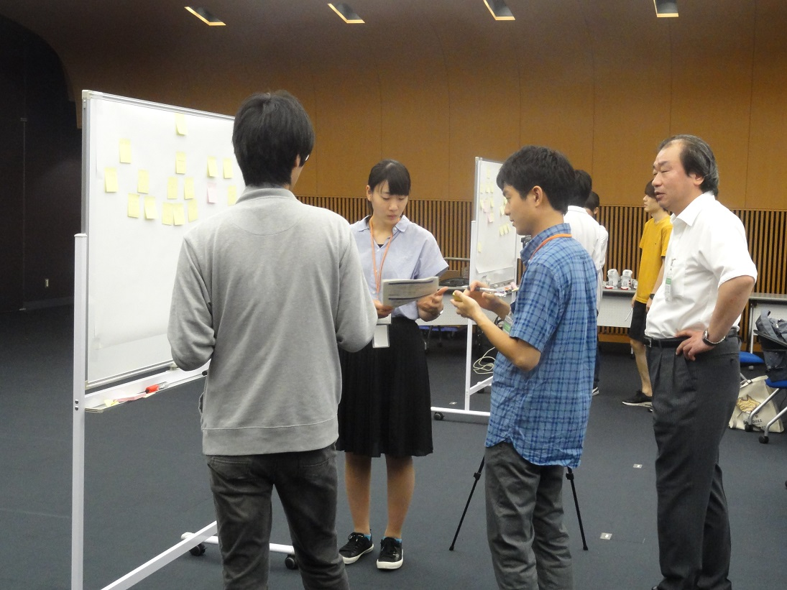</a>

 

<a href="pic-01.jpg">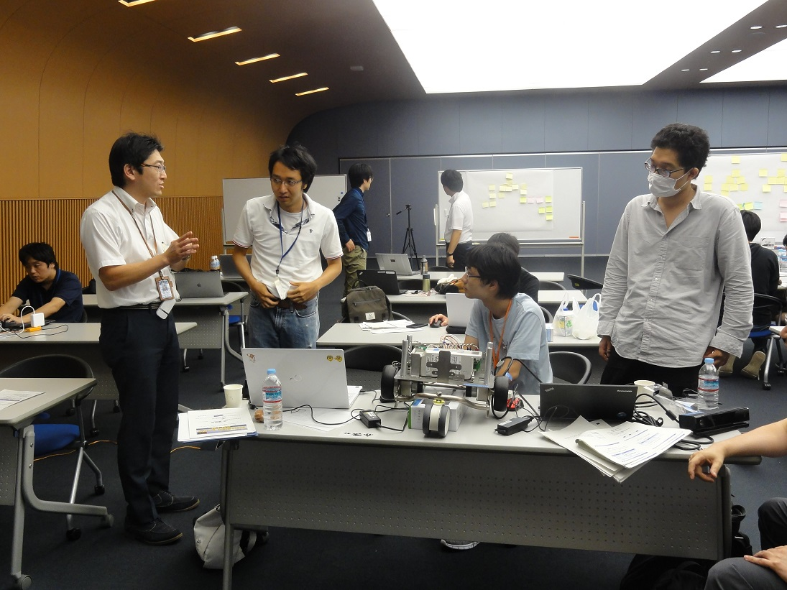</a>

 

<a href="pic-02.jpg">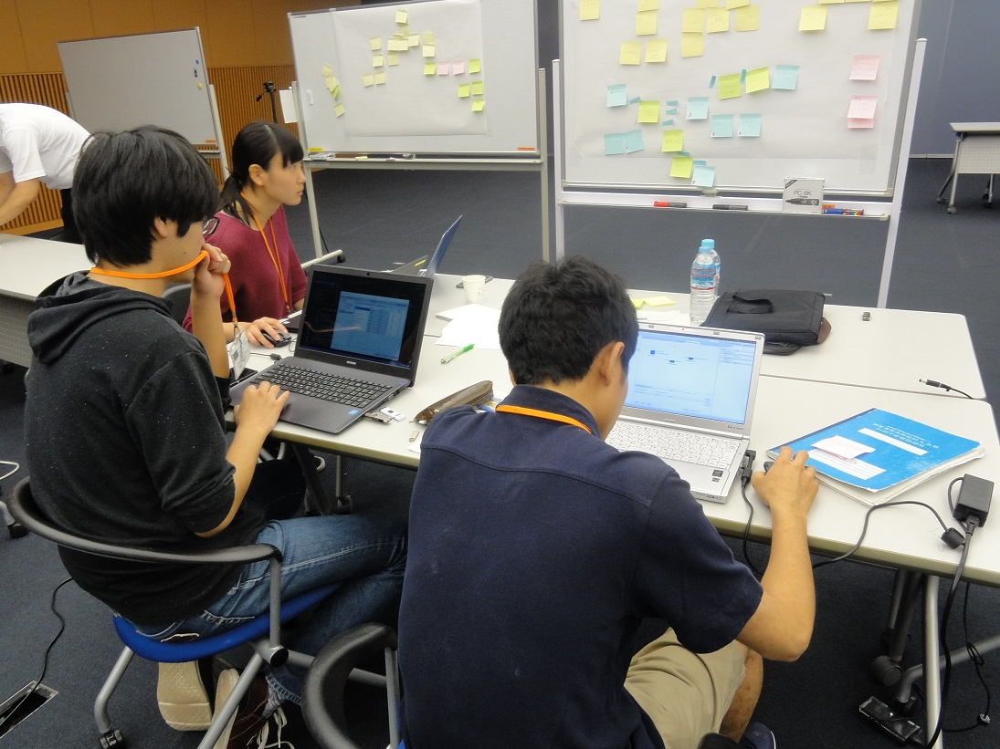</a>

 

<a href="pic-03.jpg">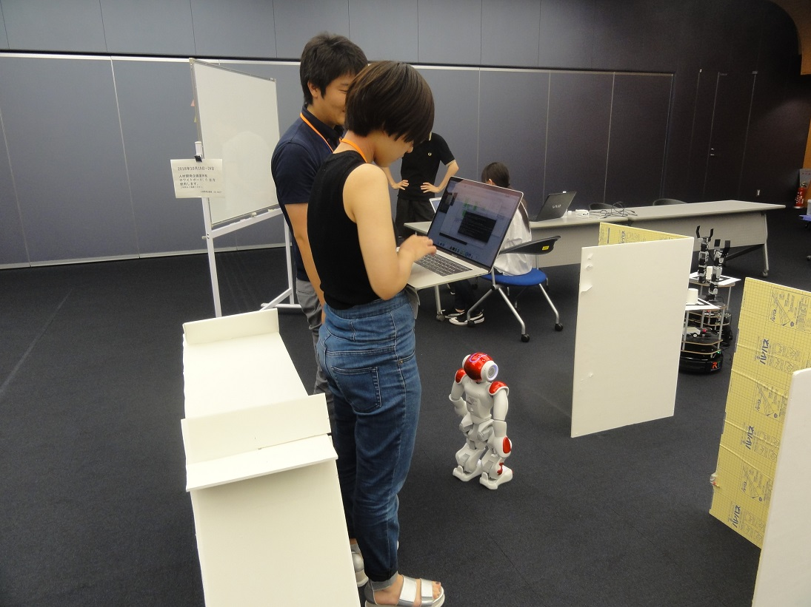</a>

 

<a href="pic-04.jpg">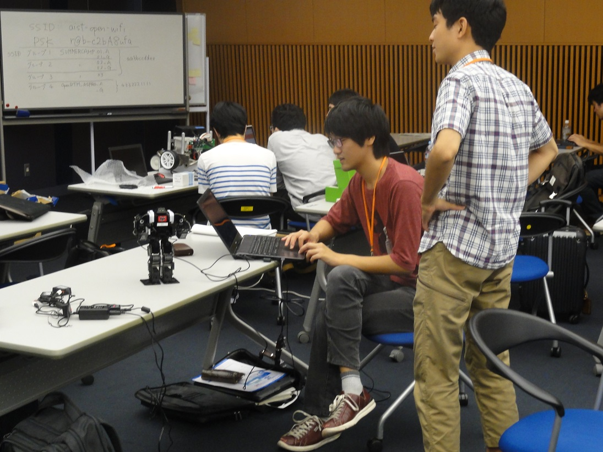</a>

 

<a href="pic-05.jpg">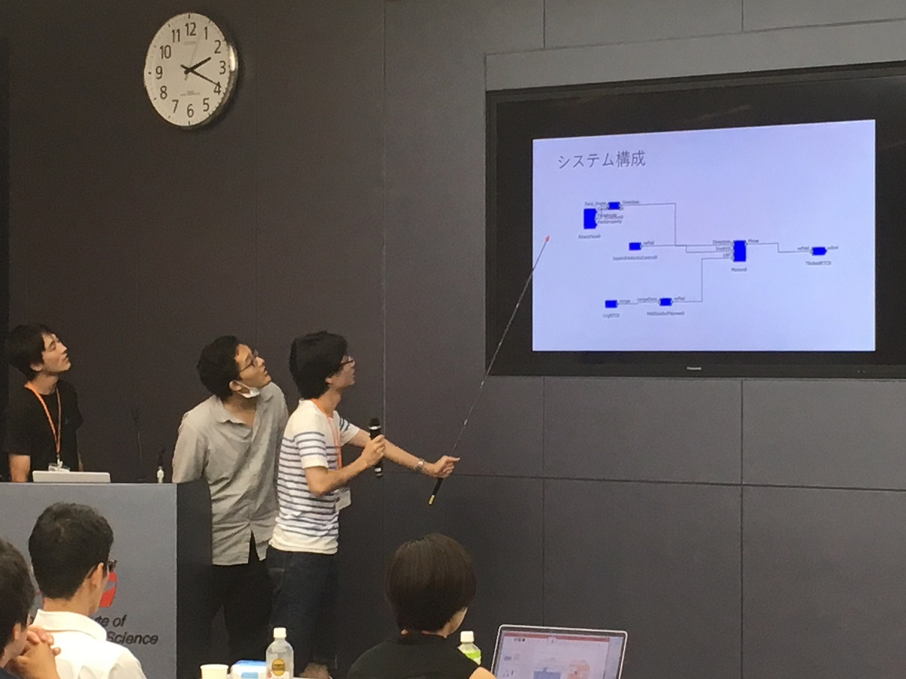</a>

 

<a href="pic-05-01.jpg">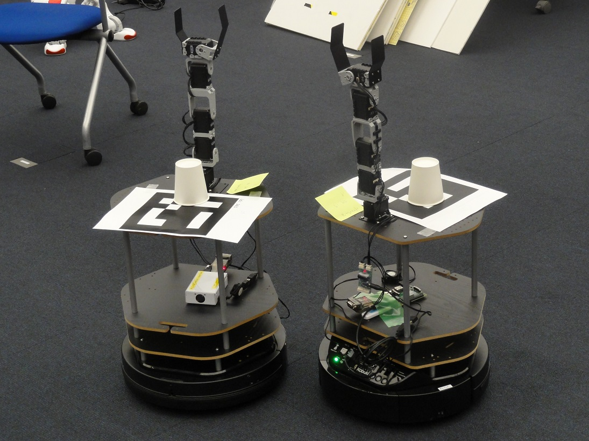</a>

 

<a href="pic-06.jpg">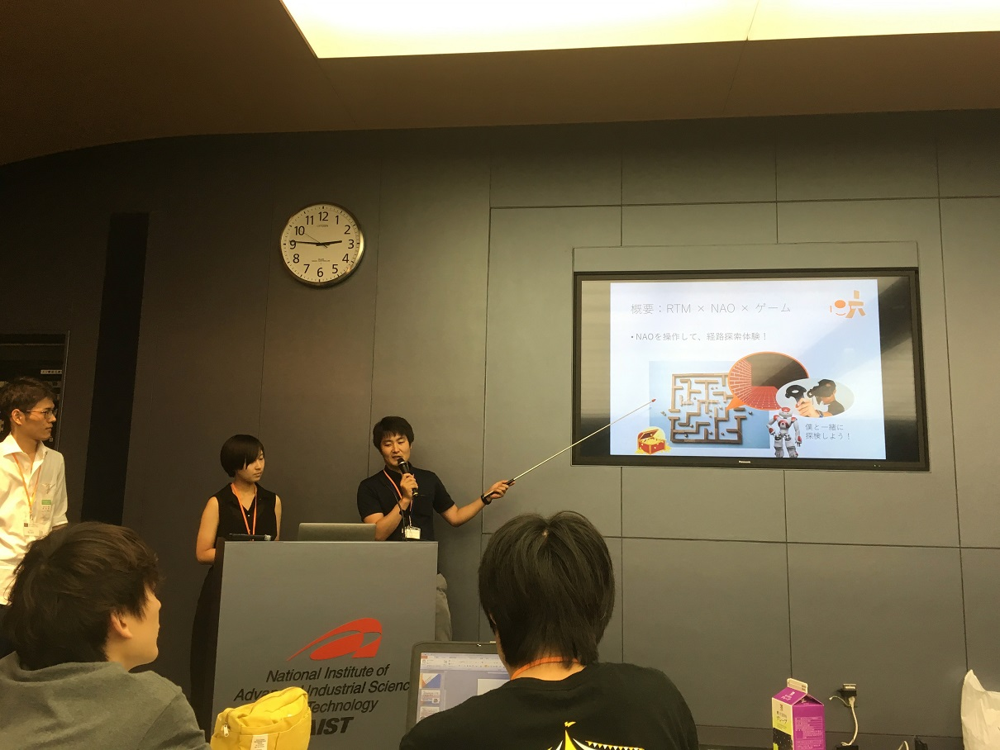</a>

 

<a href="pic-06-01.jpg">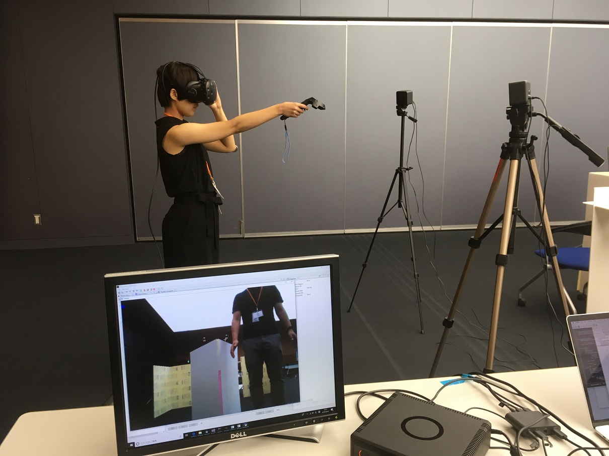</a>

 

<a href="pic-07.jpg">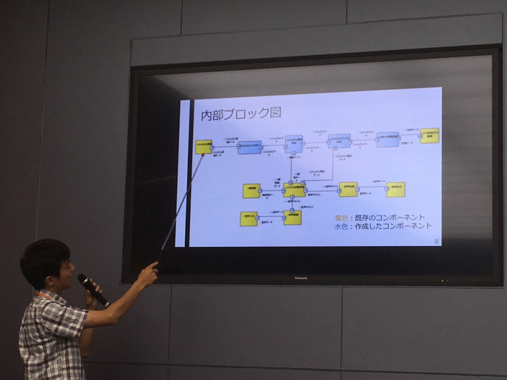</a>

 

<a href="pic-08-01.jpg">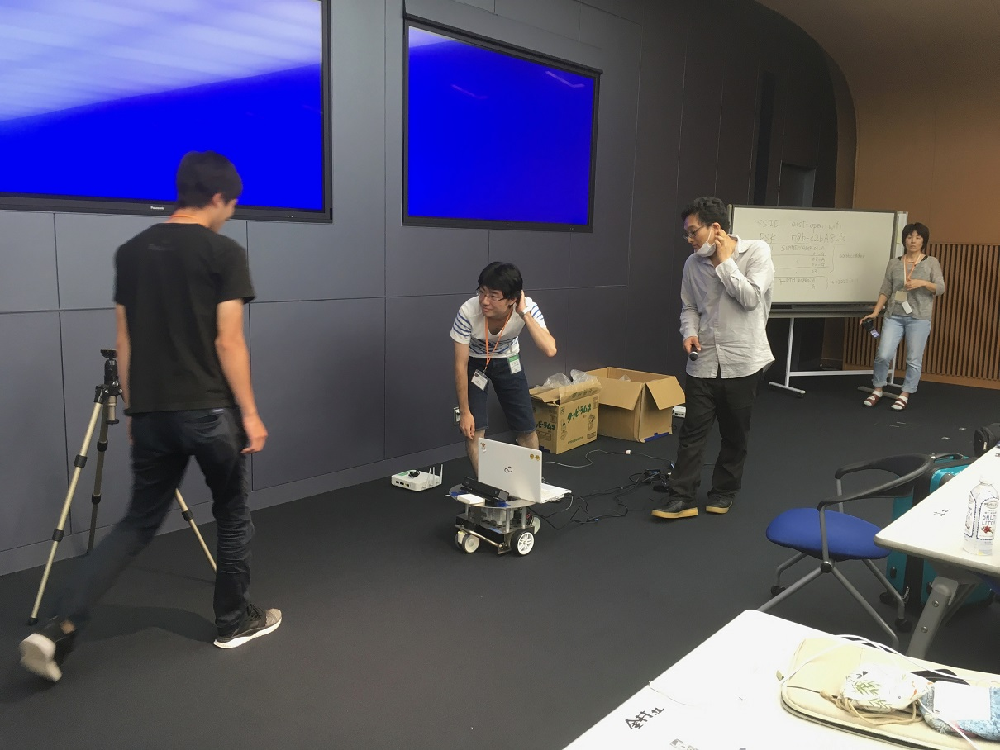</a>

 

<a href="pic-09.jpg">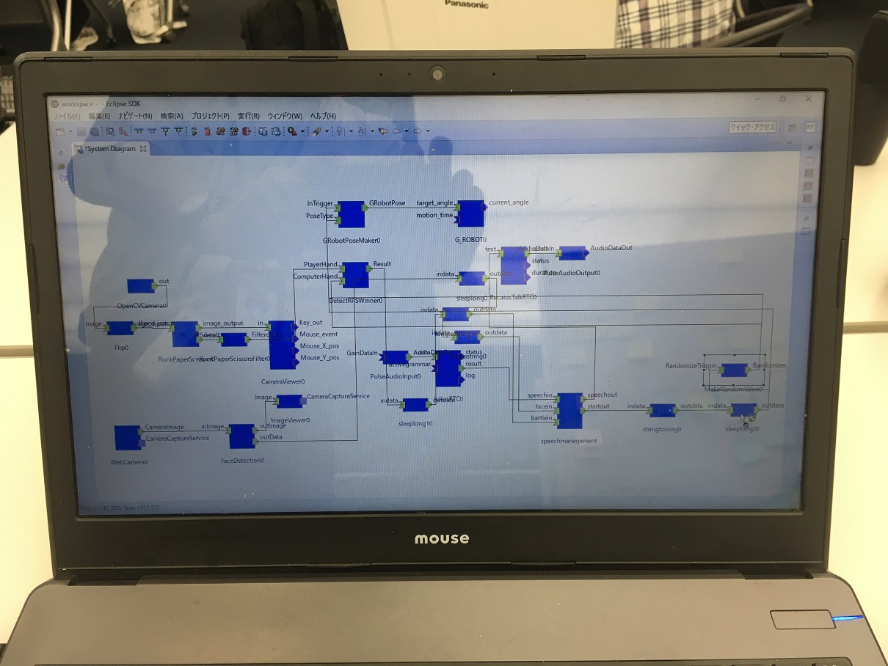</a>

 

## お問い合わせ

基本的な情報はホームページから提供いたします．
参加申込みいただいた方は連絡したメールに返信ください．

RTミドルウエアサマーキャンプ実行委員会~
summercamp(at)aist.go.jp~
(at)を＠におきかえてください．~

<!-- -------jp page!!------- -->
