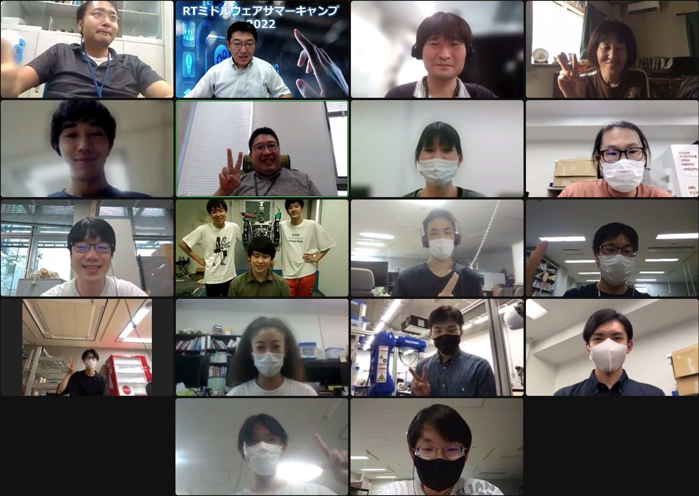
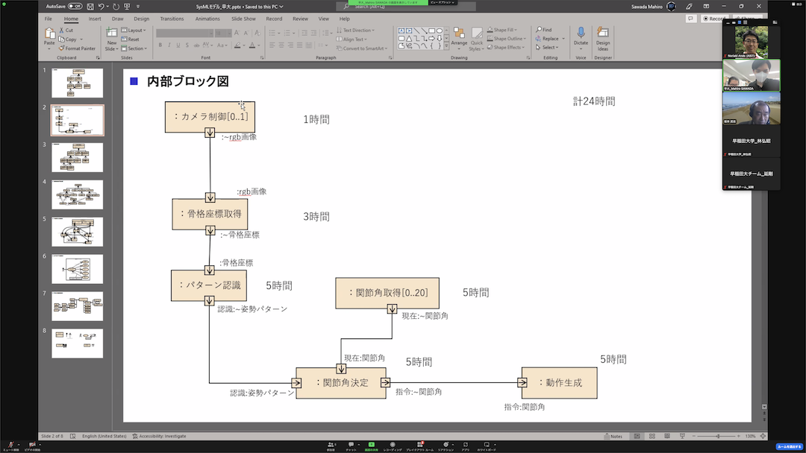
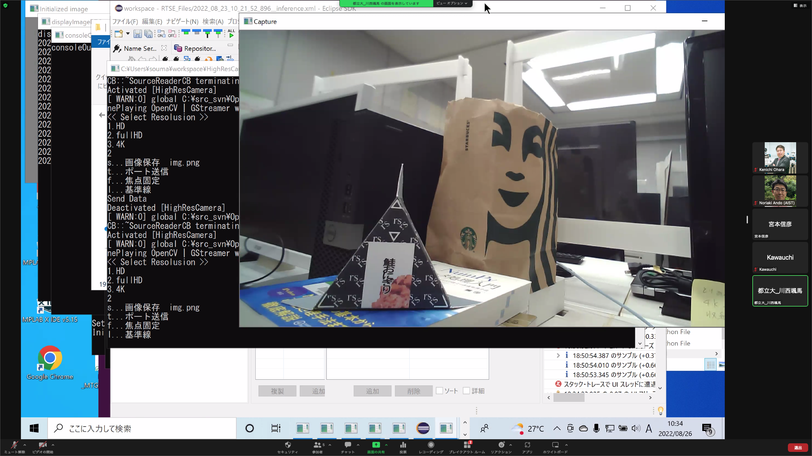
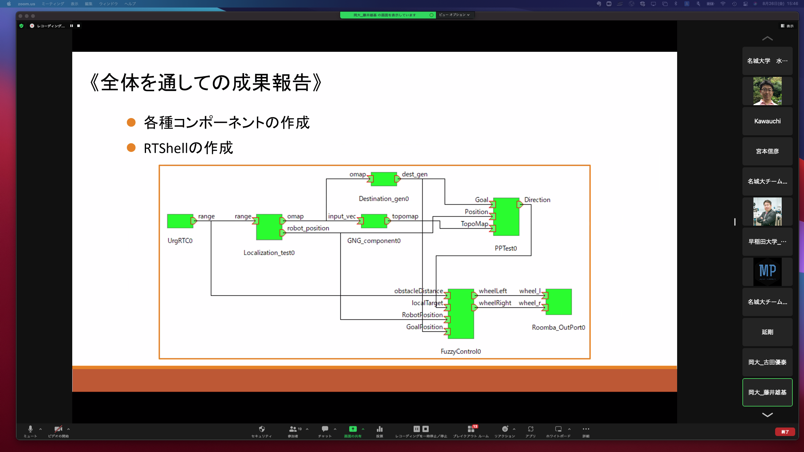

 
<a>No English version available.
</a>

<!-- -------jp page!!------- -->

#contents

## 開催のご案内

新型コロナウイルスの影響で、本年度のサマーキャンプもオンライン開催いたします。;

今年で12回目となりました、RTミドルウエアキャンプを8月22日から26日の5日間、オンラインにて開催いたします。RTミドルウエアやロボット開発に精通する講師陣のもとで、RTミドルウエアを用いた様々なロボットシステム開発を体験する機会を5日間にわたり提供します。RTミドルウエアを用いたプログラミングの方法や、実践的なロボットシステムへの応用、RTミドルウエアコンテストでの必勝法等、様々な講義を予定しています。一緒に参加した仲間とともに密度の濃い開発経験を通して、より実践的なロボットシステム構築方法を身に付けることができます。

**参加資格は、少なくとも1回以上RTミドルウエア講習会を受講した経験があるか、同等以上のプログラミングスキルを身に着けていることを条件とします。また、参加者は12月に行われるRTミドルウエアコンテストへの参加が期待されています。**

<!-- *** 参加者の声 -->

<!-- - RTミドルウェアを使う人は必修の合宿にしたほうがいいと思えるくらい素晴らしい合宿でした。(B4) -->
<!-- - 他大学の学生と知り合いの人ができました。チームで協力して目標のシステムを構築出来たので楽しかったです。(B4) -->

## 開催要旨

本サマーキャンプでは、RTミドルウエアやロボット開発に精通する講師陣のもとで、RTミドルウエアやROSを用いた様々なロボットシステム開発を体験する機会を提供します。この企画により、一緒に参加した仲間とともに密度の濃い開発経験を通して、より実践的なロボットシステム構築方法を身に付けることを目的としています。

#### 主催
- 産業技術総合研究所　インダストリアルCPS研究センター
- （公社）計測自動制御学会SI部門　RTシステムインテグレーション部会
- （一社）日本ロボット工業会・ロボットビジネス推進協議会

<!-- *** 後援 -->
<!-- -国立研究開発法人　新エネルギー・産業技術開発機構(NEDO) -->

#### 日時・場所
- 2022年8月22日（月）～8月26日（金）
- Zoom/Microsoft Teamsを利用したオンライン開催

### 参加資格

RTミドルウェア講習会に参加したことがある，もしくは同等程度の経験を有していること．
<!-- なお、例年強化月間と称して、7月に事前講習会を実施していますが、今年は原則実施ことといたします。&color(red){ (確認) } -->
これまで講習会を受講したことがない場合は、以下のチュートリアルを自習することで参加資格を満たしたことにいたします。

- [RTミドルウェアを10分で始めよう](/doc/installation/lets_start122) (インストールとサンプルの動作確認)
- [画像処理コンポーネントの作成](https://www.openrtm.org/openrtm/ja/node/6057) (画像処理コンポーネントの作成練習、USBカメラor内蔵カメラが必要)
- [ROBOMECH2022RTM講習会](../robomech2022) (移動ロボット実機を制御するコンポーネントの作成)

<!-- または， -->
<!-- -下記のサマーキャンプ受講希望者向けの講習会に参加する意思があること -->
<!-- --[[ROBOMECH2020講習会:/ja/tutorial/robomech2020]] -->
<!-- --RTM強化月間 (予定) -->
<!-- --- RTミドルウェア強化月間(第1弾)：早稲田大学・RTミドルウェア講習会 -->
<!-- --- RTミドルウェア強化月間(第2弾)：名城大学・RTミドルウェア講習会 -->
<!-- --- RTミドルウェア強化月間(第3弾)：都産技研・RTミドルウェア講習会(終了) -->

<!-- *** 参加人数 -->
<!-- - 参加者：11名 -->
<!-- - 講師・スタッフ：6名 -->
<!-- スタッフ側のボランティアも随時募集 -->

### 参加費
無料（オンライン参加に必要なPC・通信設備、通信費などは参加者でご用意いただきます。）

### 実施概要
個人またはグループで一つのロボットシステムやツールを開発し、最終日に成果発表とデモンストレーションをしていただきます。
可能であれば、開発した作品は、SI2022で行われるRTミドルウェアコンテストへエントリーしていただきたいと考えています。
参加にあたって、それぞれ目的意識を持ち、個人またはグループによる話し合いを通じて一つの課題を設定、SysMLを用いた要求分析・システム分析を行い、開発作業の見積もり・開発の分担をした上で開発作業を進めていただきます。

今年度は、オンラインでの開催としましたので、従来のグループワークは難しいと考えていますので、個人での参加または同じ研究室からの複数の参加を推奨いたします。
IT分野の勉強会で一般に「もくもく会」（集まって個人個人が黙々とコーディングをする会）と呼ばれる物がありますが、そのような形態を想定しています。
ただし、開発中、あるいは成果発表・デモ時には、参加者の所属大学・企業が許容する範囲で、新型コロナ感染拡大防止に配慮した上で、複数人が集まって作業・発表することも許容いたします。
また、事前にグルーピング及び開発対象についてヒアリングを行い、PCや簡単なセンサ、小型のロボットなどは要望があれば貸し出しします。
会期中は、前半は座学を中心に、後半は個人・グループそれぞれがリモートで個別に黙々と作業し、講師陣はオンラインで控えており質問に答える体制で進めます。

過去のサマーキャンプの様子は以下のリンクからご覧いただけますので参考にしてください。

（参考）
- [サマーキャンプ2011](../summercamp2011)
- [サマーキャンプ2012](../summercamp2012)
- [サマーキャンプ2013](../summercamp2013)
- [サマーキャンプ2014](../summercamp2014)
- [サマーキャンプ2015](../summercamp2015)
- [サマーキャンプ2016](../summercamp2016)
- [サマーキャンプ2017](../summercamp2017)
- [サマーキャンプ2018](../summercamp2018)
- [サマーキャンプ2019](../summercamp2019)
- [サマーキャンプ2020](../summercamp2020)
- [サマーキャンプ2021](../summercamp2021)

## プログラム

<!-- &color(red){準備中}; -->
<!-- &color(red){事情により変更する可能性もありますので，ご注意ください．}; -->

<table class="table-alt">
  <tr>
    <th>事前学習</th>
    <th colspan="2">サマーキャンプ開始までに視聴しておいてください。</th>
  </tr>
  <tr>
    <td></td>
    <td>講演: SysML講習会  ・<a href="2016SummerCamp-021.pdf">講義資料</a>  ・YouTubeビデオリンクはSlackにて共有</td>
    <td>坂本武志 (グローバルアシスト)</td>
  </tr>
</table>

<table class="table-alt">
  <tr>
    <th>8月22日(月)</th>
    <th colspan="2">第1日目</th>
  </tr>
  <tr>
    <td>13:00-13:05</td>
    <td>開催の挨拶</td>
    <td>安藤 慶昭  (産業技術総合研究所)</td>
  </tr>
  <tr>
    <td>13:05-13:30</td>
    <td>RTミドルウェアサマーキャンプガイダンス</td>
    <td>大原賢一 (名城大)</td>
  </tr>
  <tr>
    <td>13:30-14:20</td>
    <td>自己紹介・決意表明</td>
    <td>-</td>
  </tr>
  <tr>
    <td>14:30-16:00</td>
    <td>講演: SysMLを利用したロボット開発   <a href="20220822SC_GA.pdf">講義資料</a> , <a href="SysMLモデル例.pptx">SysMLモデル例.pptx</a></td>
    <td>坂本武志 (グローバルアシスト)</td>
  </tr>
  <tr>
    <td>16:00-17:30</td>
    <td>RTシステム開発実習</td>
    <td>グループに分かれてシステム構成を 検討してもらいます。</td>
  </tr>
  <tr>
    <td>18:00-</td>
    <td>懇親会＠Zoom</td>
    <td>-</td>
  </tr>
</table>

<table class="table-alt">
  <tr>
    <th>8月23日(火)</th>
    <th colspan="2">2日目</th>
  </tr>
  <tr>
    <td>9:30-10:10</td>
    <td>RTミドルウェア構築事例1：  RTミドルウェアを利用したシステム開発について(予定)  <a href="RTミドルウェアサマーキャンプ資料2021.pdf">講義資料</a></td>
    <td>菅 佑樹   (Sugar Sweet Robotics)</td>
  </tr>
  <tr>
    <td>10:20-11:00</td>
    <td>RTミドルウェアツール紹介3:   rtshellの使い方について  <a href="2019SummerCamp-04.pdf ">講義資料</a></td>
    <td>安藤 慶昭   (産業技術総合研究所)</td>
  </tr>
  <tr>
    <td>11:10-11:50</td>
    <td>RTミドルウェアツール紹介1：  利用可能なRTコンポーネントやツールについて  <a href="2021SummerCamp-02.pdf">講義資料</a></td>
    <td>宮本 信彦  (産業技術総合研究所)</td>
  </tr>
  <tr>
    <td>11:50-13:00</td>
    <td colspan="2">昼休み</td>
  </tr>
  <tr>
    <td>13:00-15:00</td>
    <td>講演：ロボットシステム開発とモデリング</td>
    <td>坂本武志 (グローバルアシスト)</td>
  </tr>
  <tr>
    <td>15:00-16:00</td>
    <td>開発システム構成発表</td>
    <td>今後開発するシステムに付いてグループごとに 発表してもらいます。</td>
  </tr>
  <tr>
    <td>16:00-18:00</td>
    <td>RTシステム構築実習1</td>
    <td>実際のシステム構築に取り組んでもらいます。</td>
  </tr>
  <tr>
    <td>18:00-22:00</td>
    <td>夜の部</td>
    <td>希望者は引き続き開発作業可能</td>
  </tr>
</table>

<table class="table-alt">
  <tr>
    <th>8月24日(水)</th>
    <th colspan="2">第3日目</th>
  </tr>
  <tr>
    <td>09:00-16:30</td>
    <td>RTシステム構築実習2</td>
    <td>-</td>
  </tr>
  <tr>
    <td>16:30-17:00</td>
    <td>各チームの進捗報告</td>
    <td>-</td>
  </tr>
  <tr>
    <td>17:00-22:00</td>
    <td>夜の部</td>
    <td>希望者は引き続き開発作業可能</td>
  </tr>
</table>

<table class="table-alt">
  <tr>
    <th>8月25日(木)</th>
    <th colspan="2">第4日目</th>
  </tr>
  <tr>
    <td>09:00-16:30</td>
    <td>RTシステム構築実習3</td>
    <td>-</td>
  </tr>
  <tr>
    <td>16:30-17:00</td>
    <td>各チームの進捗報告</td>
    <td>-</td>
  </tr>
  <tr>
    <td>17:00-22:00</td>
    <td>夜の部</td>
    <td>希望者は引き続き開発作業可能</td>
  </tr>
</table>

<table class="table-alt">
  <tr>
    <th>8月26日(金)</th>
    <th colspan="2">第5日目</th>
  </tr>
  <tr>
    <td>09:00-15:00</td>
    <td>RTシステム構築実習4</td>
    <td>-</td>
  </tr>
  <tr>
    <td>15:00-17:00</td>
    <td>成果報告会</td>
    <td>-</td>
  </tr>
  <tr>
    <td>17:00-17:10</td>
    <td>閉会の挨拶</td>
  </tr>
  <tr>
    <td>18:00-20:00</td>
    <td>RTミドルウェア情報交換会（BOFミーティング）@Zoom</td>
    <td>-</td>
  </tr>
</table>

※本サマーキャンプでの成果物（作品・スライド）や成果発表の動画等は、ホームページで公開します。

### 産総研見学会

今年はオンライン開催のため見学会はありません。
申し訳ございません。

<!-- ** 課題について -->
<!-- 基本的には各参加者に課題を持ち寄っていただき，講師陣は参加者のサポートを行う形態を取ります。 -->
<!-- 対象は、RTミドルウェアやROSを含むロボットミドルウエアを活用した課題であれば何でも結構です。 -->

<!-- *** 課題例 -->
<!-- |CENTER:200|LEFT:100|c -->
<!-- |Robocup@Homeの競技|[[資料>http://www.openrtm.org/openrtm/sites/default/files/rulehome2015.pdf]]| -->
<!-- |MobileRobotiNavigationFrameworkを用いたアプリケーション開発|[[資料>http://ogata-lab.jp/ja/technology_ja/mobile_nav_rtcs_ja.html]]| -->
<!-- |人型ロボット(G-Robot)を使ったモーション生成| -->
<!-- |Pioneer/Kobukiを用いた課題自律移動ロボットの制御| -->
<!-- |RTミドルウェアリファレンスハードウェア「OROCHI」を用いた物体把持| -->
<!-- |OpenHRIを用いた音声認識を用いた課題| -->
<!-- |RTスペース操作用コンポーネントの開発| -->
<!-- |レーザレンジファインダを用いた環境認識| -->
<!-- |AR Toolkitを用いた拡張現実感| -->

<!-- （注）変更する可能性もございますことご了承下さい． -->

<!-- *** 提供可能な機材 -->

<!-- - ノートPC (Think Pad Corei5程度のもの、10台まで） -->
<!-- -- 主に、Zoomで常時接続するための機材として提供、開発に使用しても構いません、Windows PC -->
<!-- - RaspberryPi Mouse (15台まで） -->
<!-- #ref(https://rt-net.jp/mobility/wp-content/uploads/2015/08/RaspberryPiMouse_s.jpg, left,150%) -->
<!-- -- LiDAR付きも１０台程度あり -->
<!-- -- https://rt-net.jp/mobility/products/raspberry-pi-mouse -->
<!-- -- https://www.youtube.com/watch?v=kbfV2R64yP4&feature=youtu.be -->
<!-- - Turtlebot Berger (10台まで) -->
<!-- #ref(https://www.besttechnology.co.jp/uploads/onlineshop/photos/e00192e594288ec39172.png, left,50%) -->
<!-- -- https://www.besttechnology.co.jp/modules/onlineshop/index.php?fct=photo&p=192 -->
<!-- - G-ROBOT (10台まで） -->
<!-- #ref(grobo.jpg, left,100%) -->
<!-- -- [[G-ROBOT>https://www.vstone.co.jp/robotshop/index.php?main_page=product_info&cPath=70_110&products_id=5197]] -->
<!-- - RaspberryPi (全体で１０台程度） -->
<!-- #ref(https://www.rt-shop.jp/blog/wp-content/uploads/2020/03/img_raspimouse01-765x800.png, left,50%) -->
<!-- -- 下記のセンサ類と組み合わせて使用するのも可 -->
<!-- - Phidgetセンサ類 + RaspberryPi + 拡張基盤セット (４セット） -->
<!-- -- RaspberryPiに拡張ボード実装済み -->
<!-- -- http://cgi3.win-ei.com/wordpress/?page_id=135 -->
<!-- -- Phidgetセンサ類：圧力、温度、光（lcd）、ジョイスティック、磁気、スライダー、タッチ（静電容量） -->
<!-- -- https://www.google.com/search?q=phidget+%E3%82%BB%E3%83%B3%E3%82%B5&rlz=1C5CHFA_enJP882JP882&sxsrf=ALeKk03gjJ3-w72H8-T3eiaYobupVJyVfw:1596525505946&source=univ&tbm=shop&tbo=u&sa=X&ved=2ahUKEwiphqD9gIHrAhUy7GEKHbPmAuEQsxh6BAgMEE4&biw=1632&bih=1326 -->
<!-- - micro:Bit + センサキット（４セット） -->
<!-- #ref(microbit_set.jpeg , left,80%) -->
<!-- -- micro:Bitと３７種類のセンサキット -->
<!-- -- https://www.amazon.co.jp/gp/product/B07QD558NQ/ref=ox_sc_act_title_1?smid=AWD3NUTTSH82N&psc=1 -->
<!-- - obniz (４セット） -->
<!-- #ref(obniz.jpeg, left,100%) -->
<!-- -- https://www.amazon.co.jp/gp/product/B082MDPRWZ/ref=ox_sc_act_title_1?smid=A2SZAQLZSFR347&psc=1 -->
<!-- - myCobot -->
<!-- #ref(2209131e-b842-4d31-9f42-21d47b4511ca.png, left,80%) -->
<!-- -- https://www.switch-science.com/catalog/7141/ -->
<!-- - Kobuki -->
<!-- #ref(kobuki_img-640x381.jpg, left,50%) -->
<!-- -- https://www.tegakari.net/2016/10/kobuki/ -->
<!-- - Intel RealSense Depth Camera D415 -->
<!-- #ref(e19bc180-fcb7-4a9f-b3a3-17a8d649601e.jpg, left,80%) -->
<!-- -- https://www.switch-science.com/catalog/3632/ -->

## 実行委員会
<table class="table-alt">
  <tr>
    <td>実行委員長</td>
    <td>安藤　慶昭</td>
    <td><a href="https://staff.aist.go.jp/n-ando/index-j.html">産業技術総合研究所インダストリアルCPS研究センター 副研究センター長</a></td>
  </tr>
  <tr>
    <td>幹事</td>
    <td>大原　賢一</td>
    <td><a href="http://mechatronics.meijo-u.ac.jp/study/ohara.html">名城大学理工学部メカトロニクス工学科　教授</a></td>
  </tr>
  <tr>
    <td>委員</td>
    <td>菅　佑樹</td>
    <td><a href="http://sugarsweetrobotics.com/">株式会社SUGAR SWEET ROBOTICS</a></td>
  </tr>
  <tr>
    <td>委員</td>
    <td>平井　成興</td>
    <td>日本ロボット工業会・ロボットビジネス推進協議会・RTミドルウェアWG 主査</td>
  </tr>
  <tr>
    <td>委員</td>
    <td>佐々木　毅</td>
    <td>芝浦工業大学・SICE SI部門RTシステムインテグレーション部会主査</td>
  </tr>
  <tr>
    <td>委員</td>
    <td>神徳　徹雄</td>
    <td>産業技術総合研究所</td>
  </tr>
  <tr>
    <td>委員</td>
    <td>坂本　武志</td>
    <td>(株)グローバルアシスト</td>
  </tr>
</table>

## 参加者の方へ
<!-- *** 自己紹介スライドの準備 -->

<!-- 参加されるかたは、自己紹介用スライドのテンプレートに従って自己紹介を作成してください． -->
<!-- 事前にSlackにてお送りください。 -->
<!-- 送付方法は事務局より連絡させていただきます． -->
<!-- ※テンプレートは準備中です。もう少々お待ちください。 -->
<!-- - 自己紹介用スライドテンプレート: [[自己紹介スライドテンプレート:https://openrtm.org/openrtm/sites/default/files/7155/%E8%87%AA%E5%B7%B1%E7%B4%B9%E4%BB%8B%E3%82%B9%E3%83%A9%E3%82%A4%E3%83%88%E3%82%99.pptx]]; -->

### 最終成果報告会および提出物について
成果物として以下の物を用意して成果報告会にて発表していただきます。

- **プレゼン資料** → Slackで提出
  - PowerPoint などで作成してください。最終的には本ページに掲載されますので一般公開可能な情報のみで作成してください。
- **システムのソースコードおよびバイナリ** → プロジェクトページに自分で格納
  - このWebサイト上にプロジェクトページを作成して以下の物を格納してください
  - 自作のRTCはソースコードとバイナリ
    - ソースコードはできるだけ各自のGitHubリポジトリに置くことを推奨します
  - 再利用したRTCはダウンロードした場所などの情報，バイナリ
    - 利用させてもらったRTCは出どころを明記した上でリンクを貼ってください
- **マニュアル，ドキュメント** → プロジェクトページに自分で格納
  - 今回作成したシステムを第三者が再現できる情報をマニュアル化してください。
  - 過去のサマーキャンプやコンテストのプロジェクトを参照してください
    - [RTMサマーキャンプ2021作品一覧](../summercamp2021#toc15)
    - [RTMコンテスト2021作品一覧](https://openrtm.org/openrtm/ja/contests/2021)(no_page)
- **SysMLやＵＭＬなどのモデルをつくったらそのデータ** → プロジェクトページに自分で格納
  - モデリングツールでモデル作成をした場合はそのデータ
  - 最終成果報告会の発表資料にモデルが含まれていればそれでも結構です

<!-- &aname(entry); -->
<!-- ** サマーキャンプ2022申し込み (8/16〆切) -->

<!-- 本ページのフォームからRTミドルウェアサマーキャンプにお申し込み下さい． -->
<!-- - 参加登録するまえに当Webページのユーザ登録をお願いします。[[ユーザ登録はこちら:http://openrtm.org/openrtm/ja/user/register]] -->
<!-- - 当Webサイトにログイン済みの方は&color(red){名前の欄のユーザ名を氏名に書き換えてください};。 -->
<!-- - フォーム送信後、確認メールをお送りいたします。1日たっても確認メールが届かない場合は、こちら summercamp(at)openrtm.org までお問い合わせください。 -->
<!-- -- (at)を＠におきかえてください。 -->
<!-- - 参加申込期限は8/16とします。 -->

## 講義資料

- [SysML実習](20220822SC_GA.pdf)
<!-- Invalid YouTube URL: http://www.slideshare.net/252678104 -->
<!-- <nowiki> -->
<!-- [video:https://www.youtube.com/watch?v=H0o4OoCFCRE&feature=youtu.be] -->
<!-- </nowiki> -->

- [ロボットミドルウェアでロボットシステムを作る](RTミドルウェアサマーキャンプ資料2021.pdf  )
<!-- Invalid YouTube URL: http://www.slideshare.net/252677889 -->

<!-- - [[利用可能なRTコンポーネントやツールについて:/sites/default/files/7155/2022SummerCamp-02.pdf  ]] -->
<!-- <nowiki> -->
<!-- [video:http://www.slideshare.net/250060412] -->
<!-- </nowiki> -->

<!-- - [[eSEATの使い方とROSとの連携について:/sites/default/files/6705/2019SummerCamp-03.pdf ]] -->
<!-- <nowiki> -->
<!-- [video:http://www.slideshare.net/159363071] -->
<!-- </nowiki> -->

<!-- - [[ rtshellの使い方について:/sites/default/files/6705/2019SummerCamp-04.pdf ]] -->
<!-- <nowiki> -->
<!-- [video:http://www.slideshare.net/159088816] -->
<!-- </nowiki> -->

## 開発成果

&aname(summercamp2021_group1);
### 名城大グループ1

- **課題**: ピッキングシステム
  - [プロジェクトページ](/ja/project/SummerCamp2022_group1)(no_page)
  - [最終成果発表資料](https://www.slideshare.net/openrtm/ss-252721420)

<!-- Invalid YouTube URL: http://www.slideshare.net/252721420 -->

  - 成果報告

<iframe width="560" height="315" src="https://www.youtube.com/embed/7bb1oF8Lr1c" frameborder="0" allowfullscreen></iframe>

      - 

&aname(summercamp2022_group2);
### 名城大グループ2

- **課題**: 商品自動補充ロボットシステム
  - [プロジェクトページ](/ja/project/SummerCamp2022_group2)(no_page)
  - [最終成果発表資料](https://www.slideshare.net/openrtm/ss-252710121)

<!-- Invalid YouTube URL: http://www.slideshare.net/252710121 -->

  - 成果報告

<iframe width="560" height="315" src="https://www.youtube.com/embed/dL73QfWjyA0" frameborder="0" allowfullscreen></iframe>

      - 

&aname(summercamp2022_group3);
### 岡山大グループ

- **課題**: GNGを使った未知環境における経路計画
  - [プロジェクトページ](/ja/project/SummerCamp2022_group3)(no_page)
  - [最終成果発表資料](https://www.slideshare.net/openrtm/gng-252710439)

<!-- Invalid YouTube URL: http://www.slideshare.net/252710439 -->

  - 成果報告

<iframe width="560" height="315" src="https://www.youtube.com/embed/TKs6wNd32I4" frameborder="0" allowfullscreen></iframe>

      - 

&aname(summercamp2022_group4);
### 早稲田大グループ

- **課題**: まねっこロボット
  - [プロジェクトページ](/ja/project/SummerCamp2022_group4)(no_page)
  - [最終成果発表資料](https://www.slideshare.net/openrtm/ss-252710179)

<!-- Invalid YouTube URL: http://www.slideshare.net/252710179 -->

  - 成果報告

<iframe width="560" height="315" src="https://www.youtube.com/embed/zKbgaRtlqgA" frameborder="0" allowfullscreen></iframe>

      - 

&aname(summercamp2022_group5);
### 東京都立大グループ

- **課題**: おにぎりトレーサー
  - [プロジェクトページ](/ja/project/SummerCamp2022_group5)(no_page)
  - [最終成果発表資料](https://www.slideshare.net/openrtm/rt2022pptx)

<!-- Invalid YouTube URL: http://www.slideshare.net/252709966 -->

  - 成果報告

<iframe width="560" height="315" src="https://www.youtube.com/embed/laOG-GTYByk" frameborder="0" allowfullscreen></iframe>

      - 

## サマーキャンプの様子
<!--  -->

 

 

 

 

<!-- ** お問い合わせ -->
<!--  -->
<!-- 基本的な情報はホームページから提供いたします． -->
<!-- 参加申込みいただいた方は連絡したメールに返信ください． -->
<!--  -->
<!-- RTミドルウエアサマーキャンプ実行委員会~ -->
<!-- summercamp(at)aist.go.jp~ -->
<!-- (at)を＠におきかえてください．~ -->
<!--  -->
<!-- ** 参加申し込み -->
<!--  -->
<!-- + ''ユーザ登録:'' 参加登録するまえに当Webページのユーザ登録をお願いします。[[ユーザ登録はこちら:http://openrtm.org/openrtm/ja/user/register]] -->
<!-- -- 当Webサイトにログイン済みの方は名前の欄にユーザ名が出ますが、氏名に書き換えてください。 -->
<!-- + ''ログイン:'' ユーザ登録後 openrtm.org のサイトにログインします。 -->
<!-- + ''参加登録:'' 下記の登録フォームに必要事項を記入し登録してください。 -->
<!-- -- フォーム送信後、確認メールをお送りいたします。1日たっても確認メールが届かない場合は、[[こちら（summercamp(at)aist.go.jp）:mailto:summercamp@aist.go.jp]] までお問い合わせください。 -->
<!-- + 本フォームで登録された情報は、RTMサマーキャンプ2022以外では使用しません。 -->

<!-- #ref(reg_flow.png,60%,left,nolink) -->

<!-- -------jp page!!------- -->
