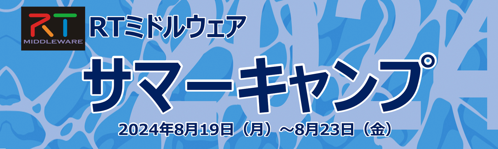
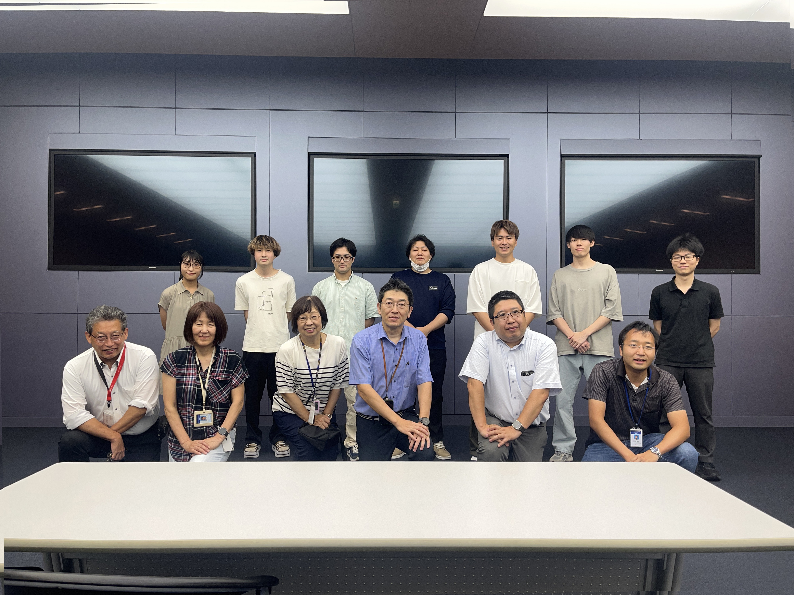
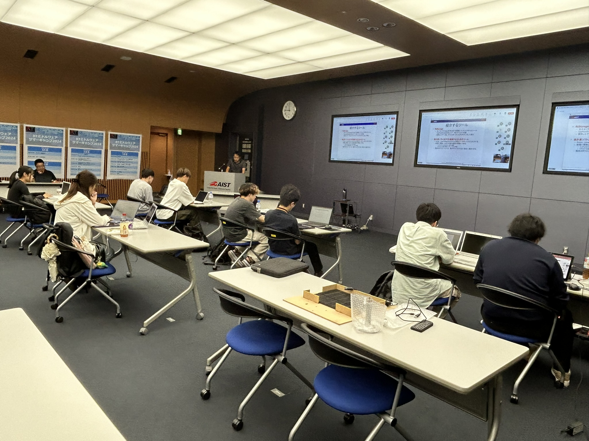
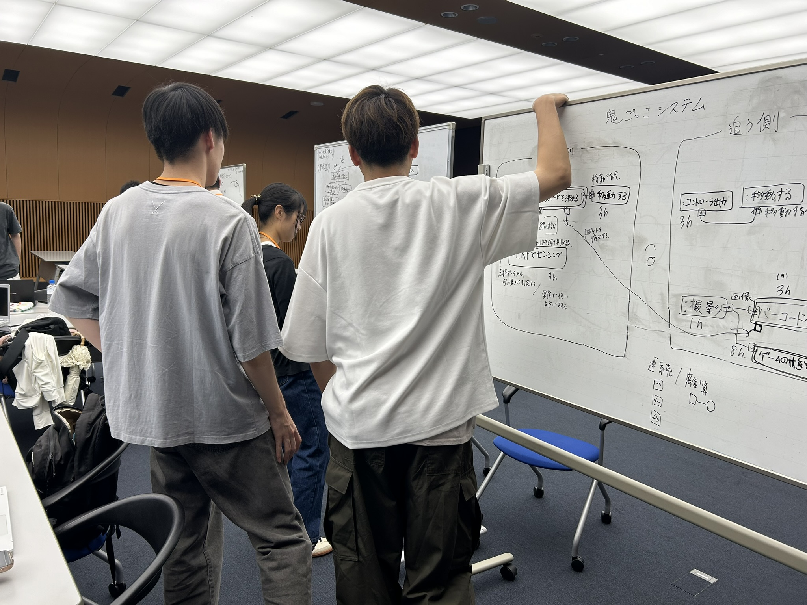
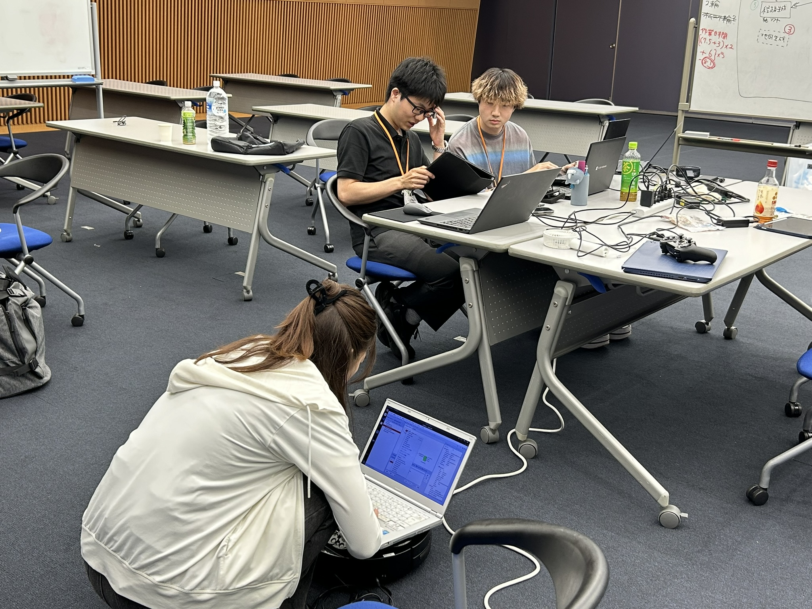
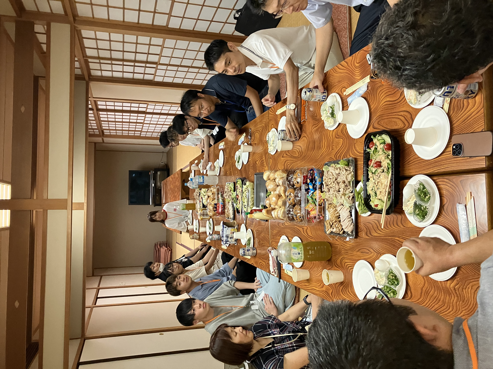

# Event Report

## Event Announcement

<!-- &color(red){Due to the impact of COVID-19, this year’s summer camp will also be held online.}; -->

The 14th RT Middleware Summer Camp will be held for five days from August 19 to August 23 at the AIST Tsukuba Center (with a hybrid online format). Under the guidance of instructors highly experienced in RT Middleware and robot development, participants will be provided with opportunities to experience various robot system development projects using RT Middleware over the course of five days. Various lectures are planned, including programming methods using RT Middleware, practical applications to robot systems, and winning strategies for the RT Middleware Contest. Through intensive collaborative development experiences with fellow participants, attendees will be able to acquire more practical robot system construction skills.

## Overview

This summer camp provides participants with opportunities to experience various robot system development projects using RT Middleware and ROS under the guidance of instructors who are highly experienced in RT Middleware and robotics development. Through intensive collaborative development experiences with fellow participants, the goal of this program is to help attendees acquire more practical robot system construction skills.

#### Organizers
- Industrial CPS Research Center, National Institute of Advanced Industrial Science and Technology (AIST)
- RT System Integration Committee, SI Division, The Society of Instrument and Control Engineers (SICE)
- Japan Robot Association / Robot Business Promotion Council

<!-- *** Support -->
<!-- -New Energy and Industrial Technology Development Organization (NEDO) -->

#### Date and Venue
- August 19 (Mon.) – August 23 (Fri.), 2024
<!-- - Online event using Zoom/Microsoft Teams -->
- Hybrid Event
  - National Institute of Advanced Industrial Science and Technology (AIST), Central Complex 1, Tsukuba Headquarters, Information Technology Collaborative Research Building 1F, Network Conference Room
  - Online (using Teams/Zoom, etc.)

### Eligibility Requirements

Participants must have attended an RT Middleware workshop previously or possess equivalent experience.
<!-- In previous years, preliminary workshops were held in July as part of an “Intensive Training Month,” but this year they will generally not be held. &color(red){ (Confirmation) } -->
If you have never attended a workshop before, you may satisfy the participation requirements by self-studying the following tutorials.

- [Get Started with RT Middleware in 10 Minutes]({{ site.baseurl }}/ja/doc/installation/lets_start122) (Installation and sample operation check)
- [Creating an Image Processing Component](https://www.openrtm.org/openrtm/ja/node/6057) (Practice creating image processing components; requires a USB camera or built-in camera)
- [ROBOMECH2024RTM Workshop](../robomech2024) (Creating components to control an actual mobile robot)

### Participation Fee
Free
<!-- Participants are responsible for preparing their own PCs, communication equipment, and communication costs required for online participation. -->

### Implementation Overview
Participants, either individually or in groups, will develop a robot system or tool and give a成果 presentation and demonstration on the final day.
If possible, participants are encouraged to enter their developed works into the RT Middleware Contest held at SI2024.
Participants are expected to set clear objectives, define a project theme through individual or group discussions, conduct requirements analysis and system analysis using SysML, estimate development tasks, assign development responsibilities, and proceed with development accordingly.

In the IT field, there are gatherings commonly known as “mokumoku-kai,” where individuals gather and quietly focus on coding independently; this camp is envisioned in a similar style.
However, during development activities and final presentations/demonstrations, participants may gather and work together within the limits permitted by their affiliated universities or companies, while taking precautions to prevent the spread of COVID-19.
Additionally, we will conduct interviews in advance regarding grouping and development themes, and PCs, simple sensors, and small robots can be loaned upon request.
<!-- During the camp period, the first half will focus mainly on lectures, while the second half will involve individual or group remote work sessions, with instructors available online to answer questions. -->

Please refer to the following links for examples of previous summer camps.

## Program

- [Teams Meeting Link](https://teams.microsoft.com/l/meetup-join/19%3ameeting_NGI0ZDJiNTEtY2EwMS00YWIxLTk5OTEtM2FhZjQ5ZTEyYzFk%40thread.v2/0?context=%7b%22Tid%22%3a%2218a7fec8-652f-409b-8369-272d9ce80620%22%2c%22Oid%22%3a%224d1bc24d-f5e5-48f7-ad13-d51f4a5a1705%22%7d)

<table class="table-alt">
  <tr>
    <th>Monday, August 19</th>
    <th colspan="2">Day 1</th>
  </tr>
  <tr>
    <td>13:00-13:05</td>
    <td>Opening Remarks</td>
    <td>Kenichi Ohara  (Meijo University)</td>
  </tr>
  <tr>
    <td>13:05-13:30</td>
    <td>RT Middleware Summer Camp Guidance</td>
    <td>Kenichi Ohara (Meijo University)</td>
  </tr>
  <tr>
    <td>13:30-14:20</td>
    <td>Self-Introductions and Statement of Goals</td>
    <td>-</td>
  </tr>
  <tr>
    <td>15:00-15:50</td>
    <td>Lecture: Robot Development Using SysML   Lecture Materials:<a href="RTM_SC_2024_GA.pdf">RTM_SC_2024_GA.pdf</a> SysML Model Example:<a href="SysMLモデル例.pptx">SysML Model Example.pptx</a></td>
    <td>Takeshi Sakamoto (Global Assist)</td>
  </tr>
  <tr>
    <td>16:00-17:30</td>
    <td>RT System Modeling Workshop</td>
    <td>Participants will model the systems to be developed in groups.</td>
  </tr>
  <tr>
   <td>18:00-</td>
    <td>Networking Event</td>
    <td>-</td>
  </tr>
</table>

<!-- url=https://us02web.zoom.us/j/88504370244?pwd=WjB0S0I4ZHE1U2EvcWpZMVlkanA2QT09 -->
<table class="table-alt">
  <tr>
    <th>Tuesday, August 20</th>
    <th colspan="2">Day 2</th>
  </tr>
  <tr>
    <td>9:30-10:10(Possibly subject to change)</td>
    <td>TBD</td>
    <td>Yuki Kan   (Sugar Sweet Robotics)</td>
  </tr>
  <tr>
    <td>10:20-11:00</td>
    <td>Introduction to RT Middleware Tools 1:   About Using rtshell</td>
    <td>Yoshiaki Ando   (National Institute of Advanced Industrial Science and Technology)</td>
  </tr>
  <tr>
    <td>11:10-11:50</td>
    <td>Introduction to RT Middleware Tools 2:  About Available RT Components and Tools   <strong>Lecture Materials</strong>:<a href="2024SummerCamp-03.pdf">2024SummerCamp-03.pdf</a></td>
    <td>Nobuhiko Miyamoto  (National Institute of Advanced Industrial Science and Technology)</td>
  </tr>
  <tr>
    <td>12:00-13:00</td>
    <td>Lunch Break</td>
  </tr>
  <tr>
    <td>13:00-15:00</td>
    <td>Robot System Development and Modeling</td>
    <td>Takeshi Sakamoto (Global Assist)</td>
  </tr>
  <tr>
    <td>15:00-16:00</td>
    <td>Development Target System Presentations</td>
    <td>Each group will present the system they plan to develop.</td>
  </tr>
  <tr>
    <td>16:00-18:00</td>
    <td>RT System Development Workshop 1</td>
    <td>Participants will work on actual system development.</td>
  </tr>
  <tr>
    <td>18:00-22:00</td>
    <td>Evening Session</td>
    <td>Participants who wish may continue development work.</td>
  </tr>
</table>

<table class="table-alt">
  <tr>
    <td>Wednesday, August 21</td>
    <td colspan="2">Day 3</td>
  </tr>
  <tr>
    <td>09:00-16:30</td>
    <td>RT System Development Workshop 2</td>
    <td>-</td>
  </tr>
  <tr>
    <td>16:30-17:00</td>
    <td>Progress Reports from Each Team</td>
    <td>-</td>
  </tr>
  <tr>
    <td>17:00-22:00</td>
    <td>Evening Session</td>
    <td>Participants who wish may continue development work.</td>
  </tr>
</table>

<table class="table-alt">
  <tr>
    <th>Thursday, August 22 </th>
    <th colspan="2">Day 4</th>
  </tr>
  <tr>
    <td>09:00-16:30</td>
    <td>RT System Development Workshop 3</td>
    <td>-</td>
  </tr>
  <tr>
    <td>16:30-17:00</td>
    <td>Progress Reports from Each Team</td>
    <td>-</td>
  </tr>
  <tr>
    <td>17:00-22:00</td>
    <td>Evening Session</td>
    <td>Participants who wish may continue development work.</td>
  </tr>
</table>

<table class="table-alt">
  <tr>
    <th>Friday, August 23</th>
    <th colspan="2">Day 5</th>
  </tr>
  <tr>
    <td>09:00-12:00</td>
    <td>RT System Development Workshop 4</td>
    <td>-</td>
  </tr>
  <tr>
    <td>15:00-17:00</td>
    <td>Final Presentation Session</td>
    <td>-</td>
  </tr>
  <tr>
    <td>17:00-17:10</td>
    <td>Closing Remarks</td>
  </tr>
  <tr>
    <td>17:10-18:00</td>
    <td>Cleanup</td>
  </tr>
  <tr>
    <td>18:30-20:00</td>
    <td>RT Middleware Information Exchange Meeting (BOF Meeting)</td>
    <td>-</td>
  </tr>
</table>

※The deliverables (projects and slides) and presentation videos from this summer camp will be published on the website.

## Organizing Committee
<table class="table-alt">
  <tr>
    <td>Executive Chair</td>
    <td>Kenichi Ohara</td>
    <td><a href="https://wwwms.meijo-u.ac.jp/kohara/">Professor, Robot System Design Laboratory, Faculty of Science and Technology, Meijo University</a></td>
  </tr>
  <tr>
    <td>Secretary</td>
    <td>Nobuhiko Miyamoto</td>
    <td>Researcher, Industrial CPS Research Center, National Institute of Advanced Industrial Science and Technology (AIST)</td>
  </tr>
  <tr>
    <td>Committee Member</td>
    <td>Yoshiaki Ando</td>
    <td>Chair, RT Middleware Working Group, Japan Robot Association / Robot Business Promotion Council    Director, Research Planning Office, Information Technology and Human Factors Domain, National Institute of Advanced Industrial Science and Technology (AIST)</td>
  </tr>
  <tr>
    <td>Committee Member</td>
    <td>Saburo Takahashi</td>
    <td>Chair, RT System Integration Committee, SICE SI Division</td>
  </tr>
  <tr>
    <td>Committee Member</td>
    <td>Yuki Kan</td>
    <td><a href="http://sugarsweetrobotics.com/">SUGAR SWEET ROBOTICS Co., Ltd.</a></td>
  </tr>
  <tr>
    <td>Committee Member</td>
    <td>Tetsuo Kotoku</td>
    <td><a href="https://www.aist-solutions.co.jp/">AIST Solutions Co., Ltd.</a></td>
  </tr>
  <tr>
    <td>Committee Member</td>
    <td>Takeshi Sakamoto</td>
    <td><a href="https://globalassist.co.jp/">Global Assist Co., Ltd.</a></td>
  </tr>
</table>

### Final Presentation and Submission Materials
Participants are requested to prepare the following deliverables and present them at the final presentation session.

- **Presentation Slides** → Submit via Slack
  - Please create them using PowerPoint or similar tools. Since the materials will eventually be published on this page, include only information that can be publicly disclosed.
- **System Source Code and Binaries** → Upload to your project page
  - Please create a project page on this website and upload the following items:
  - Self-developed RTCs: source code and binaries
    - It is strongly recommended that source code be hosted in each participant’s GitHub repository whenever possible
  - Reused RTCs: information on where they were obtained and binaries
    - Please clearly indicate the origin of reused RTCs and provide links
- **Manuals and Documentation** → Upload to your project page
  - Please prepare documentation containing sufficient information for third parties to reproduce the system developed during this camp.
  - Please refer to projects from previous summer camps and contests
    - [RTM Summer Camp 2021 Project List](../summercamp2021#toc13)
    - [RTM Contest 2021 Project List](/contests/2021)(no_page)
    - [RTM Summer Camp 2022 Project List](../summercamp2022#toc18)
    - [RTM Contest 2022 Project List](https://openrtm.org/openrtm/ja/contests/2022)(no_page)
    - [RTM Summer Camp 2023 Project List](../summercamp2023#toc18)
    - [RTM Contest 2023 Project List](https://openrtm.org/openrtm/ja/contests/2023)(no_page)

- **If SysML, UML, or other models were created, submit the model data as well** → Upload to your project page
  - If modeling tools were used, please upload the original model data
  - Alternatively, including the models in the final presentation materials is also acceptable

## Development Results

&aname(summercamp2024_group1);
### Group 1

- **Theme**: Tag Game
  - [Project Page](/ja/project/summercamp20241)(no_page)
<!-- -- [[Final Presentation Slides:https://www.slideshare.net/openrtm/ss-252721420]] -->

<!-- <nowiki> -->
<!-- [video:http://www.slideshare.net/252721420 width:640] -->
<!-- </nowiki> -->

  - Result Presentation

<iframe width="560" height="315" src="https://www.youtube.com/embed/EMdSnk6KxfA" frameborder="0" allowfullscreen></iframe>

&aname(summercamp2024_group2);
### Group 2

- **Theme**: Automatic Parking Robot
  - [Project Page](/ja/project/summercamp20242)(no_page)
<!-- -- [[Final Presentation Slides:https://www.slideshare.net/openrtm/ss-252710121]] -->

<!-- <nowiki> -->
<!-- [video:http://www.slideshare.net/252710121 width:640] -->
<!-- </nowiki> -->

  - Result Presentation

<iframe width="560" height="315" src="https://www.youtube.com/embed/8LCNtiDqKJk" frameborder="0" allowfullscreen></iframe>

&aname(summercamp2024_group3);
### Group 3

- **Theme**: Remote Management System for Autonomous Mobile Robots
  - [Project Page](/ja/project/summercamp20243)(no_page)
<!-- -- [[Final Presentation Slides:https://www.slideshare.net/openrtm/gng-252710439]] -->

<!-- <nowiki> -->
<!-- [video:http://www.slideshare.net/252710439 width:640] -->
<!-- </nowiki> -->

  - Result Presentation

<iframe width="560" height="315" src="https://www.youtube.com/embed/HGNBGazctgU" frameborder="0" allowfullscreen></iframe>

  - Demo Video

<iframe width="560" height="315" src="https://www.youtube.com/embed/JeMvhzOGg3Y" frameborder="0" allowfullscreen></iframe>

&aname(summercamp2024_group4);
### Group 4

- **Theme**: A Robot That Can Automatically Escape from a Maze
  - [Project Page](/ja/project/summercamp20244)(no_page)
<!-- -- [[Final Presentation Slides:https://www.slideshare.net/openrtm/ss-252710179]] -->

<!-- <nowiki> -->
<!-- [video:http://www.slideshare.net/252710179 width:640] -->
<!-- </nowiki> -->

  - Result Presentation

<iframe width="560" height="315" src="https://www.youtube.com/embed/WLMQ4TywHoQ" frameborder="0" allowfullscreen></iframe>

  - Demo Video

<iframe width="560" height="315" src="https://www.youtube.com/embed/IVwxuZlGjuA" frameborder="0" allowfullscreen></iframe>

## Scenes from the Summer Camp

 

 

 

 

 

