
<a href="summercamp2025_slider.png">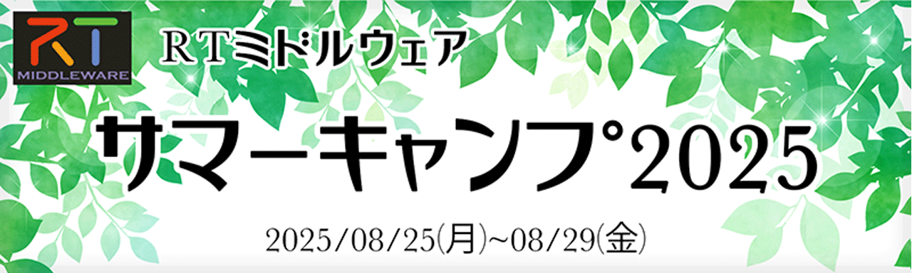</a>

#contents

# Event Report

Thanks to the tremendous efforts of Professor Ohara of Meijo University, as well as the support of many special lecturers and staff members, we were once again able to successfully organize this year’s summer camp together with more than 10 participants. We would like to express our sincere gratitude to everyone involved. Through face-to-face design discussions and distributed development activities, participants were able to reaffirm the advantages of middleware, while also working toward solving their own technical challenges and improving their skills. We hope that the成果 of this training camp will be presented at the RT Middleware Contest.

<a href="summercamp2025_00.jpg">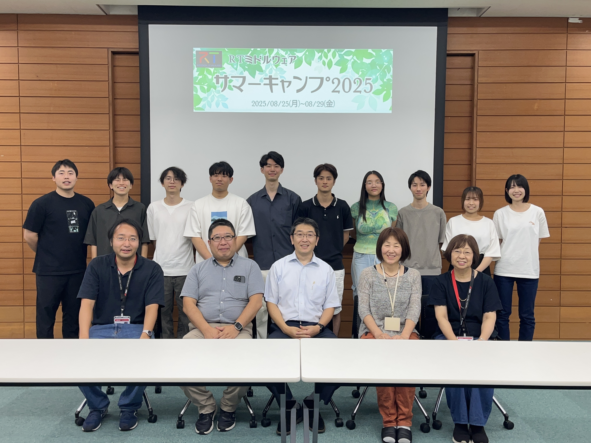</a>

## Overview

This summer camp provides participants with opportunities to experience various robot system development projects using RT Middleware and ROS under the guidance of instructors who are highly experienced in RT Middleware and robotics development. Through intensive collaborative development experiences with fellow participants, the goal of this program is to help attendees acquire more practical robot system construction skills.

#### Organizers
- Intelligent Systems Research Institute, Information Technology and Human Factors Domain, National Institute of Advanced Industrial Science and Technology (AIST)
- RT System Integration Committee, SI Division, The Society of Instrument and Control Engineers (SICE)
- Japan Robot Association / Robot Business Promotion Council

## Overview

This summer camp provides participants with opportunities to experience various robot system development projects using RT Middleware and ROS under the guidance of instructors who are highly experienced in RT Middleware and robotics development. Through intensive collaborative development experiences with fellow participants, the goal of this program is to help attendees acquire more practical robot system construction skills.

#### Organizers
- Intelligent Systems Research Institute, Information Technology and Human Factors Domain, National Institute of Advanced Industrial Science and Technology (AIST)
- RT System Integration Committee, SI Division, The Society of Instrument and Control Engineers (SICE)
- Japan Robot Association / Robot Business Promotion Council

### Eligibility Requirements

Participants must have attended an RT Middleware workshop previously or possess equivalent experience.

Alternatively, please participate in the online workshop below.

- https://connpass.com/event/361075/

<!-- In previous years, we held preliminary workshops in July under the name of “Intensive Training Month,” but this year, as a general rule, they will not be held. &color(red){ (Confirmation) } -->
If you have never attended a workshop before, you may satisfy the participation requirements by self-studying the following tutorials.

- [Get Started with RT Middleware in 10 Minutes](/doc/installation/lets_start122) (Installation and sample operation check)
- [Creating an Image Processing Component](/ja/node/7151) (Practice creating image processing components; requires a USB camera or built-in camera)
<!-- - [[ROBOMECH2024RTM Workshop>https://www.openrtm.org/openrtm/ja/tutorial/robomech2024]] (Creating components to control an actual mobile robot) -->

- [Get Started with RT Middleware in 10 Minutes](/doc/installation/lets_start122) (Installation and sample operation check)
- [Creating an Image Processing Component](/ja/node/7151) (Practice creating image processing components; requires a USB camera or built-in camera)
<!-- - [[ROBOMECH2024RTM Workshop>https://www.openrtm.org/openrtm/ja/tutorial/robomech2024]] (Creating components to control an actual mobile robot) -->

- [Get Started with RT Middleware in 10 Minutes](/doc/installation/lets_start122) (Installation and sample operation check)
- [Creating an Image Processing Component](/ja/node/7151) (Practice creating image processing components; requires a USB camera or built-in camera)
<!-- - [[ROBOMECH2024RTM Workshop>https://www.openrtm.org/openrtm/ja/tutorial/robomech2024]] (Creating components to control an actual mobile robot) -->

In the IT field, there are gatherings commonly known as “mokumoku-kai,” where individuals gather and quietly focus on coding independently; this camp is envisioned in a similar style.
<!-- However, during development activities and final presentations/demonstrations, participants may gather and work together within the limits permitted by their affiliated universities or companies, while taking precautions to prevent the spread of COVID-19. -->
Additionally, we will conduct interviews in advance regarding grouping and development themes, and PCs, simple sensors, and small robots can be loaned upon request.
<!-- During the camp period, the first half will focus mainly on lectures, while the second half will involve individual or group remote work sessions, with instructors available online to answer questions. -->

Please refer to the following links for examples of previous summer camps.

(Reference)
- [Summer Camp 2011](/ja/node/3850)
- [Summer Camp 2012](/ja/node/5048)
- [Summer Camp 2013](./summercamp2013)
- [Summer Camp 2014](./summercamp2014)
- [Summer Camp 2015](./summercamp2015)
- [Summer Camp 2016](./summercamp2016)
- [Summer Camp 2017](./summercamp2017)
- [Summer Camp 2018](./summercamp2018)
- [Summer Camp 2019](./summercamp2019)
- [Summer Camp 2020](./summercamp2020)
- [Summer Camp 2021](./summercamp2021)
- [Summer Camp 2022](./summercamp2022)
- [Summer Camp 2023](./summercamp2023)
- [Summer Camp 2024](./summercamp2024)

## Program

<table class="table-alt">
  <tr style="text-align: center; font-weight: bold;">
    <td>Preliminary Study</td>
    <td colspan="2">Please watch these materials before the summer camp begins.</td>
  </tr>
  <tr>
    <td></td>
    <td>Lecture: SysML Workshop  <a href="2016SummerCamp-021.pdf">Lecture Materials</a>  ・YouTube video links will be shared via Slack</td>
    <td>Takeshi Sakamoto (Global Assist)</td>
  </tr>
  <tr style="text-align: center; font-weight: bold;">
    <td>Monday, August 25</td>
    <td colspan="2">Day 1</td>
  </tr>
  <tr>
    <td>13:00-13:05</td>
    <td>Opening Remarks</td>
    <td>Kenichi Ohara  (Meijo University)</td>
  </tr>
  <tr>
    <td>13:05-13:30</td>
    <td>RT Middleware Summer Camp Guidance</td>
    <td>Kenichi Ohara (Meijo University)</td>
  </tr>
  <tr>
    <td>13:30-14:20</td>
    <td>Self-Introductions and Statement of Goals</td>
    <td>-</td>
  </tr>
  <tr>
    <td>15:00-15:50</td>
   <td>Lecture: Robot Development Using SysML   Lecture Materials:<a href="RTM_SC_2025_GA.pdf">RTM_SC_2025_GA.pdf</a> SysML Model Example:<a href="SysMLモデル例.pptx">SysML Model Example.pptx</a></td>
    <td>Takeshi Sakamoto (Global Assist)</td>
  </tr>
  <tr>
    <td>16:00-17:30</td>
    <td>RT System Modeling Workshop</td>
    <td>Participants will model the systems to be developed in groups.</td>
  </tr>
  <tr>
    <td>18:00-</td>
    <td>Networking Event</td>
    <td></td>
  </tr>
</table>

<table class="table-alt">
  <tr style="text-align: center; font-weight: bold;">
    <td>Tuesday, August 26</td>
    <td colspan="2">Day 2</td>
  </tr>
  <tr>
    <td>9:30-10:10</td>
    <td>Building Robot Systems with Robot Middleware</td>
    <td>Yuki Kan   (Sugar Sweet Robotics)</td>
  </tr>
  <tr>
    <td>10:10-10:50</td>
    <td>Introduction to RT Middleware Tools 1:   How to Use rtshell   Lecture Materials:<a href="rtshell_2025.pdf">rtshell_2025.pdf</a></td>
    <td>Yoshiaki Ando   (National Institute of Advanced Industrial Science and Technology)</td>
  </tr>
  <tr>
    <td>10:50-11:30</td>
    <td>Introduction to RT Middleware Tools 2:  Available RT Components and Tools   Lecture Materials:<a href="2025SummerCamp-04.pdf">2025SummerCamp-04.pdf</a></td>
    <td>Nobuhiko Miyamoto  (National Institute of Advanced Industrial Science and Technology)</td>
  </tr>
  <tr>
    <td>11:30-12:30</td>
    <td colspan="2">Lunch Break</td>
  </tr>

 <tr>
    <td>12:30-13:10</td>
    <td>What Is the Distributed Simulation Hub “Hakoniwa”?  Lecture Materials: <a href="https://www.docswell.com/s/kanetugu2015/Z137XP-hakoniwa-simulation-hub">Z137XP-hakoniwa-simulation-hub</a></td>
    <td>  Takashi Mori (Hakoniwa Lab LLC)</td>
  </tr>
  <tr>
    <td>13:10-15:10</td>
    <td>Robot System Development and Modeling</td>
    <td>Takeshi Sakamoto (Global Assist)</td>
  </tr>
  <tr>
    <td>15:10-16:00</td>
    <td>Development Target System Presentations</td>
    <td>Each group will present the system they plan to develop.</td>
  </tr>
  <tr>
    <td>16:00-18:00</td>
    <td>RT System Development Workshop 1</td>
    <td>Participants will work on actual system development.</td>
  </tr>
 <tr>
    <td>18:00-22:00</td>
    <td>Evening Session</td>
    <td>Participants who wish may continue development work.</td>
  </tr>
</table>

<table class="table-alt">
  <tr style="text-align: center; font-weight: bold;">
    <td>Wednesday, August 27</td>
    <td colspan="2">Day 3</td>
  </tr>
  <tr>
    <td>9:00-16:30</td>
    <td>RT System Development Workshop 2</td>
    <td></td>
  </tr>
  <tr>
    <td>16:30-17:00</td>
    <td>Progress Reports from Each Team</td>
    <td></td>
  </tr>
  <tr>
    <td>17:00-22:00</td>
    <td>Evening Session</td>
    <td>Participants who wish may continue development work.</td>
  </tr>
</table>

<table class="table-alt">
  <tr style="text-align: center; font-weight: bold;">
    <td>Friday, August 29</td>
    <td colspan="2">Day 5</td>
  </tr>
  <tr>
    <td>9:00-15:00</td>
    <td>RT System Development Workshop 4</td>
    <td>-</td>
  </tr>
  <tr>
    <td>15:00-17:00</td>
    <td>Final Presentation Session</td>
    <td>-</td>
  </tr>
  <tr>
    <td>17:00-17:10</td>
    <td colspan="2">Closing Remarks</td>
  </tr>
  <tr>
    <td>17:10-18:00</td>
    <td colspan="2">Cleanup</td>
  </tr>
</table>
<!-- |18:30 - 20:00|RT Middleware Information Exchange Meeting (BOF Meeting)|-| -->
(Names omitted honorifics)

※The deliverables (projects and slides) and presentation videos from this summer camp will be published on the website.

- RaspberryPi Mouse (Up to 15 units)

 
  - Approximately 10 units are also equipped with LiDAR
  - https://rt-net.jp/mobility/products/raspberry-pi-mouse
  - https://www.youtube.com/watch?v=kbfV2R64yP4&feature=youtu.be
- Turtlebot Burger (Up to 10 units)

 
  - https://www.besttechnology.co.jp/modules/onlineshop/index.php?fct=photo&p=192
- G-ROBOT (Up to 10 units)

<a href="grobo.jpg">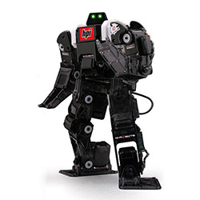</a>

 
  - [G-ROBOT](https://www.vstone.co.jp/robotshop/index.php?main_page=product_info&cPath=70_110&products_id=5197)
<!-- - RaspberryPi (Approximately 10 units in total) -->
<!-- #ref(https://www.rt-shop.jp/blog/wp-content/uploads/2020/03/img_raspimouse01-765x800.png, left,50%) -->
 - Can also be used in combination with the sensor devices listed below
- Phidget sensors + RaspberryPi + expansion board set (4 sets)
  - Expansion boards are pre-installed on the RaspberryPi
  - http://cgi3.win-ei.com/wordpress/?page_id=135
  - Phidget sensors: pressure, temperature, light (LCD), joystick, magnetic, slider, touch (capacitive)
  - https://www.google.com/search?q=phidget+%E3%82%BB%E3%83%B3%E3%82%B5&rlz=1C5CHFA_enJP882JP882&sxsrf=ALeKk03gjJ3-w72H8-//T3eiaYobupVJyVfw:1596525505946&source=univ&tbm=shop&tbo=u&sa=X&ved=2ahUKEwiphqD9gIHrAhUy7GEKHbPmAuEQsxh6BAgMEE4&biw=1632&bih=1326
- micro:Bit + sensor kit (4 sets)

<a href="microbit_set.jpeg">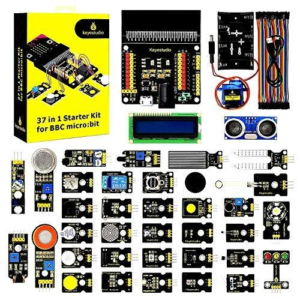</a>

 
  - micro:Bit and a 37-type sensor kit
  - https://www.amazon.co.jp/gp/product/B07QD558NQ/ref=ox_sc_act_title_1?smid=AWD3NUTTSH82N&psc=1
- obniz (4 sets)

<a href="obniz.jpeg">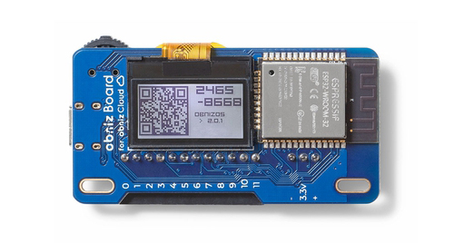</a>

 
  - https://www.amazon.co.jp/gp/product/B082MDPRWZ/ref=ox_sc_act_title_1?smid=A2SZAQLZSFR347&psc=1
- myCobot

<a href="2209131e-b842-4d31-9f42-21d47b4511ca.png">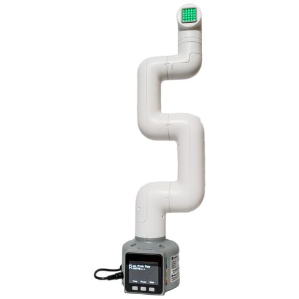</a>

 
  - https://www.switch-science.com/catalog/7141/
- Kobuki

<a href="kobuki_img-640x381.jpg">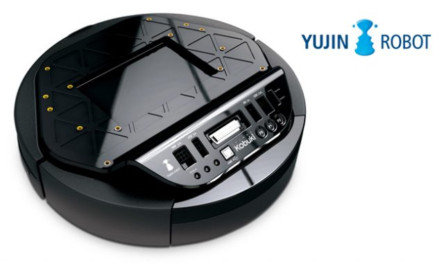</a>

 
  - https://www.tegakari.net/2016/10/kobuki/
- Intel RealSense Depth Camera D415

<a href="e19bc180-fcb7-4a9f-b3a3-17a8d649601e.jpg">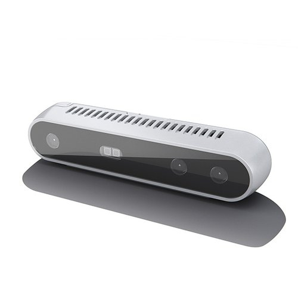</a>

 
  - https://www.switch-science.com/catalog/3632/

 LEGO Mindstorms EV3

 
  - https://afrel.co.jp/product/ev3-introduction/
- myAGV

 
  - https://www.switch-science.com/products/8581?srsltid=AfmBOoqYqkpZ4pnahBUUMmcwFKBTd1TdV6uI3L_DvWBkUH4sQE9fZqii
- CRANE+

 
  - https://rt-net.jp/products/cranev2/
- Leap Motion
- Kachaka

 
  - https://kachaka.life/

## Organizing Committee
<table class="table-alt">
  <tr>
    <td>Executive Chair</td>
    <td>Kenichi Ohara</td>
    <td><a href="https://wwwms.meijo-u.ac.jp/kohara/">Professor, Robot System Design Laboratory, Faculty of Science and Technology, Meijo University</a></td>
  </tr>
  <tr>
    <td>Secretary</td>
    <td>Nobuhiko Miyamoto</td>
    <td>Researcher, Intelligent Systems Research Institute, Information Technology and Human Factors Domain, National Institute of Advanced Industrial Science and Technology (AIST)</td>
  </tr>
  <tr>
    <td>Committee Member</td>
    <td>Yoshiaki Ando</td>
    <td>Chair, RT Middleware Working Group, Japan Robot Association / Robot Business Promotion Council   Director, Intelligent Systems Research Institute, Information Technology and Human Factors Domain, National Institute of Advanced Industrial Science and Technology (AIST)</td>
 </tr>
  <tr>
    <td>Committee Member</td>
    <td>Shoji Suzuki</td>
    <td>Chair, RT System Integration Committee, SICE SI Division</td>
  </tr>
  <tr>
    <td>Committee Member</td>
    <td>Yuki Kan</td>
    <td><a href="http://sugarsweetrobotics.com/">SUGAR SWEET ROBOTICS Co., Ltd.</a></td>
  </tr>
  <tr>
    <td>Committee Member</td>
    <td>Tetsuo Kotoku</td>
    <td><a href="https://www.aist-solutions.co.jp/">AIST Solutions Co., Ltd.</a></td>
  </tr>
  <tr>
    <td>Committee Member</td>
    <td>Takeshi Sakamoto</td>
    <td><a href="https://globalassist.co.jp/">Global Assist Co., Ltd.</a></td>
  </tr>
</table>

### Final Presentation and Submission Materials
Participants are requested to prepare the following deliverables and present them at the final presentation session.

- **Presentation Slides** → Submit via Slack
  - Please create them using PowerPoint or similar tools. Since the materials will eventually be published on this page, include only information that can be publicly disclosed.
- **System Source Code and Binaries** → Upload to your project page
  - Please create a project page on this website and upload the following items:
  - Self-developed RTCs: source code and binaries
    - It is strongly recommended that source code be hosted in each participant’s GitHub repository whenever possible
  - Reused RTCs: information on where they were obtained and binaries
    - Please clearly indicate the origin of reused RTCs and provide links
- **Manuals and Documentation** → Upload to your project page
  - Please prepare documentation containing sufficient information for third parties to reproduce the system developed during this camp.
  - Please refer to projects from previous summer camps and contests
    - [RTM Summer Camp 2021 Project List](./summercamp2021#toc13)
    - [RTM Contest 2021 Project List](https://openrtm.org/openrtm/ja/contests/2021)(no_page)
    - [RTM Summer Camp 2022 Project List](./summercamp2022#toc18)
    - [RTM Contest 2022 Project List](https://openrtm.org/openrtm/ja/contests/2022)(no_page)
    - [RTM Summer Camp 2023 Project List](./summercamp2023#toc18)
    - [RTM Contest 2023 Project List](https://openrtm.org/openrtm/ja/contests/2023)(no_page)
    - [RTM Summer Camp 2024 Project List](./summercamp2024#toc18)
    - [RTM Contest 2024 Project List](https://openrtm.org/openrtm/ja/contests/2024)(no_page)

- **If SysML, UML, or other models were created, submit the model data as well** → Upload to your project page
  - If modeling tools were used, please upload the original model data
  - Alternatively, including the models in the final presentation materials is also acceptable

## Lecture Materials

- Preparing

## Development Results

&aname(summercamp2024_group1);
### Group 1
- **Theme**: Pet Robot “PonPon” – Welcome Home, Master! (＞ω＜)
  - [Project Page](/ja/project/summercamp20251)(no_page)

  - [Final Presentation Slides](https://www.scribd.com/document/911601061/%E3%82%B5%E3%83%9E%E3%83%BC%E3%82%AD%E3%83%A3%E3%83%B3%E3%83%95-2025-1%E7%8F%AD-%E7%99%BA%E8%A1%A8%E8%B3%87%E6%96%99)

<!-- -- Development Model Presentation -->
<!-- <nowiki> -->
<!-- [video:http://www.youtube.com/watch?v=pvltRrL-DJE width:560] -->
<!-- </nowiki> -->

  - Result Presentation

<iframe width="560" height="315" src="https://www.youtube.com/embed/kHZeBdJqkn0" frameborder="0" allowfullscreen></iframe>

  - Demo Video

<iframe width="560" height="315" src="https://www.youtube.com/embed/wWuxPTDONbw" frameborder="0" allowfullscreen></iframe>

&aname(summercamp2024_group2);
### Group 2
- **Theme**: Heterogeneous Hardware Teleoperable Dual-Arm System
  - [Project Page](/ja/project/summercamp20252)(no_page)

  - [Final Presentation Slides](https://www.scribd.com/document/911600718/%E3%82%B5%E3%83%9E%E3%83%BC%E3%82%AD%E3%83%A3%E3%83%B3%E3%83%95-2025-2%E7%8F%AD-%E7%99%BA%E8%A1%A8%E8%B3%87%E6%96%99)

  - Result Presentation

<iframe width="560" height="315" src="https://www.youtube.com/embed/y0y-eOuA4Ss" frameborder="0" allowfullscreen></iframe>

  - Demo Video

<iframe width="560" height="315" src="https://www.youtube.com/embed/JdK0fUOvMwY" frameborder="0" allowfullscreen></iframe>

&aname(summercamp2024_group3);
### Group 3
- **Theme**: Voice-Driven Manipulation System
  - [Project Page](/ja/project/summercamp20253)(no_page)

  - [Final Presentation Slides](https://www.scribd.com/document/914174477/%E3%82%B5%E3%83%9E%E3%83%BC%E3%82%AD%E3%83%A3%E3%83%B3%E3%83%95-2025-3%E7%8F%AD-%E7%99%BA%E8%A1%A8%E8%B3%87%E6%96%99)

  - Result Presentation

<iframe width="560" height="315" src="https://www.youtube.com/embed/nY-yRp8CmVo" frameborder="0" allowfullscreen></iframe>

 - Demo Video

<iframe width="560" height="315" src="https://www.youtube.com/embed/OYaNBTZ9DsM" frameborder="0" allowfullscreen></iframe>

## Scenes from the Summer Camp

<a href="summercamp2025_01.jpg">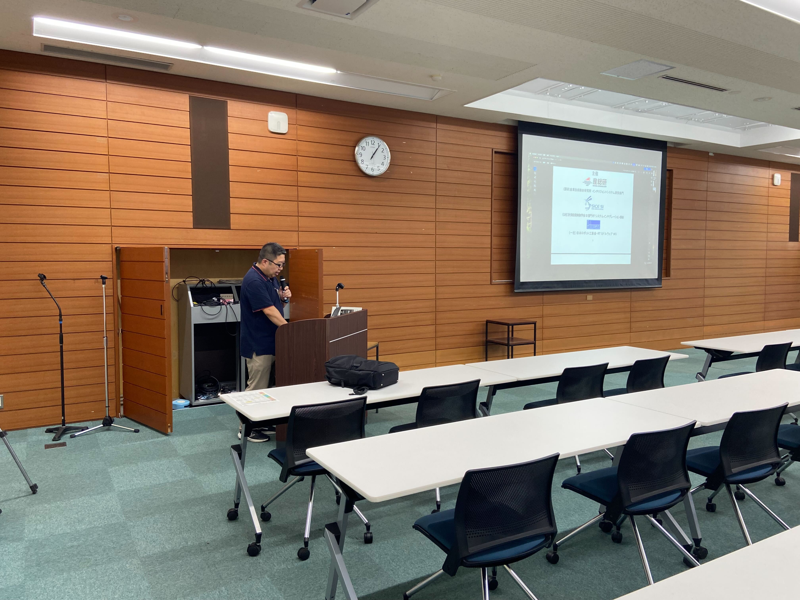</a>

 

<a href="summercamp2025_02.jpg">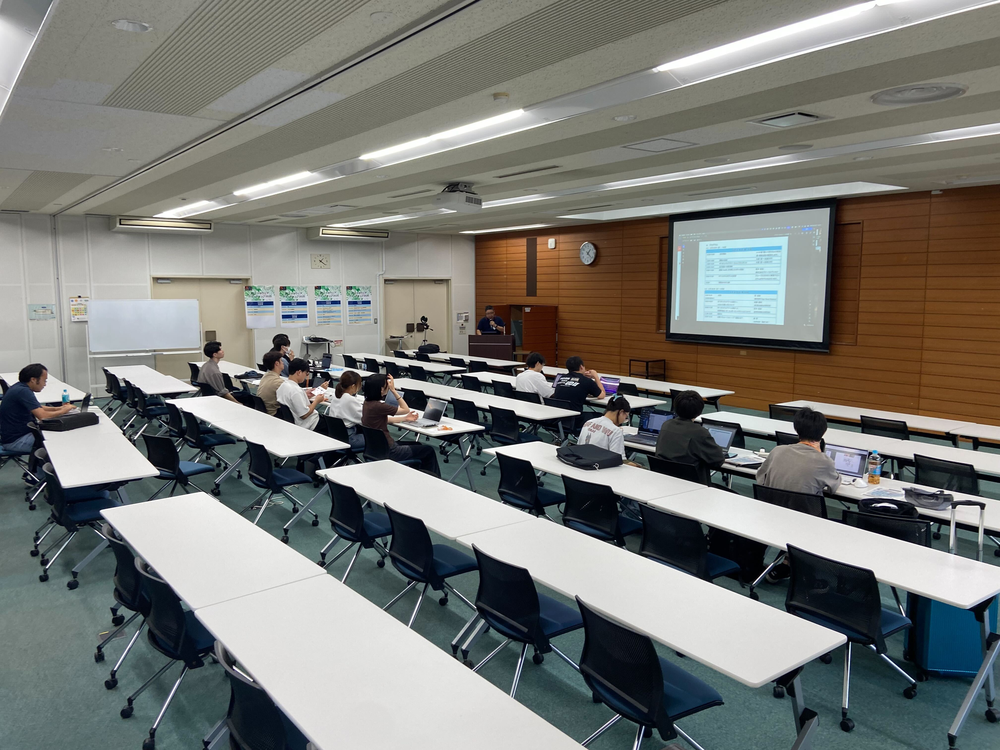</a>

 

<a href="summercamp2025_03.jpg">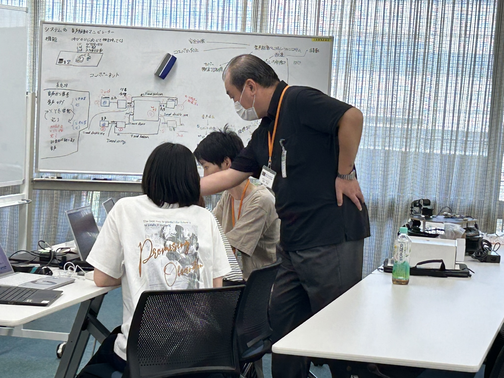</a>

 

<a href="summercamp2025_04.jpg">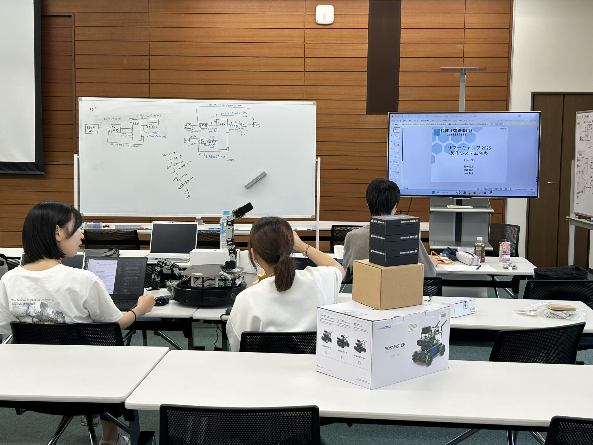</a>

 

<a href="summercamp2025_05.jpg">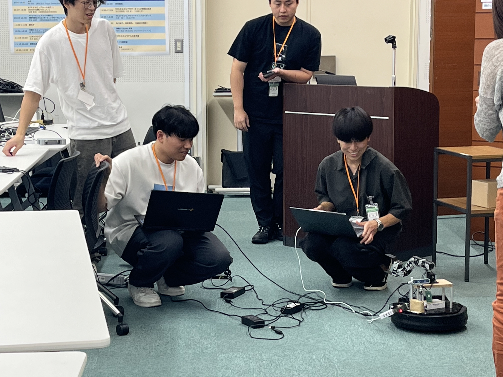</a>

 

<a href="summercamp2025_06.jpg">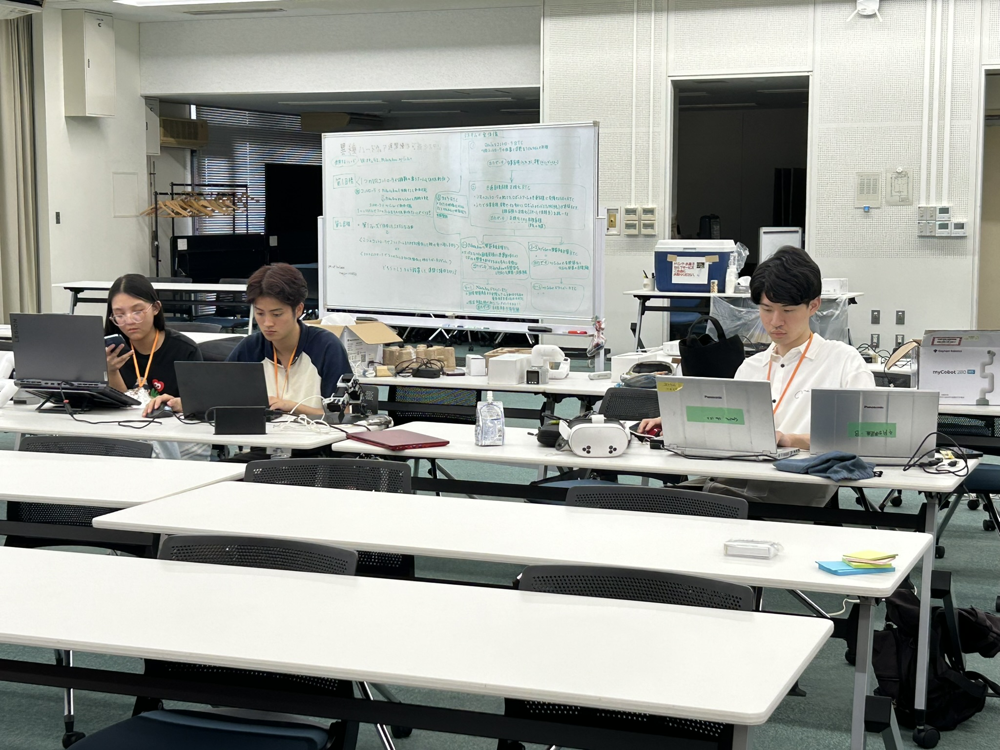</a>

br>

<a href="summercamp2025_07.jpg">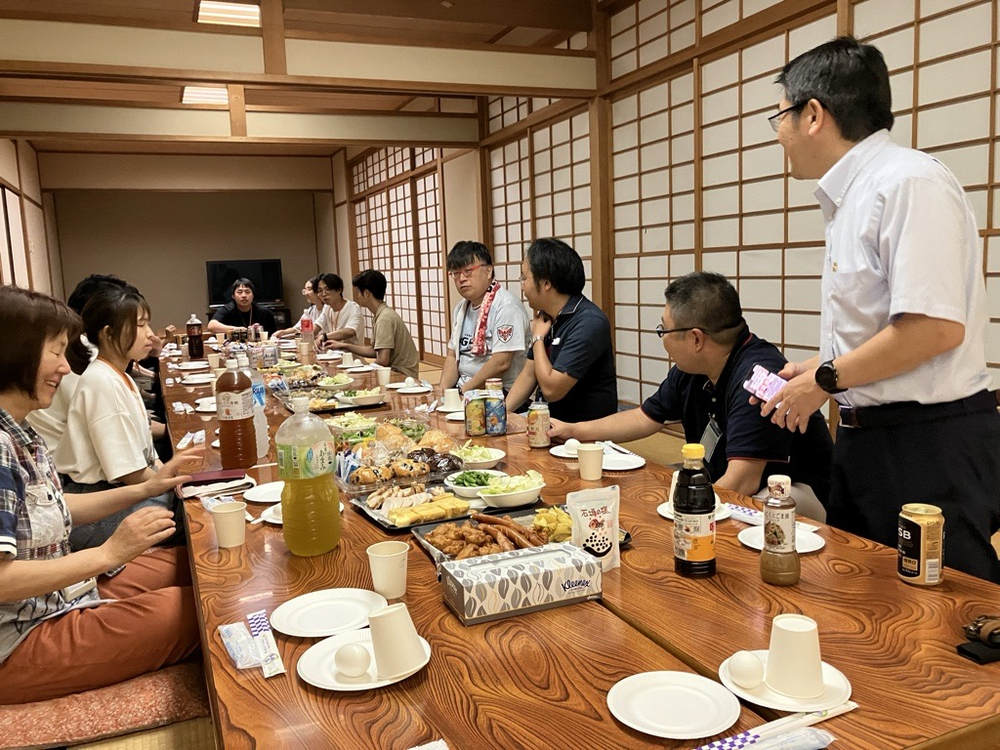</a>

 
