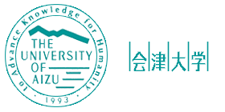
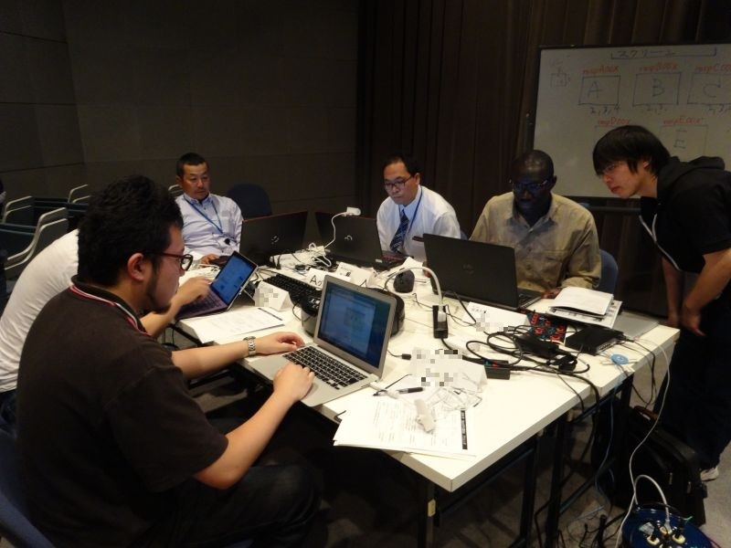
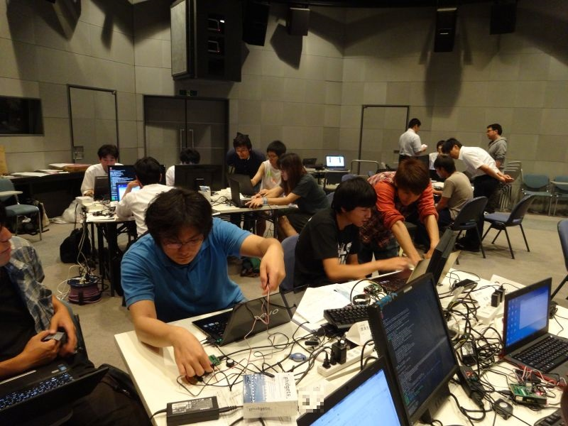
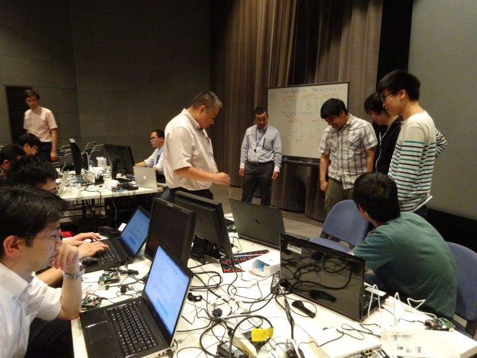
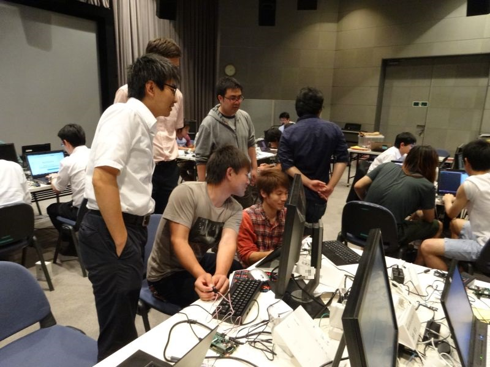
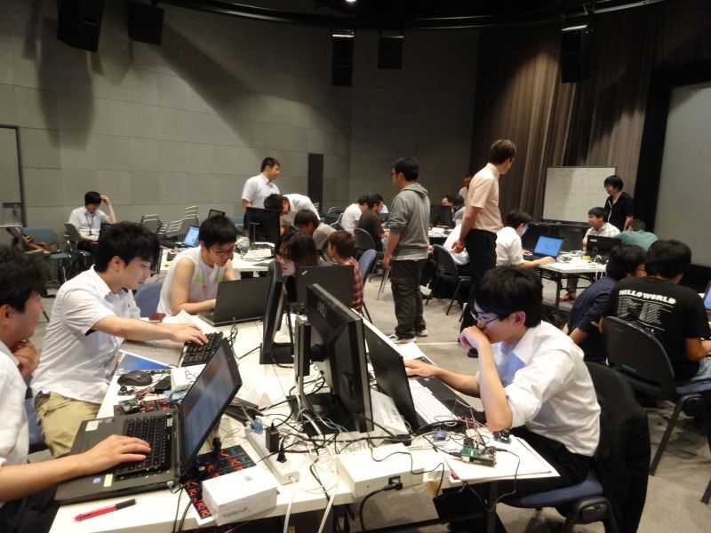

#contents

## 会津大学RTミドルウェア講習会

2015年6月24日(水)に会津大学において，RTミドルウェア講習会を開催いたしました．

会津大学では、「会津大学　産学ロボット技術開発支援事業」を実施し、ロボット研究を進めていくこ
とになりました。この事業は、本学の強みであるＩＣＴを活用したロボット開発の技術支援、会津
ＩＴバレーとロボットバレーの連携による福島・国際研究産業都市（イノベーション・コースト）
構想実現への貢献を目的としています。
今回、その取り組みの一環として「ＲＴミドルウェア講習会」を開催することに致しましたので、
ご案内させていただきます。本講習会は、ＲＴミドルウェアやＲＴコンポーネントの概念、作成方
法、各種ツールの使い方を解説するとともに、実際にＲＴコンポーネントを作成しロボットを動作
させてＲＴミドルウェアの使い方を学ぶ実習形式の講習会となっております。
<!-- ぜひ、この機会をご利用いただき、関係各位のご参加を頂きますようお願い申し上げます。 -->

## 日時・場所
- **日　時** ： 2015年6月24日（水） 10:00～16:45
- **場　所** ： 会津大学 産学イノベーションセンター(UBIC) ３Ｄシアター
  - キャンパスマップ http://www.u-aizu.ac.jp/intro/facilities.html
<!-- - ''受講料'' ： 無料 -->
- **定　員** ： 学生及び大学院生 10 名、企業10 名 合計20 名
<!-- -- ※会場の都合上、企業の参加はご案内をお送りした企業に限定させて頂き、各企業 2 名までの参加とさせていただきます。また、本セミナーは、創造工房セミナーの一環として実施することから、主たる受講者は学生・大学院生となり、各企業のご希望に沿えない場合がありますのであらかじめご了承ください。 -->
<!-- - ''申込み'' ： 別添の申込書に記入の上、以下アドレスまで送信のほどよろしくお願いします。 -->
<!-- -- 申込アドレス_講習会事務局（㈱FSK 内）： sale@fsk-brain.co.jp -->
<!-- - ''申込期限''： 2015 年6 月16 日（火）16時 -->

## プログラム

<table class="table-alt">
  <tr>
    <td>10:00 - 10:10</td>
    <td>**開会のご挨拶**   岩瀬 次郎 会津大学理事</td>
  </tr>
  <tr>
    <td>10:10 - 11:00</td>
    <td>**第1部：OpenRTM-aist およびRT コンポーネントプログラミングの概要**   **担当**：安藤慶昭(産総研)  **概要**：RT ミドルウェア(OpenRTM-aist)はロボットシステムをコンポーネント指向で構築するソフトウェアプラットフォームです。RT ミドルウェアを利用することで、既存のコンポーネントを再利用し、モジュール指向の柔軟なロボットシステムを構築することができます。RT ミドルウエアについて、その概要およびRT コンポーネントの機能やプログラミングの流れについて説明します。  **講義資料:**<a href="150624-01.pdf">150624-01.pdf</a></td>
  </tr>
  <tr>
    <td>11:10 - 12:30</td>
    <td>**第2部: RTコンポーネントの作成入門**  **担当**：安藤慶昭(産総研)  **概要**：RT システムを設計するツールRTSystemEditor およびRT コンポーネントを作成するツールRTCBuilder の使用方法について解説するとともに、RTCBuilder を使用したRT コンポーネントの作成方法を実習形式で体験していただきます。  **講義資料:**<a href="150624-02.pdf">150624-02.pdf</a>;   <a href="/ja/node/5022">チュートリアル（画像処理コンポーネントの作成 Windows編）</a>   <a href="/ja/node/430">チュートリアル（画像処理コンポーネントの作成 Linux編）</a></td>
  </tr>
  <tr>
    <td>13:30 - 16:30</td>
    <td>**第3部：プログラミング実習**   担当：Geoffrey Biggs(産総研)   **概要**：OpenRTM-aist を利用してコンポーネントを作成し実際にロボットを動かします。  **講義資料:**<a href="150624-03.pdf">150624-03.pdf</a>;  <a href="150624-04.pdf">150624-04.pdf</a>;   <a href="/ja/node/5269">チュートリアル</a></td>
  </tr>
  <tr>
    <td>16:30 - 16:40</td>
    <td>**閉会のご挨拶**   成瀬 継太郎 会津大学上級准教授</td>
  </tr>
</table>

## 講習会の様子

 

 

 

 

 
