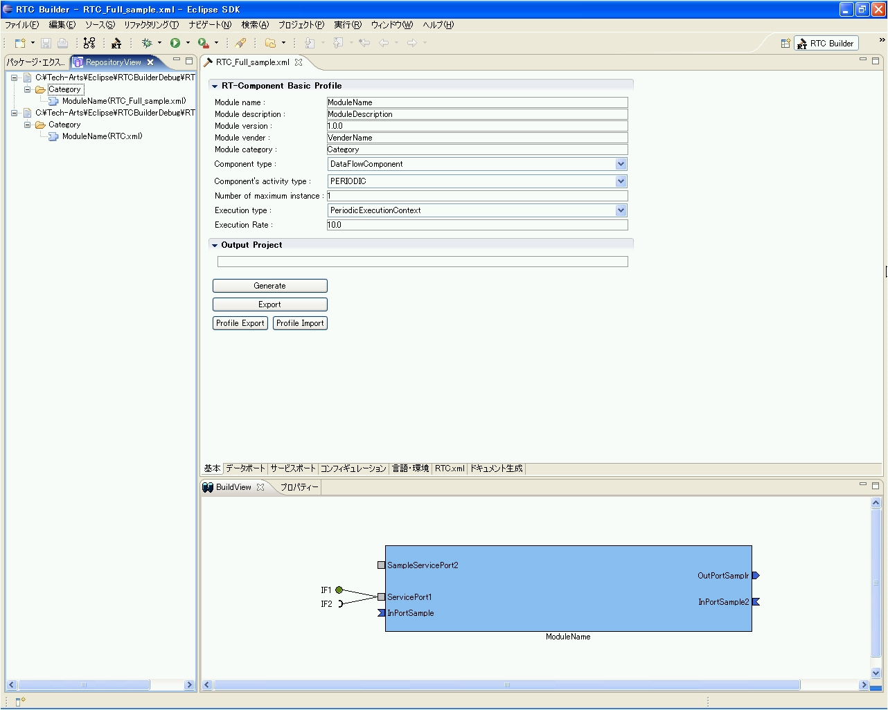

#contents
#clear

## 開催概要
- 会期：2010年10月14,15日
  - 14日（木）　 　　10：00～17：00
  - 15日（金） 　　　10：00～16：30
- 場所：
  - 独立行政法人 産業技術総合研究所 つくばセンター
- 対象：
  - 産業界、大学、公的研究機関等の皆様
- 主な当部門の展示：
  - I-57 ロボットのための音響シミュレータ 
  - I-58 屋内外をシームレスに自律走行する車いす
  - I-59 協調走行する車いす ( I-58 と共同開催)
  - I-60 生活支援ロボットの安全性検証用試験装置の開発
  - I-61 生活支援ロボットのリスクアセスメントと機能安全
  - I-62 メンタルコミットロボット「パロ」 
  - I-63 作業技能構築法：ヒューマノイドロボットHRP-2による精密な操作
  - I-64 ハンドアイによる日用品の把持と簡便な複数カメラの較正法
  - I-65 ビンピッキングをめざした管状物体３次元位置姿勢推定技術 
  - I-66 ロボットソフトウェア基盤：RTミドルウェア 
  - I-67 上肢に障害のある人の生活を支援するロボットアーム RAPUDA 
  - I-68 応急措置のための遠隔行動誘導システム
  - I-69 人と共存するアンドロイドロボット「アクトロイド-F」
  - I-70 ヒューマノイドの視覚を用いた能動的な物体モデリング 
  - I-71 VocaListenerで歌うサイバネティックヒューマンHRP-4C未夢
  - I-72 障害者の自立を支援する住環境モデル

- 参加費：
  - 無料
- 事前登録：
  - **[ホームページ](http://www.aist-openlab.jp/index.html)からの事前来場登録（来場申し込み）とラボ事前予約が必要となります。**
- 交通機関：
  - つくばエクスプレス「つくば駅」（秋葉原から快速45分）より無料バスを運行予定
- 公式Webページ
  - [http](//www.aist-openlab.jp/index.html:http://www.aist-openlab.jp/index.html)

## 展示内容
RTミドルウエア関連の展示は以下のとおりです。
- I-66 ロボットソフトウェア基盤：RTミドルウェア 

### RTミドルウエア：OpenRTM-aist
**出展者**

[産総研・知能システム研究部門・安藤慶昭](http://unit.aist.go.jp/is/index_j.html)

**概要**

RTミドルウエア（OpenRTM-aist）はロボットシステムを容易に構築するためのソフトウエアプラットフォームです。ロボットの機能要素（センサ、アクチュエータ、アルゴリズム等）を、RTコンポーネントと呼ばれる単位でモジュール化し、その組み合わせでシステムを構成します。ミドルウエアには、モジュール化とその再利用を容易にするための機能が備わっており、ロボットシステムの開発期間の短縮、コストの削減に貢献します。
RTコンポーネントは、言語（C++、Java、Python）、OS（UNIX、Windows、MacOS X等）を問わず作成・動作が可能で、異言語・OS上のRTコンポーネント同士をネットワーク経由で容易に連携させることができます。RTミドルウエア（OpenRTM-aist）のインターフェース仕様は、産総研が中心となって策定されたOMG（Object Management Group）の国際標準：RTC (Robotic Technology Component)仕様に準拠しています。OpenRTM-aistは今年のロボット大賞2007 ソフトウエア・部品部門優秀賞受賞ソフトウエアです。

**特徴**

- ロボットをモジュール単位で容易に構築するソフトウエアプラットフォーム
- モジュール化と再利用によって開発期間の短縮、コスト削減が可能
- ロボット特有なソフトウエア機能、異言語・異OS間で連携する機能を提供

### OpenRTM-aistツール(RTCBuilder・RTSystemEditor) 

**出展者**

[産総研・知能システム研究部門・安藤慶昭](http://unit.aist.go.jp/is/index_j.html)

**概要**

現在、NEDO「次世代ロボット知能化技術開発プロジェクト(通称：知能化プロジェクト)」(2007-2011)において、ロボットシステム開発のための統合開発プラットフォーム **OpenRT Platform** が開発されています。このソフトウエアプラットフォームは、OpenRTMをベースとし、多くのツール群(ツールチェーン)によりロボットの開発効率の向上を目指しています。

旧OpenRTMツール(RtcTemplate・RtcLink)も、OpenRT Platform ツールチェーンに取り込まれ、様々な機能追加・改良を行った RTCBuilder・RTCSystemEditor として新たにリリースされました。

本展示では、新しいツールの新機能・改良点などをご紹介します。

**特徴**

- **RTCBuilder**
  - わかりやすいGUIで、コンポーネントの設計をより簡単に
  - C++、Java、Python、C#のひな型コードを自動生成
- **RTSystemEditor**
  - RTコンポーネントシステムを簡単に設計・操作可能
  - 新機能・オフラインエディタ

<strong>RTCBuilder</strong>

 

### OpenRTM-aistシェルツール(rtcshell・rtsshell)

**出展者**

[産総研・知能システム研究部門・Geoffrey Biggs](http://unit.aist.go.jp/is/index_j.html)

**概要**

<!-- OpenRTM-aist用のシステム構築ツールセットです。コマンドラインで個々のRTコンポーネントやRTシステムが制御できて、及び以下の用な使い方もできます。 -->
<!-- -通信中のDataPortのデータを読んだり書いたりするオンラインデバッグをします。 -->
<!-- -シェルスクリプトでコンポーネントの管理を自動実行します。 -->
<!-- -コンポーネントAが起動が終わったことを確認してからコンポーネントBを起動します。 -->
<!--  -->
<!-- 今までRTSystemEditorが使えなかった以下のような場合にお勧めします。 -->
<!-- -リソースが少ないロボットに搭載されたコンピュータの場合 -->
<!-- -リモートからRTSystemEditorで接続することができない場合 -->

OpenRTM-aist用のシステム構築ツールセットです。コマンドラインで個々のRTコンポーネントやRTシステムが制御でき、使い方によっては以下のような事も可能です。

- 通信中のDataPortに対してデータを読み書きし、オンラインデバッグを行う
- シェルスクリプトでのコンポーネントの管理を行う
- コンポーネントAの起動が終わったことを確認してからコンポーネントBを起動する

以下のような理由で今までRTSystemEditorを使用する事ができなかった方にお勧めします。
- ロボットに搭載されたコンピュータのリソースが少ない
- リモートからRTSystemEditorで接続することができない

 

### OpenRTM-aist用のシミュレーターコンポーネント(RTC:Stage)
**出展者**

[産総研・知能システム研究部門・Geoffrey Biggs](http://unit.aist.go.jp/is/index_j.html)

**概要**

<!-- [[ステージシミュレータ:http://playerstage.sourceforge.net/]]によって実行されているシミュレーションの世界へのアクセスを提供するRTコンポーネントです。仮想世界のすべてのモデルは他のコンポーネントで制御できて、提供しているデータを他のコンポーネントで使えます。プラグインで新しいモデルを簡単にサポートできます。コンポーネントのポートは自動的に仮想世界に合わせます。 -->

[ステージシミュレータ](http://playerstage.sourceforge.net/)によって実行されている仮想空間へのアクセスを提供するRTコンポーネントです。

**特徴**

- 仮想空間のすべてのモデルは他のコンポーネントから制御可能
- 仮想モデルが提供しているデータを他のコンポーネントから参照可能
- 新しいモデルを簡単に使用するためのプラグイン機能
- コンポーネントのポートを仮想空間で使用できるようにするための自動変換機能

 

<!-- div align="center">

<strong>RTC:Stage</strong></div-->
 

### OpenHRI
**出展者**

[産総研・知能システム研究部門・松坂 要佐](http](//unit.aist.go.jp/is/index_j.html)

**概要**

[OpenHRI](http://openhri.net/)は、音声認識・音声合成・対話制御など、ロボットのコミュニケーション機能の実現に必要な各要素を実現するコンポーネント群です。

**特徴**

- HPでソースコードを公開しています。
- フリーで利用できる各オープンソースソフトウェアを使い易いコンポーネントとしてまとめました。

 

&aname(OpenCV);
### OpenCV2.0を用いた画像処理システムのためのRTコンポーネント群

**出展者**

[株式会社 デジタルクラフト](http://www.e-digitalcraft.com/) [産総研・知能システム研究部門・安藤慶昭](http://unit.aist.go.jp/is/index_j.html)

**概要**

画像処理ライブラリとして広く利用されているOpenCV 2.0の様々な処理関数をRTコンポーネント化する際に、データ型・インター 
フェース等のモジュール設計を検討し実装を行った。

**特徴**
- 画像処理ライブラリOpenCV2.0を利用
- 画像処理専用データ型の導入
- 画像の動的リサイズに対応
- 様々な画像処理機能の実装

**ダウンロード**

以下からソースとVC9用のバイナリセットがダウンロードできます。

[OpenCV_RTC.zip(ソース)](./OpenCVRTC-1.0.0.zip)

 

<!-- div align="center">

;

<strong>OpenCV RTCを用いた画像処理システム例</strong></div-->

 

&aname(ARToolKit);
### ARToolKitを用いた拡張現実システムのためのRTコンポーネント

**出展者**

[株式会社 デジタルクラフト](http://www.e-digitalcraft.com/) [産総研・知能システム研究部門・安藤慶昭](http://unit.aist.go.jp/is/index_j.html)

**概要**

拡張現実 (Augmented Reality) を比較的容易に実現するためのソフトウエアツール
キットとして注目を集めているARToolKitをRTコンポーネント化しました。

**特徴**

- OpenGLのFBOの仕組みを利用する事で、3Dレンダリング部分と表示部分を分離
- カメラ画像取得、3Dレンダリング、表示部分の分離により、再利用性と効率性が向上
- データポートのデータ型にCameraImage型を使用しているため、既存のOpenCVコンポーネントとの連携が可能

**ダウンロード**

以下からソースとVC9用のバイナリセットがダウンロードできます。

[ARToolKit_RTC.zip(ソース+VC9用バイナリ)](http://www.openrtm.org/pub/OpenRTM-aist/components/ARToolKit-RTC/ARToolKit_RTC.zip)

 

<!-- div align="center">

;

<strong>OpenCV RTCとARToolKit RTCとの連携</strong></div-->

 

## 協力展示
### PatterWeaver for RT-Middleware
**出展者**

[株式会社テクノロジックアート](http://www.tech-arts.co.jp/)

**概要**

UMLモデリングツールをベースとしたRTコンポーネントの設計ツールです．

**特徴**

- OpenRTM-aist-1.0.0-RELEASE(C++,Java,Python)に対応
- UMLを用いたコンポーネント設計/システム設計支援
- システム設計情報を基にした各種コードの自動生成
- RTコンポーネント(C++，Java，Python) スケルトンコード
  - CORBA IDL コード
  - 関連クラス(C++，Java，Python) スケルトンコード

 

<!-- div align="center">

;

<strong>PatterWeaver for RT-Middleware</strong></div-->
 

### 共有メモリコンポーネントを用いた遠隔可変型ソフトウェアアーキテクチャ

**出展者**

[中央大学國井研究室](http://www.hmsl.elect.chuo-u.ac.jp/)

**概要**

- 移動ロボットの遠隔自律システムをRTミドルウェアで構築
- RTMにて複数CPU間の共有メモリを提供する枠組みを実現
- 共有メモリコンポーネントでデータを一括管理できて、なおかつシーケンス動作をGUIを使って簡単に変更できる。

 

<!-- div align="center">

;

<strong>共有メモリコンポーネントを用いた遠隔可変型ソフトウェアアーキテクチャ</strong></div-->
 

### OpenRTMによるWiiリモコンからのロボットアームコントロール

**出展者**

[アイ・テー・シー株式会社](http://www.itckk.co.jp/)

**概要**

普及されている家庭用ゲーム機「Ｗｉｉ」のコントローラをＲＴＣ化し、ロボットアームのコントロールを実現しました。　

コントローラの特徴でもある3軸加速度センサに対応し、また、RTミドルウェアを採用することで、高い拡張性と保守性を維持しております。
今後は、この技術を活かし、Apple社製 iPhone、iPadによるコントロールの技術を開発していきます。

**特徴**

- Ｗｉｉコントローラの3軸加速度センサに対応
- 今後、追加される拡張コントローラを意識した設計
- RTミドルウェアを採用することで、高い拡張性と保守性を維持

 

<!-- table class="table-alt">
  <tr>
    <th>CENTER:

;</th>
  </tr>
  <tr>
    <td>CENTER:**構成図**</td>
  </tr>
</table>
<table class="table-alt">
  <tr>
    <th></th>
  </tr>
</table>

|

|
<table class="table-alt">
  <tr>
    <th>CENTER:**Wiiコンポーネント**</th>
    <th>CENTER:**ロボットアームコンポーネント**</th>
  </tr>
</table-->

 

### RTC-CANopen
<!-- ***組込みシステムバス上の分散制御ロボット用RT-Middleware:RTC-CANopen-0.3.0 -->
**出展者**

[芝浦工業大学水川研究室](http://www.hri.ee.shibaura-it.ac.jp/)

**概要**

RTC-CANopenとは，安全バスシステムとして広く使用されているCANopenの特徴を取り入れた組み込み向けのRT-Middlewareです．RTC-CANopenを用いる事により，CANopen準拠の既存製品をRT-Middlewareの枠組みの上で，通常のRT-Component同様に管理・操作する事ができます．同時開発しているシステム開発向けのツールを用いる事で，RTC-CANopenを用いたシステム構築を簡単に行う事ができます．また，RTシステムのPnP機能をサポートしており，柔軟なシステムの構築を実現しています．

 

<!-- div align="center">

;

<strong>RTC-CANopen System</strong></div-->

 

### DAQ-Middleware(DAQミドルウェア)

**出展者**

[高エネルギー加速器研究機構](http://www.kek.jp)

**概要**

DAQ-Middleware[1]はOpenRTM-aistを基盤とした高エネルギー加速器研究機構（KEK[2]）や大強度陽子加速器施設（J-PARC[3]）等の実験データ収集（DAQ）システムで使用するためのソフトウェアフレームワークである。 
RTコンポーネントを拡張したDAQコンポーネントによる汎用で柔軟なDAQシステム構築を目指している。 
現在、J-PARCの物質・生命科学実験施設（MLF[4]）の複数の実験装置で稼働中。 

**References**

1. http://daqmw.kek.jp/
1. http://www.kek.jp/
1. http://j-parc.jp/
1. http://j-parc.jp/MatLife/ja/

 

### 再利用技術研究センターの活動概要
**出展者**

[富士ソフト株式会社](http://www.fsi.co.jp/)

**概要**

- NEDO「知能化プロジェクト」におけるモジュールの再利用性研究
- 標準的な検証環境を準備し、RTCの動作テスト、評価を行う
- 知能化プロジェクトで開発されたRTCの動作検証、組み換え検証を行う

**特徴**

- 再利用性試験プラットフォームを用いた動作検証および組換検証を行う
- 各種検証環境（アーム、台車＋アーム、移動ロボット、車椅子等）を設置
- Webサイトによる「蓄積・受入確認・提供」を一元管理

 

<!-- table class="table-alt">
  <tr>
    <th></th>
  </tr>
</table>

|

|
<table class="table-alt">
  <tr>
    <th>CENTER:**NEDO知能化プロジェクト・RTC再利用技術研究センター**</th>
    <th>CENTER:**RTC再利用技術研究センターで利用可能なロボットプラットフォーム**</th>
  </tr>
</table-->

 

### RTミドルウェア技術を活用したインフォメーションロボットシステム
**出展者**

[株式会社セック](http://www.sec.co.jp)

**概要**

当社では、RTミドルウェアの活用事例の一つとして、セキュリティ分野にも
応用可能なインフォメーションロボットシステムの開発を進めています。
インフォメーションロボットシステムは、人間などの移動体を捕捉し高精度に
追跡を行うことができるロボットです。また、頭部に搭載した液晶ディスプレイ
を使って、ユーザーに様々な情報を伝えることが可能です。
本システムは当社が注力しているRTミドルウェアを採用しており、高い拡張性と
保守容易性を備えています。防犯システムをはじめ、自動受付システムや店舗内
の動線計測システムなど、様々な分野に応用することができます。

 

<!-- div align="center">

;

<strong>RTミドルウェア技術を活用したインフォメーションロボットシステム</strong>
--->

 

### VIRCA (Virtual Collaboration Arena)による知能化空間ネットワーク
<!-- ''RT ミドルウエアコンテスト 2007 最優秀賞受賞作品'' -->
<!--  -->
**出展者**

[東京大学橋本研究室・佐々木毅氏](http://dfs.iis.u-tokyo.ac.jp/ja/)

**概要**

東京大学生産技術研究所橋本研究室では、空間に多数のセンサやアクチュエータを分 
散配置することで実現される知能化空間（インテリジェント・スペース）の構築を行 
っています。特に現在、ハンガリーの研究室と、遠隔空間同士を接続し、実験を行う 
ことが可能な仮想空間プラットホーム「VIRCA (Virtual Collaboration Arena)」を介 
した知能化空間ネットワークの研究を進めています。本展示では、VIRCAによる遠隔ロ 
ボットの操作デモンストレーションを予定しています。

 

<!-- div align="center">

;

<strong>VIRCAによる知能化空間ネットワーク構成図</strong></div-->

 

### 株式会社リバストにおけるRTミドルウエア対応の取り組み

**出展者**

[株式会社リバスト](http://www.revast.co.jp/) 

**概要**

 当社取り扱いのロボット製品のRTミドルウエア対応を進めております．
- RTミドルウエア対応により，ユーザ様には当社取り扱いのRT製品等を共通プラットフォームでお使い頂けるようになります．
- RTコンポーネントを再利用することで，RT製品を組み合わせたシステムの開発コストを削減出来ます．

 

<!-- table class="table-alt">
  <tr>
    <th></th>
  </tr>
</table>

|

|
<table class="table-alt">
  <tr>
    <th>CENTER:**対応製品でのRTシステム構成**</th>
    <th>CENTER:**対応製品の組み合わせ例**</th>
  </tr>
</table-->

 

### 組込み向けRTコンポーネント - TOPPERS版 OpenRTM-aist -

**出展者**

[株式会社 未来技術研究所](http://www.ftl.co.jp/index.html)

**概要**

- TOPPERS版OpenRTM-aist(ARM版)  組込みボード上にTOPPERS版のOpenRTM-aistを開発いたしました。これにより、ハードウェアリソースの少ないボードでもRTコンポーネントの実行を可能にする環境を構築することができました。
- TOPPERS版OpenRTM-aist(SH版)  移植ターゲットをSH2にしたTOPPERS版OpenRTMを開発いたしました。応用例として、ターゲットボードよりA/D値を読み取り、PC上のRTCツールに表示するものを開発いたしました。
- Digi Connect ME(NS9210)版OpenRTM-aist  Digi社より販売されているモジュラーコネクタ内蔵型組込み用デバイスDigi Connect ME9210に対し、ArmadilloシリーズのARM9用TOPPERSに移植されたTRON版OpenRTM-aistを現在、移植の作業を行っております。

 

<!-- div align="center">

;

<strong>組込み向けRTコンポーネントの構成例</strong></div-->

 

### VxWorks版RTミドルウェアを用いたRTユニット

**出展者**

[株式会社 安川電機**: http](//www.yaskawa.co.jp/)

**概要**

- 機能単位で分割したRTユニットを、 VxWorks版OpenRTM-aistによりRTミドルウェア対応ユニットとしました。
- RTミドルウェア対応RTユニットには、サービスロボット用に開発した7軸アームユニットと移動ユニットがあります。

**特徴**

- アームユニット（右腕・左腕）は７自由度のため、多様な姿勢を実現することができます。
- 移動ユニットには３輪の全方向移動型と２輪差動型があります。
- アームユニットは基本動作としてＰＴＰ命令やＣＰ命令、移動ユニットは並進・回転命令を準備しており、上位から容易に実行可能です。
- ユニット内のコントローラにRTミドルウェアを搭載しており、他のRTミドルウェア対応モジュールとの接続が容易です。

 

<!-- div align="center">

;

<strong>RTユニットによるロボットシステム</strong></div-->

 

### 学習・推論コンポーネント

**出展者**

[株式会社 アドイン研究所**](http//www.adin.co.jp)

**概要**

カテゴリ分類されたサンプルデータを教示するとデータを分類するためのルールを自動的に解析・生成する『学習機能』と、未知のデータを入力すると学習により生成したカテゴリ分類のルールを元に入力されたデータがどのカテゴリに属するかを推論・出力する『推論機能』を有するコンポーネントです。

**特徴**

- アドイン研究所が開発したファジィ・ニューロ技術に基づく学習・推論エンジンβ-RNAを学習・推論エンジンとして組み込んでいます。
- 音声・画像・文字認識といったパターン認識、ロボットに必要な状況認識（学習）や自律判断（推論）、制御系の各種診断（故障原因のカテゴリ分類）などに適用できます。

 

<!-- div align="center">

;

<strong>学習・推論コンポーネント利用システム</strong></div-->
 

