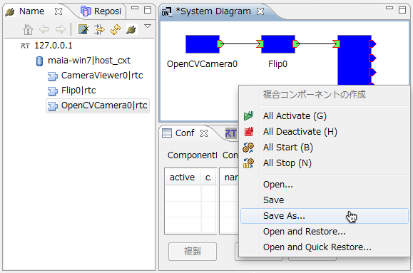
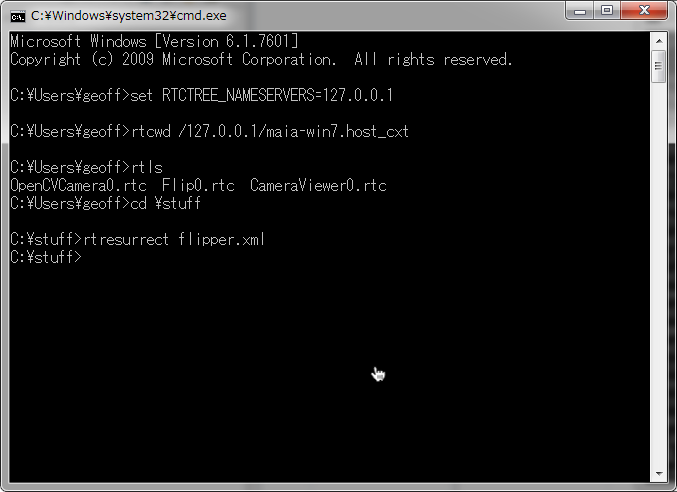
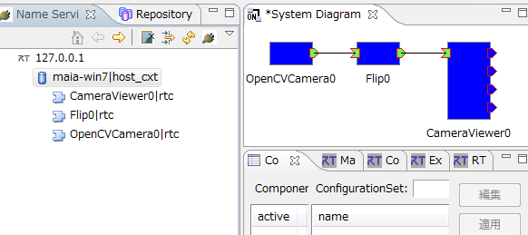
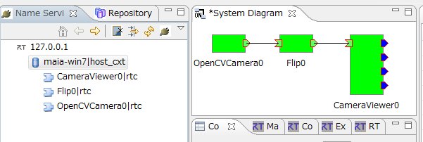
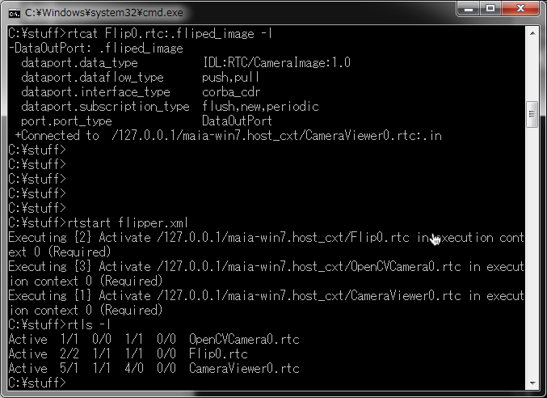
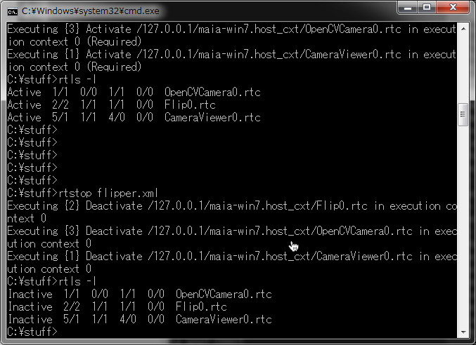
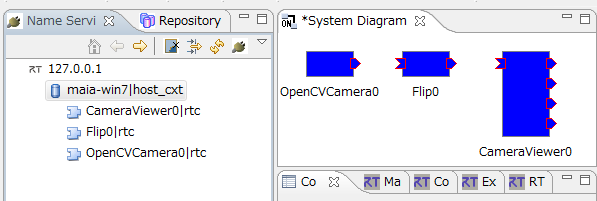
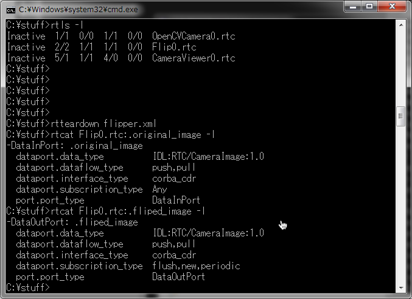
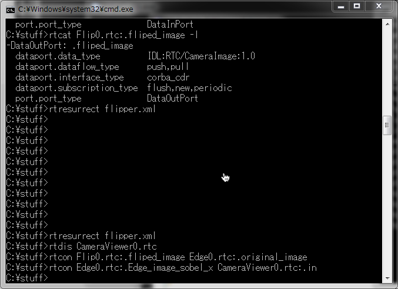
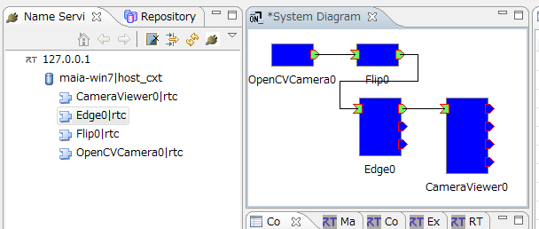

#contents

## はじめに

このケーススタディでは、rtshell で RTシステムの管理方法を紹介します。既存のカメラコンポーネントと画像処理コンポーネントと画像表示コンポーネントを利用し、自動でシステム復元や起動などを行います。
システム設計を RTSystemEditor で行い、復元・起動を rtshell とシェルスクリプトで行うといった、RTシステムの効率的な作成・運用を行うことができます。

### rtshell とは

[rtshell](http://www.openrtm.org/openrtm/ja/node/1005) はネームサーバー上に登録されている RTコンポーネントをシェルから管理することができるツールです。コンポーネントを activate/deactivate/reset したり、ポートの接続を行うことができます。
さらに、RTシステム全体を管理することもできます。

### 流れ

- RTSystemEditor でシステムの作成
- システムを RTSProfile に保存
- rtshell と rtcd（RTコンポーネントマネジャー）で RTコンポーネントのインスタンス作成
- rtshell の rtresurrectで システムコネクションの作成
- rtshell の rtstart でシステムの機動
- rtshell の rtstop でシステムの停止
- rtshell の rtteardown でシステムの削除

## システムを作成する

最初にネームサーバーを起動します。

次は以下のコンポーネントを起動します。

- OpenCVCameraComp
- FlipComp
- CameraViewerComp

RTSystemEditor を機動して、以下のシステムを作成します。

<div align="center"><a href="rtsystemeditor_make_system.png"></a></div>

ポート間のコネクションプロパティはデフォルト設定で OK です。


## システムを RTSProfile に保存

### RTSProfile とは

RTSProfile とは RTシステムを記述するファイルフォーマットです。使われるコンポーネント、コンフィギュレーションパラメーター、コネクション等の情報を記述することができます。
RTSProfile を使うことにより、RTSystemEditor で作成したシステム構成を保存し、他のツールで利用する（あるいはその逆）事ができます。

### 保存方法

作成したシステムエディタのバックグランド（の白い部分）をクリックして、[Save As] を選択します。

<div align="center"><a href="rtsystemeditor_save_system.png"></a></div>

システムの情報を入力します。

<div align="center"><a href="rtsystemeditor_save_system_info.png"></a></div>

[OK] ボタンをクリックして RTSProfile ファイルを作成・保存します。

最後に、コンポーネントを終了します。


## rtshell の使うための準備

Windows のコマンドプロンプトを起動します。

<div align="center"><a href="start_command_prompt.png"></a></div>

環境変数を設定します。コマンドプロンプトで以下のコマンドを実行します。
「RTCTREE_NAMESERVERS」は、rtshell の支援ライブラリrtctree が使う変数で、rtshell が見えるネームサーバーを指定します。

```
  set RTCTREE_NAMESERVERS=127.0.0.1
```


## RTシステムの復元

コンポーネント間のコネクションを再作成で RTシステムを復元します。以下のコンポーネントを起動します。

- OpenCVCameraComp
- FlipComp
- CameraViewerComp

rtshell でコンポーネントが登録されているネームサーバー上のフォルダーに移動します。

```
  rtcwd /127.0.0.1/maia-win7.host_cxt
```

「maia-win7.host_cxt」はネームサーバーの名です。

コマンドプロンプトで RTSProfile ファイルが保存されているフォルダーに移動して、以下のコマンドを実行します。

```
  rtresurrect flipper.xml
```

「flipper.xml」はRTSProfileファイルの名です。

<div align="center"><a href="rtresurrect_success.png"></a></div>

Eclipse でコマンドの実行結果を見ることができます。コンポーネントのポートが接続されていることがわかります。

<div align="center"><a href="rtresurrect_success_eclipse.png"></a></div>

rtcat コマンドでも同様に、システムが再構成されている様子を見ることができます。

<div align="center"><a href="rtresurrect_success_rtcat.png"></a></div>


## RTシステムの起動

システムを構成するすべてのコンポーネントをactivate する rtstart コマンドを利用するト、システム全体を起動することができます。

```
  rtstart flipper.xml
```

コマンドの実行結果は、Eclipse からコンポーネントがアクティブ状態（緑色）になっていることから確認できます。

<div align="center"><a href="rtstart_success_eclipse.png"></a></div>

rtls コマンドを利用しても書くにすることができます。

<div align="center"><a href="rtstart_success_rtls.png"></a></div>


## RTシステムの停止

システムを構成するすべてのコンポーネントをdeactivate する rtstop コマンドを使うことで、システム全体を停止することができます。

```
  rtstop flipper.xml
```

コマンドの実行結果は Eclipse からコンポーネントが全て青色になっていることから確認できます。

<div align="center"><a href="rtstop_success_eclipse.png"></a></div>

rtls コマンドでも確認することができます。

<div align="center"><a href="rtstop_success_rtls.png"></a></div>


## RTシステムの削除

最後に、rtteardown コマンドを使ってすべてのコネクションを削除することによってシステムを削除します。

```
  rtteardown flipper.xml
```

コマンドの実行結果は Eclipse からコンポーネント間の接続が切断されていることから確認できます。

<div align="center"><a href="rtteardown_success_eclipse.png"></a></div>

rtcat コマンドでもその様子を見ることができます。

<div align="center"><a href="rtteardown_success_rtcat.png"></a></div>


## rtshell で RTシステムの保存

rtshell では Eclipseと同様にシステムの構成情報を保存することも可能です。まずは簡単なシステムを作成します。

EdgeComp コンポーネントを起動して、以下のコマンドでポートを接続します。

```
  rtresurrect flipper.xml
  rtdis CameraViewer0.rtc
  rtcon Flip0.rtc:.fliped_image Edge0.rtc:.original_image
  rtcon Edge0.rtc:.Edge_image_sobel_x CameraViewer0.rtc:.in
```

これらのコマンドは、既に保存したシステムを復元して、一箇のコネクションを削除し、パイプラインに新しいコンポーネントを追加しています。

<div align="center"><a href="extended_system.png"></a></div>

Eclipse でシステム構成を確認することができます。

<div align="center"><a href="extended_system_eclipse.png"></a></div>

rtshell の rtcryo
コマンドは RTシステムを保存します。以下のコマンドで現在のシステムを保存します。

```
  rtcryo -n "Flipped edge detector" -v 2 -e Geoff -o edge.xml 127.0.0.1
```

保存されたファイルを Eclipse のシステムエディタで開くとシステム編集が行えます。オプションは以下のとおりです。

  -n システムの名
  -v システムのバージョン
  -e 作成者
  -o 出力フィアル名


## スクリプトによる簡単なシステム管理

スクリプトファイル（Windows では batch file、Linux や Mac OS X では bash等）を使うと、紹介されたコマンドを使って、複雑な RTシステムを簡単に起動・停止することが行えます。

まずは作成したシステムを削除します。

```
  rtteardown edge.xml
```

以下の内容を「run_system.bat」というファイルに保存します。

```
  @echo off
  echo "Starting system"
  call rtresurrect edge.xml
  call rtstart edge.xml
  echo "Press any key to shut down"
  pause
  call rtstop edge.xml
  call rtteardown edge.xml
```

```
 run_system.bat
```

を実行すると、システムが起動されます。
さらに、ユーザーが Enter キーを押すとシステムを削除し終了します。

