<!-- Title: チュートリアル(Raspberry Pi Mouse、C++、Windows、強化月間用) -->
#contents

## はじめに

このページではシミュレーター上の Raspberry Pi マウスを操作するためのコンポーネントの作成手順を説明します。

<div align="center"><a href="raspimouse2.png"></a></div>


## 資料のダウンロード

まずは資料をダウンロードしてください。

- [RTM_Tutorial_RaspberryPiMouse.zip](https://github.com/OpenRTM/RTM_Tutorial_RaspberryPiMouse/archive/master.zip)

ZIPファイルは [Lhaplus](http://forest.watch.impress.co.jp/library/software/lhaplus/) 等で展開してください。

インターネットに接続できない環境で講習会を実施している場合がありますので、その場合は配布のUSBメモリーに入れてあります。


### シミュレーター

- [RaspberryPiMouseSimulator コンポーネント](/content/simulator_rtc_raspbian_raspimouse)

シミュレーターは [Open Dynamics Engine(ODE)](http://www.ode.org/) という物理演算エンジンと ODE 付属の描画ライブラリ(drawstuff)を使用して開発しています。
OpenGL が動作すれば動くので、大抵の環境で動作するはずです。

以下の [Raspberry Piマウス](http://products.rt-net.jp/micromouse/raspberry-pi-mouse) というロボットのシミュレーションができます。

<div align="center"><a href="s_DSC00444.JPG"></a></div>


シミュレーター上の Raspberry Pi マウスの動力学計算、接触応答だけではなく、距離センサーのデータも現実のロボットに近い値を再現するようにしています。

## Raspberry Piマウスの仕様

Raspberry Piマウスはアールティが販売している独立二輪駆動型の移動ロボットです。

<div align="center"><a href="raspi_gaiyou.jpg"></a></div>


<table class="table-alt">
  <tr>
    <th colspan="2" style="text-align: center;">ラズパイマウスの仕様</th>
  </tr>
  <tr>
    <td>CPU</td>
    <td>Raspberry Pi 2 Model B</td>
  </tr>
  <tr>
    <td>モーター</td>
    <td>ステッピングモーターST-42BYG020 2個</td>
  </tr>
  <tr>
    <td>モータードライバー</td>
    <td>SLA7070MRPT 2個</td>
  </tr>
  <tr>
    <td>距離センサー</td>
    <td>赤色LED+フォトトランジスタ(ST-1K3) 4個</td>
  </tr>
  <tr>
    <td>モニター用赤色LED</td>
    <td>4個</td>
  </tr>
  <tr>
    <td>ブザー</td>
    <td>1個</td>
  </tr>
  <tr>
    <td>スイッチ</td>
    <td>3個</td>
  </tr>
  <tr>
    <td>バッテリー</td>
    <td>LiPo3セル(11.1V)1000mAh 1個</td>
  </tr>
</table>


## 作成する RTコンポーネント

- RobotController コンポーネント

RaspberryPiMouseSimulator コンポーネントと接続してシミュレーター上のロボットを操作するためのコンポーネントです。

## RobotController コンポーネントの作成

GUI(スライダー)によりシミュレーター上のロボットの操作を行い、センサー値が一定以上の時には自動的に停止するコンポーネントの作成を行います。

<div align="center"><a href="robotcomp.png"></a></div>

### 作成手順
作成手順は以下の通りです。

- 開発環境の確認
- コンポーネントの仕様を決める
- RTC Builderによるソースコードのひな形の作成
- ソースコードの編集
- コンポーネントの動作確認

### 開発環境の確認
以下の環境を想定しています。

- OS: Windows 8.1(7、10も可)
- [OpenRTM-aist: 1.2.1-RC](https://github.com/OpenRTM/OpenRTM-aist/releases/download/v1.2.0/OpenRTM-aist-1.2.1-RC190514_x86_64.msi)
- [Visual Studio: 2017:](https://www.visualstudio.com/ja-jp/downloads/download-visual-studio-vs.aspx)(2013、2015、2019でも可)
- [CMake](https://github.com/Kitware/CMake/releases/download/v3.14.1/cmake-3.14.1-win64-x64.msi)：3.5以上推奨
- [Python 2.7](https://www.python.org/ftp/python/2.7.16/python-2.7.16.amd64.msi)
- [Doxygen:ftp](//ftp.stack.nl/pub/users/dimitri/doxygen-1.8.14-setup.exe)


### コンポーネントの仕様

RobotController は目標速度を出力するアウトポート、センサー値を入力するインポート、目標速度や停止するセンサー値を設定するコンフィギュレーションパラメーターを持っています。

<table class="table-alt">
  <tr>
    <th>コンポーネント名称</th>
    <th>RobotController</th>
  </tr>
  <tr>
    <td colspan="2" style="text-align: center;">InPort</td>
  </tr>
  <tr>
    <td>ポート名</td>
    <td>in</td>
  </tr>
  <tr>
    <td>型</td>
    <td>TimedShortSeq</td>
  </tr>
  <tr>
    <td>説明</td>
    <td>センサー値</td>
  </tr>
  <tr>
    <td colspan="2" style="text-align: center;">OutPort</td>
  </tr>
  <tr>
    <td>ポート名</td>
    <td>out</td>
  </tr>
  <tr>
    <td>型</td>
    <td>TimedVelocity2D</td>
  </tr>
  <tr>
    <td>説明</td>
    <td>目標速度</td>
  </tr>
  <tr>
    <td colspan="2" style="text-align: center;">Configuration</td>
  </tr>
  <tr>
    <td>パラメーター名</td>
    <td>speed_x</td>
  </tr>
  <tr>
    <td>型</td>
    <td>double</td>
  </tr>
  <tr>
    <td>デフォルト値</td>
    <td>0.0</td>
  </tr>
  <tr>
    <td>制約</td>
    <td>-1.5<x<1.5</td>
  </tr>
  <tr>
    <td>Widget</td>
    <td>slider</td>
  </tr>
  <tr>
    <td>Step</td>
    <td>0.01</td>
  </tr>
  <tr>
    <td>説明</td>
    <td>直進速度の設定</td>
  </tr>
  <tr>
    <td colspan="2" style="text-align: center;">Configuration</td>
  </tr>
  <tr>
    <td>パラメーター名</td>
    <td>speed_r</td>
  </tr>
  <tr>
    <td>型</td>
    <td>double</td>
  </tr>
  <tr>
    <td>デフォルト値</td>
    <td>0.0</td>
  </tr>
  <tr>
    <td>制約</td>
    <td>-2.0<x<2.0</td>
  </tr>
  <tr>
    <td>Widget</td>
    <td>slider</td>
  </tr>
  <tr>
    <td>Step</td>
    <td>0.01</td>
  </tr>
  <tr>
    <td>説明</td>
    <td>回転速度の設定</td>
  </tr>
  <tr>
    <td colspan="2" style="text-align: center;">Configuration</td>
  </tr>
  <tr>
    <td>パラメーター名</td>
    <td>stop_d</td>
  </tr>
  <tr>
    <td>型</td>
    <td>int</td>
  </tr>
  <tr>
    <td>デフォルト値</td>
    <td>30</td>
  </tr>
  <tr>
    <td>説明</td>
    <td>停止するセンサー値の設定</td>
  </tr>
</table>

#### TimedVelocity2D 型について
2次元平面上の移動ロボットの移動速度を格納するデータ型である TimedVelocity2D 型を使用します。

```
     struct Velocity2D
     {
           /// Velocity along the x axis in metres per second.
           double vx;
           /// Velocity along the y axis in metres per second.
           double vy;
           /// Yaw velocity in radians per second.
           double va;
     };
 
 
     struct TimedVelocity2D
     {
           Time tm;
           Velocity2D data;
     };
```


このデータ型にはX軸方向の速度**vx**、Y軸方向の速度**vy**、Z軸周りの回転速度**va**が格納できます。

**vx**、**vy**、**va**はロボット中心座標系での速度を表しています。

<br>

<div align="center"><a href="tu_ev3_20.png">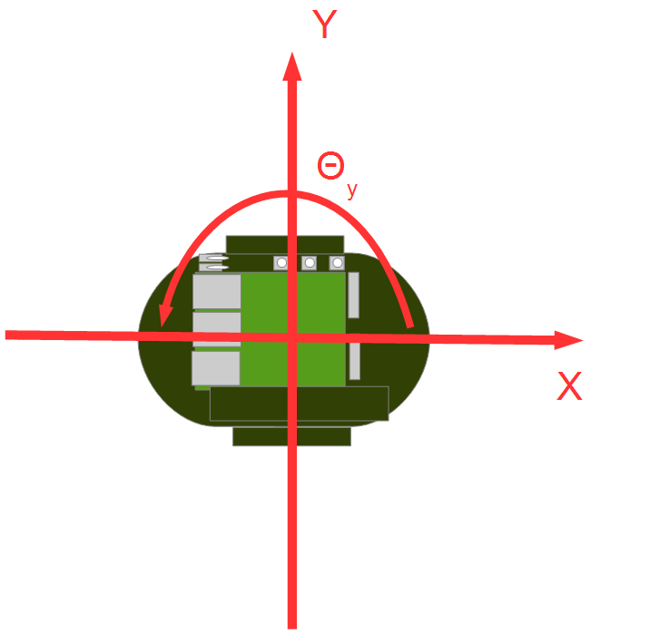</a></div>
<br>

**vx**はX方向の速度、**vy**はY方向の速度、**va**はZ軸周りの角速度です。

Raspberry Pi マウスのように2個の車輪が左右に取り付けられているロボットの場合、横滑りしないと仮定すると**vy**は0になります。

直進速度**vx**、回転速度**va**を指定することでロボットの操作を行います。

#### 距離センサーのデータについて
Raspberry Pi マウスの距離センサーのデータは物体との距離が近づくほど大きな値を出力するようになっています。


<br>

<div align="center"><a href="rpm14_graph.png"></a></div>
<br>


<table class="table-alt">
  <tr>
    <th>デバイスファイルから取得した数値</th>
    <th>実際の距離[m]</th>
  </tr>
  <tr>
    <td>1394</td>
    <td>0.01</td>
  </tr>
  <tr>
    <td>792</td>
    <td>0.02</td>
  </tr>
  <tr>
    <td>525</td>
    <td>0.03</td>
  </tr>
  <tr>
    <td>373</td>
    <td>0.04</td>
  </tr>
  <tr>
    <td>299</td>
    <td>0.05</td>
  </tr>
  <tr>
    <td>260</td>
    <td>0.06</td>
  </tr>
  <tr>
    <td>222</td>
    <td>0.07</td>
  </tr>
  <tr>
    <td>181</td>
    <td>0.08</td>
  </tr>
  <tr>
    <td>135</td>
    <td>0.09</td>
  </tr>
  <tr>
    <td>100</td>
    <td>0.10</td>
  </tr>
  <tr>
    <td>81</td>
    <td>0.15</td>
  </tr>
  <tr>
    <td>36</td>
    <td>0.20</td>
  </tr>
  <tr>
    <td>17</td>
    <td>0.25</td>
  </tr>
  <tr>
    <td>16</td>
    <td>0.30</td>
  </tr>
</table>

シミュレーターではこの値を再現して出力しています。
RobotController コンポーネントではこの値が一定以上の時に自動的に停止する処理を実装します。


### RobotController コンポーネントのひな型の生成

RobotController コンポーネントの雛型の生成は、RTCBuilder を用いて行います。

#### RTCBuilder の起動
Eclipse では、各種作業を行うフォルダーを「ワークスペース」(Work Space)とよび、原則としてすべての生成物はこのフォルダーの下に保存されます。
ワークスペースはアクセスできるフォルダーであれば、どこに作っても構いませんが、このチュートリアルでは以下のワークスペースを仮定します。

- C:\workspace

まずは Eclipse を起動します。
Windows 8.1の場合は「スタート」>「アプリビュー(右下矢印)」>「OpenRTM-aist 1.2.0」>「OpenRTP」をクリックすると起動できます。


最初にワークスペースの場所を尋ねられますので、上記のワークスペースを指定してください。


<div align="center"><a href="robomech2018_1.jpg">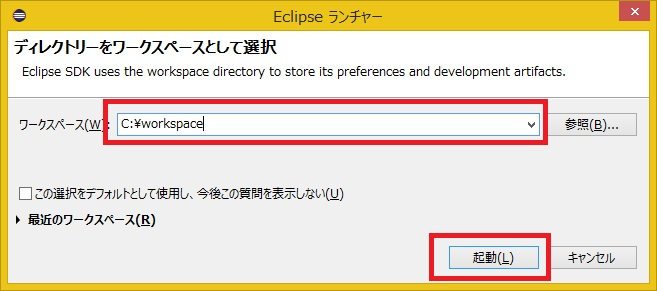</a></div>

すると、以下のようなWelcomeページが表示されます。

<br>


<div align="center"><a href="robomech2018_2_2.jpg"></a></div>
<div align="center"><strong>Eclipse の初期起動時の画面</strong></div>

Welcomeページはいまは必要ないので左上の「×」ボタンをクリックして閉じてください。

右上の [Open Perspective] ボタンをクリックしてください。

<div align="center"><a href="install42.png"></a></div>
<div align="center"><strong>パースペクティブの切り替え</strong></div>

「RTC Builder」を選択することで、RTCBuilder が起動します。メニューバーに「カナヅチとRT」の RTCBuilder のアイコンが表示されます。

<div align="center"><a href="robomech2018_3.jpg"></a></div>
<div align="center"><strong>パースペクティブの選択</strong></div>


#### 新規プロジェクトの作成

RobotController コンポーネントを作成するために、RTC Builder で新規プロジェクトを作成する必要があります。

左上の [Open New RTCBuilder Editor] のアイコンをクリックしてください。


<div align="center"><a href="CreateProject_0.png">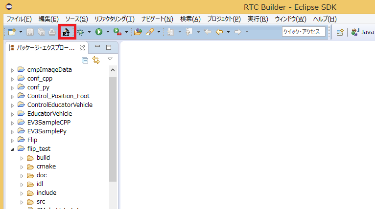</a></div>
<div align="center"><strong>RTC Builder 用プロジェクトの作成</strong></div>

｢プロジェクト名｣欄に作成するプロジェクト名 (ここでは **RobotController**) を入力して [終了] ボタンをクリックします。


<div align="center"><a href="RT-Component-BuilderProject_1.png"></a></div>


指定した名称のプロジェクトが生成され、パッケージエクスプローラ内に追加されます。


<div align="center"><a href="PackageExplolrer_1.png"></a></div>

生成したプロジェクト内には、デフォルト値が設定された RTC プロファイル XML(RTC.xml) が自動的に生成されます。

#### RTC プロファイルエディタの起動

RTC.xml が生成された時点で、このプロジェクトに関連付けられているワークスペースとして RTCBuilder のエディタが開くはずです。
もし起動しない場合はパッケージエクスプローラーの RTC.xml をダブルクリックしてください。


<div align="center"><a href="Open_RTCBuilder_0.png"></a></div>


#### プロファイル情報入力とコードの生成

まず、いちばん左の「基本」タブを選択し、基本情報を入力します。先ほど決めた RobotController コンポーネントの仕様(名前)の他に、概要やバージョン等を入力してください。
ラベルが赤字の項目は必須項目です。その他はデフォルトで構いません。

- モジュール名: RobotController
- モジュール概要: 任意(Robot Controller component)
- バージョン: 任意(1.0.0)
- ベンダ名: 任意
- モジュールカテゴリ: 任意(Controller)


<br>

<div align="center"><a href="Basic_1.png"></a></div>
<div align="center"><strong>基本情報の入力</strong></div>
<br>


次に、「アクティビティ」タブを選択し、使用するアクションコールバックを指定します。

RobotController コンポーネントでは、onActivated()、onDeactivated()、onExecute()
コールバックを使用します。下図のように①の onAtivated をクリック後に②のラジオボタンにて [ON] にチェックを入れます。
onDeactivated、onExecute についても同様の手順を行います。

<br>

<div align="center"><a href="Activity_1.png">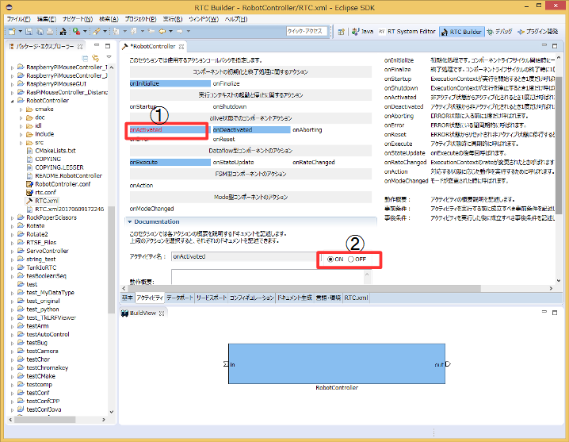</a></div>
<div align="center"><strong>アクティビティコールバックの選択</strong></div>
<br>


さらに、「データポート」タブを選択し、データポートの情報を入力します。
先ほど決めた仕様を元に以下のように入力します。なお、変数名や表示位置はオプションで、そのままで結構です。


<br>

- InPort Profile:
  - ポート名: in
  - データ型: TimedShortSeq

<br>


- OutPort Profile:
  - ポート名: out
  - データ型: TimedVelocity2D


<br>


<div align="center"><a href="DataPort_1.png"></a></div>
<div align="center"><strong>データポート情報の入力</strong></div>
<br>

次に、「コンフィギュレーション」タブを選択し、先ほど決めた仕様を元に、Configuration の情報を入力します。
制約条件および Widget とは、RTSystemEditor でコンポーネントのコンフィギュレーションパラメーターを表示する際に、スライダー、スピンボタン、ラジオボタンなど、GUI で値の変更を行うためのものです。

直進速度 speed_x、回転速度 speed_r はスライダーのより操作できるようにします。

<br>

- speed_x
  - 名称: speed_x
  - データ型: double
  - デフォルト値: 0.0
  - 制約条件: -1.5<x<1.5
  - Widget: slider
  - Step: 0.01
- speed_r
  - 名称: speed_r
  - データ型: double
  - デフォルト値: 0.0
  - 制約条件: -2.0<x<2.0
  - Widget: slider
  - Step: 0.01
- stop_d
  - 名称: stop_d
  - データ型: int
  - デフォルト値: 30
  - Widget: text

<br>


<div align="center"><a href="Configuration_1.png">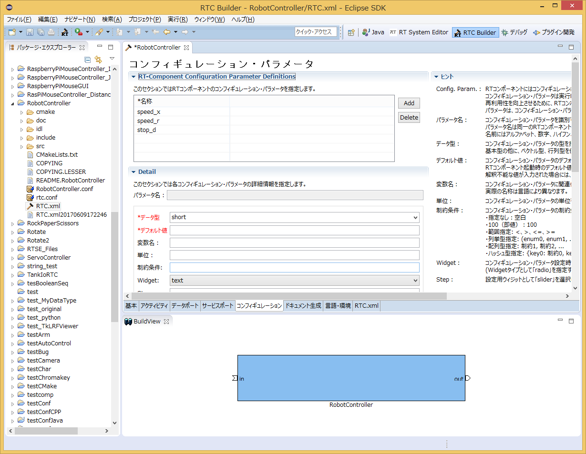</a></div>
<div align="center"><strong>コンフィグレーション情報の入力</strong></div>
<br>

次に、「言語・環境」タブを選択し、プログラミング言語を選択します。
ここでは、C++(言語)を選択します。なお、言語・環境はデフォルト等が設定されておらず、指定し忘れるとコード生成時にエラーになりますので、必ず言語の指定を行うようにしてください。


<div align="center"><a href="Language_1.png">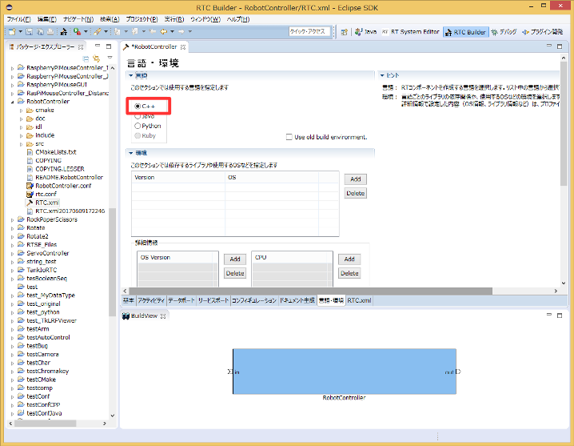</a></div>
<div align="center"><strong>プログラミング言語の選択</strong></div>
<br>

最後に、「基本」タブにあ [コード生成] ボタンをクリックし、コンポーネントの雛型を生成します。

<br>

<div align="center"><a href="Generate_1.png"></a></div>
<div align="center"><strong>雛型の生成(Generate)</strong></div>
<br>

プロジェクトを右クリックして、「表示方法」→「システム・エクスプローラー」を選択するとワークスペースをエクスプローラーで開くことができます。


<div align="center"><a href="robomech2018_4.jpg"></a></div>


### CMake によるビルドに必要なファイルの生成

RTC Builder で生成したコードの中には CMake でビルドに必要な各種ファイルを生成するための CMakeLists.txt が含まれています。
CMake を利用することにより CMakeLists.txt からVisual Studio のプロジェクトファイル、ソリューションファイル、もしくは Makefile 等を自動生成できます。


#### CMake(cmake-gui) の操作
CMake を利用してビルド環境の Configure を行います。
まずは CMake(cmake-gui) を起動してください。「スタート」>「アプリビュー(右下矢印)」>「CMake 3.11.2」>「CMake (cmake-gui)」をクリックすると起動できます。

<div align="center"><a href="CMakeGUI0_1.png"></a></div>
<div align="center"><strong>CMake GUI の起動とディレクトリーの指定</strong></div>

画面上部に以下のようなテキストボックスがありますので、それぞれソースコードの場所 (CMakeList.txtがある場所) と、ビルドディレクトリーを指定します。

- **Where is the soruce code**
- **Where to build the binaries**

ソースコードの場所は RobotController コンポーネントのソースが生成された場所で CMakeList.txt が存在するディレクトリーです。
デフォルトでは <ワークスペースディレクトリー>/RobotController になります。

このディレクトリーはエクスプローラから cmake-gui にドラックアンドドロップすると手入力しなくても設定されます。


ビルドディレクトリーとは、ビルドするためのプロジェクトファイルやオブジェクトファイル、バイナリを格納する場所のことです。
場所は任意ですが、この場合 <ワークスペースディレクトリー>/RobotController/build のように分かりやすい名前をつけた RobotController のサブディレクトリーを指定することをお勧めします。

<table class="table-alt">
  <tr>
    <td>**Where is the soruce code**</td>
    <td>C:\workspace\RobotController</td>
  </tr>
  <tr>
    <td>**Where to build the binaries**</td>
    <td>C:\workspace\RobotController\build</td>
  </tr>
</table>

指定したら、下の [Configure] ボタンをクリックします。すると下図のようなダイアログが表示されますので、生成したいプロジェクトの種類を指定します。
今回は Visual Studio 15 2017 とします。Visual Studio 2013や Visual Studio 2019を利用している方はそれぞれ変更してください。
またプラットフォームにはx64を設定します。32bit版をインストールしている場合はWin32を選択してください。


<div align="center"><a href="cmake_vs.png">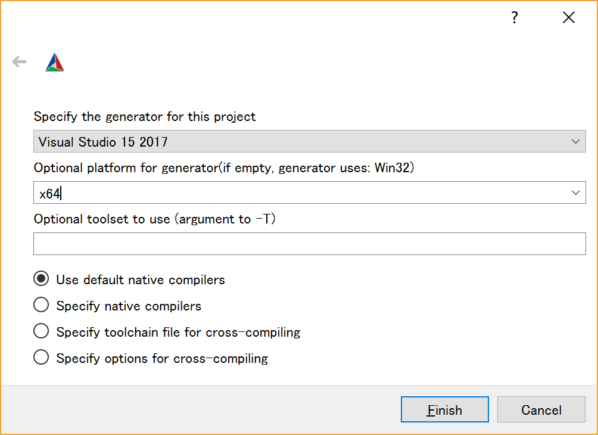</a></div>
<div align="center"><strong>生成するプロジェクトの種類の指定</strong></div>

ダイアログで [Finish] ボタンをクリックすると Configure が始まります。
問題がなければ下部のログウインドウに「Configuring done」と出力されますので、続けて [Generate] ボタンをクリックします。
「Generating done」と出ればプロジェクトファイル・ソリューションファイル等の出力が完了します。

なお、CMake は Configure の段階でキャッシュファイルを生成しますので、トラブルなどで設定を変更したり環境を変更した場合は [File] > [Delete Cache] でキャッシュを削除して Configure からやり直してください。


### ヘッダ、ソースの編集

次に先ほど指定した build ディレクトリーの中の RobotController.sln をダブルクリックして Visual Studio 2013 を起動します。

※cmake-gui の新しいバージョンでは cmake-gui 上のボタンをクリックすることで起動できます。

<br>

<div align="center"><a href="cmake_gui.png"></a></div>
<br>


ヘッダ (include/RobotController/RobotController.h) およびソースコード (src/RobotController.cpp) をそれぞれ編集します。
Visual Studio のソリューションエクスプローラから RobotController.h、RobotController.cpp をクリックすることで編集画面が開きます。


<div align="center"><a href="robomech2018_5.jpg">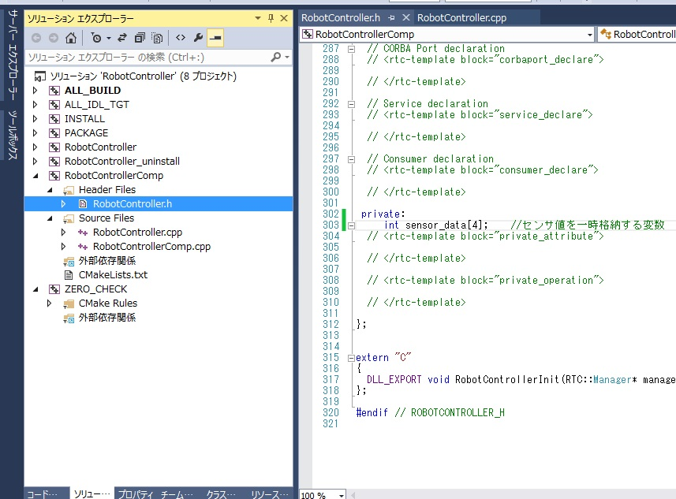</a></div>


#### アクティビティ処理の実装


RobotController コンポーネントでは、コンフィギュレーションパラメーター(speed_x、speed_y)をスライダーで操作しその値を目標速度としてアウトポート(out)から出力します。
インポート(in) から入力された値を変数に格納して、その値が一定以上の場合は停止するようにします。

<br>
onActivated()、onExecute()、onDeactivated() での処理内容を下図に示します。
<br>

<div align="center"><a href="RCRTC_State_1.png">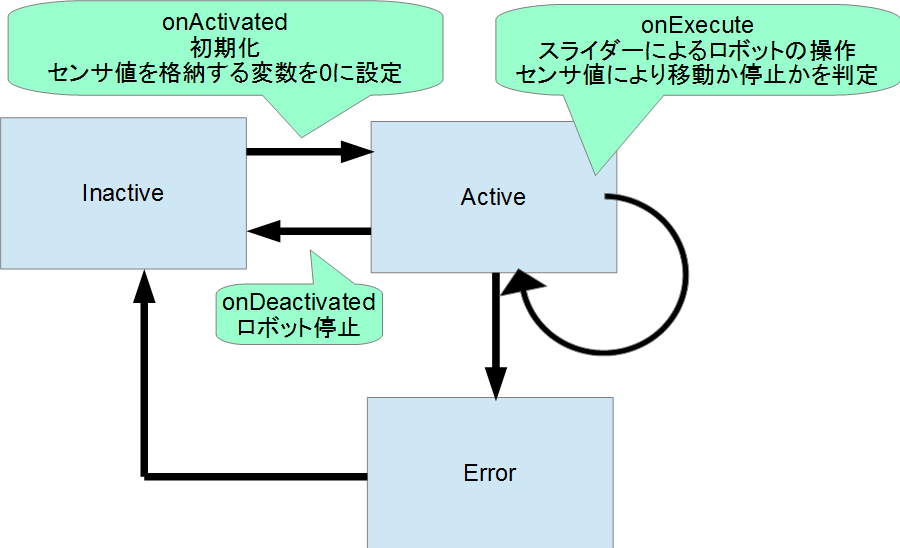</a></div>
<div align="center"><strong>アクティビティ処理の概要</strong></div>
<br>


#### ヘッダファイル (RobotController.h) の編集

センサー値を一時的に格納する変数 sensor_data を宣言します。

```
   private:
 	 int sensor_data[4];	//センサー値を一時格納する変数
```


#### ソースファイル (RobotController.cpp) の編集

下記のように、onActivated()、onDeactivated()、onExecute() を実装します。

```
 RTC::ReturnCode_t RobotController::onActivated(RTC::UniqueId ec_id)
 {
 	    //センサー値初期化
 	    for (int i = 0; i < 4; i++)
 	    {
 		        sensor_data[i] = 0;
 	    }
 
 	    return RTC::RTC_OK;
 }
```


```
 RTC::ReturnCode_t RobotController::onDeactivated(RTC::UniqueId ec_id)
 {
 	    //ロボットを停止する
 	    m_out.data.vx = 0;
 	    m_out.data.va = 0;
 	    m_outOut.write();
 
 	    return RTC::RTC_OK;
 }
```


```
 RTC::ReturnCode_t RobotController::onExecute(RTC::UniqueId ec_id)
 {
 	    //入力データの存在確認
 	    if (m_inIn.isNew())
 	    {
 		    //入力データ読み込み
 		    m_inIn.read();
 		    for (int i = 0; i < m_in.data.length(); i++)
 		    {
 			    //入力データ格納
 			    if (i < 4)
 			    {
 				    sensor_data[i] = m_in.data[i];
 			    }
 		    }
 	    }
 
 	    //前進するときのみ停止するかを判定
 	    if (m_speed_x > 0)
 	    {
 		    for (int i = 0; i < 4; i++)
 		    {
 			    //センサー値が設定値以上か判定
 			    if (sensor_data[i] > m_stop_d)
 			    {
 				        //センサー値が設定値以上の場合は停止
 				        m_out.data.vx = 0;
 				        m_out.data.va = 0;
 				        m_outOut.write();
 				        return RTC::RTC_OK;
 			    }
 		    }
 	    }
 	    //設定値以上の値のセンサーが無い場合はコンフィギュレーションパラメーターの値で操作
 	    m_out.data.vx = m_speed_x;
 	    m_out.data.va = m_speed_r;
 	    m_outOut.write();
           return RTC::RTC_OK;
 }
```


### Visual Studio によるビルド

#### ビルドの実行

Visual Studioの [ビルド] >「ソリューションのビルド」を選択してビルドを行います。


<br>

<div align="center"><a href="VC++_build_0.png"></a></div>
<div align="center"><strong>ビルドの実行</strong></div>
<br>


## RobotController コンポーネントの動作確認
作成した RobotController をシミュレーターコンポーネントと接続して動作確認を行います。


### NameService の起動

コンポーネントの参照を登録するためのネームサービスを起動します。

<br>
RT System Editorのネームサービス起動ボタンを押すと起動します。

<div align="center"><a href="robomech2018_6.jpg"></a></div>

&color(red){※ 「Start Naming Service」をクリックしても omniNames が起動されない場合は、フルコンピュータ名が14文字以内に設定されているかを確認してください。


### RobotController コンポーネントの起動

RobotController コンポーネントを起動します。

RobotController\build\src\Debug(もしくは、Release)フォルダーの RobotControllerComp.exe ファイルを実行してください。


### シミュレーターコンポーネントの起動

このコンポーネントは先ほどダウンロードしたファイル(RTM_Tutorial_RaspberryPiMouse.zip)を展開したフォルダーの EXE/RaspberryPiMouseSimulatorComp.exe を実行すると起動します。


### コンポーネントの接続

下図のように、RTSystemEditor にて
RobotController コンポーネント、RaspberryPiMouseSimulator コンポーネントを接続します。

<div align="center"><a href="RTSE_Connect_1.png"></a></div>
<div align="center"><strong>コンポーネントの接続</strong></div>

### コンポーネントのActivate

RTSystemEditor の上部にあります [All Activate] というアイコンをクリックし、全てのコンポーネントをアクティブ化します。
正常にアクティベートされた場合、下図のように黄緑色でコンポーネントが表示されます。

<br>

<div align="center"><a href="robomech2018_26.jpg">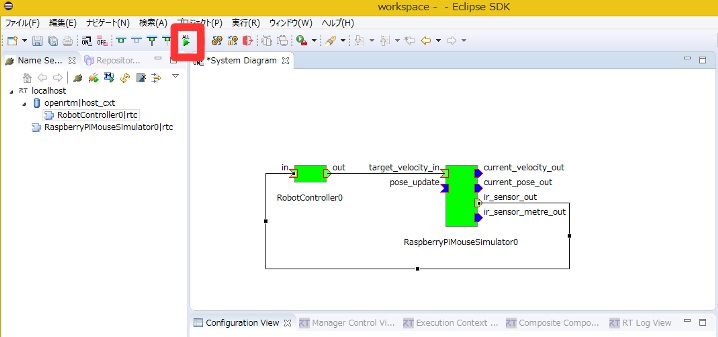</a></div>
<div align="center"><strong>コンポーネントのアクティブ化</strong></div>
<br>

### 動作確認

下図のようにコンフィギュレーションビューの [編集] ボタンからコンフィギュレーションを変更することができます。

<br>

<div align="center"><a href="RTSE_Configuration_10.png"></a></div>
<br>

スライダーを操作してシミュレーター上の Raspberry Pi マウスの操作ができるかを確認してください。

<br>

<div align="center"><a href="RTSE_Configuration_1.png"></a></div>
<div align="center"><strong>コンフィギュレーションパラメーターの変更</strong></div>
<br>


## 実機での動作確認
講習会で Raspberry Pi マウス実機を用意している場合は実機での動作確認が可能ですので、時間に余裕がある人は試してみてください。

手順は以下の通りです。

- Raspberry Pi マウスの電源を投入する
- Raspberry Pi マウスのアクセスポイントに接続
- ポートの接続
- コンポーネントのアクティブ化


### 電源を投入する

Raspberry PiマウスにはRaspberry Piの電源スイッチとモーターの電源スイッチの2つがあります。

<br>

<div align="center"><a href="rpm8_raspi.png">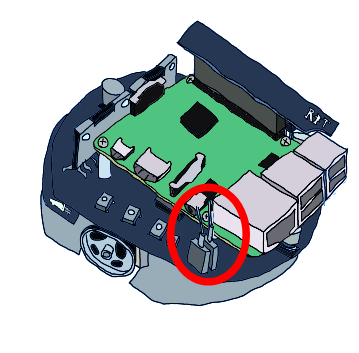</a></div>

<br>


内側の電源スイッチをオンにするとRaspberry Piが起動します。

<br>

<div align="center"><a href="rpm9_raspi.png"></a></div>

<br>


#### 電源を切る場合

Raspberry Piの電源を切る場合は、電源スイッチから直接オフにはしないようにしてください。
3つ並んだボタンの中央のボタンを数秒押すとシャットダウンが始まります。
10秒程度でRaspbianのシャットダウンが終了するため、その後に電源スイッチをオフにしてください。

<br>

<div align="center"><a href="rpm8.png"></a></div>
<br>


### アクセスポイントに接続
アクセスポイントへの接続方法は以下のページを参考にしてください。


- [Windows 7で無線LANに接続する方法](http://121ware.com/qasearch/1007/app/servlet/qadoc?QID=011120)
- [Windows 8 / 8.1で無線LANに接続する方法](http://121ware.com/qasearch/1007/app/servlet/relatedqa?QID=014183)


SSID、パスワードは Rasoberry Pi マウスに貼り付けたシールに記載してあります。


まず右下のネットワークアイコンをクリックしてください。

<br>

<div align="center"><a href="tu_ev3_14.png">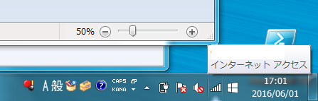</a></div>
<br>

次に一覧から raspberrypi_*** を選択してください。


<br>

<div align="center"><a href="tu_ev3_15.png"></a></div>
<br>


パスワードを入力してください。

<br>

<div align="center"><a href="tu_ev3_12.png"></a></div>
<br>

※ネットワークが切り替わった場合にネームサーバーへのコンポーネントの登録やポートの接続が失敗する場合があるのでネームサーバ、コンポーネントを一旦全て終了してください。
ネットワーク切り替え後に起動した場合には問題ないので、終了させる必要はありません。


### ネームサーバー追加

続いてRTシステムエディタの [ネームサーバー追加] ボタンで <span style="color:red;">192.168.11.1</span>; を追加してください。


<br>

<div align="center"><div align="center"><a href="tutorial_raspimouse0.png"></a></div>;  <div align="center"><a href="tutorial_raspimouse1.png"></a></div>;</div>
<br>
<br>

すると以下の3つの RTC が見えるようになります。

<div align="center"><a href="robomech2018_7.jpg">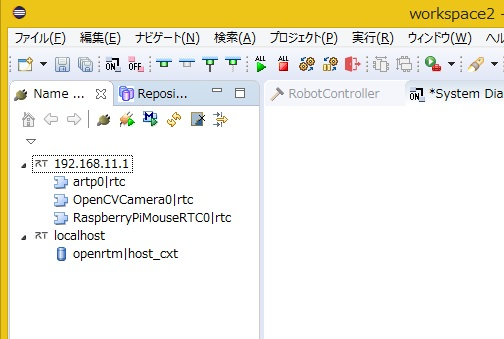</a></div>

- [RaspberryPiMouseRTC](/ja/node/6015#toc0)
- OpenCVCamera
- artp

RaspberryPiMouseRTC は名城大学のロボットシステムデザイン研究室で開発されているラズパイマウス制御用の RTコンポーネントです。


### ポートの接続

RTシステムエディタで RaspberryPiMouseRTC、RobotController コンポーネントを以下のように接続します。

<div align="center"><a href="tutorial_raspimouse41.png">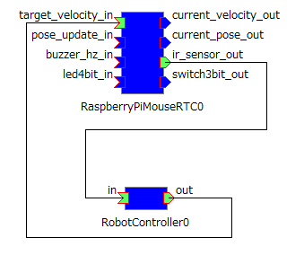</a></div>


### モーターの電源を投入する
動作の前に、モーターの電源スイッチをオンにしてください。
モーターの電源はこまめに切るようにしてください。


<br>

<div align="center"><a href="rpm10_raspi.png"></a></div>

<br>

### アクティブ化
そして RTC をアクティブ化すると Raspberry Pi マウスの操作ができるようになります。


