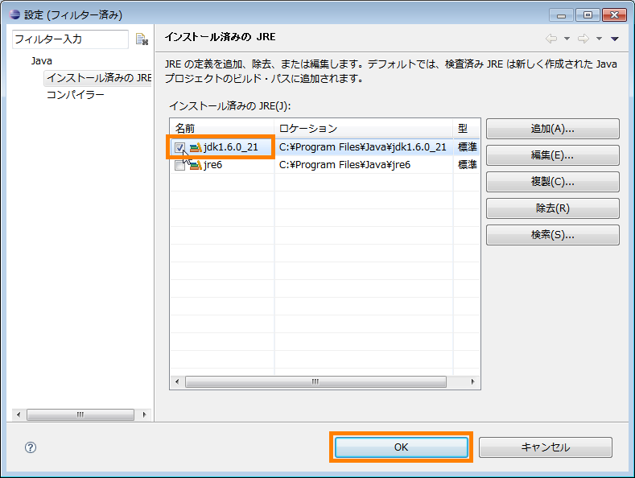
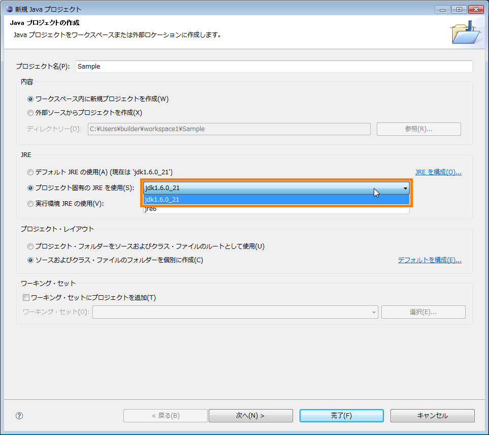
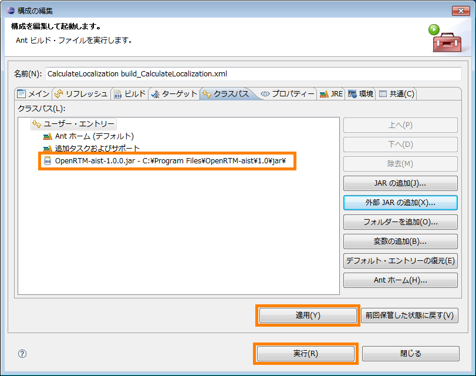

<!-- Title: RTコンポーネント作成について -->
#contents(4)
RTコンポーネント作成に関する FAQ をまとめました。

#clear
<br>

#### RTコンポーネントのインスタンス命名規則は
: | RTコンポーネントのインスタンス命名規則は、
::[RTコンポーネント type名] + [数字 (0、1、2、3...)]
: |のようになっています。~
RTコンポーネント type名は、rtc-template で --type-name オプションで指定した名前、もしくは、コンポーネントプロファイル(通常は *.cppファイルの先頭に記述) "type_name" に指定されている名前です。~
番号は、同一マネージャ上で生成されたコンポーネントに対して、0、1、2、3...のような連番を振ります。~
~
同一のコンポーネントが別プロセスで複数起動された場合には、インスタンスの番号はそれぞれ 0 から始まるので、同一の名前のコンポーネントが複数起動されたことになります。~
場合によっては、ネームサービスに同一の名前として複数のコンポーネントが登録されることになり、前に登録されたものは後で登録されたもので上書きされます。~
~
これを回避するには、
:: 同一プロセスで複数のコンポーネントを起動させる
:: rtc.conf の naming.formats オプションでそれぞれ衝突しない名前フォーマットを指定する
: |などの方法があります。

<br>

#### 標準以外のデータ型を InPort/OutPort で使うには
: |通常 OpenRTM-aist では rtm/idl/BasicDataType.idl で定義されている TimedShort、TimedLong、TimedUShort、TimedULong、TimedFloat、TimedDouble、TimedChar、TimedBoolean、TimedOctet、TimedString、TimedShortSeq、TimedLongSeq、TimedUShortSeq、TimedULongSeq、TimedFloatSeq、TimedDoubleSeq、TimedCharSeq、TimedBooleanSeq、TimedOctetSeq、TimedStringSeq の20種類のデータ型を InPort および OutPort のデータ型として使用することができます。~
~
これ以外のデータ型を定義し InPort/OutPort で使用したい場合は、そのデータ型を IDL で定義し、コンポーネントをコンパイルするときに同時にコンパイル・リンクする必要があります。~
~
仮に画像を格納するため、サイズ(width, height)、デプス、イメージデータ、各メンバを持つデータ型を使用したいとします。IDL ではこのデータ型を以下のように定義します。~
```
 #include <BasicDataType.idl>
 module RTC
 {
   struct TimedImage
   {
     Time tm;
     long width;
     long height;
     long depth;
     sequence<octet> data;
   };
 };
```
: |Time型は OpenRTM で定義されているタイムスタンプのための型です。無くても構いませんが、含めておいたほうが良いでしょう。~
これを TimedImage.idl として、ファイルに保存します。~
~
このファイルをコンポーネントを作成するディレクトリーにおきます。~
次に、rtc-templateでコンポーネントを作成します。その際に、この IDL ファイルを --consumer-idl オプションに指定します。~
```
 rtc-template -bcxx \
```
   --module-name=ConsoleIn --module-type='DataFlowComponent' \
   --module-desc='Console input component' \
   --module-version=1.0 --module-vendor='Noriaki Ando, AIST' \
   --module-category=example \
   --module-comp-type=DataFlowComponent --module-act-type=SPORADIC \
   --module-max-inst=10 --outport=out:TimedImage \
   --consumer-idl=TimedImage.idl
: |この例では、TimedImage.idl で定義した TimedImage型を OutPort のデータ型として用いています。生成されたコードをコンパイルします。~
```
 make -f Makefile.ConsoleIn
```
: |これで、TimedImage.idl が IDL コンパイラでコンパイルされ、スタブが生成されると共に、コンポーネントにリンクされます。~
コンポーネント内でのデータの使用方法は通常のものと同じです。~
これと同じデータ型を他のコンポーネントでも使用したい場合は、この IDL ファイルだけコピーして、同様に rtc-template の --consumer-idl オプションでファイルを指定してください。~
これで、このデータ型を用いてコンポーネント間で通信できるようになります。

<br>

#### データポートで約2MB以上のデータを送りたい
: |画像データなどをデータポートで送る際、1回に贈られるのデータサイズ約2MBを超える場合には注意が必要です。~
omniORBでは、giop (General Inter-ORB Protocol)で扱えるサイズはデフォルトで"2097152B(2MB)"となっています。~
このサイズを超えるデータを1回に送ろうとすると、giop の制限のため正しいデータを送ることができません。~
この最大サイズを変更するためには、下記の2つの方法があります。
::rtc.conf にて最大サイズを指定する。~
```
 # file: rtc.conf
 corba.nameservers: localhost
 naming.formats: %n.rtc
 corba.args: -ORBgiopMaxMsgSize 3145728 # この行を追加
                                          # Maxサイズを3Mに指定
```
:: 環境変数にて指定する場合~
```
  export ORBgiopMaxMsgSize=3145728
```
:: |※ giopMaxMsgSize を指定する場合、server、client 共(対になるコンポーネント)に設定する必要があります。~
~
(omniORB configuration and API) [http](//omniorb.sourceforge.net/omni41/omniORB/omniORB004.html:http://omniorb.sourceforge.net/omni41/omniORB/omniORB004.html)

<br>

<!-- **入出力ポートのデータ型の選択  -->
<!-- **ConsoleOut でコールバックが必要な訳は？ -->
&aname(errorjavaJDK);
#### 新規 Java プロジェクトが JDK6(1.6)準拠として作成できない
: |新規プロジェクトで Java プロジェクトを作成しようとすると、次のようなダイアログが表示されて、JDK準拠が選択できないことがあります。
: |RTCBuilder を利用し、Java で RTコンポーネント作成するプロジェクトでは、このダイアログにおいて指定する JRE（Java実行環境）を JDK 内に含まれている JRE とする必要があります。このままでは JDK内の JRE を選択できないため設定を変更します。

: |下図のように JRE フレーム内の「JREを構成...」リンクをクリックします。（あるいは、一旦このダイアログをキャンセルして Eclipse のメニューバーの[ウィンドウ] > [設定] > 「設定」ダイアログの左のツリー部分から「Java」の下の「インストール済みのJRE」を選択します。）

<div align="center"><a href="new_project_name_ja.png"></a></div>
<div align="center"><strong>新規Javaプロジェクトのダイアログ（JDKの選択がない場合）</strong></div>

<br>

: |[追加] ボタンをクリックします。

<div align="center"><a href="new_JRE_setting_ja.png"></a></div>
<div align="center"><strong>インストール済みのJREのダイアログ（JDKの表示はまだない）</strong></div>

<br>

: |標準VM を選択して [次へ] ボタンをクリックします。

<div align="center"><a href="new_JRE_VM_setting_ja.png"></a></div>
<div align="center"><strong>JREの型の選択のダイアログ</strong></div>

** |[ディレクトリー] ボタンをクリックして、JDK6 までのパスを選択します。（参考：通常、JDK6 のパスはC**: \Program Files\Java\jdk1.6.0_XX）

<div align="center"><a href="add_JRE_ja.png"></a></div>
<div align="center"><strong>JRE の追加ダイアログ</strong></div>
<br>

<div align="center"><a href="select_JDK_ja.png"></a></div>
<div align="center"><strong>JDK6 までのパスを選択し、「JRE の追加」ダイアログに JDK を参照させる</strong></div>
<br>
: |JDK までのパスの参照に成功すると、「JRE の追加」ダイアログが下図のようになりますので、[完了] ボタンをクリックしてダイアログを閉じます。

<div align="center"><a href="load_JDK_ja.png"></a></div>
<div align="center"><strong>JDK6 のパス参照に成功</strong></div>
<br>

: |「インストール済みの JRE」ダイアログに戻ってくるので（JDK が追加された状態で）、下図のようにアクティブとする JRE にチェックを入れ、[OK] ボタンをクリックします。

<div align="center"><a href="set_active_JDK_ja.png"></a></div>
<div align="center"><strong>「インストール済みの JRE」ダイアログに JDK が追加されているので、アクティブチェックを JDK に変更</strong></div>
<br>

: |「新規 Java プロジェクト」のダイアログで JDK が選択できるようになります。

<div align="center"><a href="SelectJDKasJRE_ja.png"></a></div>
<div align="center"><strong>「JRE」としてJDK内の JRE で構成するように指定する</strong></div>

<br>

&aname(Antbuild);
#### 任意のフォルダーにクラスパスを設定して Ant ビルドを行う方法は？
: |環境変数 RTM_JAVA_ROOT に OpenRTM-aist (Java版)ライブラリ「OpenRTM-aist-X.X.X.jar」（X.X.Xはバージョンです。）が存在するフォルダ「jar」へのパスのベースパス（親フォルダまでのパス）を設定し、それをクラスパスの設定に用いることで、OpenRTM-aist (Java版)はRTCBuilderでのコード生成とAntでのビルド実行の連携を築いています。したがって、RTM_JAVA_ROOT は OpenRTM-aist (Java版) のライブラリフォルダへのパス（のベースパス）を必ず保持していなければならないわけです。ところが、RTM_JAVA_ROOT はその名の示すとおり、本来 OpenRTM-aist (Java版)のインストール場所を指すものなので、結果 OpenRTM-aist (Java版) のライブラリと他のコンポーネント（ドキュメント・サンプル・ユーティリティツール類）は常にそのフォルダー構造を保っていなければならないことになります。~
~
環境変数 RTM_JAVA_ROOT をクラスパス設定専用に使う方法も考えられます。OpenRTM-aist (Java版)のライブラリフォルダを自由な位置に配置し、それに合わせて RTM_JAVA_ROOT 設定するという使い方もできるでしょう。ただし、この場合は、「環境変数 RTM_JAVA_ROOT をライブラリへのクラスパスの用途以外には使用していない」という保証が必要です。~
~
そこで、何らかの事情で RTM_JAVA_ROOT が指示しているところとは別のところにクラスパスを設定したい場合、クラスパスをどのように設定したらよいのかをここで説明します。

<br>

:: **Eclipse の Ant 設定ダイアログを呼び出す**|Eclipse の通常左のビュー「パッケージ・エクスプローラー」から build_<CompName>.xml を右クリックして、[実行] > [Antビルド...] を選択する。

<div align="center"><a href="Call_Ant_Setting_ja.png"></a></div>
<div align="center"><strong>Ant設定ダイアログを呼び出す</strong></div>

<br>

: |
:: **クラスパスの設定**|Ant の設定ダイアログが表示されるので、「クラスパス」タブを選択する。

<div align="center"><a href="Ant_Setting_Classpath_ja.png"></a></div>
<div align="center"><strong>「クラスパス」タグを選択する</strong></div>

<br>

: |
:: |「ユーザーエントリ」を一度選択し、その後「外部 JAR の追加」ボタンをクリックする。

<div align="center"><a href="Ant_External_Jar_ja.png"></a></div>
<div align="center"><strong>外部JARの追加</strong></div>
<br>
: |
:: |「JAR の選択」ダイアログが現れたら、目的の JAR ライブラリまでのパスを指定する。結果、下図のように追加した JAR ライブラリが Ant の設定ダイアログに表示される。

<div align="center"><a href="Ant_Add_Jar_ja.png"></a></div>
<div align="center"><strong>追加された JAR</strong></div>

<br>

: |
::**重要な留意点**|環境変数 RTM_JAVA_ROOT は必ず設定しなければなりません（ただし、ダミーでも可）。クラスパスを任意に指定することで、たとえ RTM_JAVA_ROOT の設定が不要となったとしても、その設定削除をしたり、設定そのものをしなかったりするとビルド時にエラーとなります。また、RTM_JAVA_ROOT が指し示すパスの先には（空でもいいので）必ず「jar」という名前のフォルダーが実在していなければなりません。

