<!-- Title: RTコンポーネント作成(Java版) -->
#contents


# 概要 
## OpenRTM-aist-Java 概要
　OpenRTM-aist とは、独立行政法人産業技術総合研究所・知能システム研究部門・タスクインテリジェンス研究グループが実装・配布・メンテナンスを行っている RTミドルウェアの実装例です。RTミドルウェアおよび OpenRTM-aist は、ロボットの様々な機能要素を RTコンポーネントと呼ばれる部品単位に分割し、これらを自由に組み合わせることで多様なロボットシステムの構築を可能にするためのソフトウェアプラットフォームです。現在 OMG (Object Management Group) にて仕様策定中のロボット用ミドルウェア仕様(The Robotic Technology Component Specification)にも準拠しています。<br> OpenRTM-aist-Java は、これまで C++言語向けに提供されていた OpenRTM-aist を Java言語に移植したものです。C++版 OpenRTM-aist互換のインターフェースを有し、Java言語を使用して開発した RTコンポーネントと C++言語を利用して開発した RTコンポーネントの相互運用が可能としています。<br>
## 対象
　本ドキュメントは、OpenRTM-aist-Java を利用して、Java言語版 RTコンポーネントを開発する方法について説明しています。なお、本ドキュメントでは Java言語については基本知識を既に持っている方を対象としています。<br>
## 動作環境
　OpenRTM-aist-Java の動作に必要な環境は以下のとおりです。<br>

<br>

<div align="center"><strong>表 1-1 動作環境</strong></div>
<table class="table-alt">
  <tr style="text-align: center;">
    <th>環境</th>
    <th>備考</th>
  </tr>
  <tr>
    <td><a href="http://java.sun.com/javase/downloads/index_jdk5.jsp">Java Development Kit 5.0 (JDK 5) </a><br>(http://java.sun.com/products/archive/j2se/5.0_14/index.html )</td>
    <td>注意：Java1.4 では動作しません.</td>
  </tr>
</table>
<br>
<br>
　OpenRTM-aist-Java のインストール方法の詳細につきましては、[「OpenRTM-aist-Java インストールマニュアル(UNIX)」](/ja/node/804)あるいは[「OpenRTM-aist-Java インストールマニュアル(Windows)」](/ja/node/807)を参照してください。特に、次のことを確認してから以下の作業に移ってください。
- 「java -version」を実行したときのバージョンが上記 JDKと一致すること
<!-- ---環境変数 JAVA_HOME に上記JDKのインストールフォルダーが設定されていること -->
- 環境変数 RTM_JAVA_ROOT に OpenRTM-aist-Java のライブラリへのパス（ベースパス）が設定されていること
<!-- ---<JAVA_HOME>\jre\lib\ext\にOpenRTM-aist-0.4.x.jarとcommons-cli-1.1.jar が存在すること -->
- <RTM_JAVA_ROOT>で設定されるパスの直下のディレクトリー「jar」内にライブラリファイル OpenRTM-aist-0.4.x.jar と commons-cli-1.1.jar が存在すること（クラスパスとして設定するため）**※**
:　**※** [こちら ](/ja/node/6426#Antbuild)を参考に独自のクラスパスの設定も可能です。|

<br>

**◆参考:**
  - [ JDK 5 インストール方法（UNIX） ](/ja/node/805/)、[ JDK 5 インストール方法（Windows） ](/ja/node/807)
  - [ システム環境変数の設定方法（UNIX）](/ja/node/804#hensu)、[ システム環境変数の設定方法（Windows） ](/ja/node/807#javazip)
<!-- --[[OpenRTM-aist-Java-0.4 のインストール（UNIX） >/ja/node/659#instjava04]][[OpenRTM-aist-Java-0.4のインストール（Windows） >/ja/node/666#instjava04]] -->
<!-- --[[FAQ: 「java -version」がインストールした JDK とは違うバージョンとなります（Windows） >/ja/node/1190#JDKver]] -->
  - [FAQ: Javaをインストールする際の FedoraCore での対応 ](/ja/node/6425#javafedora)
  - [FAQ: 任意のフォルダーにクラスパスを設定してAnt ビルドを行う方法は？ ](/ja/node/6426#Antbuild)
<br>

&aname(javacomp);
# Java版RTコンポーネントの開発について 
　ここでは、Java版 RTコンポーネントの開発を行う場合の手順をご紹介します。サンプルとして以下のような仕様のコンポーネントを取り上げます。<br>
<div align="center"><strong>表 2-1 サンプルコンポーネントの仕様</strong><br><br></div>

<table class="table-alt">
  <tr>
    <td colspan="2" style="text-align: center;"><strong>基本プロファイル</strong></td>
  </tr>
  <tr>
    <td>コンポーネント名</td>
    <td>sample</td>
  </tr>
  <tr>
    <td>説明</td>
    <td>SampleComponent</td>
  </tr>
  <tr>
    <td>バージョン</td>
    <td>1.0</td>
  </tr>
  <tr>
    <td>ベンダ</td>
    <td>AIST</td>
  </tr>
  <tr>
    <td>カテゴリ</td>
    <td>example</td>
  </tr>
  <tr>
    <td>コンポーネントの型</td>
    <td>DataFlowComponent</td>
  </tr>
  <tr>
    <td>アクティビティタイプ</td>
    <td>SPORADIC</td>
  </tr>
  <tr>
    <td>最大インスタンス数</td>
    <td>5</td>
  </tr>
  <tr>
    <td colspan="2" style="text-align: center;"><strong>データInPort</strong></td>
  </tr>
  <tr>
    <td>名称</td>
    <td>in</td>
  </tr>
  <tr>
    <td>型</td>
    <td>TimedLong</td>
  </tr>
  <tr>
    <td colspan="2" style="text-align: center;"><strong>サービスProvider</strong></td>
  </tr>
  <tr>
    <td>IDLパス</td>
    <td>IDLs/MyService.idl  <strong>※</strong></td>
  </tr>
  <tr>
    <td>ポート名</td>
    <td>MySvcPort</td>
  </tr>
  <tr>
    <td>サービス名</td>
    <td>myservice0</td>
  </tr>
  <tr>
    <td>サービス型</td>
    <td>MyService</td>
  </tr>
  <tr>
    <td colspan="2" style="text-align: center;"><strong>コンフィギュレーションパラメーター</strong></td>
  </tr>
  <tr>
    <td>名称</td>
    <td>multiply</td>
  </tr>
  <tr>
    <td>型</td>
    <td>int</td>
  </tr>
  <tr>
    <td>デフォルト値</td>
    <td>1</td>
  </tr>
</table>

<br>
**※** MyService.idl は適当なエディタを用いて以下のような IDL ファイルを作成します。また、上の表中の「IDLパス」はMyService.idl のパスを記述します。Windowsの場合は、この「IDLパス」が MyService.idl へのフルパスでなければなりません。

```
 typedef sequence<string> EchoList;
 typedef sequence<float> ValueList;
 interface MyService
 {
   string echo(in string msg);
   EchoList get_echo_history();
   void set_value(in float value);
   float get_value();
   ValueList get_value_history();
 };
```
<div align="center"><strong>MyService.idl</strong></div>
<br>
なお、上記 MyService.idl は OpenRTM-aist-0.4-Java に付属するサンプルの「examples/Java/RTMExamples/SimpleService」ディレクトリー内にあるものと同一です。
<br>
<br>


## GUI を用いた場合の RTコンポーネントの開発手順 
　GUI ツールである RtcTemlate を用いて、RTコンポーネントを開発手順を説明します。RtcTemplate の詳細については[RtcLink・RtcTemplateのインストール](/node/)および[RtcTemplate](/node/)を参照してください。
### RtcTemplate と JDT の連携
- **Eclipse を「新規」に開く**<br>
　RTコンポーネントの開発は、統合開発環境 Eclipse のプロジェクトから行うことも可能です。新しいワークスペースを指定して [OK] ボタンをクリックします。Eclipse が起動します。（このとき「ようこそ」という画面が表示される場合がありますが、これは閉じます。）<br>

<div align="center"><a href="CheckedWorkSpace2.png"></a></div>
<div align="center"><strong>図 2-2 新規の Workspace を指定</strong></div>

<br>

- **Java プロジェクトファイルの作成**<br>
　上部メニューから [ファイル] > [新規] > [プロジェクト] を選択します。<br>
<div align="center"><a href="MakeProjectForBulid1.png">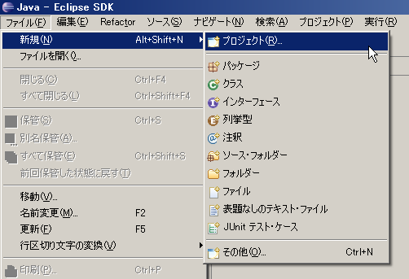</a></div>
<div align="center"><strong>図 2-3 ビルド用プロジェクトの作成　１</strong></div>
<br>

　｢新規プロジェクト｣ウィザード内で｢Javaプロジェクト｣を選択し、[次へ] ボタンをクリックします。|<br>
<div align="center"><a href="MakeProjectForBulid2.png">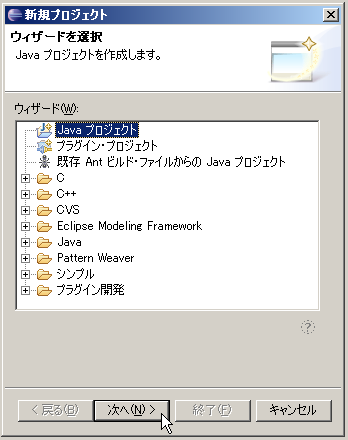</a></div>
<div align="center"><strong>図 2-4 ビルド用プロジェクトの作成　２</strong></div>
<br>

　｢新規プロジェクト｣ウィザードの次のステップで、作成する｢プロジェクト名｣を入力します。｢JDK準拠｣グループ内の設定が｢5.0｣以上（あるいは1.5以上）となっていることを確認した上で、[次へ] ボタンをクリックします（**図 2-5**）。一方、環境によっては「JDK準拠」フレームであるところが「JRE」フレームとなっており、プルダウンメニューから JDK5（あるいはJDK1.5）が選択できない場合があります（**図 2-5**'）。その場合は、[こちら ](/ja/node/159#errorjavaJDK)を参照してJDKを選択できるようにします。|<br>
<div align="center"><a href="MakeProjectForBulid3.png"></a></div>
<div align="center"><strong>図 2-5 ビルド用プロジェクトの作成　３</strong></div>
<br>

<div align="center"><a href="PullDownMenu_Default.png"></a></div>
<!-- #ref(http://openrtm.a01.aist.go.jp/~chbi/PullDownMenu_Default.png,nolink,center) -->
<div align="center"><strong>図 2-5' 環境によっては JDK を選択できない</strong></div>

<br>


- **参考：**
  - → [FAQ: Q. 新規 Java プロジェクトが JDK5 (1.5) 準拠として作成できない ](/ja/node/159#errorjavaJDK)|
<br>
<br>
<br>

　表示された｢新規 Java プロジェクト｣画面において、生成するプロジェクトの各種設定を行い [終了] ボタンをクリックします。|

<div align="center"><a href="ProjectSettings.png">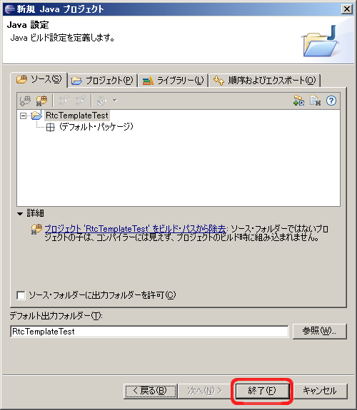</a></div>
<div align="center"><strong>図 2-6 プロジェクトの各種設定をして終了</strong></div>

　指定したプロジェクトが生成され、｢パッケージ・エクスプローラービュー｣内に表示されます。|

<div align="center"><a href="PackageExplorerView.png"></a></div>

<div align="center"><strong>図 2-7 パッケージエクスプローラビューの表示例</strong></div>
<br>
<br>
- **自動ビルドを無効に**<br>
　Eclipse のメニューバーの [プロジェクト] > [自動的にビルド] がオンになっている場合は、チェックをはずし無効にしておいた方がいいでしょう。
<br>
<br>


**※** プロジェクトの作成時の各種オプション、設定など Eclipse に関する詳細は、[Eclipse のサイト](http://www.eclipse.org/)などを参照してください。<br><br>
<br>
<br>
### RtcTemplate を利用したスケルトン・コードの生成 
- **GUI版RtcTemplate エディタの起動**
　RtcTemplate のエディタ画面を起動します。

<br>

- **参考：**
  - →　[RtcTemplate を直接起動する](/ja/node/737#startTemplate)
**※** RtcTemplate の使用方法等につきましては、[RtcTemplate](/node)を参照してください。
<br>
<br>

- **RtcTemplate エディタで設定項目を編集**
　GUI版の RtcTemplate を使用して[表2-1>#javacomp](#javacomp)の仕様を持つ RTコンポーネントのスケルトン・コードを生成させる場合の設定を以下に示します。
<br>

<div align="center"><a href="GUIrtc-templateSetting1.png">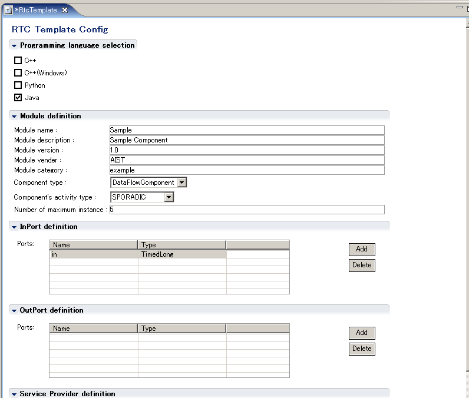</a></div>

<div align="center"><a href="GUIrtc-templateSetting2.png"></a></div>
<div align="center"><strong>図 2-8 GUI RtcTemplateの設定</strong></div>
<br>
<br>
**注** ：Windowsの場合、上記 ｢Output directory｣ や「IDL path: 」などはフルパスで記述すること。
<br>
<br>

- **[Generate] ボタンでコードを生成**<br>
　[Generate] ボタンをクリックし、コード生成を実行する。このとき必ず、RtcTemplate エディタ最下段の ｢Output directory｣ 欄に、先に生成したプロジェクトのディレクトリーを指定すること（**※** 図 2-8では「temp」となっている）。

<br>


<div><a href="GenCode.png">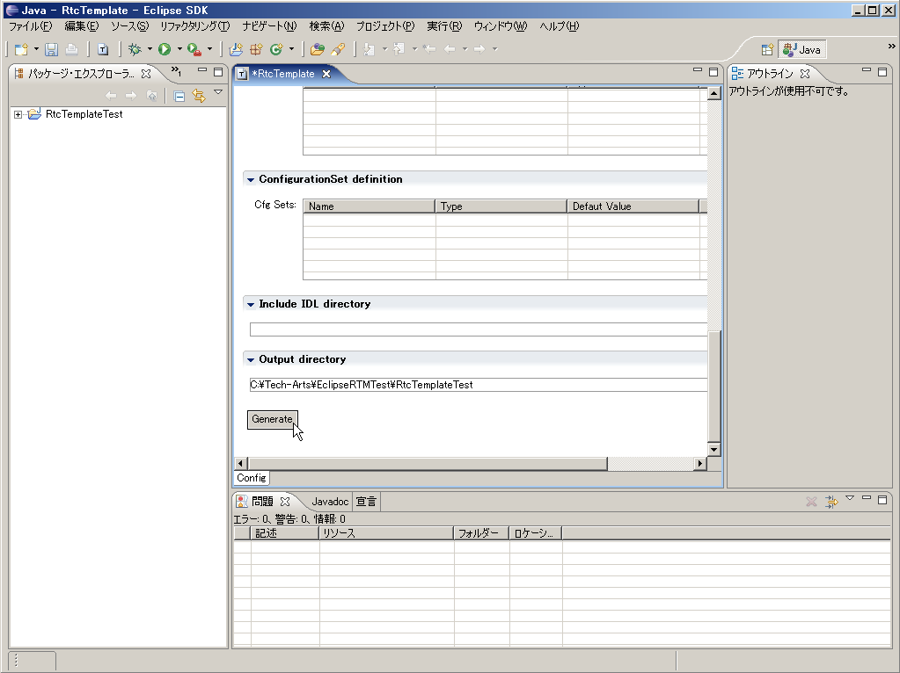</a></div><br>
<div align="center"><strong>図 2-9 コードを生成</strong></div>
<br>


- **生成された各種ファイルがプロジェクトに追加**

　｢Output directory｣として指定したディレクトリーに以下のファイルが生成されます。
  - Sample.java　・・・・・・・・・・・・・・・・・・・　Component Profile、初期化処理などを定義したクラス
  - Sampleimpl.java　・・・・・・・・・・・・・・・　RTコンポーネント本体クラス
  - SampleComp.java　・・・・・・・・・・・・・　RTコンポーネント起動用クラス
  - MyServiceSVC_impl.java　・・・・・・・  サービス実装クラス
  - build_Sample.xml　・・・・・・・・・・・・・・  RTコンポーネント　ビルドファイル
  - README.Sample　・・・・・・・・・・・・・・　 Read Meファイル

<br>
　｢Output directory｣欄にプロジェクトのディレクトリーを指定することにより、生成された各種ファイルがプロジェクトへ（自動的に）追加されることになります。


<div align="center"><a href="Done.png">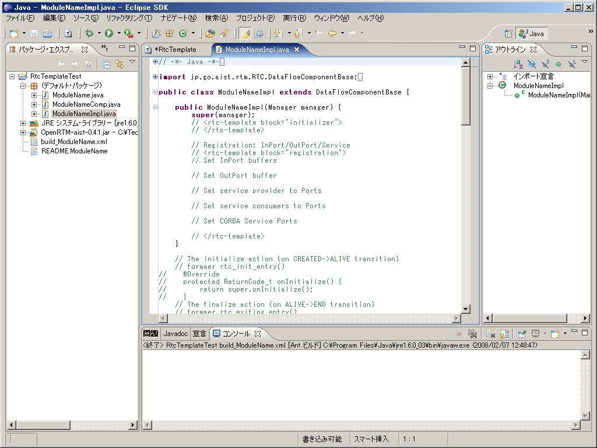</a></div>
<div align="center"><strong>図 2-10 各種ファイルの追加</strong></div>
<br>

**※** コード生成が完了しても生成されたファイルの内容がプロジェクトの｢パッケージ・エクスプローラ｣に反映されていない場合があります。対象プロジェクトを右クリックして表示されるコンテキストメニュー内から [更新] を選択して、情報の更新を行うことができます。
<div align="center"><a href="UpdateProject.png"></a></div>
<div align="center"><strong>図 2-11 プロジェクト表示の更新</strong></div>
<br>

**※** サービスポートを定義している RTコンポーネントの場合、Rtctemplate が生成したファイルだけではエラーが表示されます。これは該当するファイルが、IDL ファイルから自動生成されるクラスを利用しているためです。これらのクラスはビルド実行時に自動生成されます。<br><br>
<br>

**※**クラスパスが有効となる場所に、OpenRTM-aist-Java がインストールされていない場合、エラーが表示されます。この場合、プロジェクトのプロパティから OpenRTM-aist-Java のインストールフォルダー（ディレクトリー）を指定してください。
<br>

<div align="center"><a href="ProjectContextMenu.png"></a></div>
<div align="center"><strong>図 2-12 プロジェクトを右クリック</strong></div>

<br>

<div align="center"><a href="ProjectProperty.png">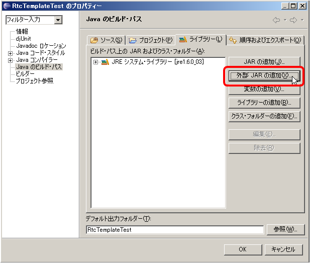</a></div>
<div align="center"><strong>図 2-13 OpenRTM-aist-Javaへのパスを追加</strong></div>
<br>

<br>

- **IDLファイルを｢Output directory｣に追加**<br>
　RtcTemplate エディタ上の「IDL path:」で指定したIDLファイルを、生成されたJavaソースコードが配置される｢Output directory｣に手動でコピーします。
<br>

<br>
### Eclipseを用いたビルド

- **Antビルド**~
　パッケージ・エクスプローラー内の build_Sample.xml を右クリックし、表示されるコンテキストメニュー中から [実行] > [Antビルド] を選択することで、対象 RTコンポーネントのビルドを行うことが可能です。自作の jar ライブラリ等を使う必要があったり、OpenRTM-aist を違う場所にインストールしたなどの事情でクラスパスを任意の場所に設定してビルドするには[こちら ](/ja/node/159#Antbuild)を参照してください。<br>

<div align="center"><a href="BuildProject.png"></a></div>
<div align="center"><strong>図 2-14 プロジェクトのビルド</strong></div>
<br>

<div align="center"><a href="BuildProject-consoleview.png">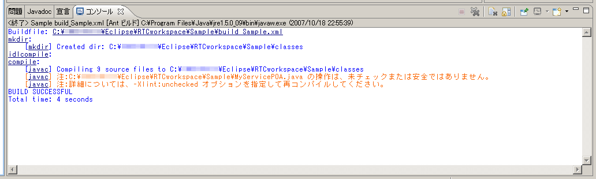</a></div>
<div align="center"><strong>図 2-15 ビルド実行時のコンソール画面</strong><br></div>
<br>

ビルドが成功すると、プロジェクト内の｢classes｣ディレクトリーに classファイルが生成されます。<br><br>
<br>
<br>
- **参考**
  - [**FAQ**:Q. 任意のフォルダーにクラスパスを設定して Ant ビルドを行う方法は？ ](/ja/node/159#Antbuild)|
<br>
<br>
<br>

## 作成した RTコンポーネントの実行

- **rtc.confの作成**<br>
　プロジェクト内の｢classes｣に以下のような内容のファイル **rtc.conf** を作成しておきます。

<br>

```
 corba.nameservers: localhost
 naming.formats: %n.rtc
```
<div align="center"><strong>rtc.conf</strong></div>
<br>

なお、上記 **rtc.conf** は OpenRTM-aist-0.4-Java に付属しているサンプルの「examples/Java/RTMExamples/SimpleService」ディレクトリー内にあるものと同一です。
<br>
<br>
- **ネームサーバーと RtcLink の起動**~
　OpenRTM-aist-0.4-Java に付属のツールで「bin」ディレクトリー内にある start-orbd.vbs をダブルクリック（Windows）し、あるいは、start-orbd.sh を実行（UNIX）し、ネームサーバーを起動しておきます。また、[RtcLink](/node/)を起動しておきます。
  - 参考：
    - [ ネームサーバの起動(UNIX) ](/ja/node/660#samplecomponent)、[ ネームサーバの起動(Windows) ](/ja/node/667#javasample)
    - [RtcLink の起動 >RtcLink#startRtcLink](/node/)
<br>
<br>
- **RTコンポーネントの実行**<br>
　コマンドプロンプトあるいはターミナルを起動して、前述｢classes｣ディレクトリーをカレントとします。
<!-- > java SampleComp -->

  - **UNIX系システムの場合**

```
 $ java -classpath .:$RTM_JAVA_ROOT/jar/OpenRTM-aist-0.4.1.jar:$RTM_JAVA_ROOT/jar/commons-cli-1.1.jar SampleComp

 あるいは、たとえば bash の場合などは、上記コマンドを分割して、
 
 $ export CLASSPATH=.:$RTM_JAVA_ROOT/jar/OpenRTM-aist-0.4.1.jar:$RTM_JAVA_ROOT/jar/commons-cli-1.1.jar
 $ java SampleComp
```

  - **Windows系システムの場合**
 
```
 > java -classpath ".;%RTM_JAVA_ROOT%\jar\OpenRTM-aist-0.4.1.jar;%RTM_JAVA_ROOT%\jar\commons-cli-1.1.jar" SampleComp
 
 あるいは、上記コマンドを分割して、
 
 > set CLASSPATH=.;%RTM_JAVA_ROOT%\jar\OpenRTM-aist-0.4.1.jar;%RTM_JAVA_ROOT%\jar\commons-cli-1.1.jar
 > java SampleComp
```
というコマンドを実行すれば、RtcLink上に RTコンポーネントがあらわれます。

<br>
<br>

<div align="center"><a href="JavaSampleOnRtcLink.png"></a></div>
<div align="center"><strong>図 2-16 Sample コンポーネントを実行に成功したときの RtcLink の状態</strong></div>
<br>

<br>
# Java版 RTコンポーネントの詳細 
## Java版 RTコンポーネントの構成 
Java版 RTコンポーネントのソースファイルと、各ファイル内で実行している概略機能との関係を図3-1に示します。また、比較のために C++版 RTコンポーネントおよび OpenRTM-aist-0.3用 Java版 RTコンポーネントの構成も併せて示します。<br>
<div align="center"><a href="InnerRTcomponents.png"></a></div>
<div align="center"><strong>図3-1 RTコンポーネントの構成</strong></div>
<br>


既存の C++版 RTコンポーネントと Java版 RTコンポーネントを比較した場合、以下の点が異なります。<br>
- RTコンポーネント機能の実体の分離
Java版 RTコンポーネントでは、起動処理の関係などから、RTコンポーネント機能の実体をXXXImplクラス (図3-1中では\<Sample>Impl.java) 側へ移動しております。これに伴い、元々の RTコンポーネントクラス(図3-1中では\<Sample>.java)側では Component Profile 定義と、各種コンポーネント生成用処理のみが残った形となっております。<br>
- コールバック関数のインターフェース化
C++版 RTコンポーネントにてコールバック関数として定義されていた部分が、Java版 RTコンポーネントではインターフェース化されています。<br>
  - ModuleInitProc：コンポーネント起動クラス起動用インターフェース
  - RtcNewFunc：RTコンポーネント生成用インターフェース
  - RtcDeleteFunc：RTコンポーネント破棄用インターフェース

この修正に伴い、コンポーネント起動用クラスは上記インターフェースの実装を行う必要がございます。
<br>
<br>

## Java版 RTコンポーネントと C++版コンポーネントの相違点

### データポート
OpenRTM-aist-Java では、データの受け渡しを行うためにホルダクラス(DataRefクラス)を追加しています。そのため、データポートの定義および利用方法が以下のように変更されております。<br>
<br>

<div align="center"><a href="java_dataport.png">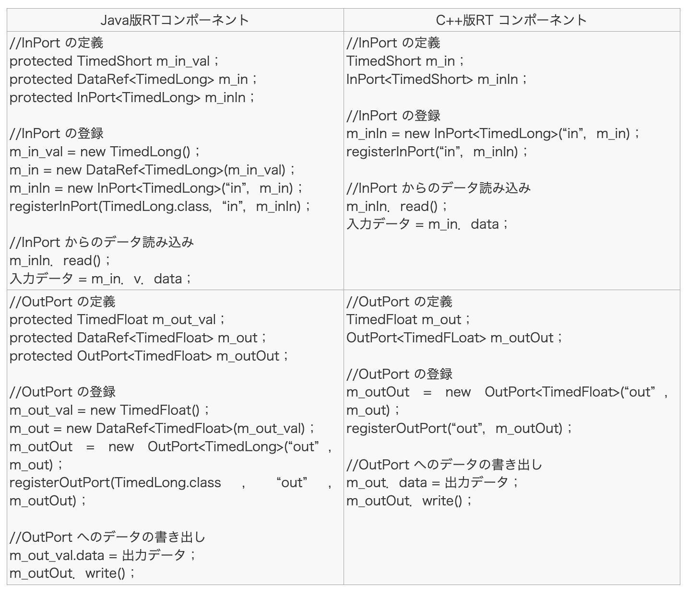</a></div>

<br>　データポート使用方法につきましては、｢SeqIO｣｢SimpleIO｣のサンプルをご参照ください。
<br><br>


### サービスポート 

　OpenRTM-aist-Java では、サービスポートを使用するための補助変数(/<サービス名>Base)を追加しております。このため、サービスポートの定義、利用方法が以下のように変更されております。詳細につきましては、｢SimpleService｣のサンプルをご覧ください。<br>
<br>

<div align="center"><a href="java_serviceport.png">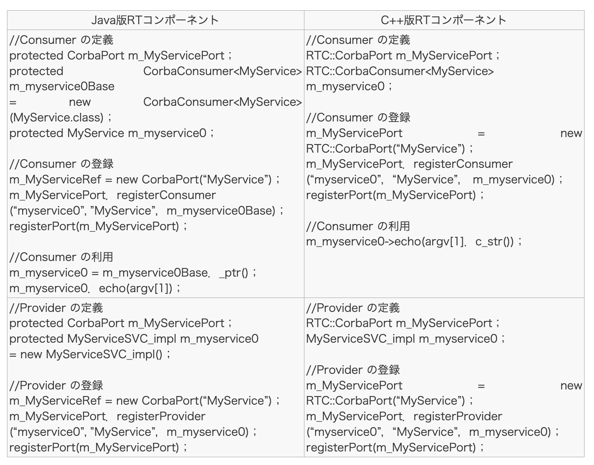</a></div>


### コンフィギュレーション

データポートの場合と同様、コンフィギュレーションを利用する場合もデータの受け渡しのためにホルダクラスを利用しています。このため、コンフィギュレーション・データの定義、利用方法が以下のように変更されております。<br>
<br>

<div align="center"><a href="java_config.png"></a></div>

コンフィギュレーション・データの使用方法につきましては、｢ConfigSample｣のサンプルをご参照ください。<br>
OpenRTM-aist-Javaで、コンフィギュレーション・データ用ホルダとして用意しているホルダクラスの種類とデータ型の関係を表3-1に示します。<br>
<div align="center"><strong>表 3-1 コンフィギュレーション・データ用ホルダ型対応関係</strong><br><br></div>
<table class="table-alt">
  <tr>
    <th>データ型</th>
    <th>ホルダ・クラス</th>
  </tr>
  <tr>
    <td>short</td>
    <td>jp.go.aist.rtm.RTC.util.ShortHolder</td>
  </tr>
  <tr>
    <td>int</td>
    <td>jp.go.aist.rtm.RTC.util.IntegerHolder</td>
  </tr>
  <tr>
    <td>long</td>
    <td>jp.go.aist.rtm.RTC.util.LongHolder</td>
  </tr>
  <tr>
    <td>float</td>
    <td>jp.go.aist.rtm.RTC.util.FloatHolder</td>
  </tr>
  <tr>
    <td>double</td>
    <td>jp.go.aist.rtm.RTC.util.DoubleHolder</td>
  </tr>
  <tr>
    <td>byte</td>
    <td>jp.go.aist.rtm.RTC.util.ByteHolder</td>
  </tr>
  <tr>
    <td>String</td>
    <td>jp.go.aist.rtm.RTC.util.StringHolder</td>
  </tr>
</table>


<br>
C++版 OpenRTM-aist と同様に、OpenRTM-aist-Java におきましてもユーザーが定義した任意の型についてコンフィグレーション・データ用ホルダを作成することができます。<br>
コンフィギュレーション・データ用のホルダを実装する場合は、jp.go.aist.rtm.RTC.util.ValueHolder の stringFrom メソッドを実装し、implements節に Serializable インターフェースを追加する必要があります。<br>jp.go.aist.rtm.RTC.util.ValueHolder の stringFrom メソッドは、引数で渡された文字列から対象データ型に変換するためのメソッドです。<br>
コンフィグレーション・データ用ホルダにつきましては｢ConfigSample｣サンプル内の VectorHolder クラスをご参照ください。<br>

## Java版 RTコンポーネントの起動時の振る舞い
C++版 RTコンポーネントの起動時の振る舞いを以下に示します。コンポーネント起動時の振る舞いについては、Java版 RTコンポーネントも基本的には同様な振る舞いとなっておりますが、RTコンポーネント機能の実体が XXXImpl クラスに分離された関係から、コンポーネント生成時、コンポーネント初期化時のメッセージの送信先はXXXクラスへと変更となっております。<br>

<div align="center"><a href="JavaRTcomponent1.png">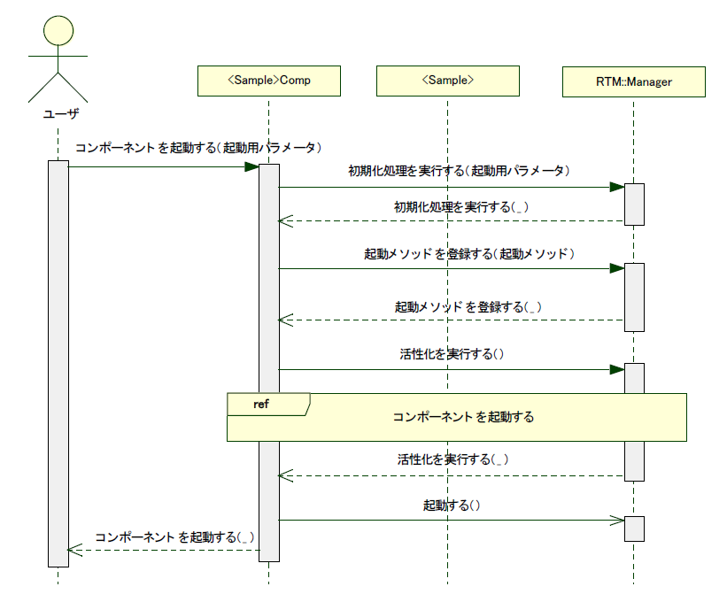</a></div>
<br>

<div align="center"><a href="JavaRTcomponent2.png">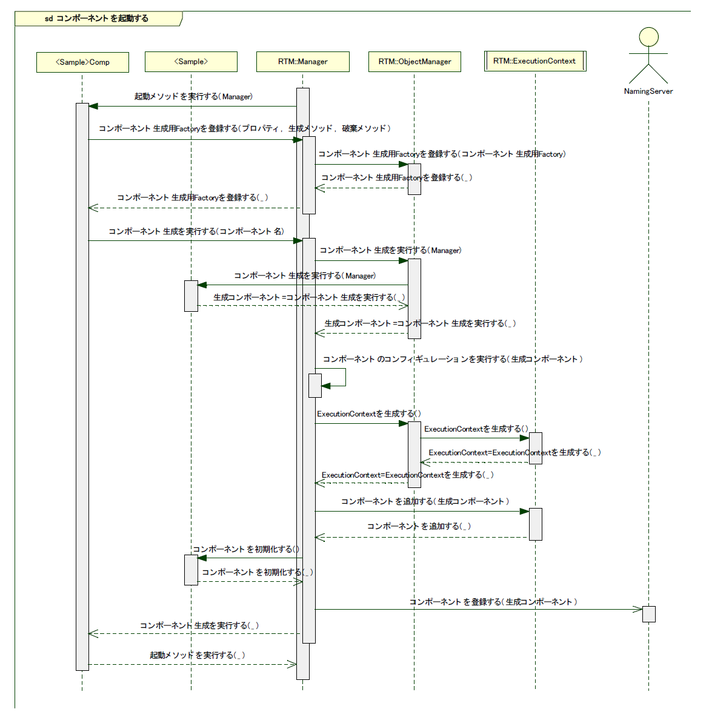</a></div>
<br>

## IDL用データ型と Java言語データ型の対応関係
CORBA IDL用データ型と Java言語データ型の対応関係を表3-2に示します。<br>
<div align="center"><strong>表 3-2 データ型対応関係</strong></div>
<table class="table-alt">
  <tr style="text-align: center;">
    <th>CORBA IDL</th>
    <th>Java言語</th>
  </tr>
  <tr>
    <td></td>
  </tr>
  <tr>
    <td>short</td>
    <td>short</td>
  </tr>
  <tr>
    <td>long</td>
    <td>int</td>
  </tr>
  <tr>
    <td>float</td>
    <td>float</td>
  </tr>
  <tr>
    <td>double</td>
    <td>double</td>
  </tr>
  <tr>
    <td>long long</td>
    <td>long</td>
  </tr>
  <tr>
    <td>long double</td>
    <td>double</td>
  </tr>
  <tr>
    <td>char</td>
    <td>char</td>
  </tr>
  <tr>
    <td>wchar</td>
    <td>char</td>
  </tr>
  <tr>
    <td>octet</td>
    <td>byte</td>
  </tr>
  <tr>
    <td>unsigned short</td>
    <td>short</td>
  </tr>
  <tr>
    <td>unsigned long</td>
    <td>int</td>
  </tr>
  <tr>
    <td>unsigned long long</td>
    <td>long</td>
  </tr>
  <tr>
    <td>boolean</td>
    <td>boolean</td>
  </tr>
  <tr>
    <td>string</td>
    <td>String</td>
  </tr>
  <tr>
    <td>wstring</td>
    <td>String</td>
  </tr>
  <tr>
    <td>any</td>
    <td>org.omg.CORBA.Any</td>
  </tr>
  <tr>
    <td>void</td>
    <td>void</td>
  </tr>
</table>

# その他

## Tips
### Eclipse の自動起動の設定方法について
- Windows の場合
  - １．Eclipse プロジェクトのディレクトリーの中から｢.project｣ファイルを選択して右クリックします。表示されたコンテキストメニュー内から [プロパティ] を選択します。~
※選択する Eclipse プロジェクトは任意のプロジェクトで構いません。

<br>

<div align="center"><a href="SelectProject.png">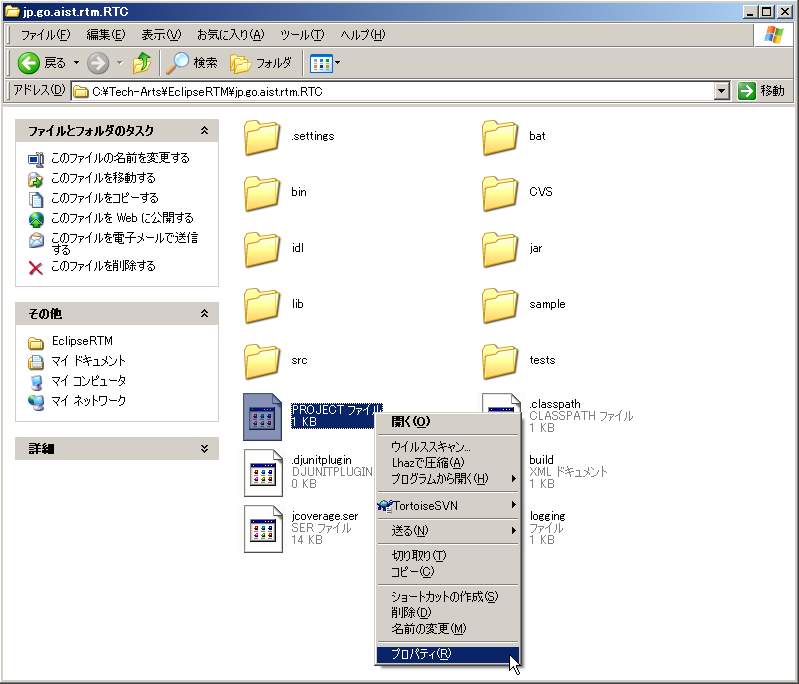</a></div>
<div align="center"><strong>｢.project｣ファイルを選択</strong></div>


- ２．表示された｢プロパティ｣画面の｢全般｣タブ内、中段にある｢プログラム｣行右側の [変更] ボタンをクリックします。
<div align="center"><a href="Property.png"></a></div>
<div align="center"><strong>アプリケーションの関連付けの変更</strong></div>

- ３．表示された｢ファイルを開くプログラムの選択｣画面下側にある [参照] ボタンをクリックします。
<div align="center"><a href="SelectApplication.png">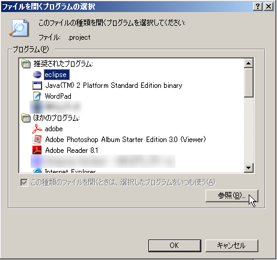</a></div>
<div align="center"><strong>Eclipseを選択</strong></div>

- ４．ファイル選択画面が表示されるので、自動起動を行う Eclipse がインストールされているディレクトリー内から｢eclipse.exe｣を選択します。
- ５．｢ファイルを開くプログラムの選択｣画面、｢プロパティ｣ を [OK] ボタンをクリックして閉じます。
<br>
以上の設定を行うことで、｢.project｣ファイルをダブルクリックすることで指定した Eclipse を自動起動することが可能となります。<br>
<br>
**※** 複数の Eclipse をインストールしている場合、ダブルクリック動作では上記操作で指定したバージョンの Eclipse が常に起動されますのでご注意ください。<br>
**※** ダブルクリックを行ったプロジェクトが、起動対象 Eclipse に設定された workspace 内に含まれない場合、起動された Eclipse のパッケージ・エクスプローラー内に表示されません。この場合は、対象プロジェクトを workspace 内にインポートするか、workspace の設定を変更してください。
<br>
<br>
- **Linuxの場合**
  - data オプションにて workspace を指定して Eclipse を起動することが可能です。
```
 > eclipse -data /home/devel/OpenRTM/workspace
```
対象プロジェクトが含まれている workspace を指定してください。
<br>
<br>

## 謝辞
　OpenRTM-aist-Java は、以下のライブラリを使用して開発されました。これらのプロジェクトの開発と設計にかかわった方々に感謝します。<br>
- Apache Commons CLI 1.1<br>

This product includes software developed by The Apache Software Foundation (http://www.apache.org/ ).

