#contents

## はじめに

Choreonoidはオープンソースのロボット用シミュレーションソフトウェアです。
拡張性が高く、物理エンジン、通信機能、スクリプティング機能、制御アルゴリズム等をC++プラグインとして追加できます。

- [Choreonoid ホームページ](https://choreonoid.org/ja/)

このページでは、Choreonoidシミュレータ上の移動ロボットの入出力を行うRTCの作成手順を説明します。


<div align="center"><a href="choreonoidtutorial1_1.png">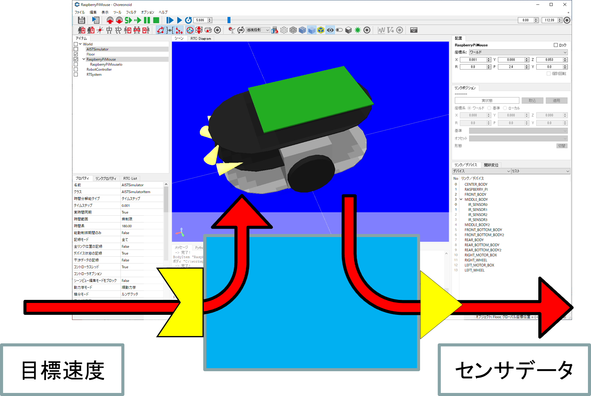</a></div>

## Choreonoidの起動

講習会の実習の場合はUSBメモリ等で資料を配布しているため、USBメモリ内の**choreonoid**フォルダ内の**choreonoid.bat**をダブルクリックして起動してください。

## アイテムの追加

Choreonoid上で以下のアイテムを追加してシミュレーション環境を構築します。

```
 World(ワールドアイテム)
```
<table class="table-alt">
  <tr>
    <th>-AISTSimulator(AISTシミュレータ)</th>
  </tr>
  <tr>
    <td>-Floor(model/misc/floor.body)</td>
  </tr>
  <tr>
    <td>-RaspberryPiMouse(model/RaspberryPiMouse/RaspberryPiMouse.body)</td>
  </tr>
  <tr>
    <td>-RaspberryPiMouseIo(PyRTC)</td>
  </tr>
  <tr>
    <td>-RobotController(RTC)</td>
  </tr>
  <tr>
    <td>-RTSystem</td>
  </tr>
</table>


### ワールド追加

Choreonoidで仮想世界を表現するワールドアイテムを追加します。
ボディモデル等の各アイテムはワールドアイテムと関連付けする必要があります。

「ファイル」->「新規」->「ワールド」をクリックしてWorldを追加してください。

<div align="center"><a href="choreonoidtutorial1_2.png">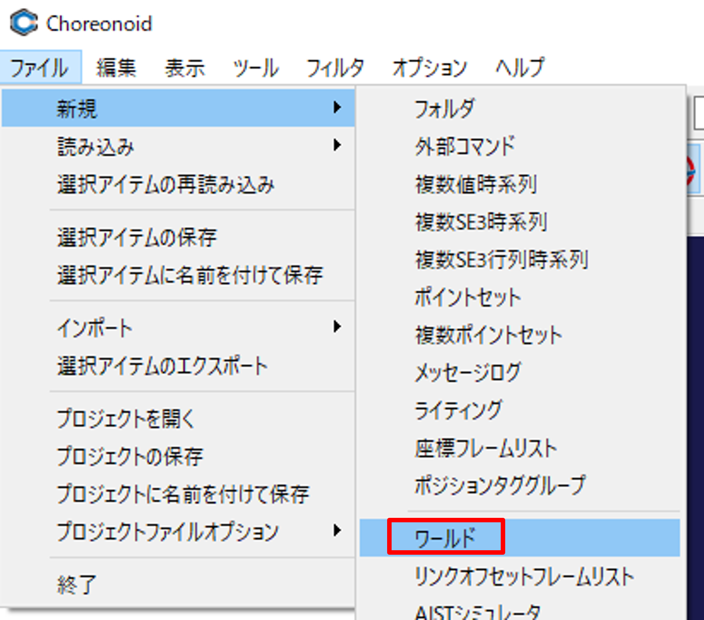</a></div>

名前は変更せずに生成します。

ワールドアイテムが追加されると、アイテムビューにWorldが表示されます。

<div align="center"><a href="choreonoidtutorial1_3.png">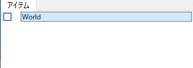</a></div>

### シミュレータ追加

Choreonoidは複数のプラグインから使用する物理エンジンを選択することができます。
Choreonoid本体でサポートしているプラグインとしては、AISTシミュレータ、ODE, Bullet, PhysXが使用できます。

今回はAISTシミュレータを追加するため、「ファイル」->「新規」->「AISTシミュレータ」をクリックしてください。

<div align="center"><a href="choreonoidtutorial1_4.png">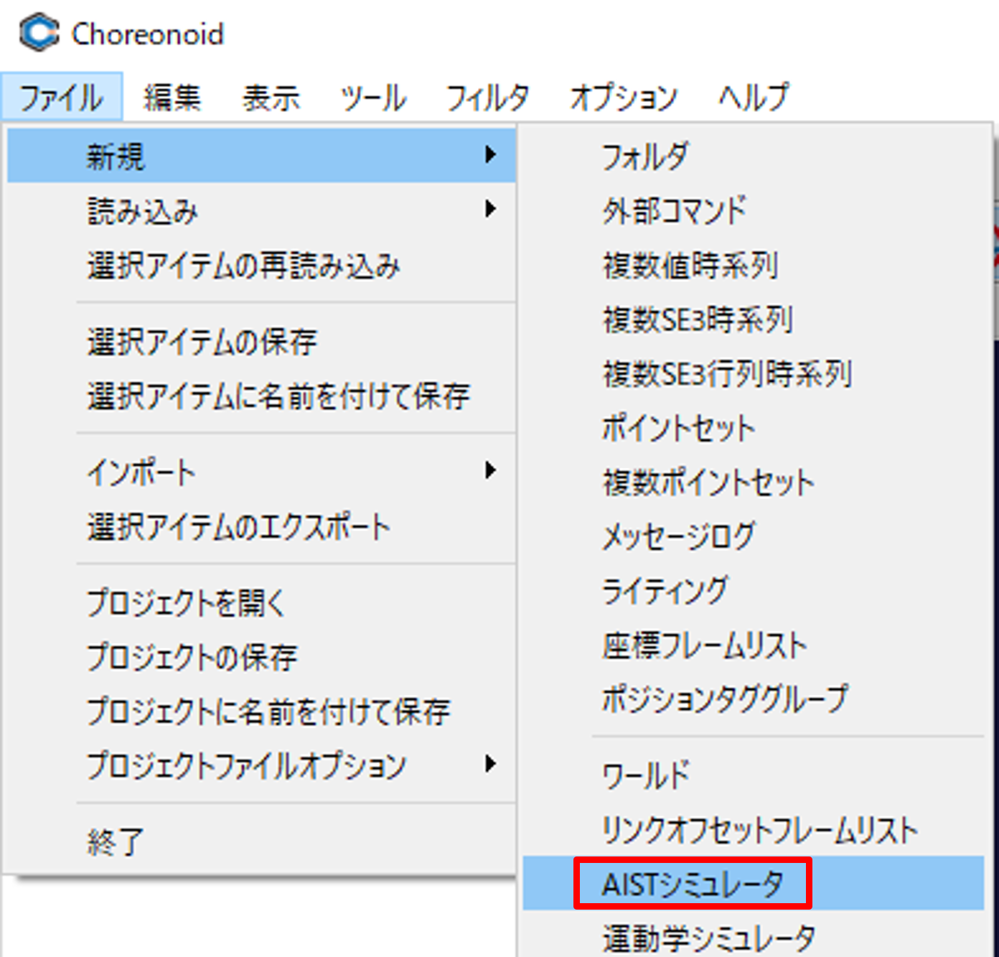</a></div>

名前は変更せずに生成します。

AISTシミュレータアイテムが追加されると、アイテムビューにAISTSimulatorが表示されます。

### 地面追加

地面を表現するボディアイテムを追加します。
「ファイル」->「読み込み」->「ボディ」をクリックしてください。

<div align="center"><a href="choreonoidtutorial1_5.png">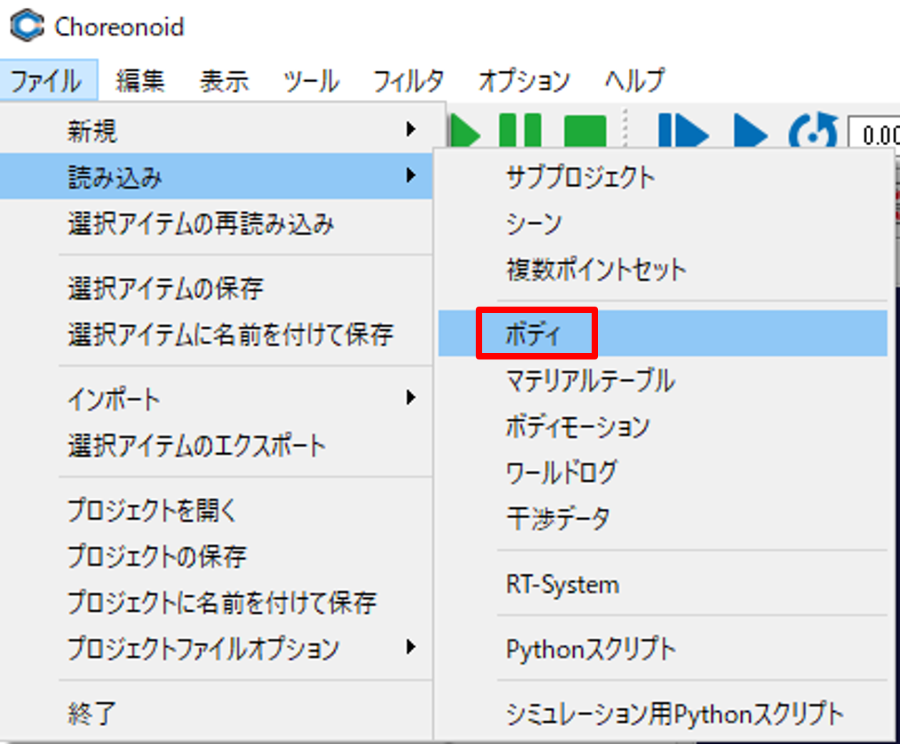</a></div>

「ボディ読み込み」の画面で**floor.body**を選択します。
左側の**share**をクリックして、**share/model/misc/floor.body**のファイルを選択してください。

<div align="center"><a href="choreonoidtutorial1_6.png">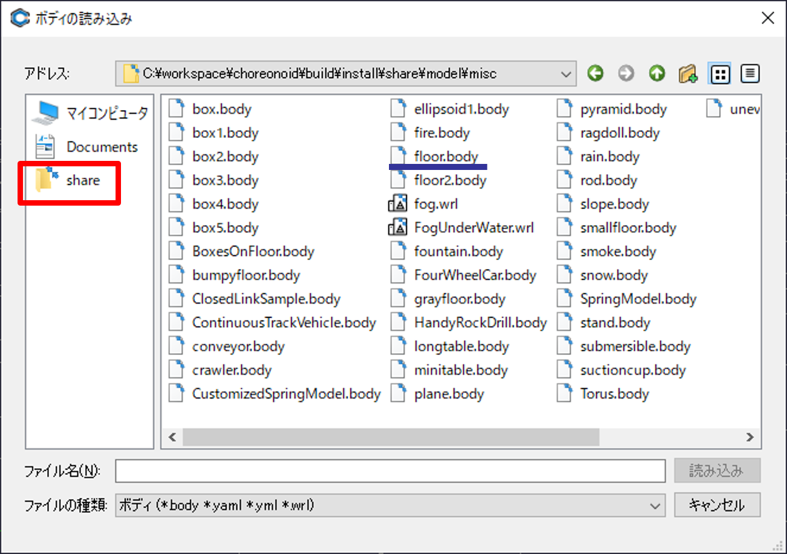</a></div>

アイテムが追加されると、アイテムビューにFloorが表示されます。


### Raspberry Piマウス追加

Raspberry Piマウスを表現するボディアイテムを追加します。
先ほどと同じ手順で「ファイル」->「読み込み」->「ボディ」をクリックしてください。

「ボディ読み込み」の画面で**RaspberryPiMouse.body**を選択します。
左側の**share**をクリックして、**share/model/RaspberryPiMouse/RaspberryPiMouse.body**のファイルを選択してください。

<div align="center"><a href="choreonoidtutorial1_7.png">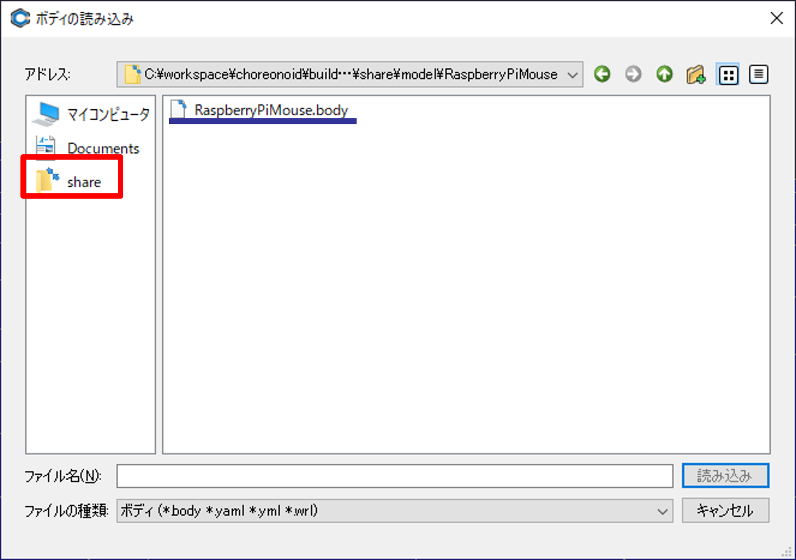</a></div>

アイテムが追加されると、アイテムビューにRaspberryPiMouseが表示されます。

また、シーンビューにRaspberryPiマウスの3Dモデルが表示されます。

<div align="center"><a href="choreonoidtutorial1_8.png">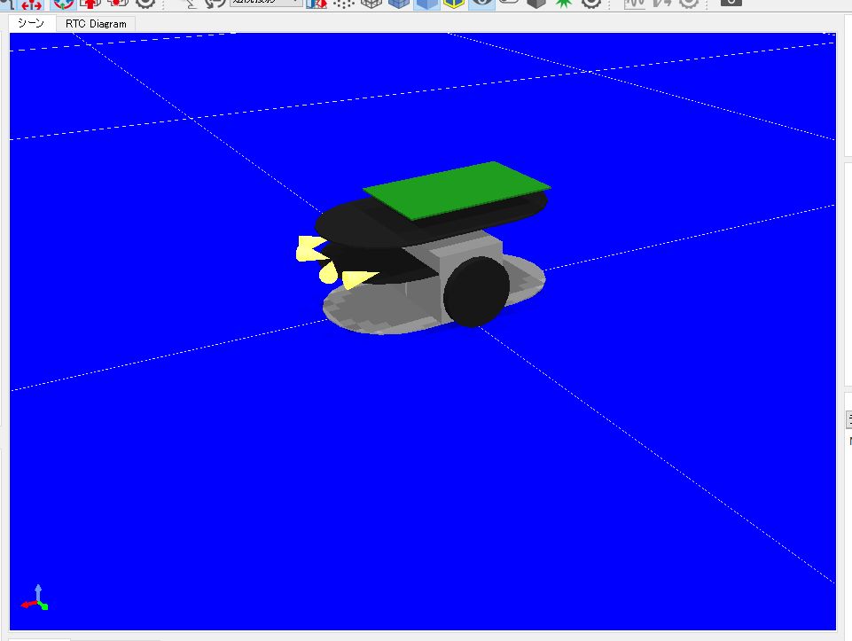</a></div>

### RTSystem追加
Choreonoid上でRTSystemEditorの一部機能を使用するためのRTSystemアイテムを追加します。
「ファイル」->「新規」->「RTSystem」をクリックしてください。名前の変更は不要です。

<div align="center"><a href="choreonoidtutorial1_9.png">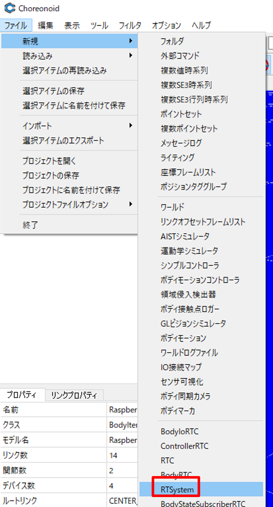</a></div>

アイテムが追加されると、アイテムビューにRTSystemが表示されます。


#### ネームサーバー、システムエディタ表示

この時点でChoreonoid上にネームサーバー、システムエディタは表示されていません。

まずネームサーバーを表示するには、「表示」->「ビューの表示」->「RTC List」をクリックします。

<div align="center"><a href="choreonoidtutorial1_10.png">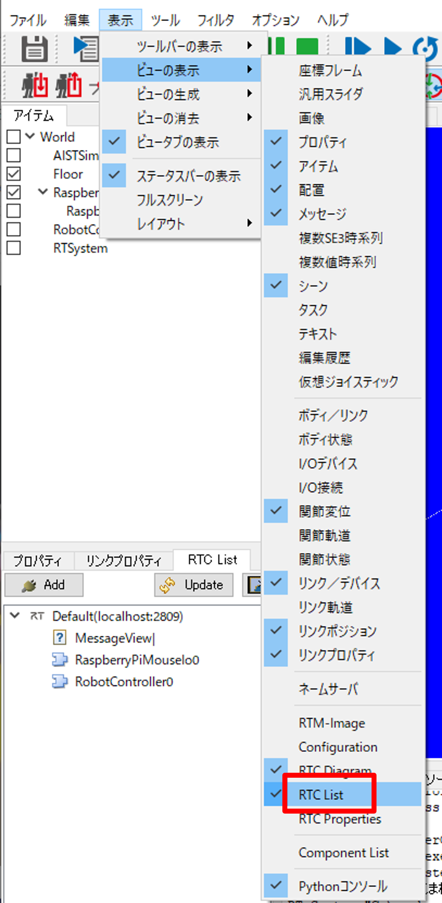</a></div>

これでプロパティ、リンクプロパティの右にRTC Listタブが表示されます。

<div align="center"><a href="choreonoidtutorial1_11.png">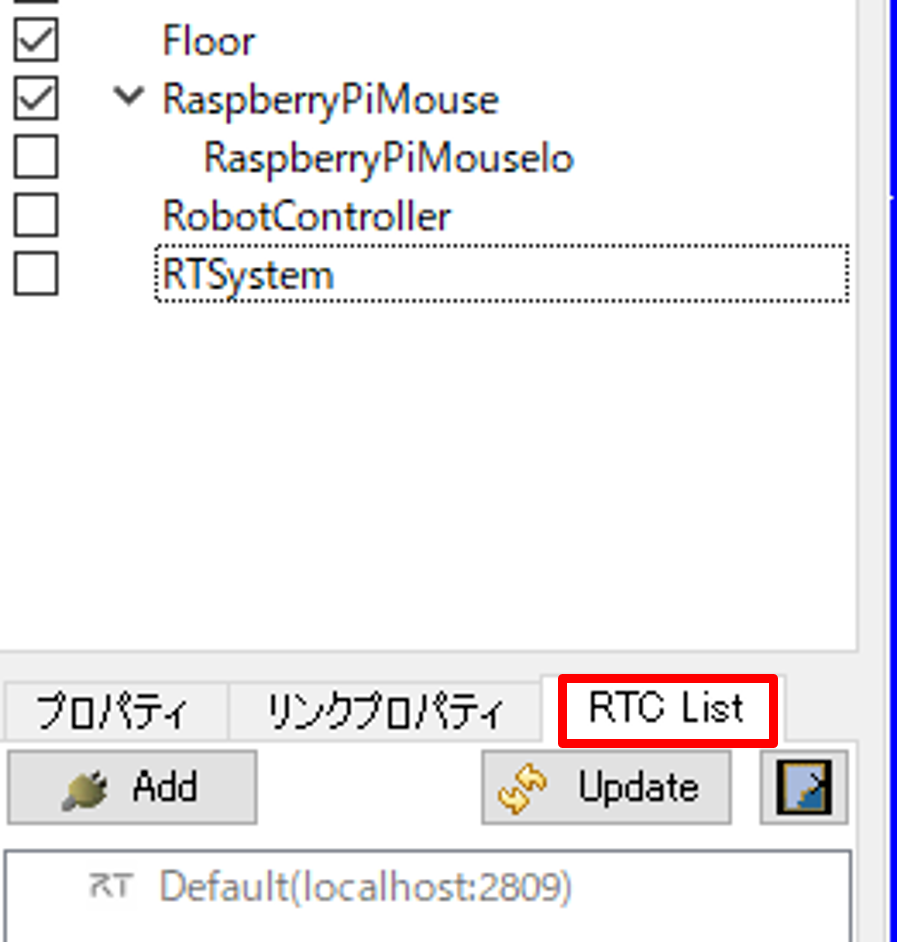</a></div>

システムエディタを表示するには、「表示」->「ビューの表示」->「RTC Diagram」をクリックします。

<div align="center"><a href="choreonoidtutorial1_12.png">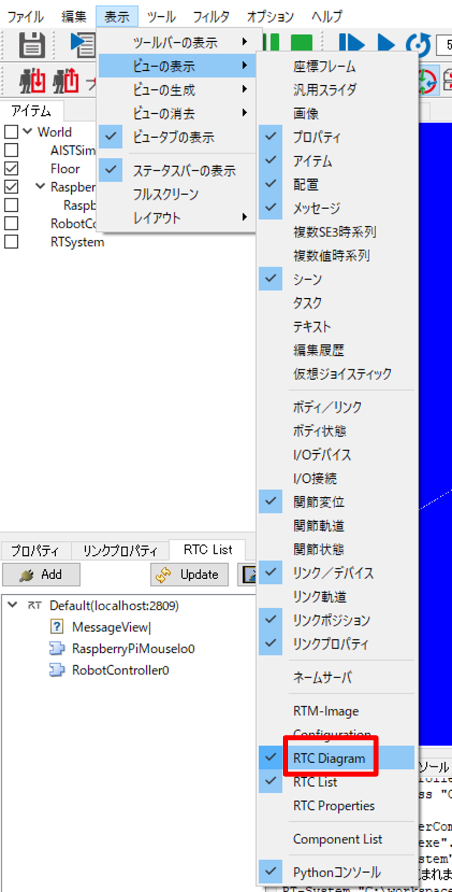</a></div>

これでシーンの右にRTC Diagramタブが表示されます。

<div align="center"><a href="choreonoidtutorial1_13.png">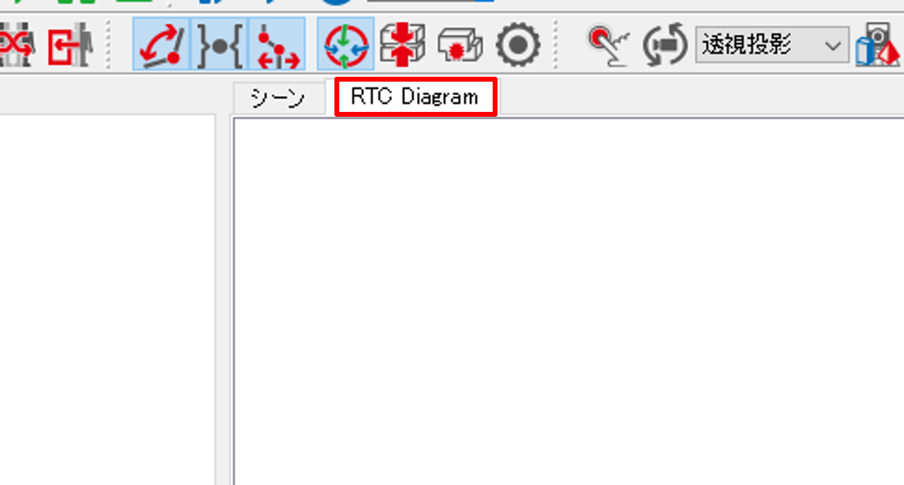</a></div>


### RobotControllerコンポーネント追加
以下のページで作成したRobotControllerコンポーネントをシミュレータで利用可能にします。

- [チュートリアル(RTコンポーネントの作成入門、Raspberry Pi Mouse、Windows)](/ja/node/6550)
- [チュートリアル(RTコンポーネントの作成入門、Raspberry Pi Mouse、Ubuntu)](/ja/node/6551)

RTCを表現するRTCアイテムを追加してください。

「ファイル」->「新規」->「RTC」をクリックします。

<div align="center"><a href="choreonoidtutorial1_14.png">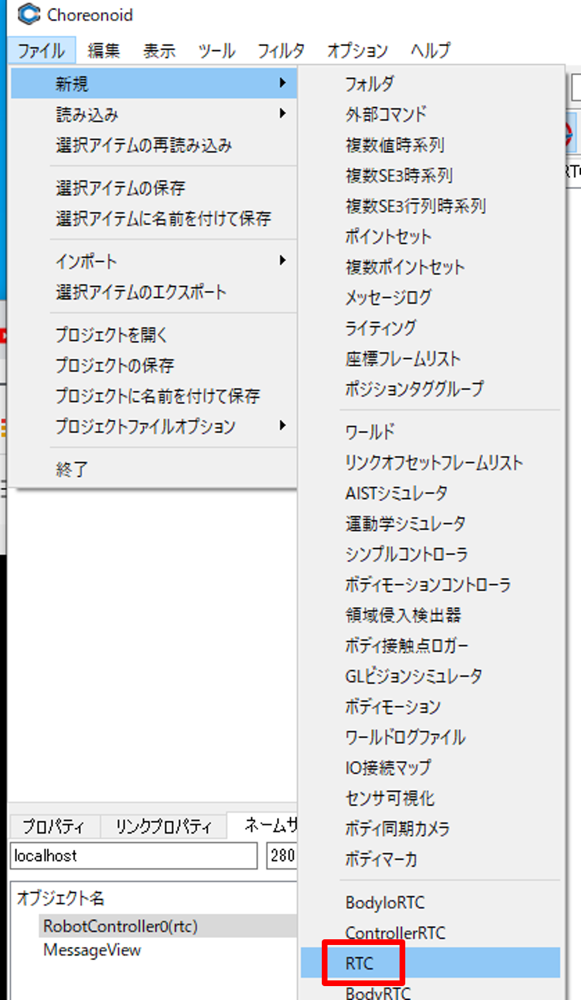</a></div>

名前を**RobotController**に変更します。

<div align="center"><a href="choreonoidtutorial1_15.png">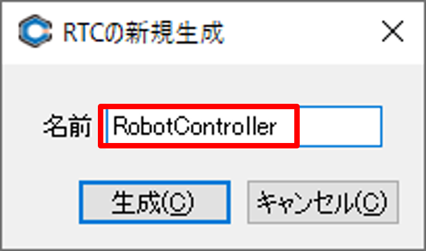</a></div>

アイテムが追加されると、アイテムビューにRobotControllerが表示されます。

#### RobotControllerコンポーネントの設定
次に**RobotControllerComp.exe**とRobotControllerアイテムを関連付けます。
アイテムビューからRobotControllerを選択して、プロパティからRTC moduleを設定します。

<div align="center"><a href="choreonoidtutorial1_16.png">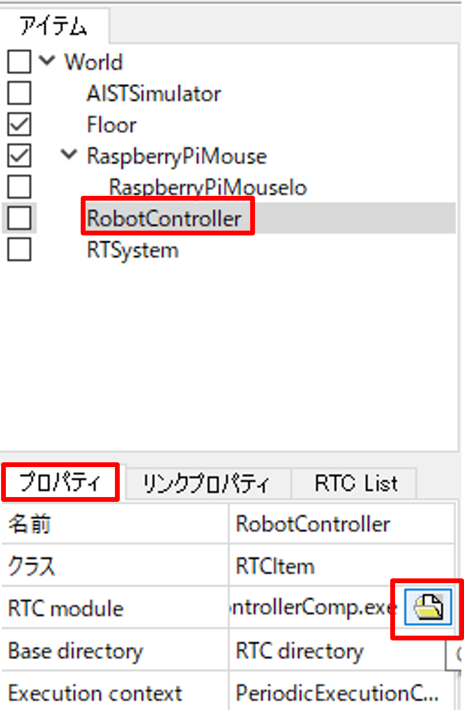</a></div>

「ファイルを選択」の画面で**RobotControllerComp.exe**を選択します。
初期の状態だと拡張子dllのファイルしか表示しないため、ファイルの種類を**全てのファイル (*) **に設定してからファイルを選択してください。

<div align="center"><a href="choreonoidtutorial1_17.png">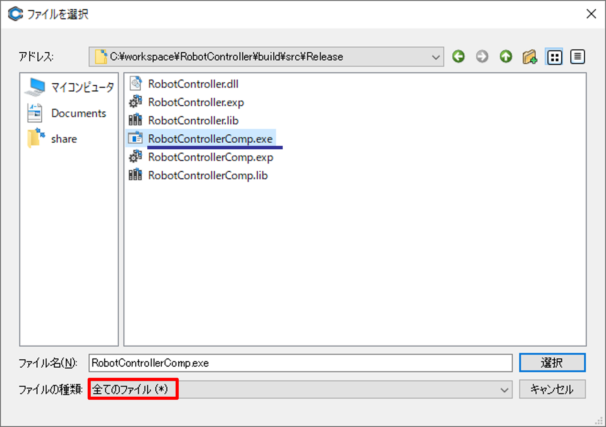</a></div>

### RaspberryPiMouseIoコンポーネント追加

PythonのRTCをChoreonoid上で起動するため、PyRTCアイテムを追加します。

「ファイル」->「新規」->「PyRTC」をクリックします。

<div align="center"><a href="choreonoidtutorial1_18.png">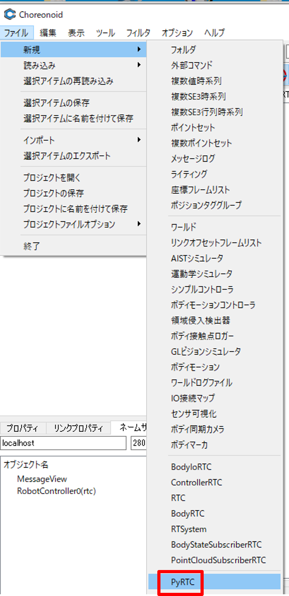</a></div>

名前を**RaspberryPiMouseIo**に変更します。

<div align="center"><a href="choreonoidtutorial1_19.png">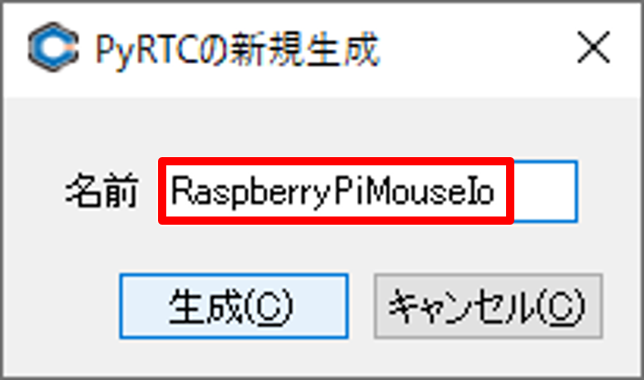</a></div>

アイテムが追加されると、アイテムビューにRaspberryPiMouseIoが表示されます。

## RaspberryPiMouseIoコンポーネント作成

ここからはRTC Builderで作業します。

以下の仕様のRTCを作成してください。

<table class="table-alt">
  <tr>
    <td colspan="2" style="text-align: center;">基本</td>
  </tr>
  <tr>
    <td>コンポーネント名</td>
    <td>RaspberryPiMouseIo</td>
  </tr>
  <tr>
    <td colspan="2" style="text-align: center;">アクティビティ</td>
  </tr>
  <tr>
    <td colspan="2" style="text-align: center;">なし</td>
  </tr>
  <tr>
    <td colspan="2" style="text-align: center;">データポート(OutPort)</td>
  </tr>
  <tr>
    <td colspan="2" style="text-align: center;">なし</td>
  </tr>
  <tr>
    <td colspan="2" style="text-align: center;">データポート(InPort)</td>
  </tr>
  <tr>
    <td>ポート名</td>
    <td>velocity</td>
  </tr>
  <tr>
    <td>データ型</td>
    <td>RTC::TimedVelocity2D</td>
  </tr>
  <tr>
    <td colspan="2" style="text-align: center;">コンフィギュレーション</td>
  </tr>
  <tr>
    <td colspan="2" style="text-align: center;">なし</td>
  </tr>
  <tr>
    <td colspan="2" style="text-align: center;">言語・環境</td>
  </tr>
  <tr>
    <td>言語</td>
    <td>Python</td>
  </tr>
</table>

### RaspberryPiMouseIo.pyの編集
コード生成すると、RaspberryPiMouseIo.pyが作成されるのでこのファイルをVisual Studio CodeやIDLEなどで編集します。

RaspberryPiMouseIoクラスに**setBody**、**outputToSimulator**、**inputFromSimulator**のメンバ関数を追加します。

**setBody**関数はRTC側でChoreonoidのボディオブジェクトを取得する関数です。
取得したBodyオブジェクトからLinkオブジェクトを取得することで、対象のJointの入出力ができます。

**outputToSimulator**関数は、シミュレータ上のオブジェクトから取得したデータをOutPortから出力する処理を行う関数です。

**inputFromSimulator**関数は、InPortの入力データをシミュレータ上のオブジェクトに入力する処理を行う関数です。

各関数は、シミュレーション実行時に以下の図のような順序で呼ばれます。

<div align="center"><a href="choreonoidtutorial1_20_2.png">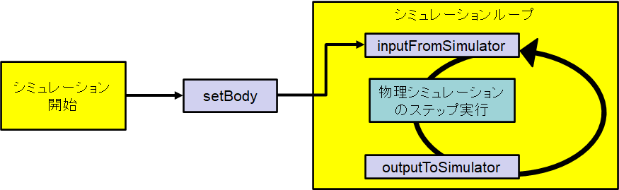</a></div>


RaspberryPiMouseIo.pyに以下のコードを追加してください。
Pythonなので、インデントには注意してください。「def ～」を「# def onRateChanged～」のインデントに合わせる必要があります。

```
    # def onRateChanged(self, ec_id):
    #
    #	return RTC.RTC_OK
    
    def setBody(self, body):
        self.ioBody = body
        self.wheelR = self.ioBody.link("RIGHT_WHEEL")
        self.wheelL = self.ioBody.link("LEFT_WHEEL")
    
    def outputToSimulator(self):
        pass
    
    def inputFromSimulator(self):
        if self._velocityIn.isNew():
            data = self._velocityIn.read()
            
            vx = data.data.vx
            va = data.data.va
            
            wheel_distance = 0.0425
            wheel_radius = 0.04
            rms = (vx + va*wheel_distance)/wheel_radius
            lms = (vx - va*wheel_distance)/wheel_radius
            
            self.wheelR.dq = rms
            self.wheelL.dq = lms
```


### RaspberryPiMouseIoコンポーネントの設定

Choreonoidでの作業に戻ります。
アイテムビューからRaspberryPiMouseIoを選択して、プロパティからRTC Moduleを設定します。

<div align="center"><a href="choreonoidtutorial1_21.png">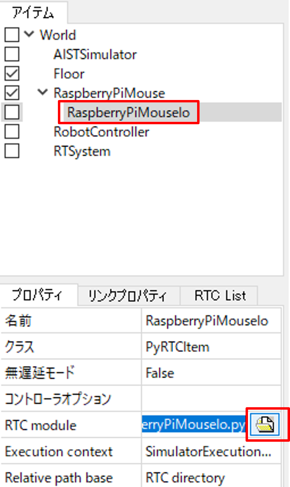</a></div>

「ファイルを選択」の画面で先ほど編集した**RaspberryPiMouseIo.py**を選択します。

<div align="center"><a href="choreonoidtutorial1_22.png">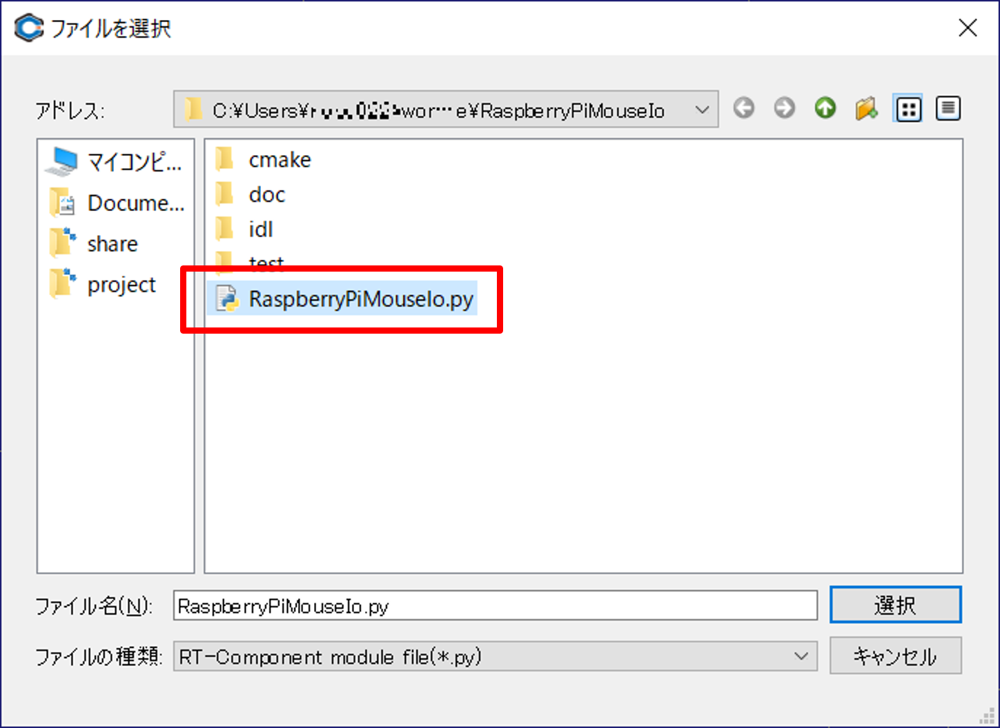</a></div>

※RaspberryPiMouseIo.pyを更新した場合は、再度この作業を行う事で再読み込みしてください。


## アイテムの位置関係を確認
アイテムビューで、全てのアイテムはワールドアイテムの子アイテムとして配置する必要があります。
また、**RaspberryPiMouseIo**は**RaspberryPiMouse**の子アイテムとして配置します。

```
 World
  |- AISTSimulator
  |- Floor
  |- RaspberryPiMouse
  |    |- RaspberryPiMouseIo
  |- RobotController
  |- RTSystem
```

位置関係が違う場合はドラッグアンドドロップして移動してください。

<div align="center"><a href="choreonoidtutorial1_23.png">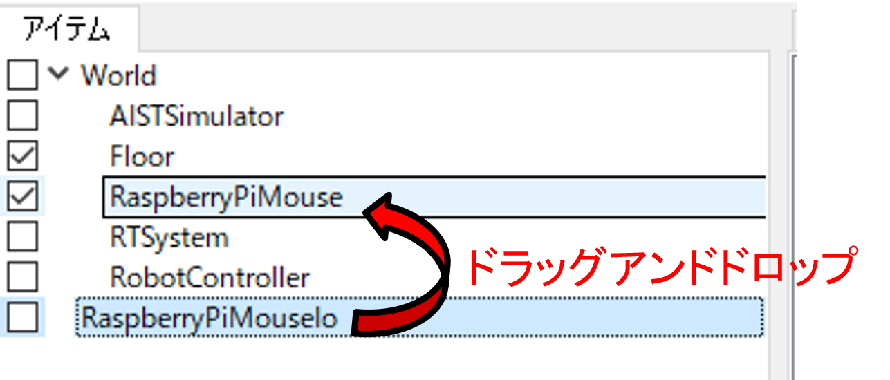</a></div>


## ポート接続

起動したRTCのポートを接続します。

この時点で**RobotController0**と**RaspberryPiMouseIo0**が起動していますが、RTC Listに表示が無い場合は「Update」ボタンを押してください。

RTC ListからRTCをRTC Diagramにドラッグアンドドロップして、以下のポートを接続してください。

<table class="table-alt">
  <tr>
    <td colspan="2" style="text-align: center;">InPort</td>
    <td colspan="2" style="text-align: center;">OutPort</td>
  </tr>
  <tr>
    <td>RobotController0</td>
    <td>out</td>
    <td>RaspberryPiMouseIo0</td>
    <td>velocity</td>
  </tr>
</table>

<div align="center"><a href="choreonoidtutorial1_24.png">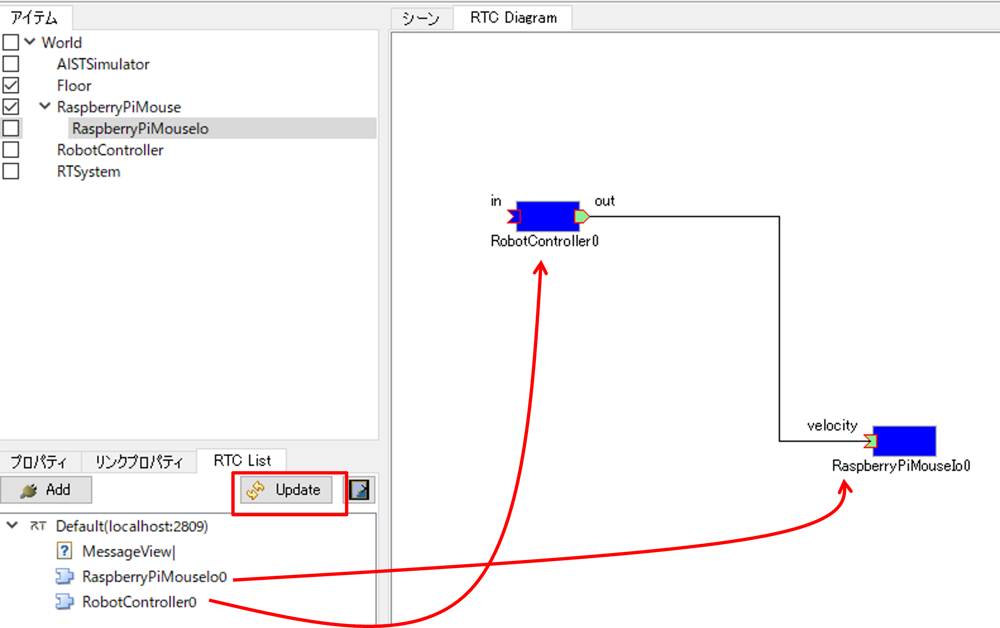</a></div>


## RobotControllerコンポーネントのアクティブ化
RTCアイテムにexeファイルを設定した場合はRTCを自動でアクティブ化しないため、RTC Diagram上でRobotController0を右クリックして「Activate」を選択してください。
※RaspberryPiMouseIo0はシミュレーションを開始すると自動的にアクティブ状態になるため操作の必要はありません。

<div align="center"><a href="choreonoidtutorial1_25.png">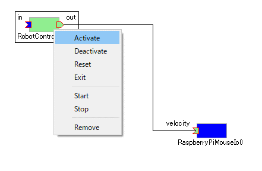</a></div>

## シミュレーション開始
「初期位置からのシミュレーション開始」ボタンを押すとシミュレーションを開始します。

<div align="center"><a href="choreonoidtutorial1_26.png">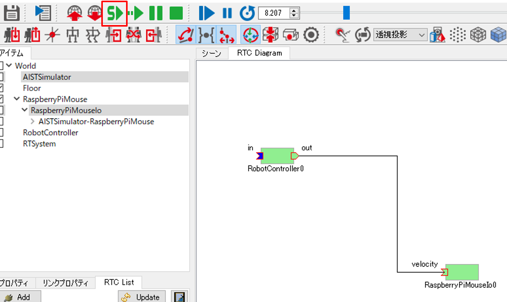</a></div>

シーンタブに切り替えるとシミュレーションを3DCGで表示します。

<div align="center"><a href="choreonoidtutorial1_27.png">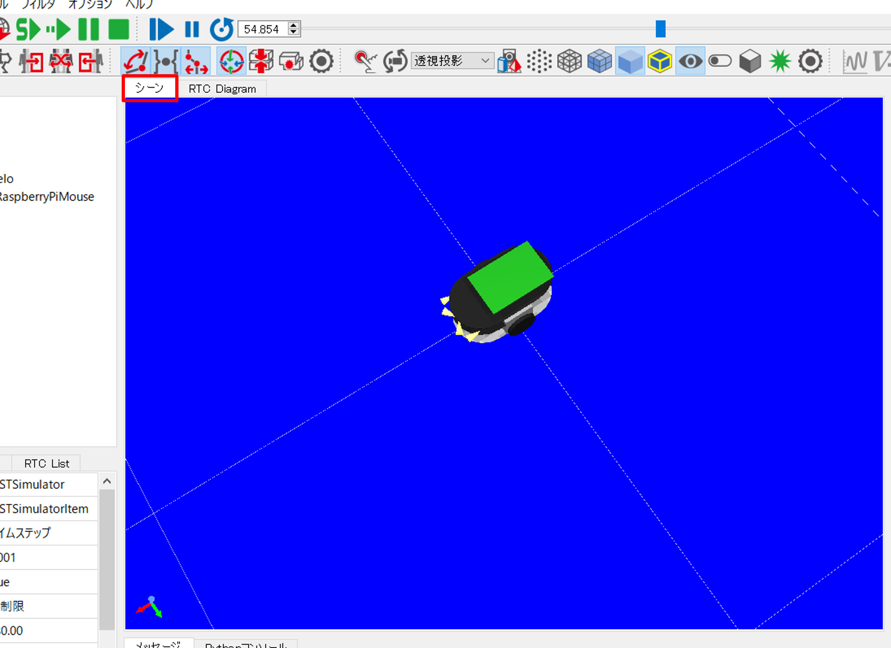</a></div>


### コンフィギュレーションパラメータの編集

Choreonoid OpenRTMプラグインにはコンフィギュレーションパラメータ編集機能がないため、RTSystemEditorで作業します。

ネームサービスビューでRobotControllerを選択して、コンフィギュレーションビューから「編集」ボタンを押して、コンフィギュレーションパラメータを変更してみてください。

<div align="center"><a href="choreonoidtutorial1_28.png">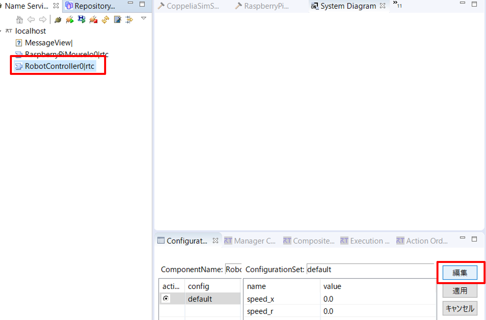</a></div>

Choreonoidで表示したRaspberry Piマウスが移動しているか確認すれば完了です。


ネームサービスビューにlocalhostと表示されていない場合については、以下のようにネームサービス接続ボタンを押して、localhostのネームサーバーに接続してください。

<div align="center"><a href="tutorial_raspimouse0_2.png"></a></div>
<div align="center"><a href="choreonoidtutorial1_30.png">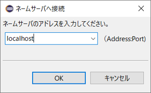</a></div>
