#contents

## はじめに

Choreonoid上のmyCobot280の制御コンポーネントの作成手順、及びmyCobot280実機の制御システムの構築手順を説明します。

<div align="center"><a href="mycobot_sim_image.png">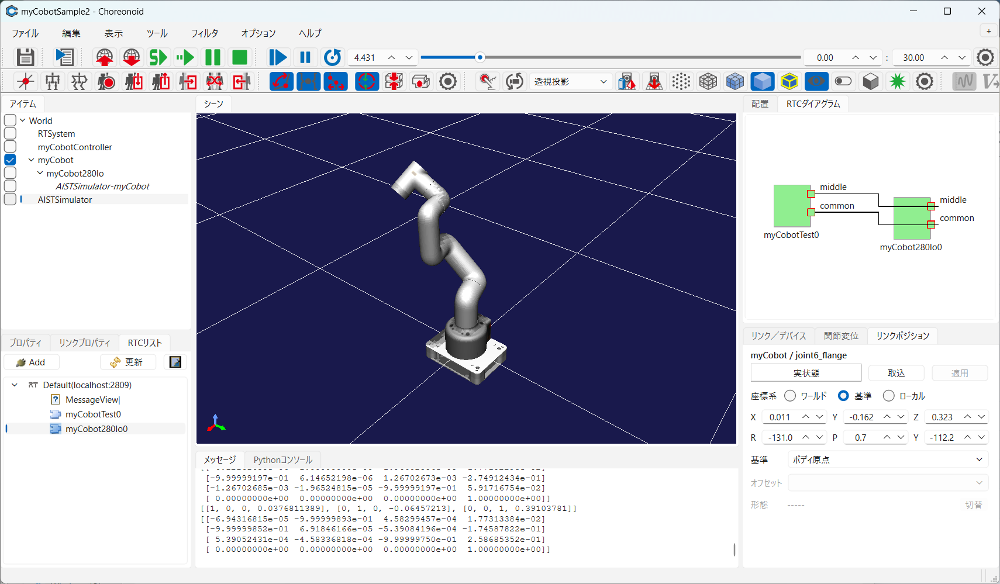</a></div>

<div align="center"><a href="https://shop.elephantrobotics.com/cdn/shop/products/myCobot280M5_d22c5ddb-4963-463c-bd22-885076cfb7eb_650x.png"></a></div>

## ArmControllerコンポーネントの作成

myCobot280制御コンポーネントにコマンドを送信するRTCを作成します。
RTC Builderで以下の仕様のRTCを作成してください。

<table class="table-alt">
  <tr>
    <td colspan="2" style="text-align: center;">基本</td>
  </tr>
  <tr>
    <td>コンポーネント名</td>
    <td>ArmController</td>
  </tr>
  <tr>
    <td colspan="2" style="text-align: center;">アクティビティ</td>
  </tr>
  <tr>
    <td colspan="2" style="text-align: center;">onActivated()、onDeactivated()、onExecute()</td>
  </tr>
  <tr>
    <td colspan="2" style="text-align: center;">データポート(OutPort)</td>
  </tr>
  <tr>
    <td colspan="2" style="text-align: center;">なし</td>
  </tr>
  <tr>
    <td colspan="2" style="text-align: center;">データポート(InPort)</td>
  </tr>
  <tr>
    <td colspan="2" style="text-align: center;">なし</td>
  </tr>
  <tr>
    <td colspan="2" style="text-align: center;">サービスポート</td>
  </tr>
  <tr>
    <td>ポート名</td>
    <td>middle</td>
  </tr>
  <tr>
    <td colspan="2" style="text-align: center;">サービスインターフェース</td>
  </tr>
  <tr>
    <td>インターフェース名</td>
    <td>JARA_ARM_ManipulatorCommonInterface_Middle</td>
  </tr>
  <tr>
    <td>方向</td>
    <td>Required</td>
  </tr>
  <tr>
    <td>インターフェース型</td>
    <td>JARA_ARM::ManipulatorCommonInterface_Middle</td>
  </tr>
  <tr>
    <td colspan="2" style="text-align: center;">サービスポート</td>
  </tr>
  <tr>
    <td>ポート名</td>
    <td>common</td>
  </tr>
  <tr>
    <td colspan="2" style="text-align: center;">サービスインターフェース</td>
  </tr>
  <tr>
    <td>インターフェース名</td>
    <td>JARA_ARM_ManipulatorCommonInterface_Common</td>
  </tr>
  <tr>
    <td>方向</td>
    <td>Required</td>
  </tr>
  <tr>
    <td>インターフェース型</td>
    <td>JARA_ARM::ManipulatorCommonInterface_Common</td>
  </tr>
  <tr>
    <td colspan="2" style="text-align: center;">コンフィギュレーション</td>
  </tr>
  <tr>
    <td>パラメーター名</td>
    <td>pos_x</td>
  </tr>
  <tr>
    <td>型</td>
    <td>double</td>
  </tr>
  <tr>
    <td>デフォルト値</td>
    <td>0.2</td>
  </tr>
  <tr>
    <td>制約</td>
    <td>-0.3<x<0.3</td>
  </tr>
  <tr>
    <td>Widget</td>
    <td>text</td>
  </tr>
  <tr>
    <td>説明</td>
    <td>アーム手先のX座標</td>
  </tr>
  <tr>
    <td colspan="2" style="text-align: center;">コンフィギュレーション</td>
  </tr>
  <tr>
    <td>パラメーター名</td>
    <td>pos_y</td>
  </tr>
  <tr>
    <td>型</td>
    <td>double</td>
  </tr>
  <tr>
    <td>デフォルト値</td>
    <td>0.0</td>
  </tr>
  <tr>
    <td>制約</td>
    <td>-0.3<x<0.3</td>
  </tr>
  <tr>
    <td>Widget</td>
    <td>text</td>
  </tr>
  <tr>
    <td>説明</td>
    <td>アーム手先のY座標</td>
  </tr>
  <tr>
    <td>コンフィギュレーション</td>
  </tr>
  <tr>
    <td>パラメーター名</td>
    <td>pos_z</td>
  </tr>
  <tr>
    <td>型</td>
    <td>double</td>
  </tr>
  <tr>
    <td>デフォルト値</td>
    <td>0.16</td>
  </tr>
  <tr>
    <td>制約</td>
    <td>-0.0<x<0.45</td>
  </tr>
  <tr>
    <td>Widget</td>
    <td>text</td>
  </tr>
  <tr>
    <td>説明</td>
    <td>アーム手先のZ座標</td>
  </tr>
  <tr>
    <td colspan="2" style="text-align: center;">言語・環境</td>
  </tr>
  <tr>
    <td>言語</td>
    <td>C++</td>
  </tr>
</table>


### ロボットアーム共通インターフェース

ロボットアームの制御のため、ロボットアーム共通インターフェースのコマンドを使用する。

- [ロボットアーム共通インターフェース](/ja/node/3853#toc3)

#### サービスポートの設定
サービスポートの設定手順について説明します。
「サービスポート」タブを選択し、サービスポートの情報を入力します。

「Add Port」ボタンを押下してサービスポートを追加後、名前を設定します。

<div align="center"><a href="rtcbuilder_service4.png">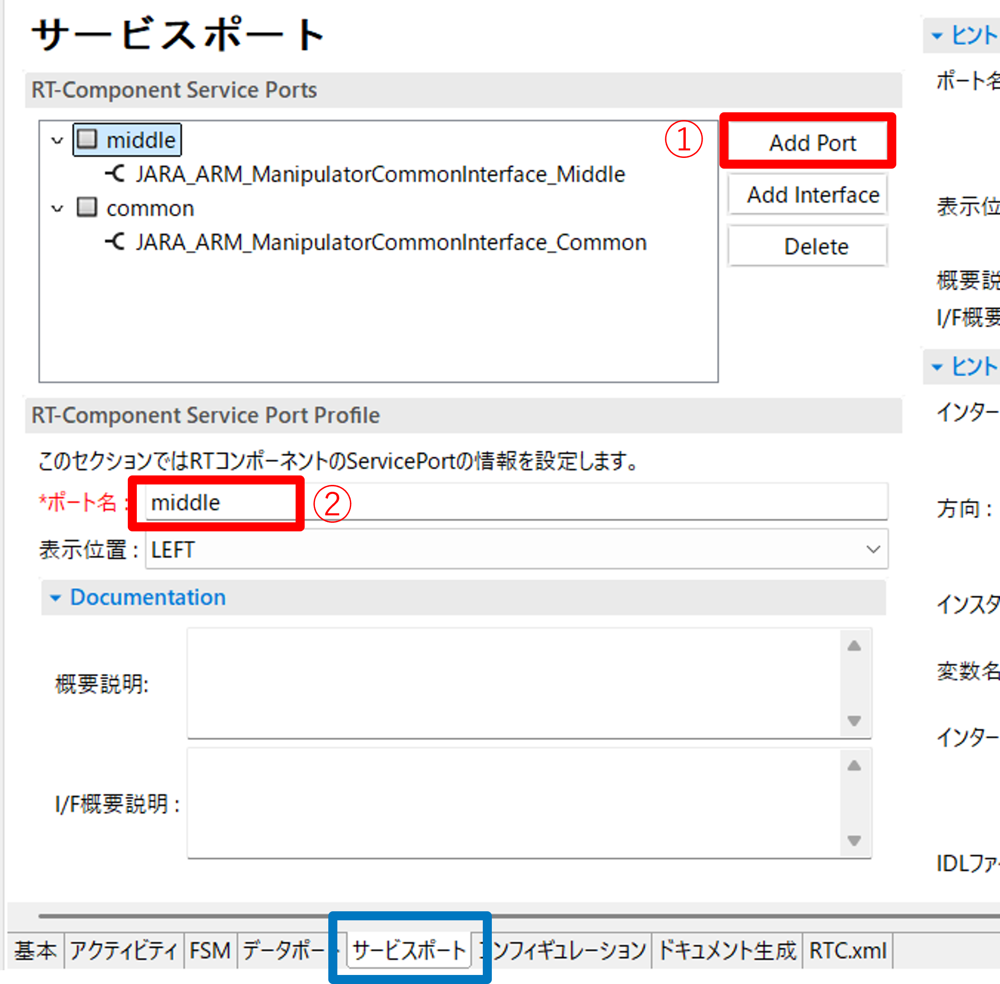</a></div>

サービスポートに「Add Interface」ボタンを押下後、各項目を設定します。

<div align="center"><a href="rtcbuilder_service5.png">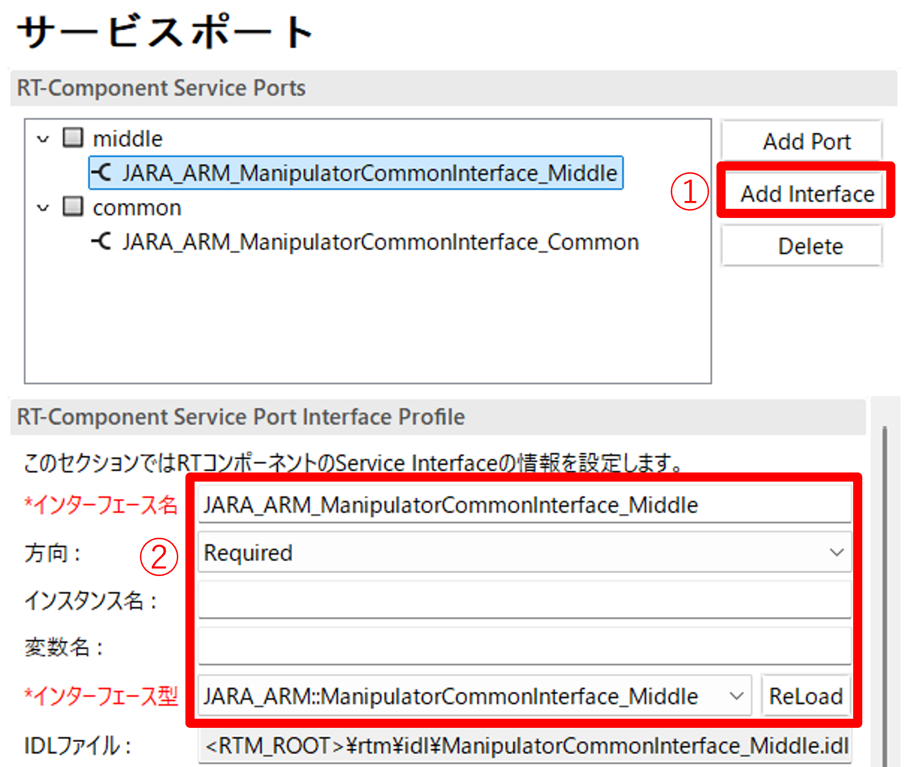</a></div>

各情報は以下の通り設定してください。

<br>

- ServicePort Profile:
  - ポート名: middle
  - サービスインターフェース:
    - インターフェース名:JARA_ARM_ManipulatorCommonInterface_Middle
    - 方向:Required
    - インターフェース型: JARA_ARM::ManipulatorCommonInterface_Middle

<br>

- ServicePort Profile:
  - ポート名: common
  - サービスインターフェース:
    - インターフェース名:JARA_ARM_ManipulatorCommonInterface_Common
    - 方向:Required
    - インターフェース型:JARA_ARM::ManipulatorCommonInterface_Common

コード生成時に以下の画面が表示されますが、「はい」を選択してください。

<div align="center"><a href="rtcbuilder_service6.png">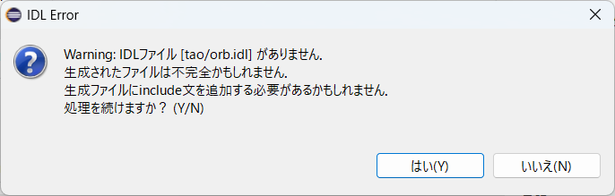</a></div>

### ソースコードの編集とビルド

ソースコード (src/ArmController.cpp) を編集します。

下記のように、onActivated()、onDeactivated()、onExecute() を実装します。

```
 RTC::ReturnCode_t ArmController::onActivated(RTC::UniqueId /*ec_id*/)
 {
    //サーボをONにするコマンドを実行
    m_JARA_ARM_ManipulatorCommonInterface_Common->servoON();
    //アームを原点復帰位置に移動する
    m_JARA_ARM_ManipulatorCommonInterface_Middle->goHome();
  return RTC::RTC_OK;
 }
```

```
 RTC::ReturnCode_t ArmController::onDeactivated(RTC::UniqueId /*ec_id*/)
 {
    //サーボをOFFにするコマンドを実行
    m_JARA_ARM_ManipulatorCommonInterface_Common->servoOFF();
  return RTC::RTC_OK;
 }
```


```
 RTC::ReturnCode_t ArmController::onExecute(RTC::UniqueId /*ec_id*/)
 {
    //コンフィギュレーションパラメータの変更時のみ実行
    if (getConfigService().isChanged())
    {
        //コンフィギュレーションパラメータを更新する
        updateParameters("default");
        //CarPosWithElbow型データに手先の位置姿勢を格納する
        JARA_ARM::CarPosWithElbow pose;
        //姿勢は固定
        pose.carPos[0][0] = -1;
        pose.carPos[0][1] = 0;
        pose.carPos[0][2] = 0;
        pose.carPos[1][0] = 0;
        pose.carPos[1][1] = 1;
        pose.carPos[1][2] = 0;
        pose.carPos[2][0] = 0;
        pose.carPos[2][1] = 0;
        pose.carPos[2][2] = -1;
        //コンフィギュレーションパラメータを位置情報として格納
        pose.carPos[0][3] = m_pos_x;
        pose.carPos[1][3] = m_pos_y;
        pose.carPos[2][3] = m_pos_z;
        pose.elbow = 0;
        pose.structFlag = 0;
        //絶対値で指定した目標位置に移動するコマンドを実行
        //移動完了まで処理は戻らない
        m_JARA_ARM_ManipulatorCommonInterface_Middle->moveLinearCartesianAbs(pose);
    }
 
  return RTC::RTC_OK;
 }
```

Visual Studioでビルドすると実行ファイル(build/src/Release(or Debug)/ArmControllerComp.exe)が生成されます。

## シミュレーション
### Choreonoid起動

講習会資料に含まれている**choreonoid**フォルダ内の**myCobot280Simulator.bat**をダブルクリックして起動してください。

- [RTM_Tutorial.zip](https://github.com/OpenRTM/RTM_Tutorial/releases/download/tutorial20260629/RTM_Tutorial.zip)

Ubuntuの場合は以下のコマンドで起動します。

```
 choreonoid ${資料のディレクトリ}/choreonoid/myCobot280Sample/myCobot280Sample.cnoid
```

### RTCItem追加

ArmControllerを起動するため、Choreonoid上でRTCItemを生成します。
「ファイル」→「新規」→「RTC」をクリックしてください。

<div align="center"><a href="choreonoid_service1.png">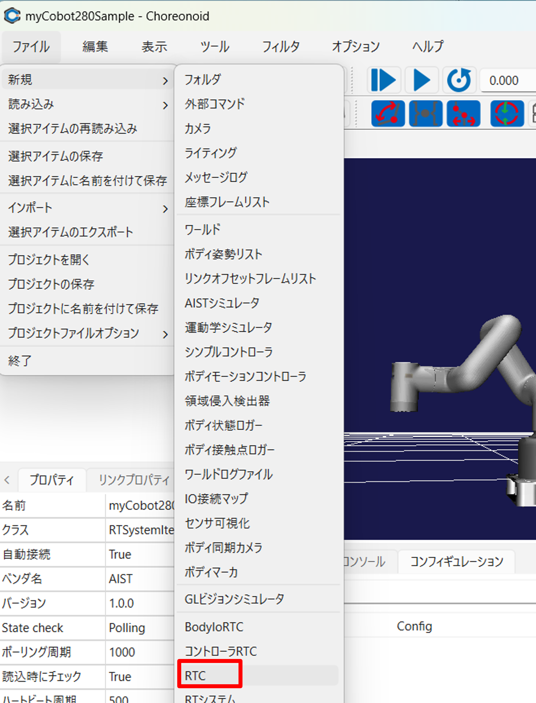</a></div>

名前は「ArmController」に設定して生成してください。

生成したArmControllerアイテムのプロパティから、RTCモジュールのパスを設定します。

ファイル選択のダイアログでは、File of typeを「全てのファイル(*)」を設定してください。
その後、プロジェクトののbuildフォルダからArmControllerComp.exeを選択してください。
※Ubuntuの場合はArmController.soを選択してください。

<div align="center"><a href="choreonoid_service2.png">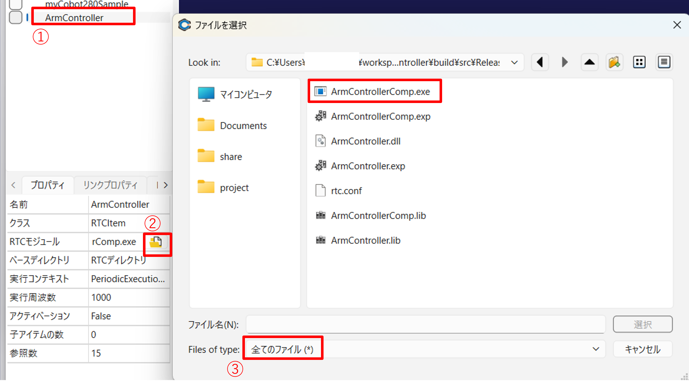</a></div>

次にRTCリストからRTCダイアグラムにmyCobot280Io0とArmController0をドラッグアンドドロップしてください。
RTCの一覧が見えない場合は「更新」ボタンを押してください。

<div align="center"><a href="choreonoid_service3.png">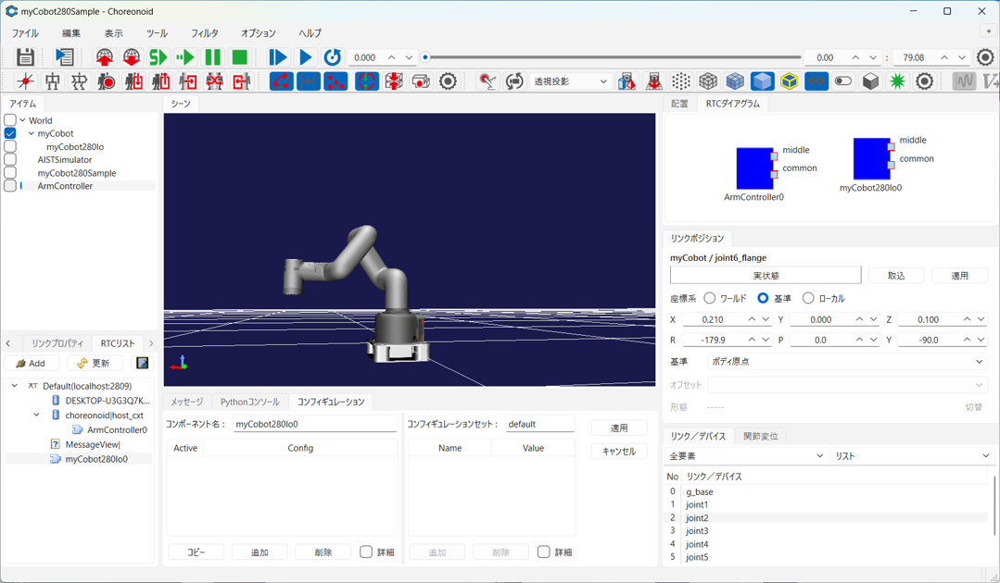</a></div>

RTCダイアグラム上でmyCobot280Io0とArmController0の「middle」ポート同士と「common」ポート同士を接続します。

<div align="center"><a href="choreonoid_service4.png">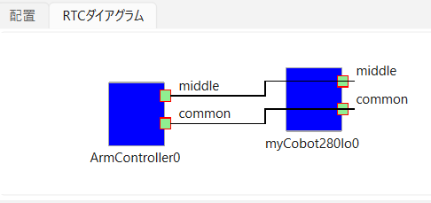</a></div>

アイテムのツリー構造が以下のようになっているか確認してください。

```
 World(ワールドアイテム)
```
<table class="table-alt">
  <tr>
    <th>-myCobot(Body)</th>
  </tr>
  <tr>
    <td>-myCobot280Io(PyRTC)</td>
  </tr>
  <tr>
    <td>-AISTSimulator(AISTシミュレータ)</td>
  </tr>
  <tr>
    <td>-myCobot280Sample(RTSystem)</td>
  </tr>
  <tr>
    <td>-ArmController(RTC)</td>
  </tr>
</table>

### シミュレーション実行

以下のボタンを押してシミュレーションを開始してください。

<div align="center"><a href="choreonoid_service5.png">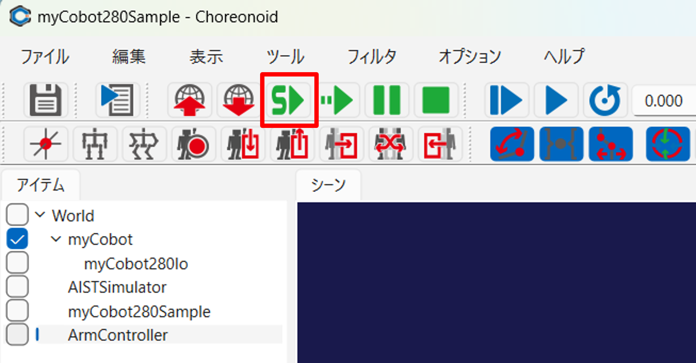</a></div>

RTCリストから「ArmController0」をクリックするとコンフィギュレーションビューからパラメータの操作ができます。
からpos_x、pos_y、pos_zの値をクリックして変更してください。「適用」を押したタイミングでコマンドが送信されてアームの手先位置が制御されます。

<div align="center"><a href="choreonoid_service6.png">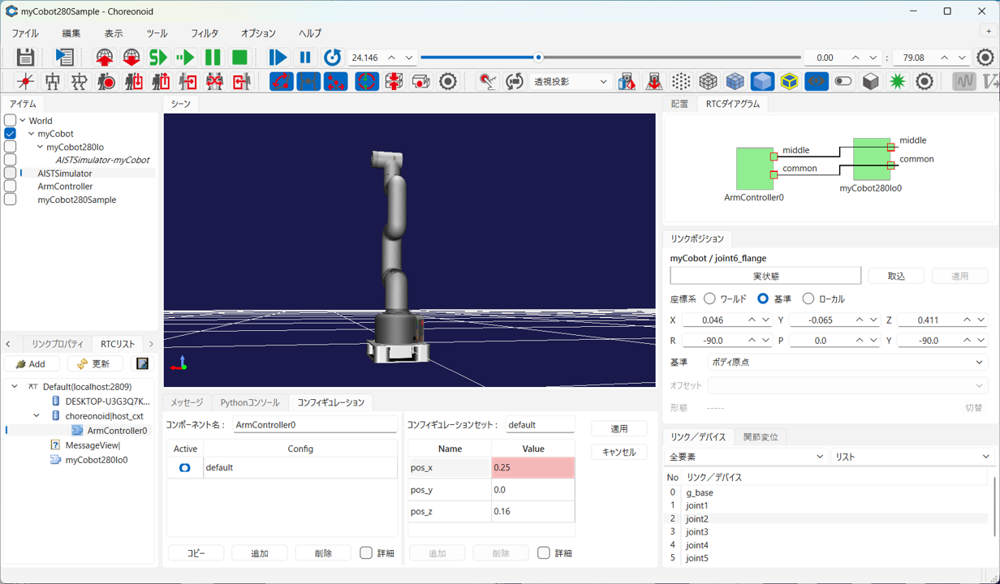</a></div>

## myCobot実機の制御

### myCobot280の準備

myCobot280をACアダプタ、USBケーブルを接続し、USBケーブルはPCに接続してください。

<div align="center"><a href="choreonoid_service7.png">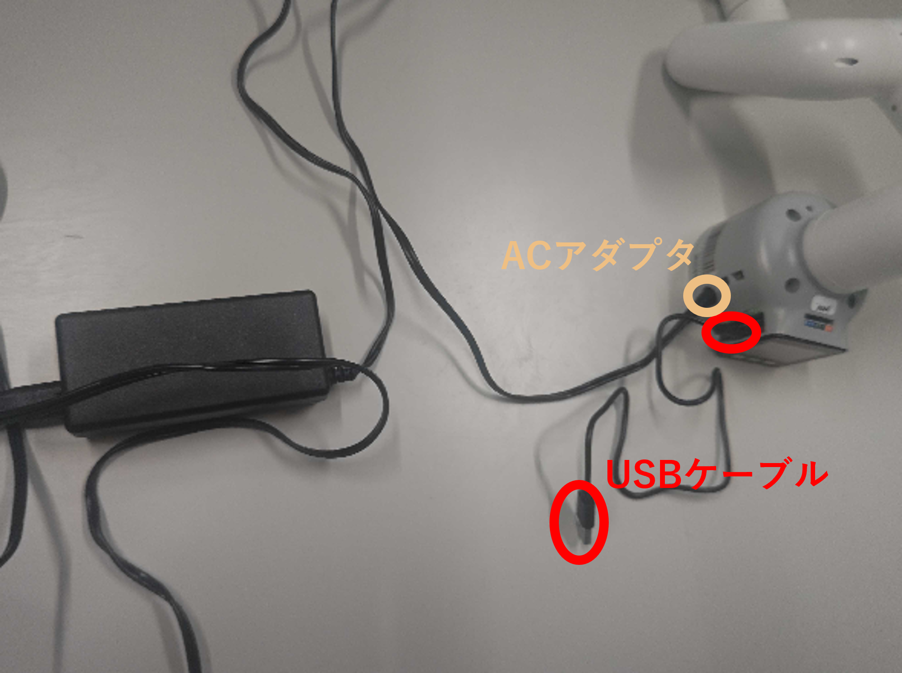</a></div>

myCobotの操作画面から、「Transponder」を選択して「myCobnot Basic Transponder」の画面を表示してください。

<div align="center"><a href="choreonoid_service9.JPG">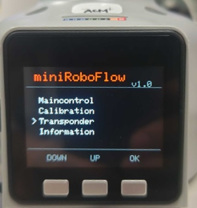</a></div>

<div align="center"><a href="choreonoid_service10.JPG">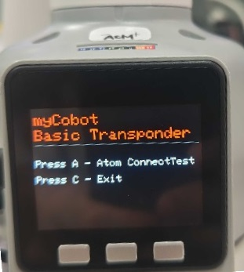</a></div>


接続後、デバイスマネージャからポート番号(COM**)を確認しておいてください。


### RTC起動

#### ArmControllerの起動
ArmControllerComp.exeと同じフォルダに以下の内容のrtc.confを作成してください。
コマンドで手先位置移動完了まで処理を返さないため、通信がタイムアウトしないように設定します。

```
 corba.args: -ORBclientCallTimeOutPeriod 0
```

ファイル構成は以下のようになります。

```
 ArmController
```
<table class="table-alt">
  <tr>
    <th>- build</th>
  </tr>
  <tr>
    <td>- src</td>
  </tr>
  <tr>
    <td>- Release(Debug)</td>
  </tr>
  <tr>
    <td>- ArmControllerComp.exe</td>
  </tr>
  <tr>
    <td>- rtc.conf</td>
  </tr>
</table>

ArmControllerComp.exeをダブルクリックして起動してください。
Ubuntuの場合はArmControllerCompを起動します。

#### myCobotRTCの起動

講習会資料に含まれている**choreonoid**フォルダ内の**myCobotRTC**フォルダ内の**myCobot.conf**を編集します。
以下の「conf.default.com_port」でデバイスマネージャで確認したポート番号(COM**)を指定してください。

```
 conf.default.com_port: COM11
```

**choreonoid**フォルダ内の**myCobot280RTC.bat**をダブルクリックして起動してください。
Ubuntuの場合は以下のコマンドで起動します。

```
 python3 myCobot.py
```

#### 動作確認

RTシステムエディタで「ArmController0」と「myCobot0」の「middle」ポート同士と「common」ポート同士で接続してアクティブ化してください。

<div align="center"><a href="choreonoid_service8.png">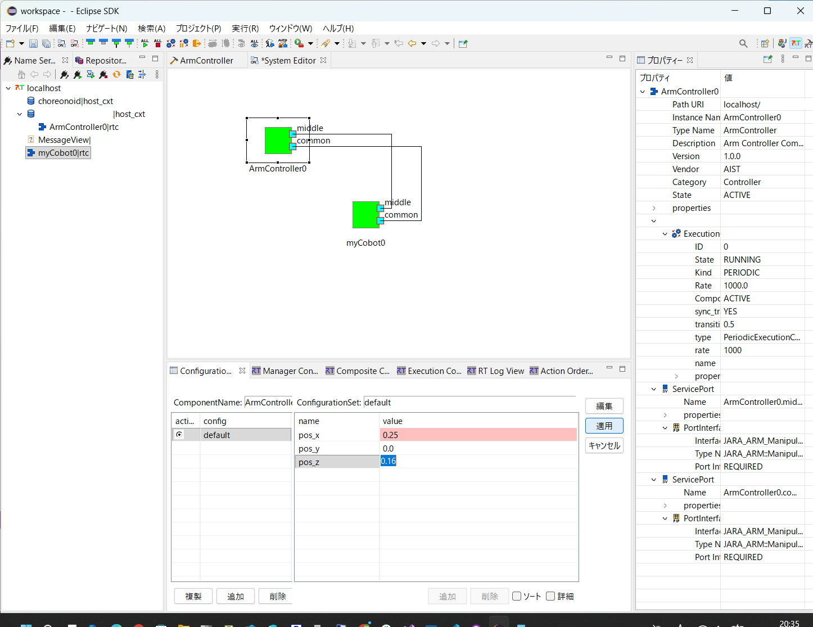</a></div>

コンフィギュレーションパラメータを変更後に編集ボタンを押すとmyCobot280の手先位置が制御されます。
