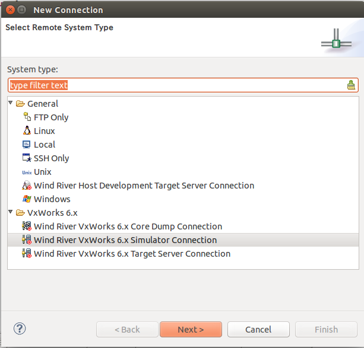
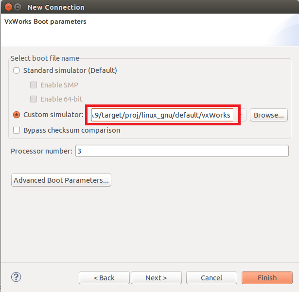
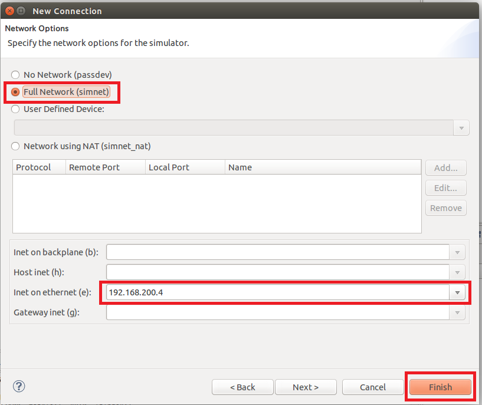

<!-- Title: VxWorksシミュレータの設定 -->
#contents

このページではWind River Workbench上で動作するVxWorksシミュレータの設定について説明します。

## シミュレータの追加
Workbenchデフォルトのシミュレータはlinux_diabシミュレータです。
OpenRTM-aistはgnuコンパイラを使用しているため、linux_gnuシミュレータを使用する必要があります。

Define a connection to remote systemボタンを押してシミュレータを追加してください。


<br>

<div align="center"><a href="sim1.png"></a></div>

<br>


New ConnectionウインドウのSelect Remote System Typeで""Wind River VxWorks 6.x Simulator Connection""を選択して次へ進んでください。

<br>

<div align="center"><a href="sim2.png"></a></div>

<br>


VxWorks Boot parametersではCustom simulatorにlinux_gnuシミュレータを指定します。

- 例：/home/openrtm/WindRiver/vxworks-6.9/target/proj/linux_gnu/default/vxWorks

<br>

<div align="center"><a href="sim3.png"></a></div>

<br>


Network Optionsまで進んだら、ネットワークをFull Networkに設定してIPアドレスを設定してください。
Finishボタンをクリックするとシミュレータを作成します。


<br>

<div align="center"><a href="sim4.png"></a></div>

<br>


## ネットワークインターフェースの起動
シミュレータ用のネットワークインターフェースを起動します。
以下のコマンドを実行してください。

```
 sudo ${WIND_BASE}/host/${WIND_HOST_TYPE}/bin/vxsimnetd
```

**tap0**というネットワークインターフェースが追加されます。

Ubuntu側で起動したネームサーバーを使う場合は、以下のコマンドでネームサーバーを再起動してください。

```
 sudo rtm-naming
```
