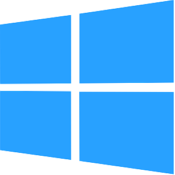

<!-- Title: インストール -->

#contents

<!-- ** インストールの準備 -->

<!-- *** 32bit版と64bit版 -->
<!--  -->
<!-- 現状、ほとんどのWindowsは64bit版が利用されていますので、基本的には以下は 64bit を前提として説明します。 -->
<!-- インストールしているWindowsが32bit版の場合は、OpenRTM-aistやその他のソフトウェアは32bit版をインストールする必要があります。 -->
<!--  -->
<!-- &color(red){''NOTE: 基本的にすべて64bit版のソフトウェアを使用してください。''}; -->

## 必要なソフトウエアのインストール
OpenRTM-aistを利用するには、Python、CMake、Doxygen、Visual Studio等のソフトウェアのインストールが必要です。

### Visual Studio

C++版の開発だけでなく、Python版、Java版のRTCを作成した際に、インストーラをビルドするのにも必要です。
以下のCommunity版（無料）をインストールするか、別途Visual Studio 2019/2022/2026を入手してインストールしてください。

- [Microsoft **Download Visual Studio 2026**](https://visualstudio.microsoft.com/ja/downloads/?utm_source=mscom&utm_campaign=msdocs)

現在動作確認できているVisual Studioの最新バージョンは2026です。　 
C++の開発環境を入れ忘れることがよくあります。以下の説明を一読することをお勧めします。
  - [Visual Studio Community 2026のインストール](/ja/doc/installation/install_2_1/install_windows_2_1/install_2_1/visual_studio_2_1/visual_studio_2026) 

### Python

PythonはPython言語版のRTCの開発だけでなく、OpenRTM-aistの様々なツールでも使用していますので必ずインストールする必要があります。
OpenRTM-aistがサポートしているPythonは 3.10, 3.11, 3.12, 3.13, 3.14 です。
最新版をインストールすることをお勧めします。

- [Python Releases for Windows](https://www.python.org/downloads/windows/)
  - [python-3.13.13-amd64.exe (64bit版)](https://www.python.org/ftp/python/3.13.13/python-3.13.13-amd64.exe)

インストールする際以下の点に注意してください。
  - Pythonのインストール先は、インストール時の選択 [Customize installation]に対応しています。
  - [Customize installation]でインストール先を指定する手順は、下記ページの解説をご覧ください。
<!-- --- [[OpenRTM-aistを10分で始めよう！・Pythonのインストール:/ja/doc/installation/lets_start#toc1]]  -->
    - [OpenRTM-aistを10分で始めよう！・Pythonのインストール](/ja/node/7323#toc1) 

### CMake
CMakeはWindowsやLinux等様々な環境でビルドに必要なファイル（Visual Studioのプロジェクトファイル、Linux上のMakefile等）を自動生成するために必要です。  
できるだけ最新版をインストールしてください。

- [CMake(3.11以上推奨)](https://cmake.org/download/)
  - [cmake-4.3.3-windows-x86_64.msi (64bit版)](https://github.com/Kitware/CMake/releases/download/v4.3.3/cmake-4.3.3-windows-x86_64.msi)
  - インストールする際、[Install Option]画面で[Add Cmake to the system PATH for all users]を選択することを推奨します。

### Doxygen & Graphviz

Doxygenは、ソースコード等のコメントからドキュメントを自動生成するツールです。  
Graphvizは、Doxygenでドキュメントを生成する際に、クラス図等の図を生成するために必要とされるツールです。  
OpenRTM-aistでは、RTCBuilderでRTCの設計時に様々な設計情報を記入することができ、それらはソースコードのコメントとして出力されます。
これをDoxygenで処理することで、RTCのキレイなドキュメントを生成することができます。  
できるだけ最新版をインストールしてください。

- [Doxygen](https://doxygen.nl/download.html#latestsrc)
  - [doxygen-1.17.0-setup.exe ](https://www.doxygen.nl/files/doxygen-1.17.0-setup.exe) (32bit, 64bitの別なし）
  - Microsoft Edge をお使いでダウンロードできない場合は、OpenRTM-aistの場合の解説をご覧ください。
    - [OpenRTM-aistを10分で始めよう！・OpenRTM-aistのダウンロード](/ja/node/7323#toc2) 

&aname(Graphviz);
- [Graphviz](https://graphviz.gitlab.io/download/)
  - [windows_10_cmake_Release_graphviz-install-15.0.0-win64.exe](https://gitlab.com/api/v4/projects/4207231/packages/generic/graphviz-releases/15.0.0/windows_10_cmake_Release_graphviz-install-15.0.0-win64.exe)

インストールの途中で[Install Options]としてsystem PATHをどうするかを聞かれますが、Add Graphviz to the system PATH for all usersを選択することを推奨します。
上記WebページからWindows版のバイナリ実行形式ファイルをダウンロードして実行してインストールしてください。

インストール後、コマンドプロンプトで dot -v を実行してプラグイン情報が表示されることを確認して下さい。
 >dot -v

<!-- 下記のように表示された場合、管理者でコマンドプロンプトを開き、dot -c を実行後に dot -v を実行すると上記のように表示されます。 -->
<!-- >dot -v -->
<!-- dot - graphviz version 3.0.0 (20220226.1711) -->
<!-- There is no layout engine support for "dot" -->
<!-- Perhaps "dot -c" needs to be run (with installer's privileges) to register the plugins? -->
<!--  -->
<!-- 管理者でコマンドプロンプトを開く方法は、Windows10の検索窓に cmd と入力し、検索結果の「コマンドプロンプト」を右クリックして「管理者として実行」を選択します。 -->

### JDK8

Javaで開発される場合に必要となります。下記ページの解説をご覧ください。
    - [JDK8のインストール](/ja/node/6911) 

## OpenRTM-aistのインストール

上記のソフトウェアのインストールが完了したら、OpenRTM-aistのインストールを行います。

### インストーラのダウンロード

OpenRTM-aistのWindows版のインストーラ（msi形式）をダウンロードします。

<table class="table-alt">
  <tr>
    <th><a href="https://openrtm.org/pub/Windows/OpenRTM-aist/2.1/OpenRTM-aist-2.1.0-RELEASE_x86_64.msi">OpenRTM-aist-2.1.0-RELEASE_x86_64.msi </a></th>
    <th>MD5:e1804a5aaa4fab85a5cdc777bd9c48c1</th>
    <th>719MB</th>
  </tr>
</table>

Microsoft Edge をお使いでダウンロードできない場合は、下記ページの解説をご覧ください。
- [OpenRTM-aistを10分で始めよう！・OpenRTM-aistのダウンロード](/ja/node/7323#toc2) 

このインストーラには、以下の内容が含まれています。

- C++ 用開発環境
  - OpenCV 4.13.0
  - C++用過去バージョンのDLL (古いRTC実行時に必要)
- Python 用開発環境
- Java 用開発環境
- omniORB 4.3.4
- OpenRTP (GUIツール、RTCBuilder，RTSystemEditor）
  - JRE8環境 (OpenRTPに必要）
- VCVerChanger (GUIツール）
- rtshell (CUIツール）

### インストール

インストール過程の詳細は、下記ページをご覧ください。
    - [OpenRTM-aistを10分で始めよう！・OpenRTM-aistのインストール](/ja/node/7323#toc3) 

正しくインストールされているかどうかの確認として、サンプルコンポーネントを実行してみてください。
    - [OpenRTM-aistを10分で始めよう！・サンプルコンポーネントを実行する](/ja/node/7323#toc5) 

インストーラが設定するシステム環境変数、インストールするファイル等の詳細は、下記ページをご覧ください。
    - [OpenRTM-aistインストーラの作業内容](/ja/doc/installation/install_2_1/install_windows_2_1/install_workcontent_2_1)

### システム環境変数確認

インストールされているVisual Studioのバージョンに合わせて、システム環境変数RTM_VC_VERSIONを設定しています。 インストール後にこの環境変数がvc16の値で展開されますが、Windowsの動作により展開されないケースが発生することを確認しています。 そのため、VCVerChangerでのシステム環境変数の確認をお勧めします。

検索窓に VCVerChanger と入力して起動してください。起動したら「確認」ボタンを押して表示されたパスを確認後、「終了」してください。

