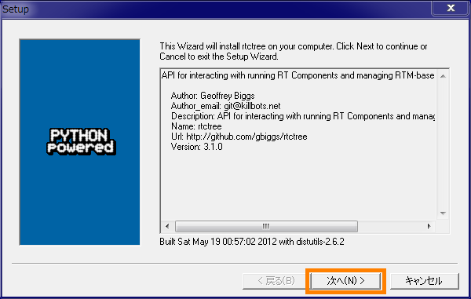
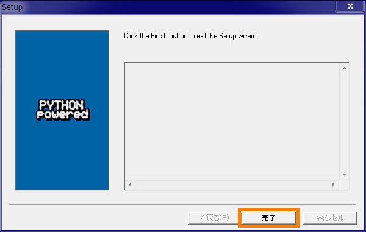
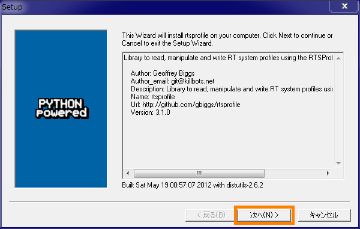
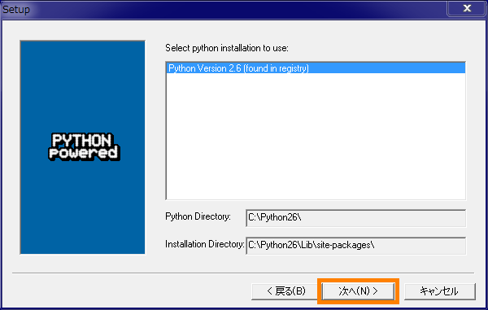
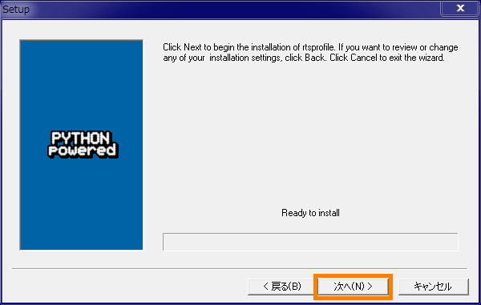
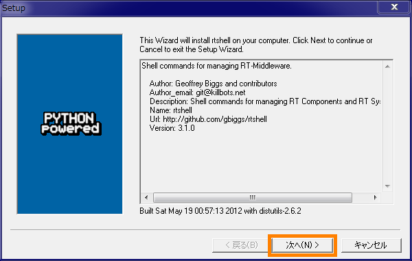
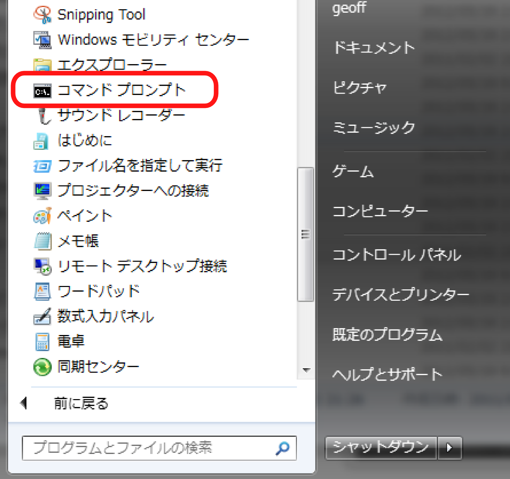
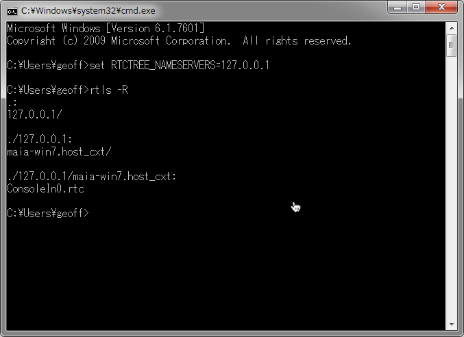

#contents

## はじめに

このドキュメントでは、Windows で rtshell のインストール方法について説明します。


### rtshellとは

[rtshell](http://www.openrtm.org/openrtm/ja/node/1005) はネームサーバー上に登録されている RTコンポーネントを、シェル (コマンドプロンプト) から管理することができるツールです。
コンポーネントを activate/deactivate/reset したり、ポートの接続を行うことができます。RTシステム全体を管理することも可能です。


### インストールの流れ

- OpenRTM-aist Python版と PyYAML のインストール
- rtctree（支援ライブラリ）のインストール
- rtsprofile（支援ライブラリ）のインストール
- rtshell のインストール
- 実行確認


### OpenRTM-aist Python版 と PyYAMLのインストール

rtshell の一部の機能（システム管理）には OpenRTM-aist-Python が必要です。

OpenRTM-aist-Python のインストールドキュメントに従って Python 2.6 または 2.7と OpenRTM-aist-Python をインストールします。
[ドキュメント](http://openrtm.org/openrtm/ja/content/windows%E3%81%B8%E3%81%AE%E3%82%A4%E3%83%B3%E3%82%B9%E3%83%88%E3%83%BC%E3%83%AB-0) を参照してください。

PyYAML は[PyYAMLのウェブサイト](http://pyyaml.org/) からダウンロードしてインストールします。バージョンは一番最新でも大丈夫です。


### rtctree のインストール

openrtm.org の[ダウンロードサイト](http://openrtm.org/openrtm/ja/node/1323)から
rtctree-3.1 のパッケージ (rtctree-3.1.0.win32.exe) をダウンロードします。

パッケージを実行すると、以下のようなダイアログが表示されるので、[次へ] をクリックします。

<div align="center"><a href="rtctree_installer_1.png"></a></div><br>

Python のバージョンを選択するダイアログが表示されます。Python の正しいバージョンが選択されていることを確認し、[次へ] をクリックします。
以下の例では Python2.6 が選択されています。

<div align="center"><a href="rtctree_installer_2.png"></a></div><br>

「インストール準備完了」ダイアログが表示されます。さらに [次へ] をクリックします。

<div align="center"><a href="rtctree_installer_3.png"></a></div><br>

インストールが行われます。終わったら、[完了] をクリックしてインストールを終了します。

<div align="center"><a href="rtctree_installer_4.png"></a></div><br>


### rtsprofile のインストール

openrtm.org の[ダウンロードサイト](http://openrtm.org/openrtm/ja/node/1323)から
rtsprofile-3.1 のパッケージ (rtsprofile-3.1.0.win32.exe) をダウンロードします。

パッケージを実行すると、以下のようなダイアログが表示されるので、[次へ] をクリックします。

<div align="center"><a href="rtsprofile_installer_1.png"></a></div><br>

Python のバージョンを選択するダイアログが表示されます。Python の正しいバージョンが選択されていることを確認し、[次へ] をクリックします。
以下の例では Python2.6 が選択されています。

<div align="center"><a href="rtsprofile_installer_2.png"></a></div><br>

「インストール準備完了」ダイアログが表示されます。さらに [次へ] をクリックします。

<div align="center"><a href="rtsprofile_installer_3.png"></a></div><br>

インストールが行われます。終わったら、[完了] をクリックしてインストールが終了します。

<div align="center"><a href="rtsprofile_installer_4.png"></a></div><br>


### rtshell のインストール

openrtm.org の [ダウンロードサイト](http://openrtm.org/openrtm/ja/node/869) から
rtshell-3.0.0 のパッケージ (rtshell-3.1.0.win32.exe)をダウンロードします。

パッケージを実行すると、以下のようなダイアログが表示されるので、[次へ] をクリックします。

<div align="center"><a href="rtshell_installer_1.png"></a></div><br>

Python のバージョンを選択するダイアログが表示されます。Python の正しいバージョンが選択されていることを確認し、[次へ] をクリックします。
以下の例では Python2.6 が選択されています。

<div align="center"><a href="rtshell_installer_2.png"></a></div><br>

「インストール準備完了」ダイアログが表示されます。さらに [次へ] をクリックします。

<div align="center"><a href="rtshell_installer_3.png"></a></div><br>

インストールが行われます。終わったら、[完了] をクリックしてインストールを終了します。

<div align="center"><a href="rtshell_installer_4.png"></a></div><br>


### 実行確認

実行確認のために、rtshell のコマンド群のうち rtls コマンドを実行して rtshell が正しくインストールされているかどうかをテストします。

はじめに、OpenRTM-aist の ネームサービスを起動して、ConsoleIn を起動します。

コンポーネントを起動したら、Windows のコマンドプロンプトを起動します。

<div align="center"><a href="start_command_prompt.png"></a></div>

コマンドプロンプトで以下のコマンドを実行します。

```
  set RTCTREE_NAMESERVERS=127.0.0.1
  rtls -R
```

１行目は環境変数を設定します。「RTCTREE_NAMESERVERS」は、rtshell の支援ライブラリ rtctree が使う変数で、rtshell が見るネームサーバーを指定します。

２行目はすべてのネームサーバーに登録されているコンポーネントを表示します。成功の場合は以下のように表示されます。

<div align="center"><a href="rtls_output.png"></a></div>

### 動かない場合

コマンドが見つけられない場合は、PATH が設定されていない可能性があります。
PATH 環境変数に以下のような二つのパスを追加すると動きます。（例は Python 2.6がインストールされている場合です。）

```
  C:\Python26
  C:\Python26\Scripts
```
