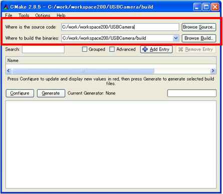
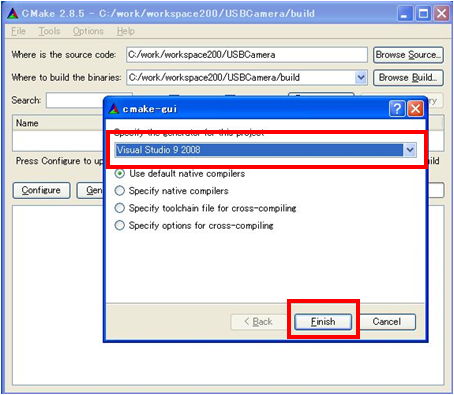
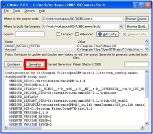
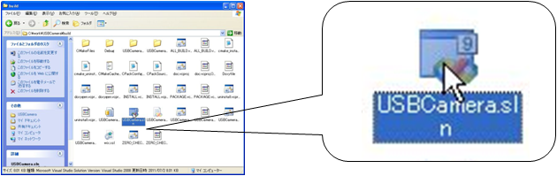
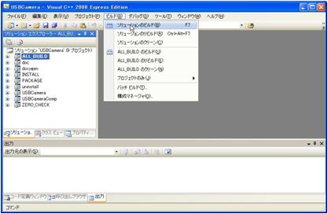
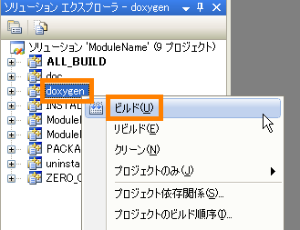
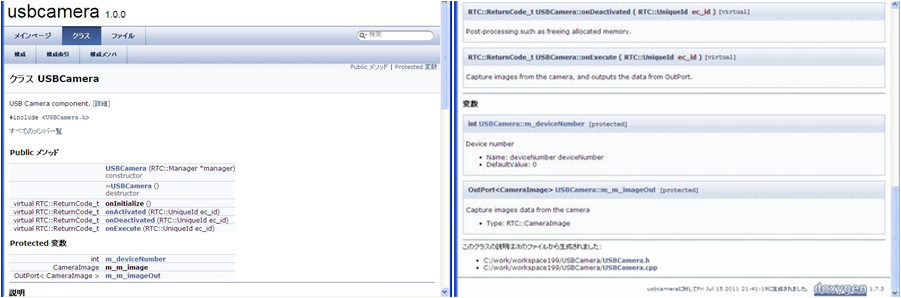
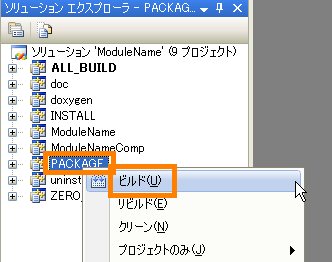

<!-- Title: コンパイル方法 (Windows、CMake 利用、C++ 編 ) -->
Windows でのビルド方法を説明します。

#contents

## 環境準備
### 環境

<table class="table-alt">
  <tr>
    <th>Visual C++( バージョン 2005 以上 )</th>
    <th>vc++開発環境</th>
  </tr>
  <tr>
    <td>CMake( バージョン 2.8.5 以上 )</td>
    <td>開発環境にあったビルドファイルを生成するツール</td>
  </tr>
  <tr>
    <td>Doxygen</td>
    <td>ドキュメンテーションジェネレーター</td>
  </tr>
  <tr>
    <td>Wix Windows Installer XML toolset ( バージョン 3.0 または 3.5)</td>
    <td>Windows Installer(MSI) パッケージを作成するためのツールセット</td>
  </tr>
</table>

### バージョンの組み合せ

Visual C++ と Wix はバージョンの組み合せが存在します。
<table class="table-alt">
  <tr>
    <th>VC++</th>
    <th>Wix</th>
  </tr>
  <tr>
    <td>2010</td>
    <td>3.5</td>
  </tr>
  <tr>
    <td>2008</td>
    <td>3.0</td>
  </tr>
  <tr>
    <td>2005</td>
    <td>3.0</td>
  </tr>
</table>

## ビルド手順

ビルド手順を示します。
図は VC++ 2005 、CMake 2.8.5 です。

### Cmake の設定
GUI 版 Cmake を起動してディレクトリーを指定します。

<table class="table-alt">
  <tr>
    <td>Where is the source code</td>
    <td>RTCBuilder で生成したコードのフォルダーを指定します。</td>
  </tr>
  <tr>
    <td>Where to build the binaries</td>
    <td>ソリューション/プロジェクト/ワークスペースなどのファイルを出力するフォルダーを指定します。</td>
  </tr>
</table>

<strong>ディレクトリーを指定</strong>

 

### Configure の実行
[Configure] ボタンをクリックして実行します。その後、使用するプラットフォームを選択します。
例では「Visual Studio 9 2008」を選択しています。

<strong>プラットフォームの選択</strong>

 

### Generate の実行
Configure が正常終了したら、[Generate] ボタンをクリックします。

<strong>Generate の実行</strong>

 

### VC++ の実行
「Where to build the binaries」で指定したフォルダー内にある␋ソリューションファイル(*.sln)を開きます。

<strong>ソリューションファイルを開く</strong>

 

### ビルドの実行
[ビルド] > [ソリューションのビルド] を実行してソリューションをビルドします。

<strong>ビルドの実行</strong>

 

## ドキュメント生成手順
### doxygen の実行
ソリューションエクスプローラで「doxygen」を選び、右クリックします。
そこで「ビルド」を選択して実行します。

<strong>doxygen の実行</strong>

 
### ドキュメント
「Where to build the binaries」で指定したフォルダー配下の doc/html にドキュメントが生成されます。

<strong>ドキュメント例</strong>

 

## パッケージ生成手順
パッケージ生成には、CMake に同梱されている cpack と Wix を使用していますが、 cpack は、Wix に対応しておらず、通常のままですと、パッケージを生成することができません。
その対応として、以下ファイルを展開して、C:\Program Files\CMake 2.8 のものと差し替えてください。

[CMake patch (for Wix 3.0)](./cmake-2.8-WiX-patch_v30.zip)

### doxygen の実行
ソリューションエクスプローラで「doxygen」を選び、右クリックします。
そこで「ビルド」を選択して実行します。

<strong>doxygen の実行</strong>

 
### PACKAGE ビルドの実行
ソリューションエクスプローラで「PACKAGE」を選び、右クリックします。
そこで「ビルド」を選択して実行します。

<strong>PACKAGE ビルドの実行</strong>

 

### パッケージ
「Where to build the binaries」で指定したフォルダー配下に msi 形式のイントールパッケージが生成されます。

rtc1.1.0-<パッケージ名>.msi

このイントールパッケージを実行すると下記へインストールされます。

C:\Program Files\OpenRTM-aist\1.1\components\<言語>/<パッケージ名>

- 添付[cmake-2.8-WiX-patch_v30.zip(1.09MB)](./cmake-2.8-WiX-patch_v30.zip)
