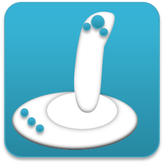

---

layout: page
title: "Hardware"

---
RTコンポーネントとして利用可能なハードウエアに関する情報。
リストに無いハードウエアがありましたら、support[at]openrtm.org までお知らせください。

<!--
&ref(randd_all2.png,url=http://www.openrtm.org/openrtm/ja/robots_and_devices/all,50%,margin=20 20 20 20,すべて);
&ref(randd_camandsensor.png,url=http://www.openrtm.org/openrtm/ja/camera_and_sensor,50%,margin=20 20 20 20,カメラ・センサ
ー);
&ref(randd_inputdevice.png,url=http://www.openrtm.org/openrtm/ja/input_devices,50%,margin=20 20 20 20,入力デバイス);
 
&ref(randd_mobilerobot.png,url=http://www.openrtm.org/openrtm/ja/mobile_robot,50%,margin=20 20 20 20,移動ロボット);
&ref(randd_manipulator.png,url=http://www.openrtm.org/openrtm/ja/manipulator_and_arm,50%,margin=20 20 20 20,アーム・マニ>ピュレータ);
&ref(randd_humanoid.png,url=http://www.openrtm.org/openrtm/ja/humanoid,50%,margin=20 20 20 20,ヒューマノイド);
-->

本ページで公開されている RTC に関する質問等は、
- [フォーラム](http://www.openrtm.org/openrtm/ja/node/281)
- [メーリングリスト](http://www.openrtm.org/openrtm/ja/node/275)
- [Issue Tracking](http://www.openrtm.org/openrtm/ja/node/add/project-issue)

に対して行なってください。

※決してメーカーへ直接問い合わせることのないようお願いいたします。;

各コンポーネントは通常 as is で提供され、デバイスやロボットでの動作を保証するものではありません。詳細は各コンポーネントの
ライセンス条項を参照するか、RTC 作成者にお問い合わせください。
