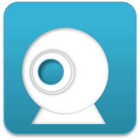
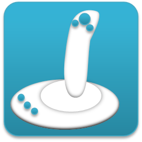
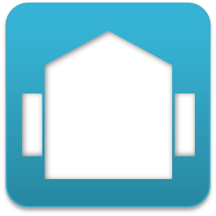
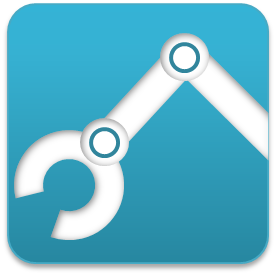
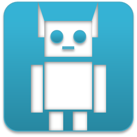

---

layout: page
title: "hardware"

---
RTコンポーネントとして利用可能なハードウエアに関する情報。
リストに無いハードウエアがありましたら、support[at]openrtm.org までお知らせください。

本ページで公開されている RTC に関する質問等は、
- [フォーラム]({{ site.baseurl }}/ja/community/forum)
- [メーリングリスト]()（「メーリングリスト」のページはリンク切れです）
- [Issue Tracking]()（リンク切れです）

に対して行なってください。

※決してメーカーへ直接問い合わせることのないようお願いいたします。;

各コンポーネントは通常 as is で提供され、デバイスやロボットでの動作を保証するものではありません。詳細は各コンポーネントの
ライセンス条項を参照するか、RTC 作成者にお問い合わせください。
