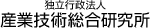

#contents(4)

## 配置

### 左寄せする

```
 #ref(aist_name_png_47544.png, left)
```



<div align="left"></div>

### センタリングする
```
 #ref(aist_name_png_47544.png, center)
```

<div align="center"></div>

### 右寄せする
```
 #ref(aist_name_png_47544.png, right)
```

<div align="right"></div>

## テキストまわりこませる
### 左寄せする
```
 #ref(aist_name_png_47544.png, around, left)
```

<div align="left"></div>
ああああああああああああああああああああああああああああああああああああああああああああああああああああああああああああああああああああああああああああああああああああああああああああああああああああああああああああああああああああああああああああああああああああああああああああああああああああああああああああああああああああああああああああああああああああああああああああああああ


### センタリングする
```
 #ref(aist_name_png_47544.png, around, center)
```

<div align="center"></div>
ああああああああああああああああああああああああああああああああああああああああああああああああああああああああああああああああああああああああああああああああああああああああああああああああああああああああああああああああああああああああああああああああああああああああああああああああああああああああああああああああああああああああああああああああああああああああああああああああ

### 右寄せする
```
 #ref(aist_name_png_47544.png, around, right)
```

<div align="right"></a></div>
ああああああああああああああああああああああああああああああああああああああああああああああああああああああああああああああああああああああああああああああああああああああああああああああああああああああああああああああああああああああああああああああああああああああああああああああああああああああああああああああああああああああああああああああああああああああああああああああああ

### まわりこみを解除する
```
 #clear
```

<div align="left"></a></div>
あああああああああああああああああああああああああああああああああああああああああああああああああああああああああああああああああああああああああああああああああああああああああああああああああああああああああああああああああああああああああああああああああああああああああ
#clear
いいいいいいいいいいいいいいいいいいいいいいいいいいいいいいいいいいいいいいいいいいいいいいいいいいいいいいいいいいいいいいいいいいいいいいいいいいいいいいいいいいいいいいいいいいいいいいいいいいいいいいいいいいいいいいいいいいいいいいいいいいいいいいいいいいいいいいいいい


## 拡大、縮小

### 原寸で表示する

※未確認

```
<div align="center"></div>
```

<div align="center"></div>


### ％で指定する
```
<div align="center"></div>
```
<div align="center"></div>

```
<div align="center"></div>
```
<div align="center"></div>


### ピクセルで指定する
※未確認

```
 #ref(logo.png, 20x20, wrap)
 #ref(logo.png, 100x100, wrap) 
 #ref(logo.png, 100x20, wrap) 
 #ref(logo.png, 20x100, wrap) 
```


<table class="table-alt">
  <tr>
    <th>20x20</th>
    <th>100x100</th>
    <th>100x20</th>
    <th>20x100</th>
  </tr>
  <tr>
    <td></td>
  </tr>
</table>
<div align="center"><a href="logo.png"></a></div> | 
<div align="center"><a href="logo.png"></a></div> |
<div align="center"><a href="logo.png"></a></div> |
<div align="center"><a href="logo.png"></a></div> |

<!-- | 20x20 | 100x100 | 100x20 | 20x100 | -->
<!-- | &ref(logo.png, 20x20, wrap); | &ref(logo.png, 100x100, wrap); | &ref(logo.png, 100x20, wrap); | &ref(logo.png, 20x100, wrap); | -->

## 枠、リンク (※ 未確認)
### イメージに枠を付ける


```
 #ref(aist_name_png_47544.png, wrap)
```

<div align="center"><a href="aist_name_png_47544.png"></a></div>

### イメージに枠を付け無い

```
 #ref(aist_name_png_47544.png, nowrap)
```

<div align="center"><a href="aist_name_png_47544.png"></a></div>

### イメージにリンクを付ける

```
 #ref(aist_name_png_47544.png)
```

<div align="center"><a href="aist_name_png_47544.png"></a></div>

### イメージにリンクを付けない
```
 #ref(aist_name_png_47544.png, nolink)
```

<div align="center"><a href="aist_name_png_47544.png"></a></div>


## イメージ展開の抑制

```
  &ref(aist_name_png_47544.png ,noimg);
```
  - <div align="center"><a href="aist_name_png_47544.png"></a></div>;

## ファイルへのリンク
```
  &ref(http://www.openrtm.org/index.html);
```
  - <div align="center"><a href="http://www.openrtm.org/index.html"></a></div>;


## マージン
```
 #ref(aist_name_png_47544.png,margin=<上下マージン> <左右マージン>)
 または
 #ref(aist_name_png_47544.png,margin=<上下左右マージン>)
```


### マージンなし

```
 #ref(aist_name_png_47544.png,around,left)
```

<div align="left"><a href="aist_name_png_47544.png"></a></div>
ああああああああああああああああああああああああああああああああああああああああああああああああああああああああああああああああああああああああああああああああああああああああああああああああああああああああああああああああああああああああああああああああああああああああああああああああああああああああああああああああああああああああああああああああああああああああああああああああああああああああああああああああああああああああああああああああああああああああああああああああああああああああああああああああああああああああああああああああああああああああああああああああああああああああああああああああああああああああああああああああああああああ


### 上下、左右別々のマージン

```
 #ref(aist_name_png_47544.png,around,margin=10 50,left)
```

<div align="left"><a href="aist_name_png_47544.png"></a></div>
ああああああああああああああああああああああああああああああああああああああああああああああああああああああああああああああああああああああああああああああああああああああああああああああああああああああああああああああああああああああああああああああああああああああああああああああああああああああああああああああああああああああああああああああああああああああああああああああああああああああああああああああああああああああああああああああああああああああああああああああああああああああああああああああああああああああああああああああああああああああああああああああああああああああああああああああああああああああああああああああああああああああ


### 上下左右同じマージン

```
 #ref(aist_name_png_47544.png,around,margin=50,left)
```

<div align="left"><a href="aist_name_png_47544.png"></a></div>
ああああああああああああああああああああああああああああああああああああああああああああああああああああああああああああああああああああああああああああああああああああああああああああああああああああああああああああああああああああああああああああああああああああああああああああああああああああああああああああああああああああああああああああああああああああああああああああああああああああああああああああああああああああああああああああああああああああああああああああああああああああああああああああああああああああああああああああああああああああああああああああああああああああああああああああああああああああああああああああああああああああああ

